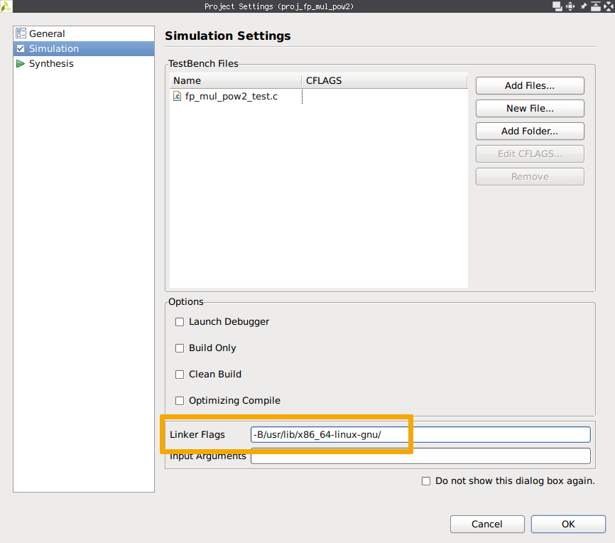

あまり表には出していませんでしたが、少し前から FPGA を触っています。FPGA は以前から興味があったデバイスの1つだったこともあり、苦戦しながらも今まで触れたことのない概念の連続をなんだかんだで楽しんでいる気がします。欲を言えば、FPGA ともう少し普通の出会い方をし、普通の環境で勉強したかったなぁというのがありますが...

その話は置いておき本題、FPGA の開発環境の話です。世の中で FPGA を使った開発が一般にどのように行われているかは詳しく知りませんが、その1つとして FPGA ベンダの提供する開発環境を利用するというのがあります。例えば最近の Xilinx なら [Vivado Design Suite](https://www.xilinx.com/products/design-tools/vivado.html) (Vivado) という感じです。さてこの Vivado、Windows 版に加えて Linux 版もあるのですが、これがこういうソフトウェアにありがちなインストーラ形式で配布されています。つまり、ディストリビューションのパッケージマネージャに管理されたインストールが困難で、おまけに動作保証されている環境が限られているわけです。(╯•﹏•╰)

また、もう1つ利用頻度がそこそこ高くなる場合のある Xilinx の開発ツールに [PetaLinux Tools](https://www.xilinx.com/products/design-tools/embedded-software/petalinux-sdk.html) というのがあるのですが、これがまぁ本っっっっっっっっ当にアレなインストーラ形式で配布されており、二度と1から環境構築したくなくなるような作りになっていたりするわけです。

こうした環境汚染を平気でしてきたりするお行儀のわるいソフトウェアは Docker コンテナに閉じ込めてしまおうということで、その時の知見を書いていこうと思います。

<!--more-->

## 環境

以下の環境で Docker イメージ作成できることを確認しました。また作成した Docker イメージ内のソフトウェアは Arch Linux と PetaLinux Tools の組み合わせを除き (僕が触った各機能は) ほぼ問題なく利用できることを確認しました。

- Arch Linux (x86_64)
    - Kernel: 4.18.6-arch1-1-ARCH
    - Docker: 18.06.1-ce
- CentOS Linux release 7.5.1804 (Core)
    - Kernel: 3.10.0-862.11.6.el7.x86_64
    - Docker: 18.06.1-ce
        - [この公式ドキュメント](https://docs.docker.com/install/linux/docker-ce/centos/)を参考にインストールしたもの

インストールした各種 Xilinx 製ツールのバージョンは以下のとおりです

- Vivado Design Suite (2018.2)
    - Vivado HL WebPACK Edition
    - 8/1 に出たらしい 2018.2.1 のアップデータは適用していません
- PetaLinux Tools (2018.2)

## Vivado

### 準備

Docker イメージを作成する前にいくつかの準備が必要です。

まずインストーラをダウンロードします。これはダウンロードに Xilinx のアカウントが必要で、`Dockerfile` から `curl` 等でダウンロードするということができないためです。[ここ](https://www.xilinx.com/support/download.html) へアクセスし、**Vivado HLx 2018.2: All OS installer Single-File Download** のリンクからインストーラをダウンロードします。Web Installer は `Dockerfile` でインストールを自動化するにあたり必要になる Batch install が使えない[^1]のでダメです。


次に Batch install に必要なインストールの設定ファイルを生成します。この設定ファイルはダウンロードしたファイルを解凍すると出てくるシェルスクリプト `xsetup` にコマンドラインオプション `-b ConfigGen` を付けて実行することで生成できます。この `xsetup` も勝手に `~/.Xilinx` ディレクトリを作成したりしてくるし、そもそも拾ってきた実行ファイルをむやみにホストで直に実行したくないので Docker コンテナの中でやってしまいましょう。

    (host) $ tar xf Xilinx_Vivado_SDK_2018.2_0614_1954.tar.gz
    (host) $ docker container run --rm -it -v /path/to/Xilinx_Vivado_SDK_2018.2_0614_1954:/vivado -w /vivado ubuntu:xenial /bin/bash
    root@a0981b2888bc:/vivado# ./xsetup -b ConfigGen
    Running in batch mode...
    Copyright (c) 1986-2018 Xilinx, Inc.  All rights reserved.
    INFO : Log file location - /root/.Xilinx/xinstall/xinstall_1536928602376.log
    1. Vivado HL WebPACK
    2. Vivado HL Design Edition
    3. Vivado HL System Edition
    4. Documentation Navigator (Standalone)
    
    Please choose: 1
    
    INFO : Config file available at /root/.Xilinx/install_config.txt. Please use -c <filename> to point to this install configuration.
    root@a0981b2888bc:/vivado# cp /root/.Xilinx/install_config.txt .

こんな感じにコマンドを実行していくと `Xilinx_Vivado_SDK_2018.2_0614_1954.tar.gz` を解凍したディレクトリに `install_config.txt` ができていると思うので、適当な場所にコピーし、必要に応じて修正をしておきます。このディレクトリはもう必要ないので消してしまって大丈夫です。一応生成された `install_config.txt` を貼っておきます。

```ini
#### Vivado HL WebPACK Install Configuration ####
Edition=Vivado HL WebPACK

# Path where Xilinx software will be installed.
Destination=/opt/Xilinx

# Choose the Products/Devices the you would like to install.
Modules=DocNav:1,Kintex UltraScale:1,Virtex UltraScale+ HBM ES:0,Spartan-7:1,Artix-7:1,Model Composer:0,ARM Cortex-A53:1,Zynq UltraScale+ MPSoC:1,Zynq-7000:1,SDK Core Tools:1,ARM Cortex-A9:1,ARM Cortex R5:1,Virtex UltraScale+ 58G ES:0,Zynq UltraScale+ MPSoC ES:0,System Generator for DSP:0,Kintex-7:1,Kintex UltraScale+:1,MicroBlaze:1

# Choose the post install scripts you'd like to run as part of the finalization step. Please note that some of these scripts may require user interaction during runtime.
InstallOptions=Enable WebTalk for SDK to send usage statistics to Xilinx:1

## Shortcuts and File associations ##
# Choose whether Start menu/Application menu shortcuts will be created or not.
CreateProgramGroupShortcuts=1

# Choose the name of the Start menu/Application menu shortcut. This setting will be ignored if you choose NOT to create shortcuts.
ProgramGroupFolder=Xilinx Design Tools

# Choose whether shortcuts will be created for All users or just the Current user. Shortcuts can be created for all users only if you run the installer as administrator.
CreateShortcutsForAllUsers=0

# Choose whether shortcuts will be created on the desktop or not.
CreateDesktopShortcuts=1

# Choose whether file associations will be created or not.
CreateFileAssociation=1

```

[^1]: モード自体は搭載されているっぽいけど途中必要になる Xilinx アカウントの指定などができないため使い物にならない

### Docker イメージの作成

今後 Vivado 以外にも GUI アプリケーションを Docker コンテナに閉じ込める機会がありそうだったことから、まず X11 関連のパッケージをインストールした Docker イメージ `ubuntu-xorg` を作成し、その後このイメージをベースに Vivado をインストールした `ubuntu-vivado` イメージを作成することにしました。

まず `ubuntu-xorg` の `Dockerfile` がこんな感じです。作成したイメージを Docker Hub などを通してグローバルに公開する予定もなかったことから、ミラーサーバを日本のものに変更してしまったりしています。

```dockerfile
FROM ubuntu:xenial

ENV DEBIAN_FRONTEND noninteractive

RUN \
  sed -i -e "s%http://[^ ]\+%http://ftp.jaist.ac.jp/pub/Linux/ubuntu/%g" /etc/apt/sources.list && \
  apt update && \
  apt upgrade -y && \
  apt -y --no-install-recommends install \
    ca-certificates curl sudo xorg dbus dbus-x11 ubuntu-gnome-default-settings gtk2-engines \
    ttf-ubuntu-font-family fonts-ubuntu-font-family-console fonts-droid-fallback lxappearance && \
  apt-get autoclean && \
  apt-get autoremove && \
  rm -rf /var/lib/apt/lists/* && \
  echo "%sudo ALL=(ALL) NOPASSWD: ALL" >> /etc/sudoers

ARG gosu_version=1.10
RUN \
  curl -SL "https://github.com/tianon/gosu/releases/download/${gosu_version}/gosu-$(dpkg --print-architecture)" \
    -o /usr/local/bin/gosu && \
  curl -SL "https://github.com/tianon/gosu/releases/download/${gosu_version}/gosu-$(dpkg --print-architecture).asc" \
    -o /usr/local/bin/gosu.asc && \
  gpg --keyserver ha.pool.sks-keyservers.net --recv-keys B42F6819007F00F88E364FD4036A9C25BF357DD4 && \
  gpg --verify /usr/local/bin/gosu.asc && \
  rm -rf /usr/local/bin/gosu.asc /root/.gnupg && \
  chmod +x /usr/local/bin/gosu
```

この `Dockerfile` を使ってこんな感じでイメージを作成しました。

    $ docker image build --rm --no-cache --pull -t ubuntu-xorg .

続いて `ubuntu-vivado` です。とりあえず、作成した `Dockerfile` がこんな感じです。

```dockerfile
FROM ubuntu-xorg

RUN \
  dpkg --add-architecture i386 && \
  apt update && \
  apt -y --no-install-recommends install \
    build-essential git gcc-multilib libc6-dev:i386 ocl-icd-opencl-dev libjpeg62-dev && \
  apt-get autoclean && \
  apt-get autoremove && \
  rm -rf /var/lib/apt/lists/*

COPY install_config.txt /vivado-installer/

ARG VIVADO_TAR_URI=http://path/to/Xilinx_Vivado_SDK_2018.2_0614_1954.tar.gz
RUN \
  curl ${VIVADO_TAR_URI} | tar zx --strip-components=1 -C /vivado-installer && \
  /vivado-installer/xsetup \
    --agree 3rdPartyEULA,WebTalkTerms,XilinxEULA \
    --batch Install \
    --config /vivado-installer/install_config.txt && \
  rm -rf /vivado-installer

COPY entrypoint.sh /usr/local/bin/entrypoint.sh
RUN chmod +x /usr/local/bin/entrypoint.sh
ENTRYPOINT ["/usr/local/bin/entrypoint.sh"]

CMD ["/bin/bash", "-l"]
```

最初の [`RUN`](https://docs.docker.com/engine/reference/builder/#run) は見てわかるとおりいくつかのパッケージをインストールしています。Vivado 自体が依存しているパッケージはほとんど無い[^2]ようなのですが、Vivado HLS で OpenCV を使った C simulation を実行しようとした際にいろいろ怒られたのでそれらを追加しています。Git は使えると便利なので入れただけで、必須ではないと思います。

[^2]: 必要なライブラリ等は一緒にインストールされるようになっている

次の [`COPY`](https://docs.docker.com/engine/reference/builder/#copy) から `RUN` で Vivado のインストールをしています。ポイントはインストーラを `curl` で流し込んでいる点です。インストーラを `Dockerfile` と同じディレクトリに置く (build context に含める) と、手元の環境ではなぜか高確率で失敗することが多かったほか、作成されるイメージのサイズが大きくなってしまうため、それを防ぐという狙いがあります。その他 `curl` の出力をそのまま `tar` に流したり、インストーラの取り込みから関連ファイルの削除までを1つの `RUN` で行うことで、`docker image build` したときのえげつないディスクアクセスを低減させたり、イメージの肥大化を防ぐなどの工夫もしています。

この次にやっているのが [`ENTRYPOINT`](https://docs.docker.com/engine/reference/builder/#entrypoint) の設定です。これはホストユーザとコンテナ内ユーザの UID を一緒にするための細工で、詳しくは後ほど説明します。とりあえず、ここで `COPY` している `entrypoint.sh` がこんな感じです。

```bash
#!/bin/bash

UART_GROUP_ID=${UART_GROUP_ID:-20}
if ! grep -q "x:${UART_GROUP_ID}:" /etc/group; then
  groupadd -g "$UART_GROUP_ID" uart
fi
UART_GROUP=$(grep -Po "^\\w+(?=:x:${UART_GROUP_ID}:)" /etc/group)

if [[ -n "$USER_ID" ]]; then
  useradd -s /bin/bash -u "$USER_ID" -o -d "$PWD" user
  usermod -aG sudo user
  usermod -aG "$UART_GROUP" user
  chown user $(tty)
  exec /usr/local/bin/gosu user "$@"
else
  exec "$@"
fi
```

適当なディレクトリに `Dockerfile`、`entrypoint.sh`、そして `install_config.txt` を配置し、また `Xilinx_Vivado_SDK_2018.2_0614_1954.tar.gz` を渡すためのローカルサーバを立てるなどの準備をしたうえで、以下のコマンドでイメージを作成しました。

    $ docker image build --rm --no-cache --pull -t ubuntu-vivado .

### インストールした Vivado を使う

まず、先ほど飛ばした `entrypoint.sh` によるこれはホストユーザとコンテナ内ユーザの UID を一緒にするための細工を紹介したいと思います。Docker コンテナは、様々な制限が加えられているとはいえ `root` ユーザで実行されるため、いくつか面倒なことを引き起こします。例えば [`--volume`](https://docs.docker.com/engine/reference/run/#volume-shared-filesystems) オプションでマウントした領域にコンテナ内からファイルを作成するとその所有者が `root` になってしまうなどです。

そこで `ENTRYPOINT` です。詳しい解説は[公式ドキュメント](https://docs.docker.com/engine/reference/builder/#understand-how-cmd-and-entrypoint-interact)にまかせるとして、この `ENTRYPOINT` を使うとコンテナ内で実行されるコマンドを `<ENTRYPOINT に指定したコマンド> <CMD に指定したコマンド>` のようにでき、つまり `CMD` に指定したコマンドを実行する前に任意の処理を実行させることが可能になります。これを利用して、本命のコマンドを実行する前にコンテナ内での作業ユーザを作成してしまおうという作戦です[^3]。

[^3]: コンテナ内ユーザの UID を指定する方法に [`--user`](https://docs.docker.com/engine/reference/run/#user) オプションを使うという手もありますが、これはコンテナ実行開始からその UID になってしまうため、今回の目的には合わないのです

さて上にあげた `entrypoint.sh` を要約するとこんな感じです。

```bash
#!/bin/bash

useradd -s /bin/bash -u "$USER_ID" -o -d "$PWD" user
chown user $(tty)
exec /usr/local/bin/gosu user "$@"
```

1つ目のコマンドで UID が環境変数 `USER_ID` に渡した値のユーザ `user` を作成し、[`gosu`](https://github.com/tianon/gosu) コマンドを使って `user` で引数のコマンドを実行しています。ちなみに2行目は `gosu` した後も `tty` の所有権が `root` のままでいろいろ問題があった[^4]ので、それを解決するために実行しています。また `useradd` に渡しているオプション `-d "$PWD"` は、ディレクトリ共有の細かな設定が面倒だったため [`-w`](https://docs.docker.com/engine/reference/run/#workdir) で指定したディレクトリをそのまま `user` の `$HOME` にしてしまおうというものです。`$HOME` は Vivado はもちろん多くのソフトウェアやライブラリがいろいろなファイルを出力するので、いずれもう少しいい感じにしたいなぁと...

[^4]: `screen` が立ち上がらず PetaLinux Tools で `petalinux-config -c kernel` などが失敗してしまうため

実際に動作させてみるとこんな感じです。


では Vivado などのソフトウェアを立ち上げていきます。Docker コンテナ内の X11 アプリケーションを呼び出す方法にはいくつかのアプローチがあるようですが、今回は `/tmp/.X11-unix/` を共有してしまう方法を紹介しようと思います。まず次のコマンドで作業ユーザによるローカルからの X11 のリクエストを許可するようにします。

    $ xhost +si:localuser:$(whoami)

次に、Docker コンテナを以下のようなオプションを付けて起動します。環境変数 `$DISPRAY` と `/tmp/.X11-unix/` を共有させている感じです。

    $ docker container run -it --rm \
        -e USER_ID=$UID \
        -e DISPLAY \
        -v /tmp/.X11-unix:/tmp/.X11-unix:ro \
        -v ~/work/localhost/vivado:/work \
        -w /work \
        ubuntu-vivado

あとは、起動したシェルで `/opt/Xilinx/Vivado/2018.2/settings64.sh` を `source` して[^5]、`vivado` や `vivado_hls`、また `/opt/Xilinx/SDK/2018.2/settings64.sh` を `source` して `xsdk` などのコマンドを実行すれば目的のソフトウェアのウィンドウが開くはずです。

[^5]: こんな感じでベンダのシェルスクリプトを `source` する系のやつ、Altera とかその他こういう系のソフトウェアでよく見かけるのだけど、もっとクールな方法って無いのかなぁ...

### 既知の問題点等

#### Vivado HLS で C simulation しようとするとリンカエラーが出る

Vivado HLS で C simulation を実行すると、こんな感じのリンカエラーが出て失敗してしまいます。

    Starting C simulation ...
    /opt/Xilinx/Vivado/2018.2/bin/vivado_hls /work/fp_mul_pow2/proj_fp_mul_pow2/solution1/csim.tcl
    INFO: [HLS 200-10] Running '/opt/Xilinx/Vivado/2018.2/bin/unwrapped/lnx64.o/vivado_hls'
    INFO: [HLS 200-10] For user 'user' on host '0d8381db2214' (Linux_x86_64 version 4.18.7-arch1-1-ARCH) on Sat Sep 15 17:07:50 JST 2018
    INFO: [HLS 200-10] In directory '/work/fp_mul_pow2'
    INFO: [HLS 200-10] Opening project '/work/fp_mul_pow2/proj_fp_mul_pow2'.
    INFO: [HLS 200-10] Opening solution '/work/fp_mul_pow2/proj_fp_mul_pow2/solution1'.
    INFO: [SYN 201-201] Setting up clock 'default' with a period of 5ns.
    INFO: [HLS 200-10] Setting target device to 'xc7k160tfbg484-1'
    INFO: [SIM 211-2] *************** CSIM start ***************
    INFO: [SIM 211-4] CSIM will launch GCC as the compiler.
       Compiling(apcc) ../../../../fp_mul_pow2_test.c in debug mode
    INFO: [HLS 200-10] Running '/opt/Xilinx/Vivado/2018.2/bin/unwrapped/lnx64.o/apcc'
    INFO: [HLS 200-10] For user 'user' on host '0d8381db2214' (Linux_x86_64 version 4.18.7-arch1-1-ARCH) on Sat Sep 15 17:07:52 JST 2018
    INFO: [HLS 200-10] In directory '/work/fp_mul_pow2/proj_fp_mul_pow2/solution1/csim/build'
    INFO: [APCC 202-3] Tmp directory is /tmp/apcc_db_user/5361536998872751479
    INFO: [APCC 202-1] APCC is done.
       Compiling(apcc) ../../../../fp_mul_pow2.c in debug mode
    INFO: [HLS 200-10] Running '/opt/Xilinx/Vivado/2018.2/bin/unwrapped/lnx64.o/apcc'
    INFO: [HLS 200-10] For user 'user' on host '0d8381db2214' (Linux_x86_64 version 4.18.7-arch1-1-ARCH) on Sat Sep 15 17:07:59 JST 2018
    INFO: [HLS 200-10] In directory '/work/fp_mul_pow2/proj_fp_mul_pow2/solution1/csim/build'
    INFO: [APCC 202-3] Tmp directory is /tmp/apcc_db_user/5991536998879756764
    INFO: [APCC 202-1] APCC is done.
       Generating csim.exe
    Makefile.rules:399: recipe for target 'csim.exe' failed
    /opt/Xilinx/Vivado/2018.2/tps/lnx64/binutils-2.26/bin/ld: cannot find crt1.o: No such file or directory
    /opt/Xilinx/Vivado/2018.2/tps/lnx64/binutils-2.26/bin/ld: cannot find crti.o: No such file or directory
    /opt/Xilinx/Vivado/2018.2/tps/lnx64/binutils-2.26/bin/ld: cannot find -lpthread
    /opt/Xilinx/Vivado/2018.2/tps/lnx64/binutils-2.26/bin/ld: cannot find -lm
    collect2: error: ld returned 1 exit status
    make: *** [csim.exe] Error 1
    ERROR: [SIM 211-100] 'csim_design' failed: compilation error(s).
    INFO: [SIM 211-3] *************** CSIM finish ***************
    4
        while executing
    "source /work/fp_mul_pow2/proj_fp_mul_pow2/solution1/csim.tcl"
        invoked from within
    "hls::main /work/fp_mul_pow2/proj_fp_mul_pow2/solution1/csim.tcl"
        ("uplevel" body line 1)
        invoked from within
    "uplevel 1 hls::main {*}$args"
        (procedure "hls_proc" line 5)
        invoked from within
    "hls_proc $argv"
    Finished C simulation.

これは、Project Settings を開き、Simulation のページにある Linker Flags に `-B/usr/lib/x86_64-linux-gnu/` を指定することで解決します。



おそらく何かパッケージが足りないせいなんだと思いますが、特定には至っていません...

#### Zybo Z7 の USB JTAG/UART が使いたい

Digilent が [Zybo Z7](https://reference.digilentinc.com/reference/programmable-logic/zybo-z7/start) という FPGA ボードを出しています。このボードには USB JTAG/UART port という、その名の通り USB ケーブル1本で JTAG も UART も使えるようになる便利なポートが付いています。これを Docker コンテナから使えるようにしてみましょう。

まずホスト環境に udev rule を追加します。ここでホスト環境をいじらないといけないのは仕方ないですね[^6]... 一旦コンテナを作成し、その中から Digilent の udev rule ファイルを取り出します。

    $ docker container run -d --name poepoe ubuntu-vivado
    $ docker container cp poepoe:/opt/Xilinx/Vivado/2018.2/data/xicom/cable_drivers/lin64/install_script/install_drivers/52-xilinx-digilent-usb.rules .
    $ docker container rm poepoe

あとは取り出したファイルをホストの `/etc/udev/rules.d/` に配置してやればおkです。`udevcontrol reload_rules` を実行すれば即時反映されるかもしれませんが、再起動するのが確実だと思います。

準備が整ったら Docker コンテナからデバイスにアクセスできるようにしましょう。Docker コンテナ内で触れるデバイスを指定するには [`--device`](https://docs.docker.com/engine/reference/run/#runtime-privilege-and-linux-capabilities) というオプションが使えます。コンテナを起動する際に、JTAG は USB のデバイスファイル `/dev/bus/usb/<bus>/<device>` を、UART は `/dev/ttyUSB1` などをこんな感じで指定してやればおkです。USB のデバイスファイルは接続毎に変わってしまうので、`lsusb` の結果から自動生成すると良いでしょう。

    $ docker container run -it --rm \
        -e USER_ID=$UID \
        -e DISPLAY \
        --device $(lsusb -d 0403:6010 | perl -pe 's!Bus\s(\d{3})\sDevice\s(\d{3}).*!/dev/bus/usb/\1/\2!')
        --device /dev/ttyUSB1
        -v /tmp/.X11-unix:/tmp/.X11-unix:ro \
        -v ~/work/localhost/vivado:/work \
        -w /work \
        ubuntu-vivado

ただこれだと途中で接続を解除してしまったりすると Docker コンテナを再起動するしかなくなってしまうのでびみょいです。Vivado Lab Edition をインストールした VM を作成して USB ポートやハブを attach、Vivado Hardware Server を立ち上げておく等すればいいかもしれません (未検証)。

[^6]: 毎回手作業でパーミッション変更するという手もあるけど...

## PetaLinux Tools

### 準備

続いて PetaLinux Tools です。こちらも同様に、まずはインストーラのダウンロードから始めます。配布ページは[ここ](https://www.xilinx.com/support/download/index.html/content/xilinx/en/downloadNav/embedded-design-tools.html)で、何やらリンクがたくさんありますが、**PetaLinux 2018.2 Installer** をダウンロードすればおkです。

時間のある方は、ダウンロードしたインストーラを `file` コマンドに掛けてみたり、適当な環境でとりあえず実行してみたりすればいいと思います。

### Docker イメージの作成

作成した `Dockerfile` がこんな感じです。面倒だったのでバリバリ X11 アプリケーションに依存しているわけではありませんが[^7]ベースイメージを先程作成した `ubuntu-xorg` にしました。

[^7]: `petalinux-build` などを実行すると裏で `Xvfb` が大量に立ち上がってたりはする

```dockerfile
FROM ubuntu-xorg

ENV DEBIAN_FRONTEND=noninteractive \
    LANG=en_US.UTF-8 \
    LANGUAGE=en_US:en \
    LC_ALL=en_US.UTF-8

RUN \
  dpkg --add-architecture i386 && \
  apt update && \
  apt -y --no-install-recommends install \
    autoconf bison build-essential chrpath cpio diffstat flex gawk gcc-multilib git \
    gnupg gzip iproute2 libc6-dev:i386 libglib2.0-dev libncurses5-dev libsdl1.2-dev \
    libselinux1 libssl-dev libtool libtool-bin locales locales-all make net-tools \
    pax rsync screen socat tar texinfo tofrodos unzip wget xterm xvfb xz-utils \
    zlib1g-dev zlib1g-dev:i386 && \
  (echo "dash dash/sh boolean false" | debconf-set-selections) && \
  dpkg-reconfigure dash && \
  apt-get autoclean && \
  apt-get autoremove && \
  rm -rf /var/lib/apt/lists/* && \
  sed -i -e 's/# \(en_US\.UTF-8 .*\)/\1/' /etc/locale.gen && \
  locale-gen

ARG PETALINUX_INSTALLER=http://path/to/petalinux-v2018.2-final-installer.run
RUN \
  mkdir -p /opt/petalinux /work && \
  chown nobody:nogroup /opt/petalinux /work && \
  curl -SL $PETALINUX_INSTALLER -o /work/petalinux-installer.run && \
  chmod +x /work/petalinux-installer.run && \
  cd /work && \
  (yes | sudo -u nobody /work/petalinux-installer.run /opt/petalinux) && \
  cd / && \
  rm -rf /work

COPY entrypoint.sh /usr/local/bin/entrypoint.sh
RUN chmod +x /usr/local/bin/entrypoint.sh
ENTRYPOINT ["/usr/local/bin/entrypoint.sh"]

CMD ["/bin/bash", "-l"]
```

最初の [`ENV`](https://docs.docker.com/engine/reference/builder/#env) でロケールの設定も行っています。ロケールが正しくないと PetaLinux Tools のインストール**中盤**でエラーを出して終了して最初からになってしまいます。

次の `RUN` で依存パッケージのインストールといくつかの設定を行っています。依存パッケージの洗い出しには本当に苦労しました。ドキュメントに依存パッケージリストがありますが**不完全**ですし、起動したインストーラが時間のかかるハッシュ確認とファイル展開の次に行う最初の依存パッケージ確認で不足があると終了して最初からになってしまいますし、最初のパッケージ確認をパスして「やったか？」と思えばインストール中盤でまた依存パッケージ確認があり不足があれば終了して最初からになってしまいますし、やっとインストールできたと思い早速 `petalinux-create` したら今度は `rsync` が無いと怒り出したり...

次にやっているのが PetaLinux Tools のインストールです。これも Vivado のときとだいたい同じ感じになっています。ただ、このインストーラは**圧縮ファイルが付加されたシェルスクリプト**なので展開する必要がなかったり[^8]、`root` で実行すると怒られるので `sudo` で `nobody` で実行させていたり、インストール途中いくつか確認を求められるので `yes` コマンドを使っていたりします。ちなみにこのインストーラを実行すると途中 EULA の文章を `less` で開いてきたりするのですが、これはコンテナ内に `less` をインストールしないという方法で回避できました。ここだけはエラーチェックが緩くて助かりました。

最後が Vivado のときと同じく `ENTRYPOINT` の設定です。Vivado のときの `entrypoint.sh` からいらないものを削ったものを入れています。

```bash
#!/bin/bash

if [[ -n "$USER_ID" ]]; then
  useradd -s /bin/bash -u "$USER_ID" -o -d "$PWD" user
  usermod -aG sudo user
  chown user $(tty)
  exec /usr/local/bin/gosu user "$@"
else
  exec "$@"
fi
```

あとは同じように Docker イメージを作成すればおkです。

    $ docker image build --rm --no-cache --pull -t ubuntu-petalinux .

作成したイメージは適当に起動して `/opt/petalinux/settings.sh` を `source` してやれば PetaLinux Tools の各種コマンドが実行できるようになります。

[^8]: Vivado のときみたいなえげつないディスクアクセスを減らす工夫ができないので勘弁してほしい

### 既知の問題点等

#### Arch Linux で PetaLinux Tools が使い物にならない

前述したように、Arch Linux で PetaLinux Tools がうまく動いてくれません。例えば `petalinux-config --get-hw-description=poepoe` を実行すると、裏で実行されているコマンドが SEGV してしまいます。全く同じイメージ (自前の container registry で転送した) を CentOS 7 で使ったら普通に動いたので、カーネル新しすぎるとダメなのかなぁと予想していますが、時間がなくて調べられていません。ちなみに Arch Linux に直接インストールしてみてもダメでした。

#### TFTP

僕が試したとき Ubuntu の Docker コンテナで tftpd のインストールがうまくいきませんでした。これも時間の都合でちゃんと調べられてないのでなんとかしたいところです。

## まとめ

Docker コンテナ内に FPGA 関連ツールを閉じ込めることで、二度と手間のかかるインストールをしなくて良くなったり、同じ環境の複製が容易になったり、環境汚染を気にしなくて良くなったり、ソフトウェアのインストール方法を細かく示すことができたり、CI 環境の構築にも役立つなど、とにかく便利だというのを紹介しました。FPGA 関連ツールに限らず、特殊なソフトウェアのインストール先としての Docker コンテナはかなり便利なんじゃないかなぁと思います。まぁその特殊なソフトウェアが減ってくれる方が嬉しいのですが。

今回は FPGA の開発環境構築の話題でしたが、これからは実装寄りの話題もいくつか書けたらなぁと思います。

## 参考 URL

- [Dockerfile reference](https://docs.docker.com/engine/reference/builder/)
- [Docker run reference](https://docs.docker.com/engine/reference/run/)
- [UG1144 - PetaLinux Tools Documentation: Reference Guide (ver2018.2)](https://www.xilinx.com/support/documentation/sw_manuals/xilinx2018_2/ug1144-petalinux-tools-reference-guide.pdf) **(PDF)**
- [Deni Bertovic :: Handling Permissions with Docker Volumes](https://denibertovic.com/posts/handling-permissions-with-docker-volumes/)
- [ubuntu - How to do \*dpkg-reconfigure dash\* as bash automatically - Super User](https://superuser.com/a/1064247)
