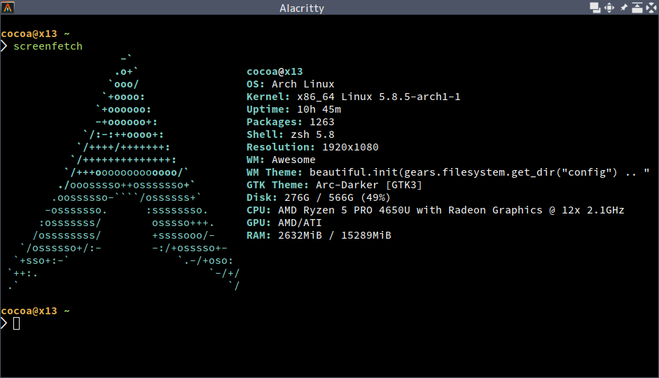

ノートパソコンを買いました。ThinkPad X13 Gen1 (AMD) です。4連休のセールをやっていた 7/26 に注文し 8/7 に届きました。たぶんかなり早く届いた方だと思います。

<blockquote class="twitter-tweet tw-align-center" data-dnt="true">
ヾ(๑╹◡╹)ﾉ&quot; <a href="https://t.co/65gU0z5zUU">pic.twitter.com/65gU0z5zUU</a>
&mdash; ✧*。ヾ(｡ᐳ﹏ᐸ｡)ﾉﾞ。*✧ (@myon___) <a href="https://twitter.com/myon___/status/1291559008206073856?ref_src=twsrc%5Etfw">August 7, 2020</a></blockquote> 

今まで使っていたノートは2012年5月購入の [VAIO Z2 (VPCZ23AJ)](https://www.sony.jp/vaio/products/Z23/) で、[デスクトップを組み立てた](/entry/2013/01/05/entry/)のも2013年1月なので、新しいパソコンは約8年ぶりです。わいわい。

<!--more-->

## 立て続けに PC が不調に...

上にちょっと書いたように、ここ何年かは VAIO Z2 とデスクトップ機を適当に使い分ける生活をしていました。

| | VAIO Z2 | デスクトップ |
| --- | --- | --- |
| CPU | [Intel Core i7-2640M](https://ark.intel.com/content/www/us/en/ark/products/53464/intel-core-i7-2640m-processor-4m-cache-up-to-3-50-ghz.html) | [Intel Core i7-3930K](https://ark.intel.com/content/www/us/en/ark/products/63697/intel-core-i7-3930k-processor-12m-cache-up-to-3-80-ghz.html) |
| RAM | DDR3 1333MHz 4GB x 2 | DDR3 1600MHz 8GB x 4 |
| GPU | Intel HD Graphics 3000 | NVIDIA GeForce 660 Ti |
| ストレージ | 64GB SSD x2 (RAID 0) | 256GB SSD 3TB & 4TB HDD (一部ミラーリング[^mirror]) |
| 主な用途 | 基本何でも | ノートで辛い開発 複数の VM を使った検証 データのバックアップ |

[^mirror]: <https://twitter.com/myon___/status/1086778627000172544/>

どちらも8年前のマシンなので最新のものと比べるとスペックは劣りますが、自分の普段の作業ではそんなに困ることはなく、今すぐ PC を買い換えようとは思っていませんでした。もちろん、試してみたくなったツールが AVX2 を要求してきて悲しくなったり、最新の高速ストレージを試したくなったりもしましたが、今は必要があれば大学の環境を使えたりもするので、買い換えるとしてもあと1年先かなという感じでした。

そんな思いでいましたが、数ヶ月前から立て続けに手持ちの PC の調子が悪くなってしまいました。

まず今年春くらいから、ノートで負荷をかけると接続している AC アダプタが一瞬認識されなくなるのを繰り返すようになってしまいました。バッテリは安定して充電されず、使い方によっては AC アダプタを接続しているのに残量がどんどん減っていく状態でした。トラブったときの応急処置「バラして掃除」も今回は効果なく、電源まわりが不調のまま使い続けるのは不安なのでデスクトップ中心に切り替えることにしました。

こうしてデスクトップをメインにして数週間たったころ、今度はマシンの排気からかすかに焼けた感じのニオイがするのに気づきます。マザーボードの VRM あたりの一部がニオイの発生源でした。軽く確認した感じでは基板上のパーツに損傷はなく、溜まったホコリか何かに熱が加わっただけかなとも思っていますが、何かあっても困るのでこれも使用を中断することにしました。

それからは、マザボと CPU を別マシンから持ってきたパーツに入れ替えたデスクトップ機を使っていました。CPU は [i3-3220](https://ark.intel.com/content/www/us/en/ark/products/65693/intel-core-i3-3220-processor-3m-cache-3-30-ghz.html) です。当時クロスコンパイラをビルドしたり、とあるソフトウェアをビルド設定まわり調整のため何度もビルドするといった作業が集中していたこともあり、この変更は作業効率に響くとても痛いものでした。

<blockquote class="twitter-tweet tw-align-center" data-dnt="true">
MB とか入れ替えてとりあえずの環境作ってる。Intel のドキュメントで名指しされてるとウワサの i7-3930k から i3-3220 <a href="https://t.co/KeOmagCLuY">pic.twitter.com/KeOmagCLuY</a>
&mdash; ✧*。ヾ(｡ᐳ﹏ᐸ｡)ﾉﾞ。*✧ (@myon___) <a href="https://twitter.com/myon___/status/1270882200037122050?ref_src=twsrc%5Etfw">June 11, 2020</a></blockquote> 

## ようやく見つけた ThinkPad X13

性能面での辛さに加え、電源やスペースの関係で設置場所を選ぶデスクトップ PC を使うことも辛くなってきました。普段クーラーのない部屋で作業していたのですが、そこを今夏の暑さが襲ったのです。流石に身の危険を感じ、クーラーのある部屋に無理やり場所を作って[^1]作業をしつつ、空いた時間に PC を探すといった日々が始まったのでした。

[^1]: デスクはなく、床または小さな台に座っての作業となった

とはいったものの、時期が悪かったりするせいか、なかなか良さげな機種が見つかりません。要求は

- 13型ノート
- 1.5kg 以下
- 最新世代の CPU 搭載 (Zen 2 な Ryzen が気になる)
- 構成カスタマイズ可能

という感じです。まぁ Zen 2 なモバイルプロセッサは出たばかりだしそれはそうという感じですが... そして少し待ってようやく見つけたのが今回の ThinkPad X13 です。もっと待てば選択肢が増えたりするかもとも思いましたが、できる限り早く欲しかったので、一晩悩んだ末にポチりました。

<blockquote class="twitter-tweet tw-align-center" data-dnt="true">
うーん <a href="https://t.co/3GE6ihYKRX">pic.twitter.com/3GE6ihYKRX</a>
&mdash; ✧*。ヾ(｡ᐳ﹏ᐸ｡)ﾉﾞ。*✧ (@myon___) <a href="https://twitter.com/myon___/status/1286991781922353153?ref_src=twsrc%5Etfw">July 25, 2020</a></blockquote> 

選んだ構成の主要なものをあげるとこんな感じです。

- [AMD Ryzen 5 PRO 4650U](https://www.amd.com/en/products/apu/amd-ryzen-5-pro-4650u)
- DDR4 3200MHz 16GB (8GB x 2)
- M.2 PCIe-NVMe SSD 256GB
- 13.3型FHD液晶 IPS 光沢なし
- バックライト付英語キーボード
- 指紋センサーなし
- 3年間 引き取り修理

CPU には Ryzen 5 PRO を選択しました。搭載可能な RAM が最大 32GB に増える Ryzen 7 PRO とかなり迷ったのですが、単純に予算の問題と、今までデスクトップで使ってきた i7-3930K とコア数が同じということで比べやすいかなということでこうしました。RAM が 16GB なのには少し不安もありますが、今までの経験から大半の作業ではなんとか収まってくれるだろうと仕方なく妥協することにしました。

SSD は手元の機器では初めての PCIe-NVMe 接続なものです。VAIO Z2 の RAID 0 構成な SSD もそこそこ速い部類でしたが、これよりも強そうなので楽しみです。もともと持ち歩くデータはそんなに多くなく、容量は 128GB でも十分ではあるのですが、たまに大きなデータや FPGA とかの開発環境を持ち歩こうとして厳しくなることがあったので倍の 256GB としました。

キーボードは英字配列です。VAIO Z2 購入当時はあまりキーボードの配列にこだわりはなかったのですが、その後すぐ出会った HHKB Lite2 で英字配列に慣れてしまい、以来日本語キーボードでも英字設定で使ったりしてきたためです。VAIO のときはなんとなくで付けたバックライトも、暗いところで便利なのがわかった[^2]ので今回も付けました。

[^2]: キーボードをずっと見て打つことはなくても、ふとした時に見えないと不安で打てなくなるタイプなので

ThinkPad ユーザが愛用していそうなイメージのある指紋センサは外しました。普段 Linux を使う身としては設定がめんどくさそうに感じたのと、削って少し安くなるならそうしたかったためです。オプションの3年間の引き取り修理は、過去に ThinkPad 使いの友人を見てて不安だったので付けました。

## #archlinuxinstallbattle

プリインストールされた OS[^win] で最低限の動作確認を済ませたのち、Arch Linux をインストールしました。

[^win]: 今の Windows で初期設定時ローカルアカウントを作る方法、ネットワークに接続しない以外にない感じなんですかね...

プリインストールされた OS は、ファームウェアのアップデートやその他何かあったときのためとりあえず残し、デュアルブートを組むことにしました。パーティションを約 48GB にまで縮小し、空いた領域に Arch Linux 用のパーティションを作りました。`nvme0n1p1` が ESP、`nvme0n1p4` がシステム用の LUKS パーティション、`nvme0n1p5` が swap という感じにしました。

    $ lsblk
    NAME          MAJ:MIN RM   SIZE RO TYPE  MOUNTPOINT
    nvme0n1       259:0    0 238.5G  0 disk
    ├─nvme0n1p1   259:1    0   260M  0 part  /boot
    ├─nvme0n1p2   259:2    0    16M  0 part
    ├─nvme0n1p3   259:3    0    48G  0 part
    ├─nvme0n1p4   259:4    0   186G  0 part
    │ └─cryptroot 254:0    0   186G  0 crypt /var/lib/docker/btrfs
    ├─nvme0n1p5   259:5    0   3.2G  0 part
    │ └─cryptswap 254:1    0   3.2G  0 crypt [SWAP]
    └─nvme0n1p6   259:6    0  1000M  0 part

そしたらあとはいつもどおりにやるだけです。といっても、自分は Arch Linux のクリーンインストールはかなり久しぶりで、公式のインストールメディアも記憶にあるものと若干違った感じになってて戸惑うこともありました。例えば無線 LAN 接続には `wifi-menu` を使っていた覚えがあるのですが今は [`iwctl` になっていたり](https://wiki.archlinux.org/index.php/Installation_guide#Connect_to_the_internet)、いい感じのミラーサーバを [`reflector` が勝手に設定](https://wiki.archlinux.org/index.php/Installation_guide#Select_the_mirrors)してくれてたり。このあたりは定期的に確認しておきたいですね。

ブートローダには systemd-boot を使うことにしました。ディスクの暗号化をするときはカーネル、initramfs、ブートローダの設定まで LUKS 上に置ける GRUB を使いたい思いがあるのですが、Secure Boot[^secboot] と組み合わせたときかなり面倒になる[^grub]ことがわかったので諦めました。systemd-boot も、起動時のメニューで OS の選択やブートオプション編集など十分な機能があったり、`bootctl` など専用のコマンドラインツールもあったりして好きですけどね。

    $ bootctl status
    System:
         Firmware: UEFI 2.70 (Lenovo 0.4176)
      Secure Boot: enabled
       Setup Mode: user
     Boot into FW: supported
    
    Current Boot Loader:
          Product: systemd-boot 246.3-1-arch
         Features: ✓ Boot counting
                   ✓ Menu timeout control
                   ✓ One-shot menu timeout control
                   ✓ Default entry control
                   ✓ One-shot entry control
                   ✓ Support for XBOOTLDR partition
                   ✓ Support for passing random seed to OS
                   ✓ Boot loader sets ESP partition information
              ESP: /dev/disk/by-partuuid/xxxxxxxx-xxxx-xxxx-xxxx-xxxxxxxxxxxx
             File: └─/EFI/systemd/shimx64.efi
    
    Random Seed:
     Passed to OS: no
     System Token: set
           Exists: yes
    
    Available Boot Loaders on ESP:
              ESP: /boot (/dev/disk/by-partuuid/xxxxxxxx-xxxx-xxxx-xxxx-xxxxxxxxxxxx)
             File: └─/EFI/systemd/shimx64.efi
             File: └─/EFI/systemd/mmx64.efi
             File: └─/EFI/systemd/systemd-bootx64.efi (systemd-boot 246.3-1-arch)
             File: └─/EFI/systemd/grubx64.efi (systemd-boot 246.3-1-arch)
             File: └─/EFI/BOOT/bootx64.efi (systemd-boot 246.3-1-arch)
    
    Boot Loaders Listed in EFI Variables:
            Title: Shim
               ID: 0x0002
           Status: active, boot-order
        Partition: /dev/disk/by-partuuid/xxxxxxxx-xxxx-xxxx-xxxx-xxxxxxxxxxxx
             File: └─/EFI/systemd/shimx64.efi
    
            Title: Linux Boot Manager
               ID: 0x0001
           Status: inactive, boot-order
        Partition: /dev/disk/by-partuuid/xxxxxxxx-xxxx-xxxx-xxxx-xxxxxxxxxxxx
             File: └─/EFI/systemd/systemd-bootx64.efi
    
            Title: Windows Boot Manager
               ID: 0x0000
           Status: active, boot-order
        Partition: /dev/disk/by-partuuid/xxxxxxxx-xxxx-xxxx-xxxx-xxxxxxxxxxxx
             File: └─/EFI/Microsoft/Boot/bootmgfw.efi
    
    Boot Loader Entries:
            $BOOT: /boot (/dev/disk/by-partuuid/xxxxxxxx-xxxx-xxxx-xxxx-xxxxxxxxxxxx)
    
    Default Boot Loader Entry:
            title: Arch Linux
               id: arch.conf
           source: /boot/loader/entries/arch.conf
            linux: /vmlinuz-linux
           initrd: /amd-ucode.img
                   /initramfs-linux.img
          options: root=/dev/mapper/cryptroot rw rootflags=subvol=@ rd.luks.name=xxxxxxxx-xxxx-xxxx-xxxx-xxxxxxxxxxxx=cryptroot loglevel=3

[^secboot]: Fast Boot や GOP 目的で、Linux を使う場合でも自分で生成した鍵でカーネルを署名して Secure Boot を有効にしている
[^grub]: [署名された EFI バイナリであっても chainload できない](https://wiki.archlinux.org/index.php/Unified_Extensible_Firmware_Interface/Secure_Boot#shim_with_key_and_GRUB)らしく、実際にやろうとしてもうまく行かなかったので

X13 での Arch Linux は、概ね問題なく動いていますが、いくつか問題もありました。気づいたもので

- UEFI のセットアップメニューで Sleep State を Linux にしないとスリープできない
- [画面輝度の保存・復帰が正しく動作していない](https://wiki.archlinux.org/index.php/backlight#Backlight_is_always_at_full_brightness_after_a_reboot_with_amdgpu_driver)
- 背面の microSD カードリーダーが正しく認識されていない

があります。

## おわり

こんな感じでようやく環境を引っ越せました。まだ使い始めて日は経っていないですが、なかなかの性能で、それでいて発熱もひどくなくファンも静かめでいい感じです。正直に書くと、ここ最近の CPU について、ベンチマークサイトを見ながら「クロックやコア数が上がってこのスコアならそれはそうだよね」などと目立った進化がない印象を持っていたところがありました。もちろんそんなことはなく、実際に8年前のデスクトップ用途に匹敵するものが薄いノートに載ってるのも1つの大きな進化なわけで、自分が典型的なベンチマークのスコアから誤った判断をするタイプになっていたのを反省です。

"ようやく" 環境を引っ越せました、と書いたように、届いてから使えるようにするまでかなり時間がかかってしまいました。というのも設定がある程度済んできた開封日の夜、Secure Boot 関連の設定をしていたときのことでした。UEFI のセットアップメニューから再起動したところ、30秒くらい文字がバーッと流れ、その後ブートループするようになってしまったのです。

<blockquote class="twitter-tweet tw-align-center" data-dnt="true">
...... <a href="https://t.co/gDHQjU6yuA">pic.twitter.com/gDHQjU6yuA</a>
&mdash; ✧*。ヾ(｡ᐳ﹏ᐸ｡)ﾉﾞ。*✧ (@myon___) <a href="https://twitter.com/myon___/status/1291738440212475906?ref_src=twsrc%5Etfw">August 7, 2020</a></blockquote> 

[フォーラムのこんな投稿](https://forums.lenovo.com/t5/ThinkPad-P-and-W-Series-Mobile/P73-endless-POST-loop-Configuration-changed-Restart-the-system/m-p/4593233)を見つけ不安になったりしましたが、サポートに電話したところすぐ修理を手配してもらえました。8/17 に引き取りに来て、8/26 に帰ってきました。この件に関して、自分も普段あまりいじるべきでないところをいじっていたというのもあるのでクレームなどを言う気は全く無いですが、今後のアップデートでファームウェアの安定性はもっと上がるといいなと思います。また何かあっても嫌なので、Secure Boot の設定はまた違う方法、[Shim](https://aur.archlinux.org/packages/shim-signed/) を使ったもので簡単に済ませました。

とまぁこんな感じにトラブルなどありましたが、今度のマシンも長く使っていけるといいなと思います (✿╹◡╹)ﾉ
