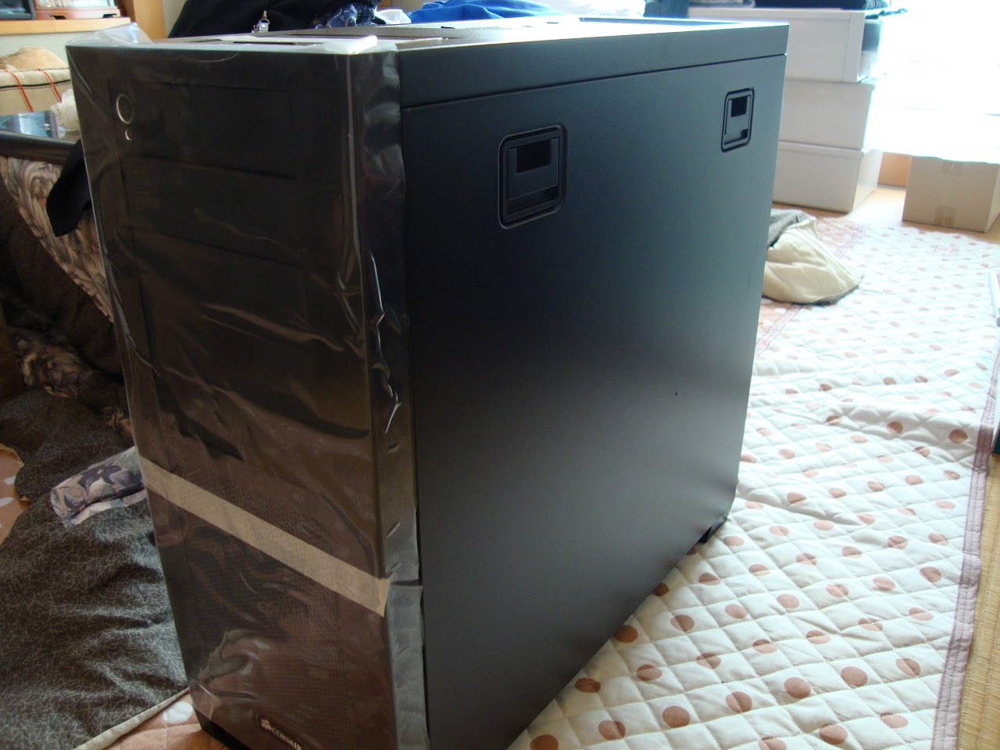

久しぶりです

冬休みはいっぱい更新したり、作っていないページを完成させたりするつもりでしたが、

1週間38度を超える熱があり、寝込んでいたとさいぬです。

カゼはもうだいたい大丈夫なはずです。

&nbsp;

PC組みました！

構成はこんな感じです

CPU:Core i7 3930k

6コア12スレッドです。

&nbsp;

Cooler:Silver Arrow SB-E Extreme

ほんとデカイです。一番上のPCI-E潰れました

あと、ケースに組んだら補助電源等の配線がとてもしにくかった

&nbsp;

M/B:Rampage IV Formula

OC＆ハードゲーマー向けのマザボです。最近OCにハマっているのもあってこれにしてみた。

デザインもいいしね！

&nbsp;

Mem:Corsair Vengeance LP 8GBx4

Elpidaのチップを使っているバージョンを買いました。

信頼性は重要です。たぶん。

&nbsp;

SSD:Plextor M5S 256GB

信頼性とかから友人に勧められ・・・

&nbsp;

HDD:TOSHIBA DT01ACA300 3TB（バルク）

3TBで1万円強。安くなりましたね。

&nbsp;

VGA:GALAXY GF PGTX660TI-OC/2GD5 GTX660TI

ミドルエンドながら結構優秀。今のグラボってすごいですね。

&nbsp;

OPT:Pioneer BDR-208BK/WS（バルク）

&nbsp;

Case:Corsair Obsidian 650D

まあまあ広いです。20cmファンが少し五月蠅いかも。

リアファンはOMEGATYPHOONのデコボコのやつに載せ替え済みなほか、トップファンを14cm2枚にしようと検討中。

&nbsp;

PSU:Owltech Xseries SS-660KM 660W

いいパーツ使ってるほか、5年保証付きです。

&nbsp;

組んだときの写真など

&nbsp;

今度はいろいろベンチしてみようと思います

いろいろ触ってみているのですが、660tiが結構優秀です

アテにならないWin7のエクスペリエンスインデックスは、プロセッサが7.8、あとは7.9でした。

