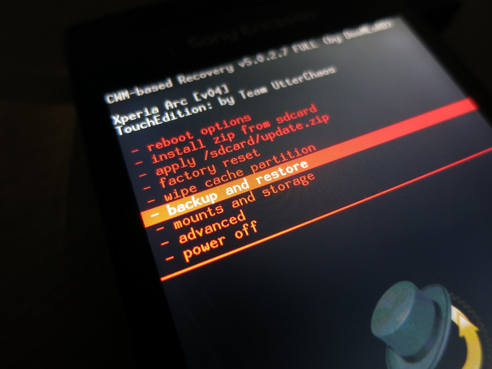

僕は後から導入したのですが, 便利すぎるので先にインストールすることをおすすめします.

## カスタムリカバリとは

これを導入することで何ができるようになるかといいますと...

* システム全体のバックアップ/リストア
* システムの初期化やシステムパーティションのフォーマット
* デバッグモード

などがあります.

これからシステムをいじっていきますが, 作業に失敗してしまった場合ブートアニメーションのループなどが発生し起動できなくなることがあります.  
そんなときの復旧方法はFlashtool等によるものしかありませんが, この方法では**設定やデータがすべて初期化**されてしまいます.

ここで便利なのがこのカスタムリカバリーの**システムバックアップ機能**です.  
このバックアップを復元することにより, 予めバックアップを取って置いた状態にいつでも戻せて大変便利です.

また, バージョンにによってはデバッグモードが有効になっており, framework-res.apk等の書き換えなども安全に行うことができます.

## 導入方法

### 公式ファームウェアかつブートローダーのアンロックをしていない場合

[Xperia CWM Auto-Installer](https://play.google.com/store/apps/details?id=com.pvy.CWMinstaler)を使うことで簡単に導入できます.

### ブートローダアンロック済み

カスタムカーネルの導入(後述)を行うと良いでしょう.  
このようなカーネルはカスタムリカバリーを持っている場合が多いので便利です.

## カスタムリカバリを使ってみる

端末の電源を入れ, バイブレータが一瞬作動するタイミングでボリュームを下げるボタンを何度か押すとリカバリーメニューに入れます.  
ただし, 利用する端末やバージョンによってはカスタムリカバリへの入り方は異なる場合があるので, 導入したカーネル等の説明書きなども参考にしてください.

### CWM recovery

試しに、現在の状態をバックアップ/リストアしてみましょう.  

音量上下キーで操作し, ホームが決定, 戻るで上のメニューに戻ります.  
`backup and restore -> backup`でシステムのバックアップ, `backup and restore -> restore`を選び任意のバックアップファイルを選ぶことでリストアできます.

### TWRP

いつか使ってみようとは思う.
