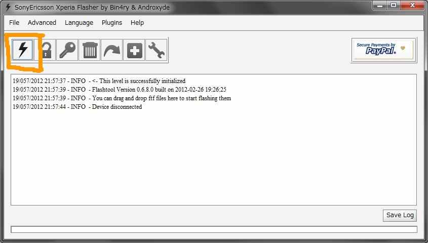

最新版のファームウェアではroot権限の取得ができなくなってしまいました.  
ということで, root権限を取得できるファームウェアをFlashtoolを書き込みます.

## 準備

* ダウングレードするXperia端末
* USBポートが搭載されたLinux, またはWindowsがインストールされているPC (Macは持ってません)
* ソフトウェアをダウンロードしてインストールできる権限

## ftfファイルの入手

XperiaArc（docomo）の場合、root取得ができる最新のファームウェアはビルド番号4.0.1.C.1.9です.  
[XDA-Developers](http://www.xda-developers.com/)や他サイトさんの情報も参考にしながら端末に合わせたroot取得ができる最新のファームウェアのftfファイルを入手します.

また, 僕が個人的によく使っているftfファイルは[こちら](https://www.mediafire.com/folder/pfrcesb2phqgf/Xperia)に置いてありますのでよかったらどうぞ.

## Flashtoolのインストール

PCにFlashtoolをインストールします.  
<http://androxyde.github.com/>から`ver0.6.9.1`をダウンロードします. アップローダーが糞遅いですが我慢しましょう.

Windowsの場合, インストールが終わったらデバッグモードやフラッシュモード用のドライバをインストールします.  
Flashtoolをインストールしたフォルダにあるdriversフォルダの中にインストーラーがあるので, 対象となる機種のドライバをインストールします.

## ファームウェアの書き込み

先ほど入手したftfファイルをFlashtoolをインストールしたフォルダの中にあるfirmwareフォルダの中にコピーします.

Flashtoolを起動します.  
64bit版Windowsを使っている方は必ずFlashtool64を起動してください. (ついでに64bitJavaも必要です)

左上の雷マークをクリック. Mode Selectorが出てくるのでFlashmodeを選択してOKをクリック.  

先ほど追加したファームを選択してOKをクリック. 今回はSO-01cです.  

あとは画面の指示に従ってファームウェアを書き込みます.  
Xperia Arcは電源を切った状態でBackボタンを押しながらPCに接続します. 書き込みが始まるまで(下のインジケータが動き始めるまで)はBackボタンは離してはいけません.

Flashing finishedと出ると書き込みが完了したことになります. 大体5分くらいです.

端末を取り外し, ちゃんと起動できるかの確認を行ってください.  
初回起動はものすごく時間がかかる場合がありますが, 異常ではありません. (さすがに10分越えとなると怪しいですが)

では, root権限の取得に進みましょう.
