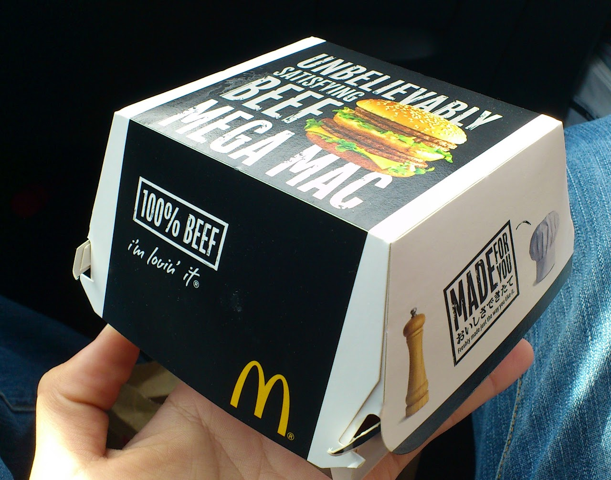
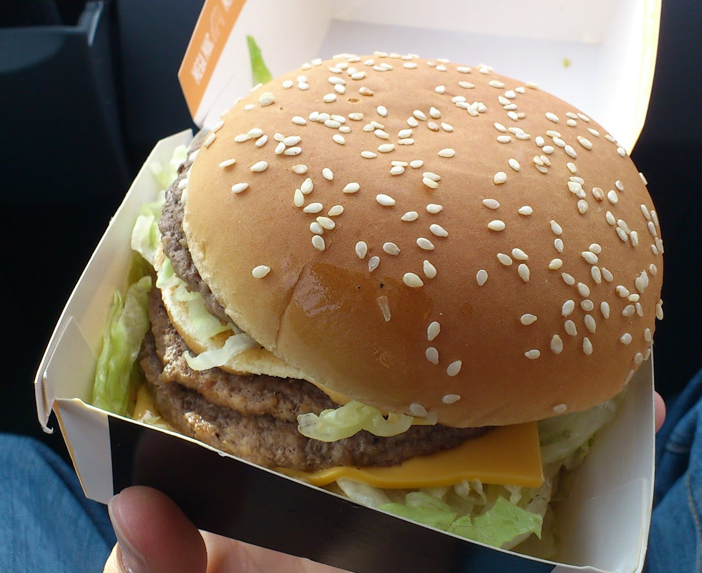

どーもとさいぬです

&nbsp;

昨日の昼食はマクドナルドで復活したらしいメガマックを食べてきました〜

でも、ものすごく微妙でした・・・

&nbsp;

メガマックのボーリュームはすごかったんですよ

こんな大きな箱でした

&nbsp;

でも、今マクドナルドは60秒以上たったら何かもらえるみたいなイベントをやっているせいか、

&nbsp;

いつも以上に作りが雑

蓋を開けるなりキャベツは落ち、そして店員は積み重ねる気あったのか？と言いたくなるくらいの本体。

もう崩れているって言ってもいいんじゃないでしょうか？

&nbsp;

ポテトは大量に作り置きされていたんだろうな・・・とわかるくらいに冷めている上に揚げ過ぎでパサパサ。

今までで一番まずかったマクドナルドでの食事になりました。

&nbsp;

ファストフードとはいうけれど、

マクドナルドには時間がかかってもいいので美味しい物を提供してもらいたいところです。

