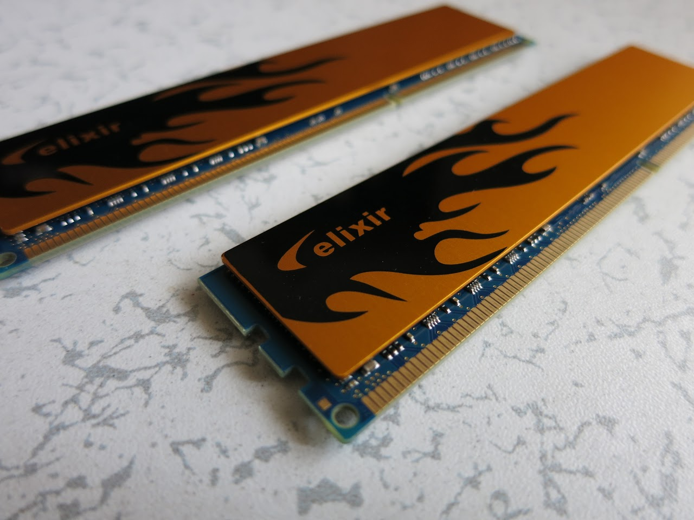

買いすぎた（笑）

&nbsp;

仕方ないね

&nbsp;

&nbsp;

&nbsp;

↓では一つずつ紹介していこうと思います。

<!--more-->

&nbsp;

<h3>PC関係</h3>

・Intel Core i3 3220

友人より安く譲ってもらいました。

ね、なんでだろうね。

Ivyは組まない予定だったのにね。

面倒くさいのでリテール使います。

友人の言うとおり本当に未使用でした。

つい最近までこれでi7-2600kを回してプギャーしていたKさん（また別の友人）の気持ちでも味わおうと思います。（笑）

&nbsp;

&nbsp;

・GIGABYTE B75M-D3H

GIGAのマザボです。

B75安過ぎだろw

そしてネイティブなPCIが熱すぎる。

まぁCPUも貰ったことだし・・・あれマシンが増える予感・・・

1155小さっ！！！！！！！

SATAは合計6本。フロントUSB3.0用のコネクタもあります。

公式サイトの画像では、この補助電源のコネクタは4pinだったのですが・・・

いくつかのロット？で変わっているのでしょうか？

&nbsp;

&nbsp;

・Elixir M2X2G64CB88GHN-DG（DDR3 PC3-12800 CL9 2GBx2）

ただのメモリです。

CL9（他の値は忘れた）なので、4枚でクアッドチャンネル動作させたらメイン機よりも速いかもしれません。

&nbsp;

&nbsp;

・SCYTHE GOURIKI NAKED 500w

安電源です。

FreeTがあった場所にオープンしたばっかりのBuy Moreで安かったので購入。

なんか簡素な箱だなぁと思っていたら、ただ裏返していただけでした。

プラグインではありません。まぁ内側のデザインにこだわるわけではないし、日によっては実験用にする予定なので関係無いでしょう。

&nbsp;

&nbsp;

・ENERMAX T.B.APOLLISH（140mm RED 2枚）

メインに載せるためのファンです。

&nbsp;

&nbsp;

・XINRUILIAN RDH-1225SBK24（120mm 25mm厚 2400rpm ２枚）

これもメインに載せます。

フロントからの吸気を強化するためにイイ音がなってくれる強力なものを選びました。

ケースを加工してフロントに120mmファンが2枚載るようにする予定です。

&nbsp;

&nbsp;

・Lian Li UC-01

美しいアルミケースのメーカーのアクセサリです。

メイン機のケースのUSB3.0コネクタがマザボ上のコネクタで接続するものではないので買いました。

今は似たようなものを使っていますが、接触が悪すぎて使い物にならないので交換します。

&nbsp;

&nbsp;

・AINEX 3.5-5インチ変換マウンタ

メインに差しているカードリーダーに使います。

今使っているものが自分で塗装したもので、なんか気に入らなかったので。

&nbsp;

&nbsp;

・Buffalo WLI-UC-GNM

有線で繋げそうに無い場所でマシンを動かすことになったので。

てか小さっ！

&nbsp;

&nbsp;

・OVERCLOCK WORKS MANAITAN-X

OCWのまな板です。

ぶっかける予定はないけれど極冷対応らしいです。

&nbsp;

&nbsp;

<h3>ジャンク</h3>

・電源

コンデンサがお亡くなりになってました。

&nbsp;

&nbsp;

・HDD（200GB SATA）

「パーツもあるし、ホテルで回せるんじゃね？」と思い急遽買ったもの。

<del>結局キーボードがなくてBIOSすら拝むことができなかったのは内緒</del>

&nbsp;

&nbsp;

<h3>カメラ関係</h3>

・Canon PowerShot S110

昨日の記事参照

&nbsp;

&nbsp;

・SANDISK SDカード（16GB）

えくすとりーむ

&nbsp;

&nbsp;

<h3>その他</h3>

ただの御札ですが何か？

&nbsp;

ウザさにひかれて・・・

&nbsp;

ドロイド君キーホルダー

丸いものって撮りにくい。影ができて物凄く暗いところができたりする。

&nbsp;

ゲームです。

モザイクかかってますが、エロゲではありません。クソゲー臭プンプンのゲームです。

これは先ほどのKさんにあげる予定です。

渡したらモザイク外して再うpする予定。

&nbsp;

つくもたん

にゃん

&nbsp;

&nbsp;

もしかしたら書き忘れがあるかもしれないけれど、本当に買いすぎた。

反省します。

&nbsp;

とても楽しい旅でした

来年でいいのでまた行きたいですね

&nbsp;

なにより、僕の地元とは違い、回るところがが決められないくらいの店があるのが良かったです。

