Xperia端末のブートローダーをアンロックする方法にOmniusを使う方法があります.  
ドコモ等のXperia国内モデルのアンロックはこれを使ってアンロックするようです.

Omniusでアンロックを行うにはUnlock Licenceの購入が必要です.  
購入方法はいくつかありますが, 僕がいつも利用している[Unlocking Software](http://www.unlockingsoftware.co.uk/)からライセンスを購入する方法を紹介します.  
購入できるライセンスの種類が少ないですが, 入金後すぐにライセンスが送られてきたり, 携帯電話の番号を入力する必要もないので気に入っています.

ちなみに, アンロックに成功するとSIMロックも解除されるようです. 便利便利.

## アンロックのための準備

用意するもの

* アンロックするXperia端末
* WindowsがインストールされたPC(XP以降)
* ソフトウェアをダウンロードしてインストールできる権限
* Testpointをショートさせるもの(クリップや安全ピンが結構便利)

ライセンスの購入にはPaypalを使います.  
アカウント作成やクレジットカードの登録を済ませておいてください.

## アンロック用ソフト "Omnius for SE" をインストール

[Omnius](http://www.omnius-server.com/)のページヘ行き, 上にあるタブのDownloadを開きます.  
このような項目が表示されると思うので**Omnius for SE**をクリックしてダウンロードします.  
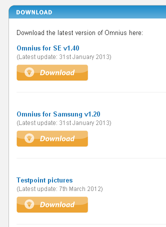

ダウンロードしたファイルを解凍し,その中の実行ファイル**Omnius\_for\_SE\_v"バージョン"\_installer.exe**を実行してインストールします.  
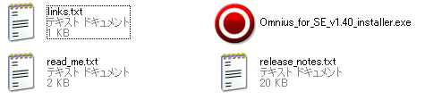

## ライセンスを購入する

[Unlocking Software](http://www.unlockingsoftware.co.uk/)にアクセスし, 左側のProducts -> Sonyericsson -> Omnius Softwareと進みます.  
ページを下げていくと画像のような項目があるので,  
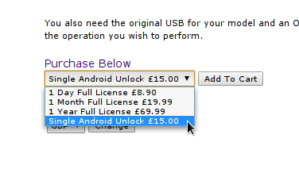

**必ずSingle Android Unlockを選んで**Add To Cartをクリックします.  
絶対にそれ以外のを選んではいけません.  
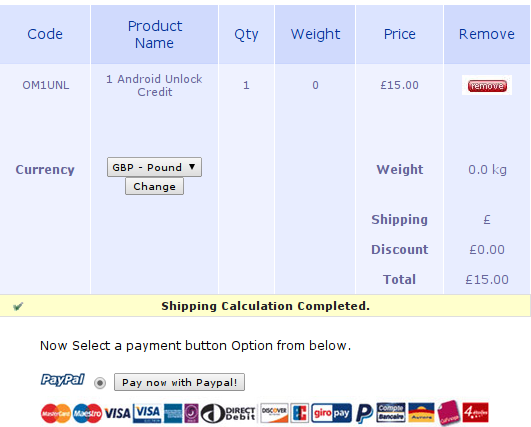

購入するライセンスの数(Qty)などを絶対に確認してください.  
何度かやり直したりしていると, たくさんのライセンスがCartに入っていることがあります.

Pay now with Paypal!をクリックして支払いに移ります.  
画面にしたがってPaypalでの支払いを済ませてください.

おそらく数分もすると, 支払いの時に入力したメールアドレスにこのようなメールが届きます.

> From:helpdesk@unlockingsoftware.co.uk  
> Dear Sir Madam  
> Thank you login Purchased From www.unlockingsoftware.co.uk Non HTML version

> Username  
> hogehoge

> Password  
> fugafuga

> Credit  
> 1.0A

これでライセンスの購入は成功しました.

## ログインする

Omnius for SEを起動します.  
スタート -> すべてのプログラム -> Omnius for SE -> Omnius for SEです.  
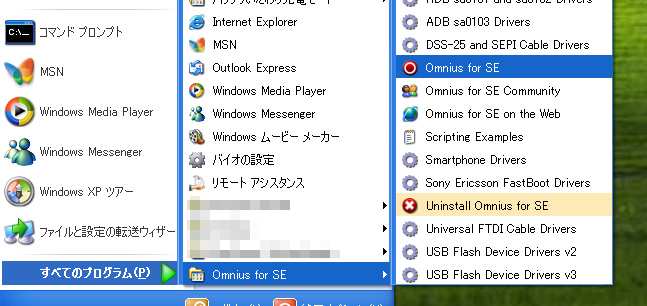

上部のサーバタブからサーバ設定をクリックします.  
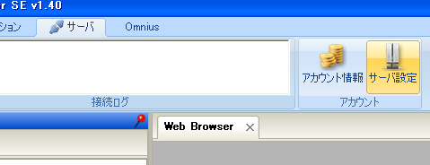

先程届いたメールに書かれたユーザー名とパスワードを入力します.  
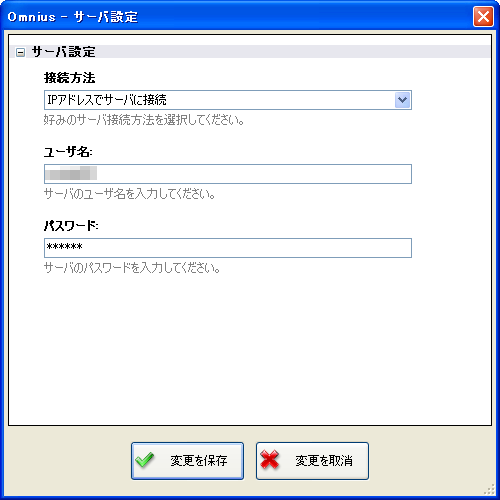

ログインに成功すると画像のようなメッセージが表示されます.  
エラーメッセージが表示された場合、入力ミスがないか確かめてください.  
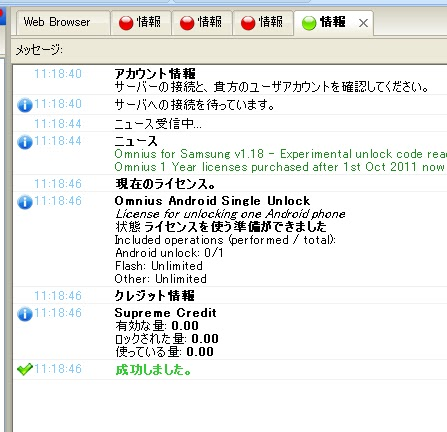

## Unlock！！！

アクションタブに戻り, 左側にあるプルダウンメニューからアンロックしたい端末の機種を選びます.  
今回はXperia RayをアンロックするのでXperia Rayを選びます. 結構下の方にあります.  
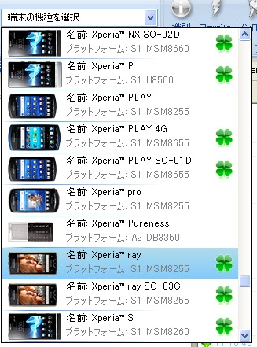

プルダウンメニューの右側にアンロックというボタンがあるのでクリックし, 証明書書き換えによるネットワークアンロックをクリックします.  
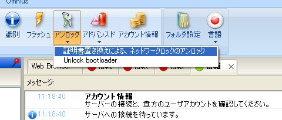

Omniusの画面に表示されている画像も参考にしながらテストポイントを探します.  
Rayはフタがされているので, 今回は細い針を使って開けました.  
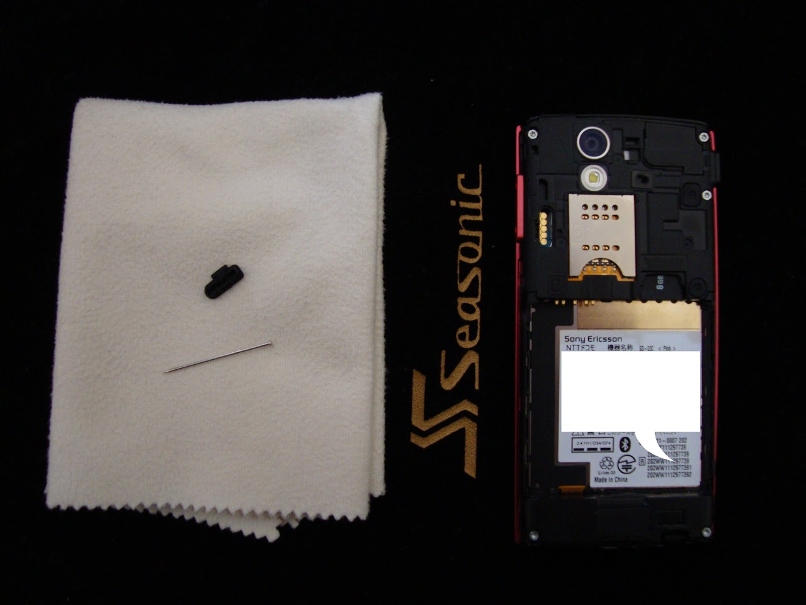

表示されている画像で赤くなっている部分とバッテリーを取り付けるところのマイナス端子, またはSIMカードのカバーをショートさせます.  
クリップなどが便利です.  
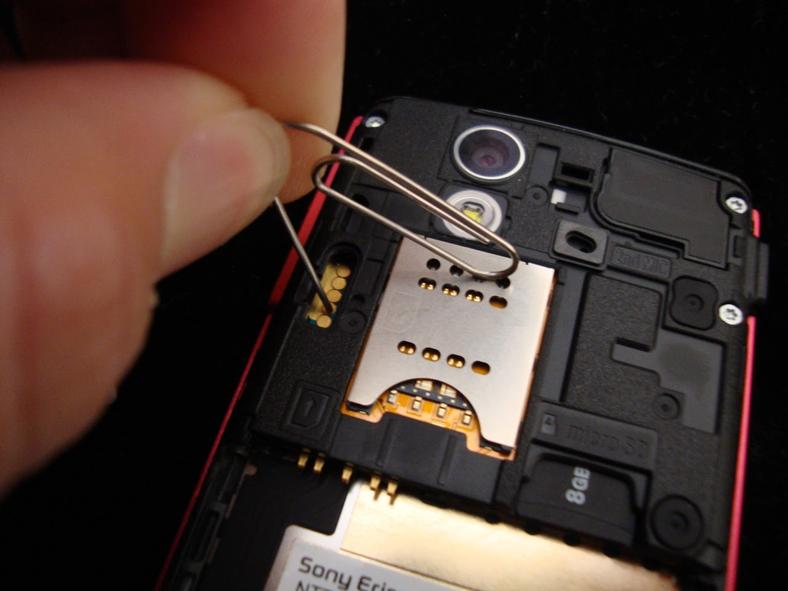

この状態でPCとUSBケーブルで端末を接続すると勝手にアンロック作業が始まります.  
Testpointを離すように指示されたらショートしているものを外しましょう.

稀にWindowsの面倒くさいドライバという概念のせいでインストールが間に合わず作業が失敗する場合があるようです. (僕も何度か経験しました)        
そのようなときは端末を一度外し, 証明書書き換えによるネットワークアンロックをクリックするところからやり直してください.

**成功しました**と表示されたらアンロック成功です.  
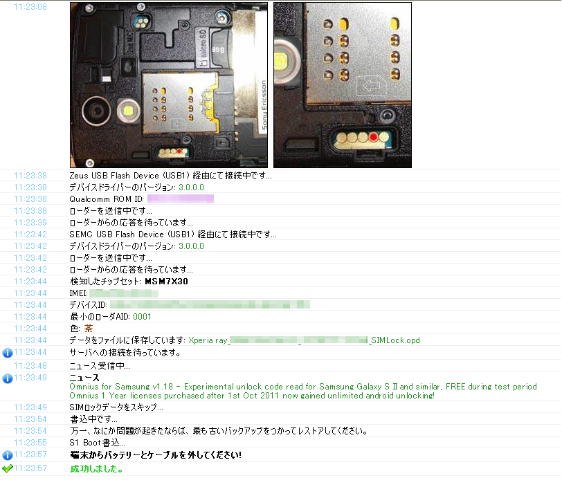

端末の電源を入れて電話を開きます.  
そして`*#*#7378423#*#*`と入力すると画面が切り替わると思います.

`Service Info -> Configuration`と進み, `Bootloader unlock allowed: Yes`となっているのを確認しましょう.  
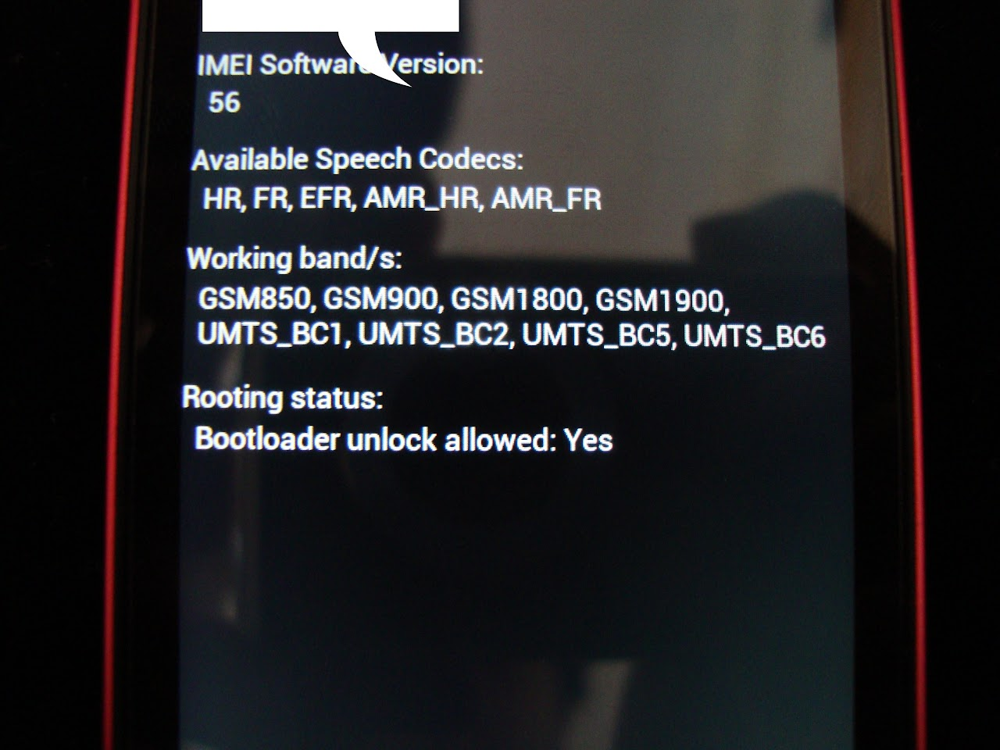

成功です, お疲れ様でした.
