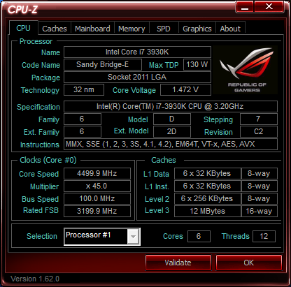
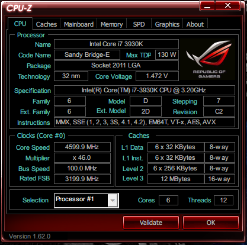
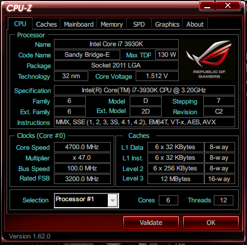
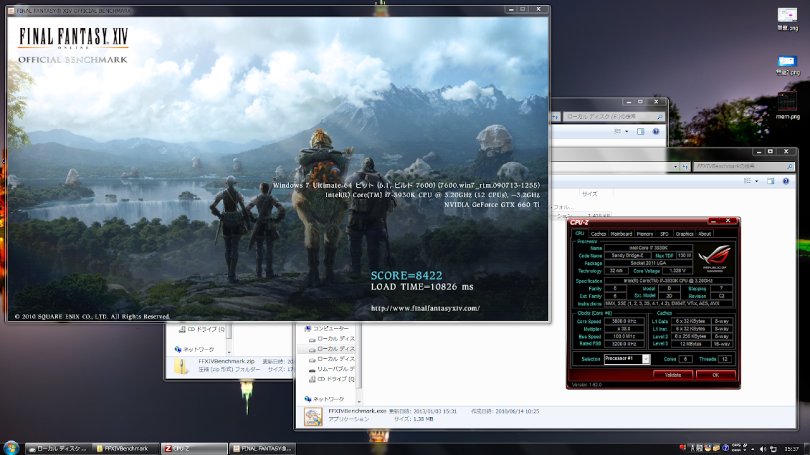
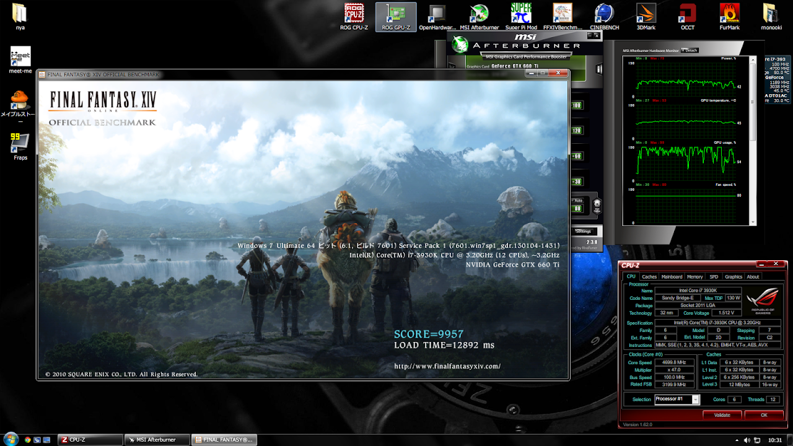

どもども

一応Xperiaの<a href="http://www5.pf-x.net/~tosainu/index.php/page/omnius">ブートローダーアンロック方法の記事</a>を完成させたつもりです。

打ち間違い等あったら指摘してもらえると助かります。

&nbsp;

とはいえ、なんかユーロも高くなっちゃったんですよね・・・

数ヶ月前は1800円もあればアンロックできていたのに、今は2200円くらいかかるみたいです。

正直言うと、2月の2台のペリアアンロック代行は、預かっていたお金を余裕でオーバーし赤字です。

&nbsp;

タイトルにもあるように、昨日はちょっとウチの3930kちゃんを焼いてました。

オーバークロック自体はかなり前からやっていたし、（ソケ478の北森pen4とか939のあちゅろんとか）

3930kのオーバークロック自体は組んでからもちょくちょくAI Suiteから試していましたが、

なかなか上手く回ってくれず4500MHz止まりだったんです。

&nbsp;

2月になってAI Suiteがなんかいろいろ調子悪くなってアンインストールしてからは遊んでなかったけれども、

昨日はBIOSから設定を見直しながら再挑戦。

&nbsp;

そして・・・

4600キター

&nbsp;

まだ盛れる・・・エイっ

4700キィ゛ェア゛アアアタアアア

&nbsp;

余裕でベンチが回るくらい安定しています。

&nbsp;

流行ってるゲームのベンチって何だろ？という理由で始めたFFXIVベンチ（Low）

定格では8422でした。

これなら10000目指せるんじゃね？と思い、以前からそれを目標にいろいろ粘っていました。

&nbsp;

4700が回った状態でさらにAfterburnerでグラボも盛ってやり・・・

9957達成！

&nbsp;

もう少し、あと少し・・・・

&nbsp;

あとはコア絞りながらもう少しクロックをあげられたらなぁと思います。

電圧もどこまで下げられるかってのも試してみたいです。

<a href="http://hwbot.org/">HWBOT</a>とか見てるとCPU-Z読みで1.4v台で5GHz回ってる人もいるようなので。

個体差はあるだろうけども・・・

&nbsp;

ベンチのプログラムをRAMDISKとかの基地外ストレージに置いてみるのも試してみたいなー

&nbsp;

&nbsp;

