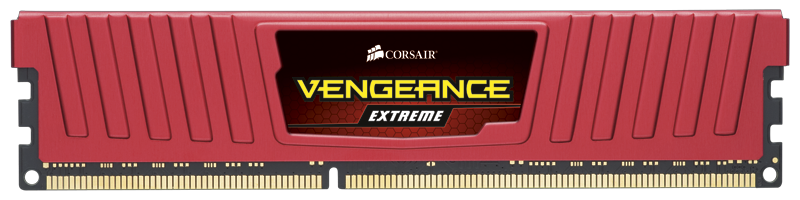

<a href="http://www.techpowerup.com/181440/Corsair-Unleashes-Vengeance-Extreme-the-World-s-Fastest-Rated-PC-Memory-Kits.html">Corsair Unleashes Vengeance Extreme, the World's Fastest Rated PC Memory Kits | techPowerUp</a>

<a href="http://www.corsair.com/us/memory-by-product-family/vengeance/vengeance-extreme-memory-8gb-3000mhz-cl12-1-65v-ddr3-memory-kit-cml8gx3m2a3000c12r.html">Vengeance® Extreme Memory — 8GB 3000MHz CL12 1.65V DDR3 Memory Kit (CML8GX3M2A3000C12R) - Vengeance - Memory by Product Family</a>

&nbsp;

お、、、おい、、、、、、、

も、、、、もう出ちゃったのかよ、、、、、

&nbsp;

どうやらメモリクロック3000MHzが回るらしいメモリが出たっぽいです。

&nbsp;

メモリクロックどんどん伸びてるなー

この調子だと年内に3000MHz出ちゃいそうだな・・・って思ってたのも数週間前。

&nbsp;

もう出ちゃったっぽいです。

&nbsp;

<del>
驚きなのはクロックだけでなく容量も。

Gskillの2800MHzメモリが4GBなのが、

容量が大きくなってくると高クロックで回りにくいからって噂があったはずなのに、

今回発表されたのは8GBですよ！！
</del>

訂正：これも4GBx2枚のキットでした

&nbsp;

もう一体どーなっちゃってるんでしょうねメモリの世界は・・・

短期間でどんどん高速化してるようです。（他のパーツ類もそうですが）

&nbsp;

ちらほら明らかになってきているDDR4も2000MHz台で動くらしいし・・・

&nbsp;

&nbsp;

&nbsp;

いつかメイン機に2133、せめて1866なメモリに載せ変えたいな・・・

Quad Channelで動かしたら・・・・ムフフフフフフフ

&nbsp;

はい、ただの妄想です。

ではでは～

