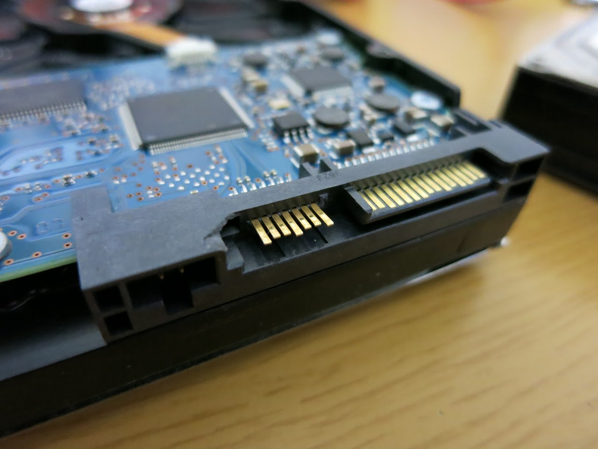
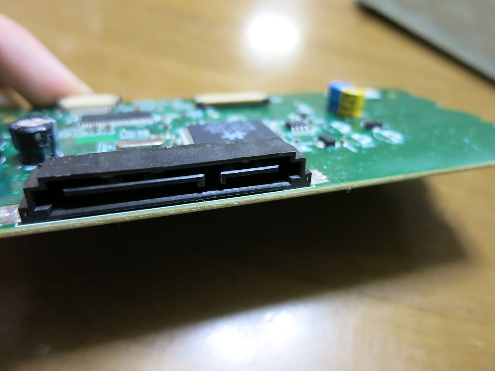
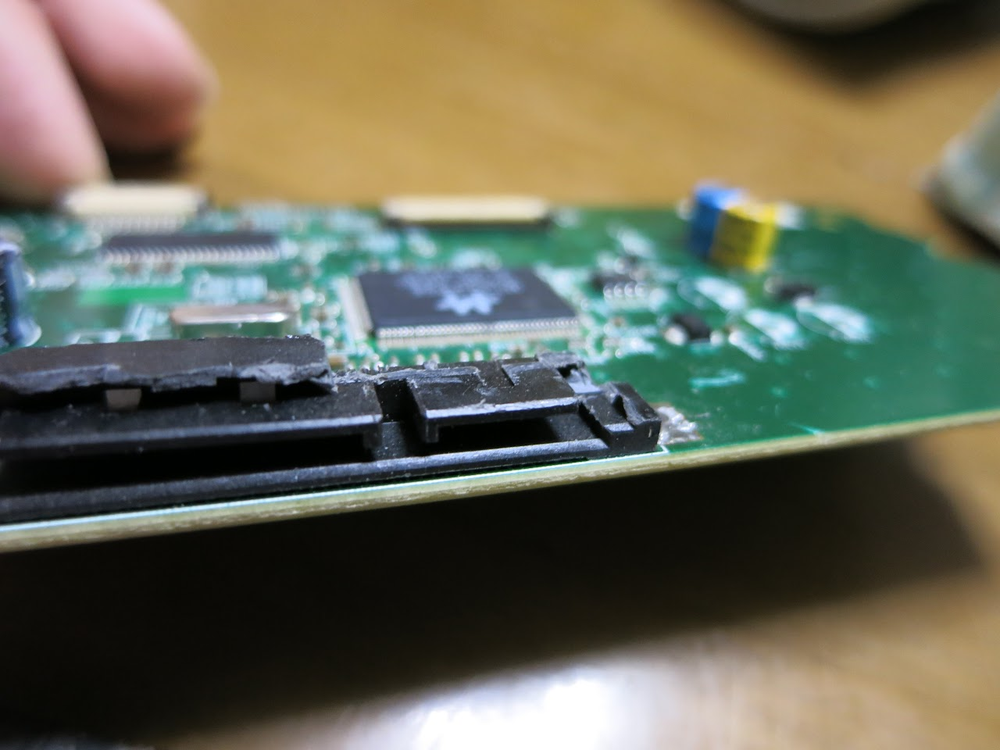
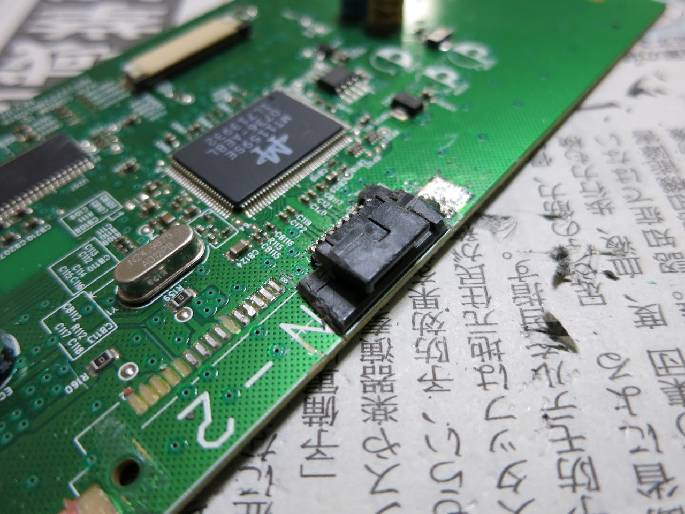
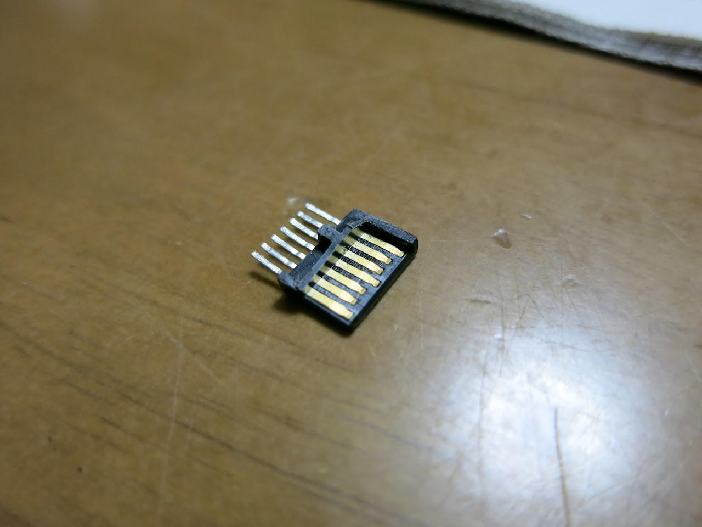
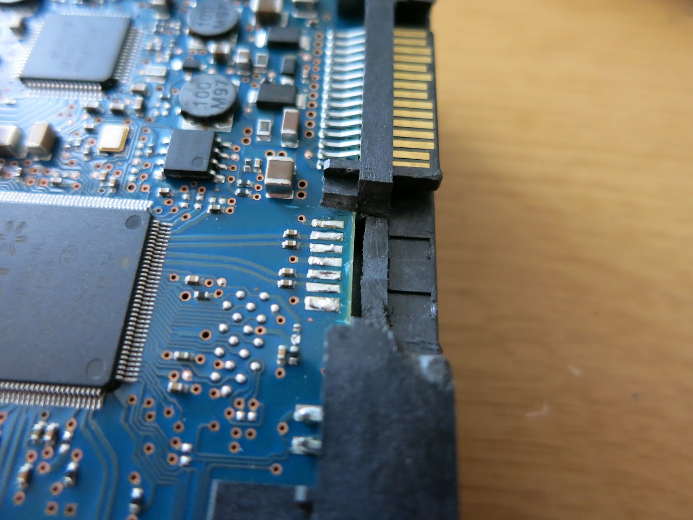
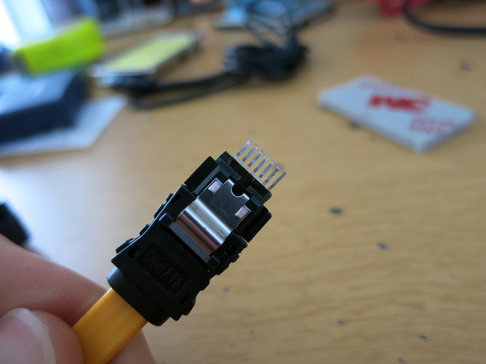
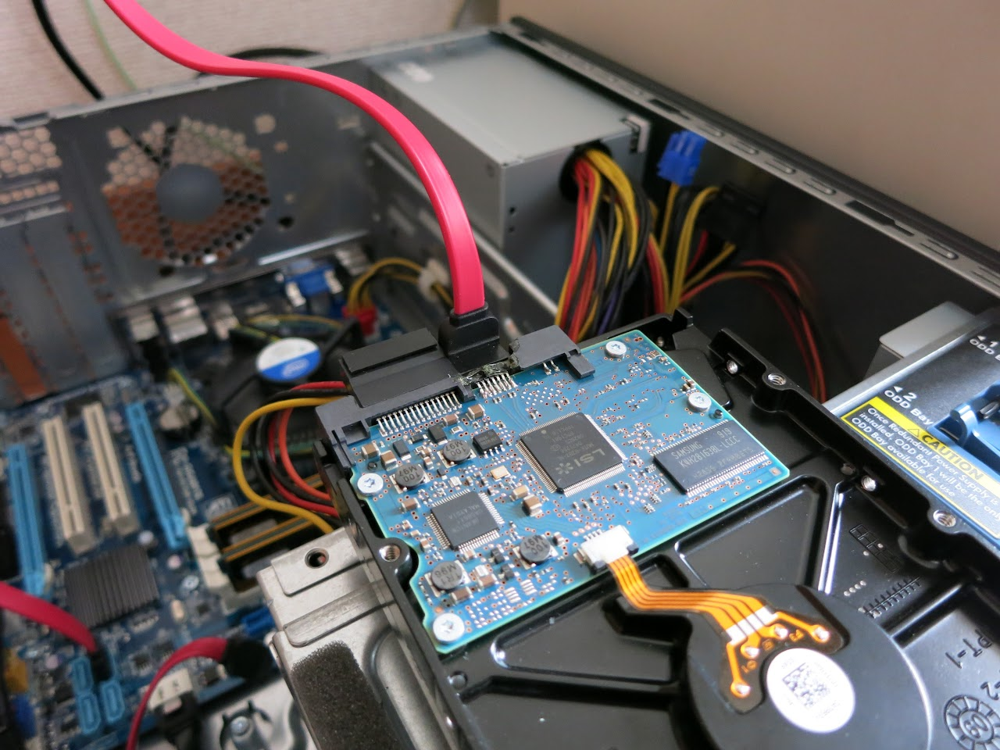

随分前から預っていたのですが、SATAコネクタ部分が破損したHDDを昨夜から修理してました。

無事修理できたようなので、その報告的なもの。

&nbsp;

まず、ドナーとなるSATAコネクタを取り出します。

今回は光学ドライブと思われる基板を使いました。

&nbsp;

破壊♪

&nbsp;

後で固定しやすいように、またある程度強度を持たせるため、周りの凸凹は残しておきます。

&nbsp;

次はHDDを加工します。

問題のSATAコネクタの部分を

破壊♪

&nbsp;

先程取り出したコネクタの端子を爪付きのSATAケーブルに差し、HDDに位置を合わせながら固定し、ハンダ付け。

あとは、取り付けた端子の周りを接着剤で固定し完成です。

&nbsp;

現在、自作機2号で物理フォーマット中です。

何の問題もなく読み書きできているようなので成功でしょう。

