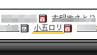

これ今日の昼食なんだけど、たぶん今までで一番きれいなビッグマックだとおもう。

全国のマクドナルド厨房の人はせめてこれを目指すんだ！！

&nbsp;

ニコ動のタグに時々？

こんなのがあるんだけど、どうしても気になったので調べてみただけ。

&nbsp;

参考

<a href="http://dic.nicovideo.jp/a/%E5%B0%8F%E4%BA%94%E3%83%AD%E3%83%AA">ニコニコ大百科（仮）</a>

<a href="http://dic.pixiv.net/a/%E5%B0%8F%E4%BA%94%E3%83%AD%E3%83%AA">ピクシブ百科事典</a>

&nbsp;

<pre class="type" name="code">
いいか、みんな 
　　　　　 　( ﾟдﾟ) 
　　　　　　(　y ) 

小五とロリでは単なる犯罪だが 
　小五　　( ﾟдﾟ)　　ロリ 
　　　＼／　y ＼／ 

二つ合わされば悟りとなる 
　　　　　( ﾟдﾟ)　 悟り 
　　　　　(＼／＼／ 
</pre>

&nbsp;

考案者はなぜこれを思いついたんだ？？

上手いんだけど酷い・・・

&nbsp;

まぁ何の事かわかったのでよしとしましょう。

ちなみに僕はロリコンではないです。きっと。

