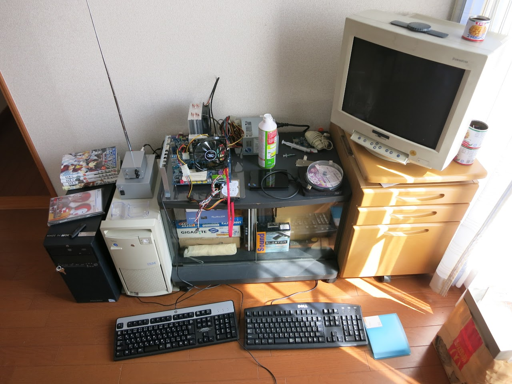
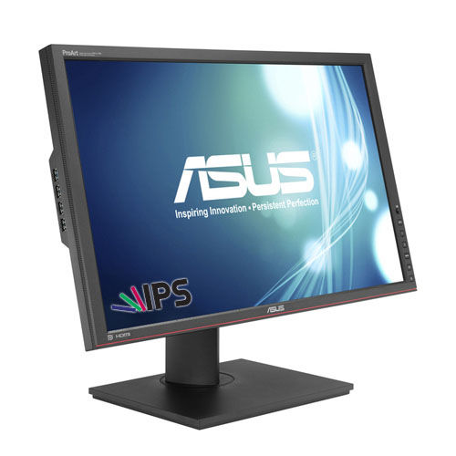
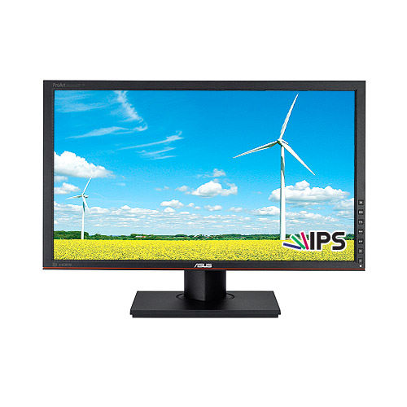
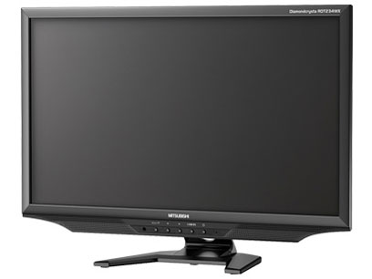
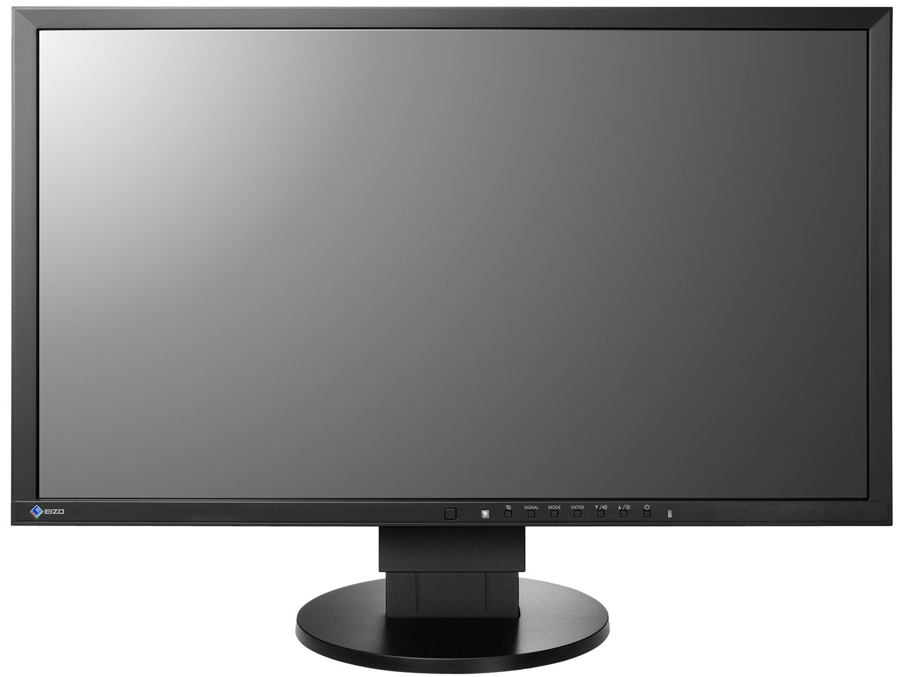
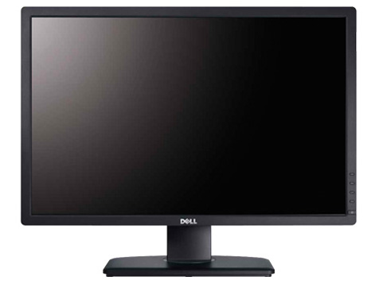

かなり前から呟いてた気がするけど、

やっぱり液晶ディスプレイが欲しいなぁと。

&nbsp;

本当はメイン機をリビングじゃなくて自室に置きたいんですよ。

でも今のままでは不可能では無いけど嫌なんです。

なぜかというと・・・

&nbsp;

僕の部屋にあるディスプレイがCRTだからです。

いや、CRT嫌いじゃ無いんですよ、問題なのが

解像度と大きさ

&nbsp;

ノーパソでさえ1920x1080ってのにメイン機のディスプレイが1280x1024ってちょっと・・・

そして奥行が50cmくらいあるっていうね

&nbsp;

ちゃんと部屋に机はあるんだけど、こんな巨大なもの置いたら作業スペースがなくなります。

机の上といい解像度といい狭くなってしまうのです。

&nbsp;

ってことで、とりあえず予算無視で良さそうなディスプレイを挙げてみる。

要求するものは、

<ul>
<li>DisplayPortとD-Subは必須。追加でDVIとかHDMIとかあると嬉しい。</li>
<li>表面処理はノングレア。でもベゼルがテカテカだったら意味がない。</li>
<li>24インチ以下。あんまり大きいと、置く場所がなかったり、荒く見えたりするのでヤダ。</li>
<li>1920x1080以上の解像度。とさいぬは高解像度/高dpi厨です。</li>
<li>画質。コマンド打ったりプログラム書くので、文字が滲むとか論外。</li>
<li>画面は暗めで使う予定。</li>
</ul>

&nbsp;

ASUS P248Q

24.1インチで1920x1200。IPS液晶のディスプレイ。

入力端子はDisplayPort、HDMI、DVI-D、D-Subと、まさかの欲しかったものが全部付いているうえに、USB3.0ハブまで付いている。

あまり期待はしていないけど、sRGBカバー率100％だったりする。

&nbsp;

ASUS PA238Q

P248Qが1920x1080の解像度になって、横のUSBハブが2.0になったって感じのやつ。

5千円くらい安くなる。

&nbsp;

三菱 RDT234WX(BK)

（きっと）信頼性のある日本メーカー製。23インチで1920x1080。IPS液晶のディスプレイ。

DisplayPortは無いけど、十分な入力端子が付いている。

日本メーカーらしい『必要そうで必要でない、ちょっと必要な機能』ってのがいっぱい。

P238Qと同じくらいの価格。

&nbsp;

ナナオ EV2316W-TSBK

23インチで1920x1080。IPS液晶のディスプレイ。

なんかナナオってだけで満足しちゃいそう。

とはいえFlexScan EVシリーズの省電力機能が鬱陶しいって噂が気になる。

&nbsp;

DELL U2412M

24インチで1920x1200。IPS液晶のディスプレイ。

多分要求スペックを満たしている上に一番安いモデルだと思う。

問題が購入方法とその後のサポート。

&nbsp;

&nbsp;

&nbsp;

結論

僕の要求スペックが高い

3万円以内で買えそうなのはこれくらいでしょうか

予算も出せそうにないし、1万円台が理想だけれど、そんなディスプレイは少なかった。

DisplayPortと画質は諦めないとだめなのかなぁ・・・

