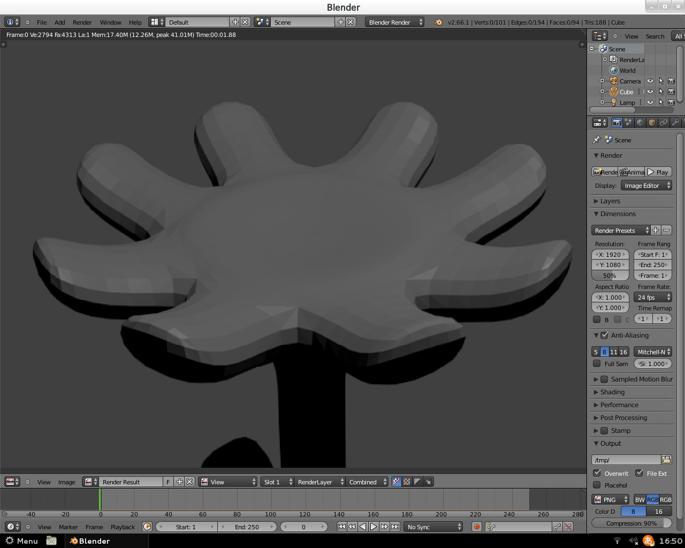

どーもです

&nbsp;

いつかはガチで勉強したいなぁと思う3DCGの世界。

ってことで無料とは思えないほど高性能と噂のBlenderを使って軽く遊んでみたんだけど・・・

&nbsp;

何なんだこれは！！！

&nbsp;

とさいぬは一応、春なのでってことで花を作ったつもりなのですが・・・

&nbsp;

なんか気持ちの悪い謎の物体が完成してしまいました。

&nbsp;

&nbsp;

うー・・・

もっと頑張るか・・・

