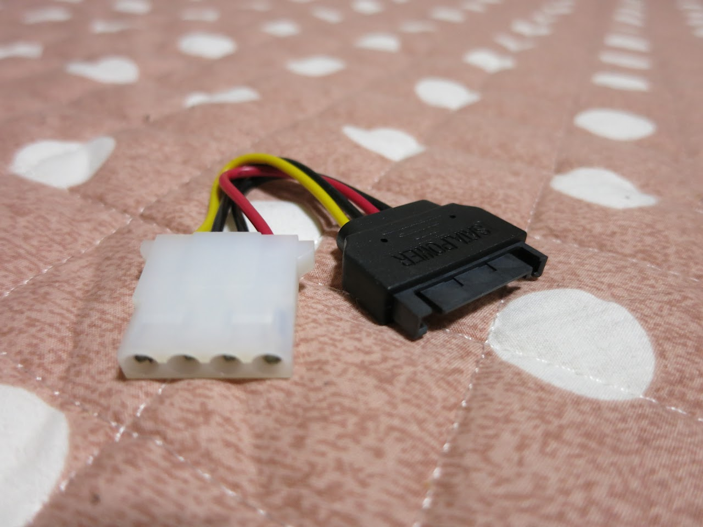
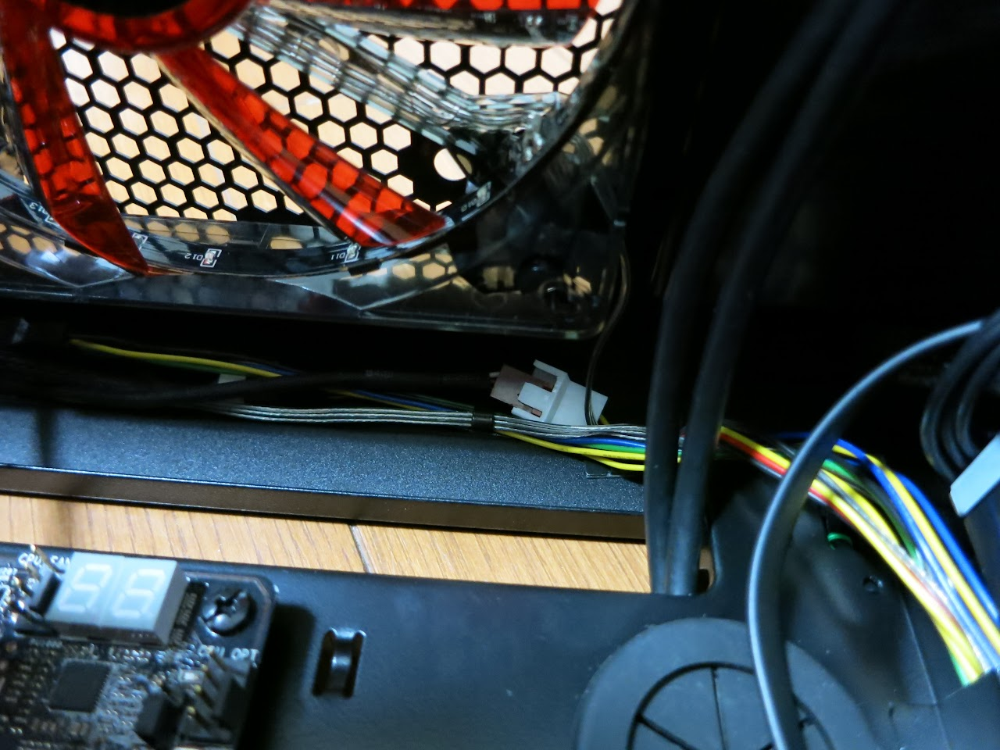
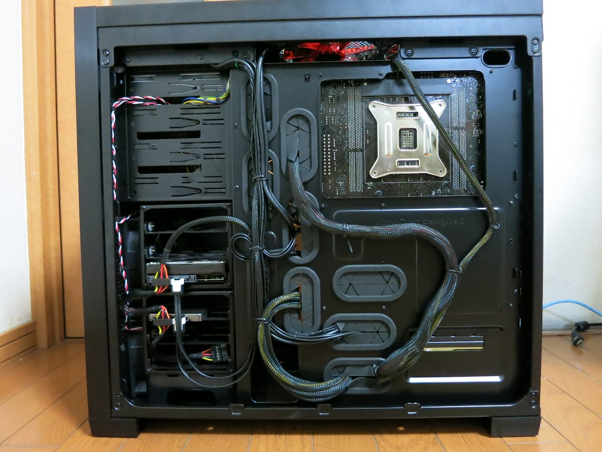
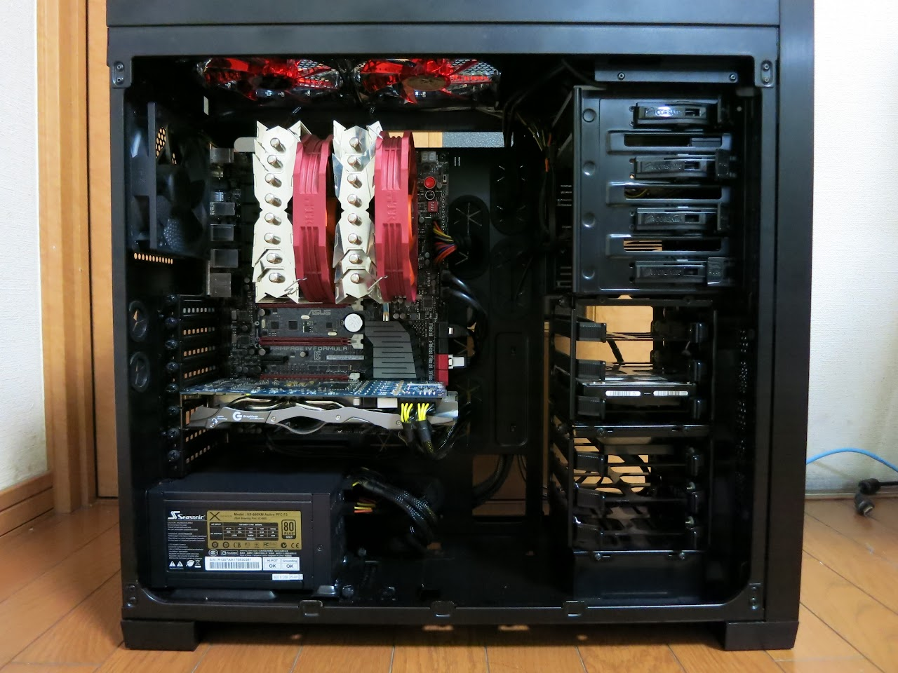

どーもです。

なんか今日が春休み最終日らしいです。

&nbsp;

ｪｪェェｴｴエエ工工（゜д゜）工工エエｴｴェェｪｪ

&nbsp;

&nbsp;

うーん・・・

早かったなぁ・・・

&nbsp;

&nbsp;

ってことでケーブル整理したZE！（何で？）

&nbsp;

今までは、電源ユニットからATX24pin、ATX8pinの他、グラボ補助電源の8+6pin、HDD・SSD用のSATA電源、光学ドライブのSATA電源、ファンコンのペリ4pinが延びていました。

今回、SATA→ペリ4pinの変換コネクタを手に入れたので、ペリ4pinのケーブルをなくすことができました。

&nbsp;

近所のホームセンターで、ケーブルを固定するやつが40個入りで安く売っていたので購入。

ファン関係のケーブルをここ

に隠しました。

&nbsp;

かなり見える配線は減ったんじゃないかなぁと思います。

上部のファンのケーブルも思っていたよりは気にならないです。

&nbsp;

授業始まったら、PCなんて弄ってる暇ないかもしれないですね。

「春休み中はほぼ毎日記事更新するんだー」とかこっそり目標にしていましたが、週1くらいに減りそうです。

&nbsp;

ではまたいつか〜

