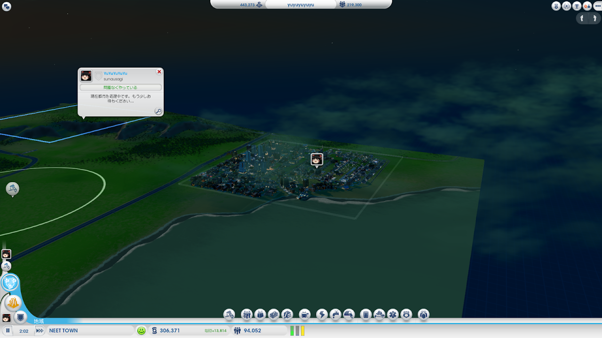

どもー

&nbsp;

数日前からずっとこれ

メインの都市にアクセスできないんだけど・・・

&nbsp;

その結果、サブ都市がどんどん人口が増えていって、そろそろメイン都市の人口を抜かそうとしている。

NEET TOWNとか支持率65%とか突っ込んじゃいけないよ！！

だって本当にみんなニートで仕事していない住民だらけだから。

&nbsp;

サブ都市とはいえ何とかしないといけませんね・・・

メインも早く進めたいです。

&nbsp;

&nbsp;

もう違うサーバーに乗り換えてやり直そうかな・・・

ggって見ると復帰してもデータが消えてるって場合もあるもたいですし(泣)

