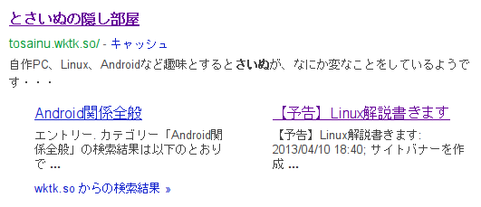
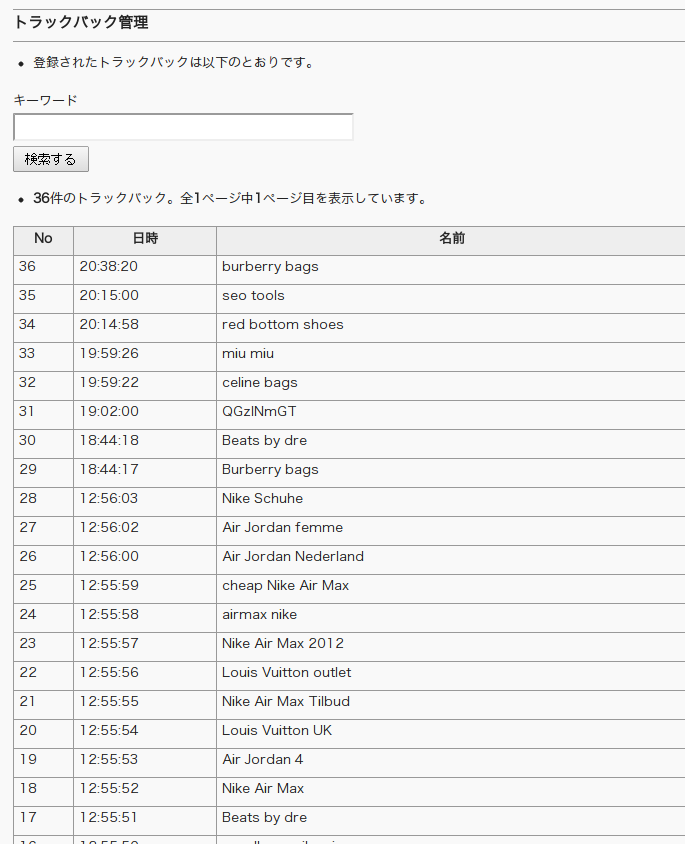

どーもです

&nbsp;

数日前から始めていた<a href="http://tosainu.wktk.so/view/263">検索サイトからの表示がおかしい件</a>が解決しつつあります。

ちゃんとしたサイト説明と、子ページとして最新の記事などのリンクが表示されるようになってくれました。

&nbsp;

主にやったことは、

前回

<ul>
<li>Metaタグを使い、トップページにサイト解説を追加</li>
</ul>

新たに行った対策

<ul>
<li>HTMLタグ上でサイドバーよりもメイン内容が上にくるように変更</li>
<li>GoogleウェブマスターツールにサイトのRSSを登録</li>
</ul>

&nbsp;

まぁ、特にアフィリエイトとかやっているわけでもないので、検索結果からの映り方なんて実際どうでもいいのですが。

&nbsp;

&nbsp;

さて、今日の13時頃から大量のトラックバックが記録されました。

&nbsp;

どれも外国の広告サイト？のようなところから。

&nbsp;

コメントと違いひどく荒らされているわけでもないので迷惑だとは思っていないけれども、

これって俗に言う「スパム」ってやつですかね？

&nbsp;

これでブログやWEBサイト運営は5年になろうとしていますが、トラックバックが記録されたのは初めてなのでちょっと嬉しかったりもする。

よくわかりませんね・・・

&nbsp;

&nbsp;

サイトのデザインが可変幅から980px固定幅になりましたがどうでしょうか？

まだ配色やCSSやHTMLの書き方が気持ち悪くて許せないのでコロコロ変わるとおもいますが、

見やすくなっているでしょうか？

