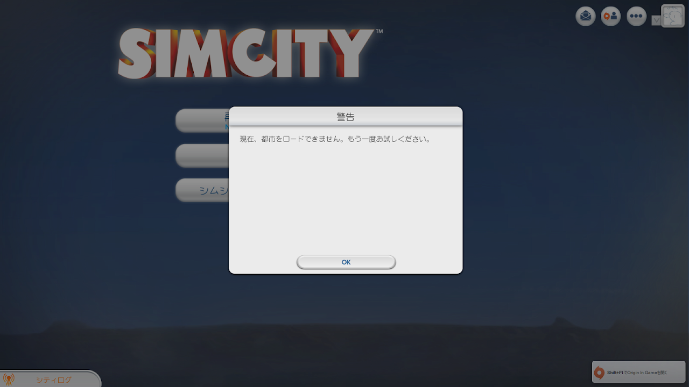

どーもです

&nbsp;

SIMCITYのアップデートパッチ2.0が来ましたねー

以前から悩んでいたSIMCITYの都市が読み込めない現象（以前の記事→<a href="http://tosainu.wktk.so/view/260">【SIMCITY2013】都市にアクセス出来なくなった件</a>）ですが、

公式が「街が適切に処理を行わない原因となっていた、いくつかの問題を改善しましたが、引き続き対応しています。」

なんて言ってるから期待大だったのに・・・

&nbsp;

&nbsp;

&nbsp;

&nbsp;

&nbsp;

サブ都市も開けなくなったorz

&nbsp;

うー・・・

サーバー替えて作り直そうかな・・・

