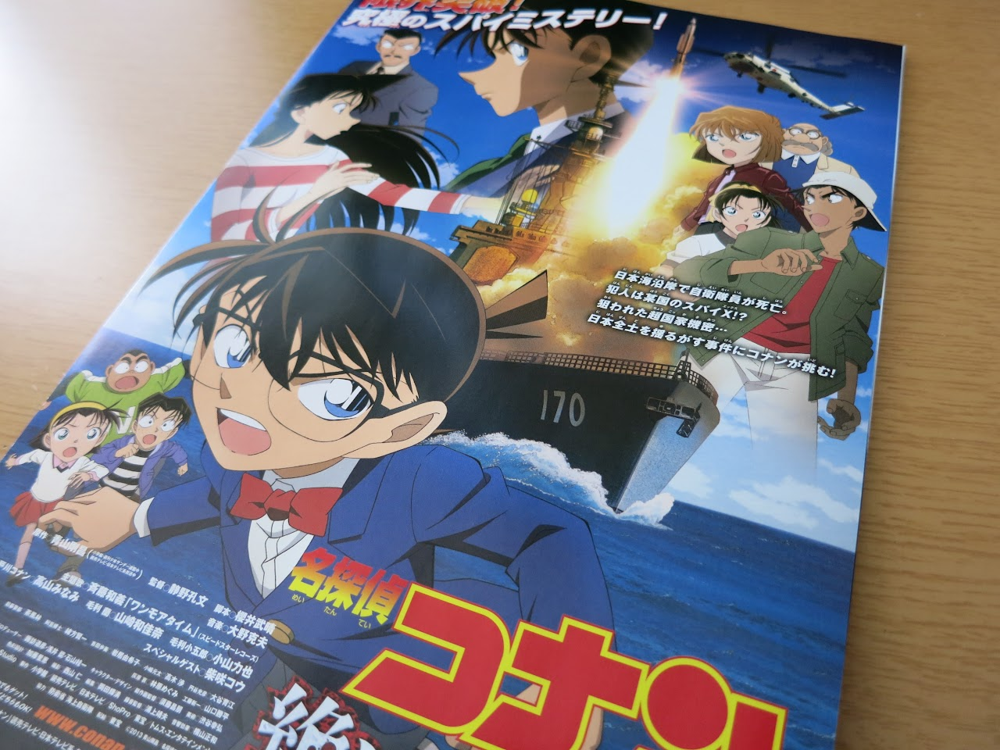

どーもです。

&nbsp;

『名探偵コナン 絶海の探偵(プライベート・アイ)』見てきました〜

<a href="http://tosainu.wktk.so/view/259">つい最近映画を見た気がしますが・・・</a>

&nbsp;

前回は友人に、今回は家族に誘われたので。

&nbsp;

正直に言うと、

『コナンの映画っぽくない』

&nbsp;

うまく説明ができませんが、コナンの映画特有の、

「事件解決・・・？→実はもっと重大なことが解決していなかった！！」

みたいなのが薄く、あっさりと事件解決してしまったような気がします。

映画の舞台がイージス艦という迫力の割に事件の規模が小さく、少し物足りない気がしました。

（といっても相変わらず蘭ちゃんは大変な目に遭ってましたが・・・）

&nbsp;

実際、本編開始前に流れた「ポケモンの映画の宣伝」の方が印象強かったのが本音です。

<iframe width="560" height="315" src="https://www.youtube.com/embed/rTyPZGdEyyc?rel=0" frameborder="0" allowfullscreen></iframe>

&nbsp;

あれっ？

ポケモンってこんなアニメだっけ！？

&nbsp;

ポケモンに興味はありませんが、この宣伝の衝撃のほうが大きかったです。

