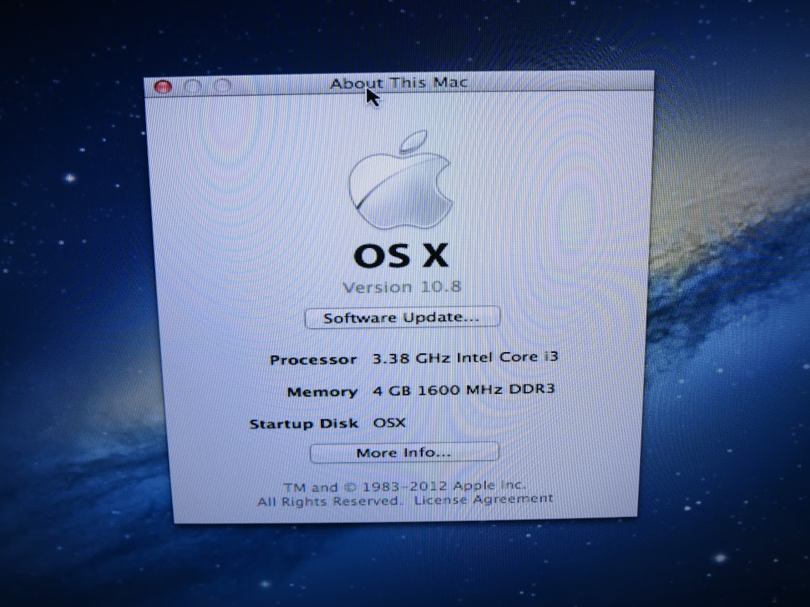

どーもです〜

&nbsp;

以前から興味があったHackintosh（林檎社以外のマシンに林檎社OSを入れること）の体験をしてみました。

あくまで今回は主に動作確認と手順の確認が目的だったため、少々グレーな方法を使いましたが、

あのLinux厨のとさいぬが、

「別にMacもアリかな・・・」

なんて思ってしまいました。

&nbsp;

そんな考えに至った原因とかを今日は書こうと思います。

&nbsp;

&nbsp;

まず、とさいぬは林檎社の製品が苦手です。（<u>会社自体はすごいと思う</u>）

林檎社製品の癖のあるデザインは僕にとっては何もかも使いづらく、

特にMacOSはWindowsから使い始めた僕には何もかも受け付けませんでした。

&nbsp;

ですが、今回OSXを実際に触ってみて、そんなイメージはほとんど吹っ飛びました。

まず、

&nbsp;

UNIXベースである

&nbsp;

そうなんですよ、Linuxに興味を持ち始めた頃から気にはなっていたのですが、

MacってBSD UNIXベースなんですよ。

&nbsp;

今回の実験では、学校のゴミ捨て場で拾ってきた海門80GBのHDDにインストールしたのですが、

起動時間を除いて、動作レスポンスはSSDに入れたWindowsと大して変わらなかったというか、

&nbsp;

むしろ速かった

&nbsp;

んですよ。

さすがだな〜って感じですね。

やっぱり、UNIX、Linixのプログラム実行速度はWindowsとは比べ物になりませんね。

&nbsp;

&nbsp;

また、UNIXもLinuxも似たようなもの同士ですから、同じようなことができるわけです。

Hackintoshでは、インストール後様々なデバイスが動くようにドライバの追加や設定ファイルの変更が必要になってきますが、

今回戸惑ったのは「システムファイルの書き換え」

システムの設定ファイルですから、対象のファイルをファイルマネージャからダブルクリックで編集ってわけにはいきません。

&nbsp;

そこで役だったのがコマンドライン。

何と、インストール直後からVimが使えたんですよ！！

sudo suでrootユーザーになって、vimから慣れた方法で書き換えができました。

これにはさすがに驚きです・・・

&nbsp;

&nbsp;

&nbsp;

何でしょうね・・・

林檎社専用OSとはいえ、自作機に案外すんなりとインストールできてしまいましたし、

UNIXベースのため、Linuxと共通のソフトウェアが使えた上に、

PhotoshopなどのAdobe系ソフトや、AutoCADなど、Windowsでも有名なソフトウェアにMac版があるってのを考えると、

Linux使いからすればちょっと羨ましい気持ちです。

&nbsp;

Macは、

「慣れさえすれば（←これ重要）ソフトも豊富なOS」

じゃないかなぁと思いました。

&nbsp;

サブOS（←あくまでまだLinux厨！Opensourceさいきょーね！）としてインストールディスクちゃんと買おうかな・・・

Gominodowsよりはるかに安いし。

