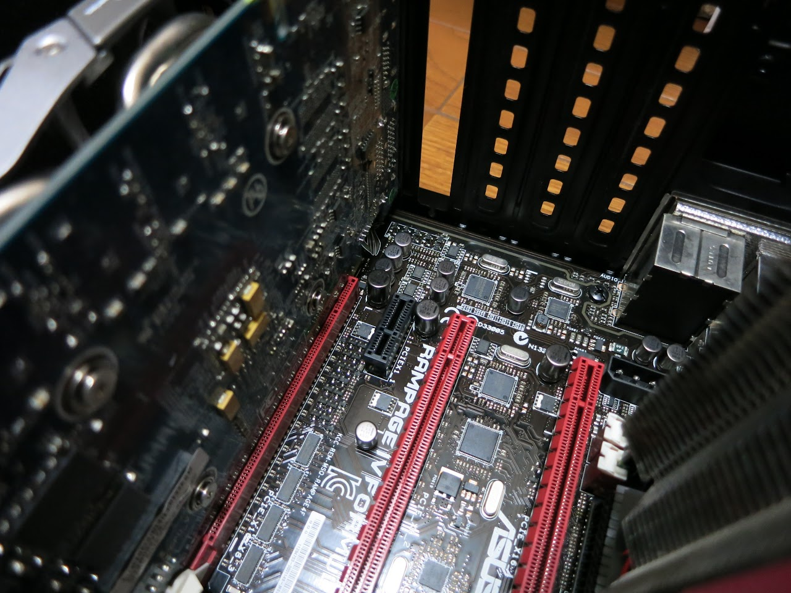

&nbsp;

行ってきました～

ガチ水冷マシンのこと、メモリ・CPUなどのオーバークロックのこと、

RAIDカードによるRAIDデモ、高音質オーディオシステム

&nbsp;

興味はあるけれど、情報の少ない分野について、

マシンを組んだ方々と実際に話をすることができました。

とても貴重な体験でした。

TEAM SHACHIHOKOさんたちの皆さん！

ありがとうございました！！

&nbsp;

&nbsp;

そして、

Intel Centrino Advanced-N 6205 for Desktop

&nbsp;

少々高くついてしまいましたが、通販にしか無いと思っていたものが並んでいたのでGET！

&nbsp;

&nbsp;

また、個人的に好きな絵師さんの本が名古屋のとら○あなにあるって情報があったのでついでに寄ってきました。

移転したとかで2時間近く歩き回った気がしましたが、無事GET！

同人誌を買うのは初めてです。

本当に薄いんですね・・・

&nbsp;

&nbsp;

一応言っておきますが全年齢・一般向けの本ですので・・・

&nbsp;

はい、では↓からIntel Centrino Advanced-N 6205 for Desktopのレビュー的なものになりまーす。

<!--more-->

&nbsp;

箱の中身

本体とロープロ用のブラケット、アンテナと固定用の両面テープと画鋲、取説とドライバDVD（←これ重要）

たかが無線LANカードのドライバだっていうのに950MBも入っていました。

このディスクは使わずIntelのサイトからドライバはダウンロードしましたが。

&nbsp;

本体

どう見てもノート用の無線LANカードががPCI-Ex1に変換されているだけです。

&nbsp;

今回はメイン機のグラボの上にあるx1スロットに取り付けます。

&nbsp;

付いた～

アンテナとの接続には2本のケーブルを使いますが、向きがあるようなので注意です。

ほんっっっっとうに見にくいですが、ANT1とANT2って書いてありました。

&nbsp;

アンテナのの固定には付属の画鋲を使い、

&nbsp;

壁にぶら下げました。

アンテナは軽いので、いまいち安定しません。

曲がった癖の付いたケーブルのせいで傾いてしまいました。

&nbsp;

付属の両面テープを使うなどしないとしっかり固定はできないでしょう。

&nbsp;

&nbsp;

さて、測度計測たーいむ！

今回は窓7x64で、<a href="http://tosainu.wktk.so/view/262">前回構築したイーサーネットコンバータ</a>とIntel Cent(ryの同じ場所での比較です。

契約回線は下り約15Mbps、上り約1Mbpsです。

&nbsp;

B11イーサーネットコンバータ

&nbsp;

Intel Centrino Advanced-N 6205 for Desktop

&nbsp;

&nbsp;

キタ———(゜∀゜)———— !!

さすがイソテルさんです。

というか、「契約回線がショボ過ぎて余裕過ぎなんですけどぉ～」なんて言っているようです。

&nbsp;

いずれ家の回線が高速なものになるのを期待して、この無線LANカードは大切に使います。

&nbsp;

ではでは～

