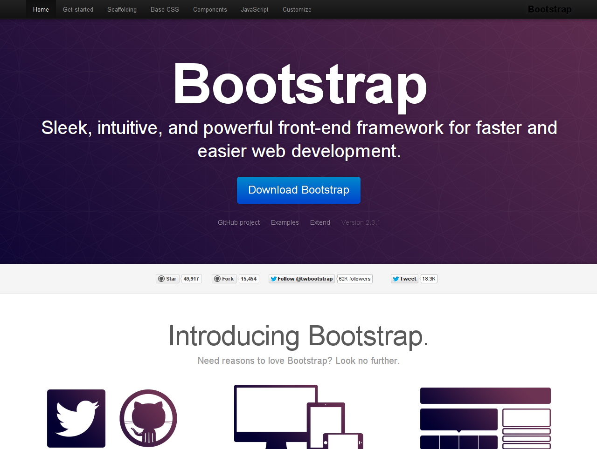

どーもです。

&nbsp;

以前予告した新デザインに困っております。

効率良くデザインを変更するためにと、VAIO Zのfedora17上にWebサーバやphp、MySQLを突っ込んでローカル内でfreoを動かして作業しているのですが、

作業効率とかHTML、CSSの文法とかそれ以前に

&nbsp;

アイデアが思い浮かばない

&nbsp;

だれか僕にセンスをください。

とりあえず今はこんな感じになっています。

コンセプトは『ポストイットを貼ったノート（日記帳）』。

サイドバーはまだ何も手をつけていないような状態です。

記事タイトルの部分は頑張ったつもりです。

背景が眩しいオレンジ色になっていますが、ボックスの形をわかりやすくするためのもので、最終的には背景画像を設定する予定です。

&nbsp;

困っているのが、

サイト全体のデザインの統一性

が出せるか？というところ。

&nbsp;

「この部分はこんな感じに」「ここはこう」

そんな感じにCSSを書いていくと、気がつけばページによって枠の形や文字サイズ、背景色などが違ってきたり・・・

現行デザインもそうですが、大見出しより小見出しの方が強調されて見えてしまうのは本当に悩んでいます。

&nbsp;

その辺を何とかできないかと考えていたら、とても興味深いものを発見。

&nbsp;

<a href="http://twitter.github.io/bootstrap/">Twitter Bootstrap</a>

Twitter社が提供しているCSSフレームワークのことで、Twitterっぽい綺麗なサイトが比較的簡単に作れるそうです。

freoのテンプレートを作成していらっしゃる<a href="http://metal-mad.com/">metal-mad.com</a>管理人の佐藤さんがこのTwitter Bootstrapを利用したテンプレートを公開されてますが、とても綺麗です。

情報も豊富なので、使ってみたいと思います。

&nbsp;

&nbsp;

最近よくこういったWebデザインの参考になりそうなサイトをいくつも巡るのが日課となり始めています。

いつも思うのですが、どのサイトも本当に綺麗で見やすく、全体の統一性もすごいなぁと思います。

&nbsp;

Webデザイン。

趣味レベルでもいいから、しっかり学んでみたいものです。

&nbsp;

ではでは〜

