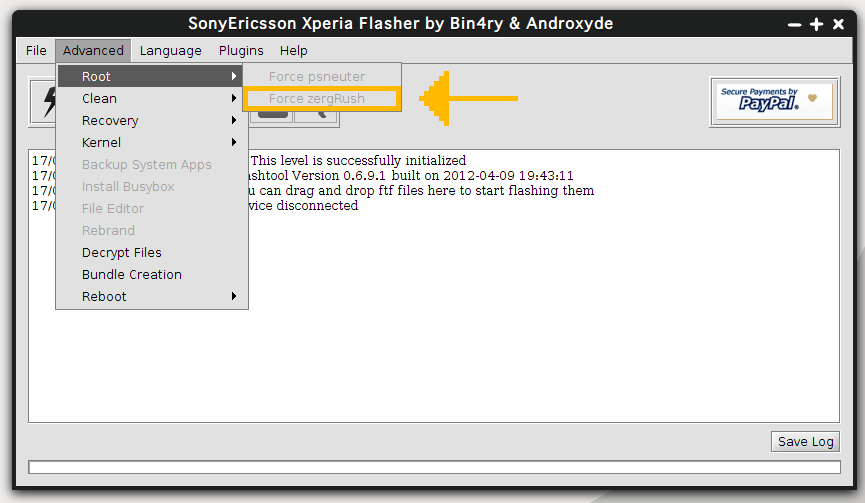
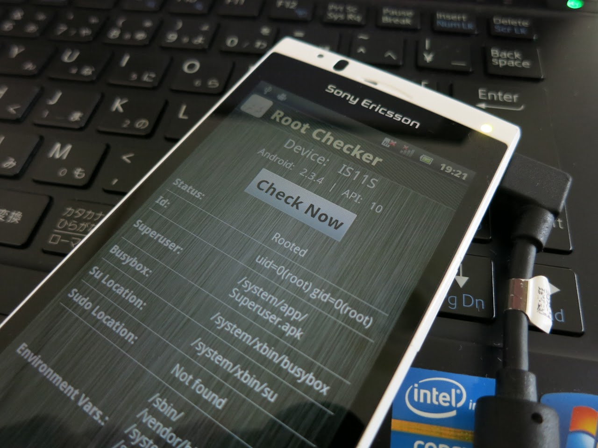
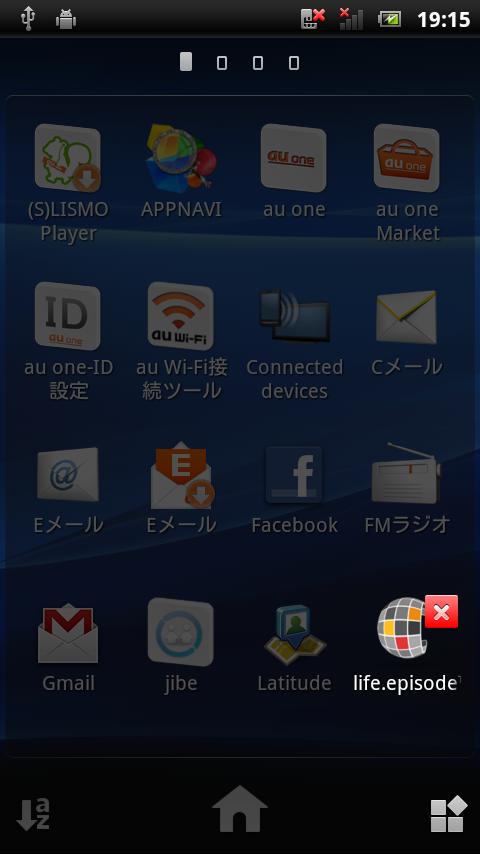
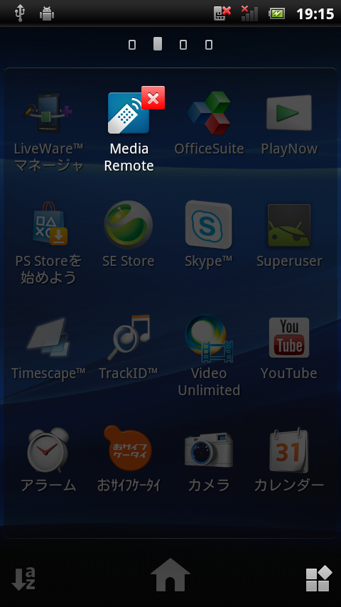
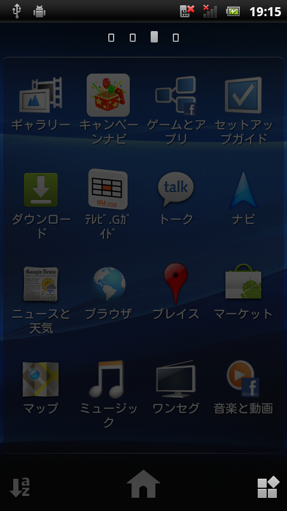
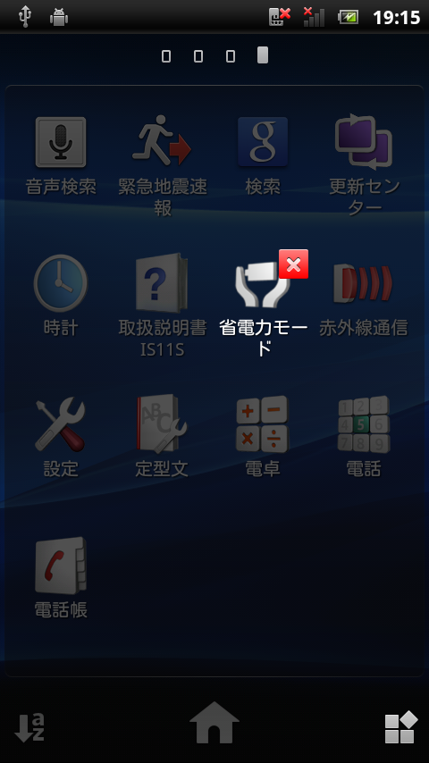

どーもです。

&nbsp;

友人から、

「Acroのroot取得頼んだ！」

と、XperiaAcro（au IS11S）を預かりました。

&nbsp;

これまた最新のファームウェアではroot取得できないので、いつものようにダウングレードの作業をします。

2011ペリアはDooMLoRD氏のバッチファイルによるroot化が有名ですが、今回はFlashtoolからやってみようと思います。

Linux環境からも簡単にroot取得の操作ができます！（←今日コレが言いたかっただけ）

&nbsp;

※ftf焼きなどに必要なソフトウェア等の準備方法は<a href="http://tosainu.wktk.so/page/xperiahack">Xperia2011年モデル改造まとめ</a>や他サイトを参考にしてください

&nbsp;

<h3>FWのダウングレード</h3>

XperiaAcro（au）のroot取得ができる最新のファームウェアはビルド番号4.0.1.B.0.112のようです。

ftfファイルはこちらにミラーしておきました→<a href="http://www.mediafire.com/download.php?466hm592w98zkg9">IS11S_4.0.1.B.0.112_KDDI.rar</a>

&nbsp;

これを、いつも通りの方法で書き込みます。

&nbsp;

<h3>Flashtoolから2011ペリア（And2.3.4）のroot化</h3>

<strong>2013/5/19 (Sun) 20:19:10修正</strong>

Flashtoolを起動して、デバッグモードを有効にした端末をPCと接続します。

ここで、接続した端末の種類を選択するウィンドウが出ると思います。XperiaAcroは一覧にありませんが、今回はただrootが取得したいだけなので、LT15 XperiaArcを選択しました。

上部メニューのAdvanced→Root→Force zergRushを実行すると

何度か再起動を繰り返して端末のroot化は完了します。

&nbsp;

&nbsp;

いろいろ触ってみましたが、とても気になることがありました。

噂には聞いていましたが、auファームってここまで○だったとは・・・

いくら何でも「消せないプリイン」が多くないですか？？

&nbsp;

たぶん僕は一生auのお世話にはならないと思います。

