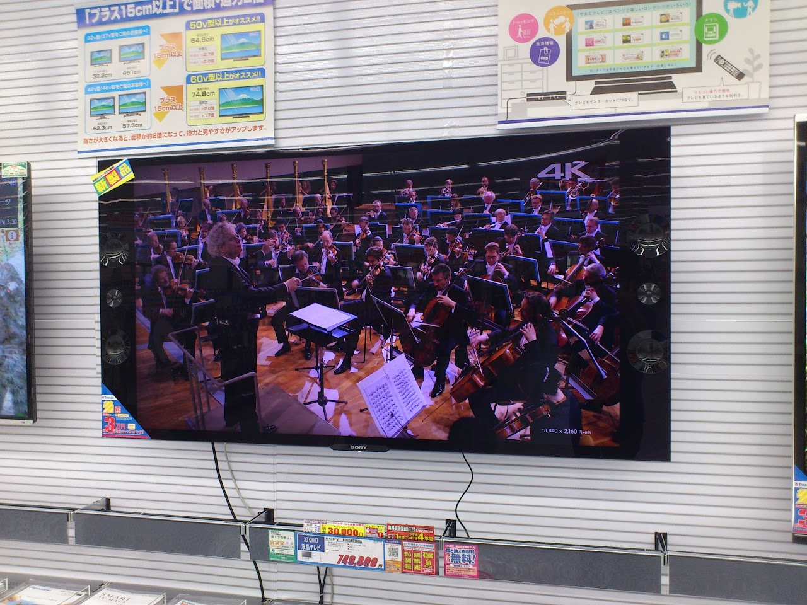

やべぇよ・・・

綺麗すぎだよ・・・

&nbsp;

新しい洗濯機を注文しにまたとある量販店に行ってきましたが、

まさかこの田舎にこんなものが展示されているとは思いませんでした。

&nbsp;

WalkmanZ、XperiaArc、VAIO Zと、解像度の割に画面の小さい（DPIの高い）液晶を持った端末に慣れてしまっているせいか、身近な液晶が荒く見えてしまう今日この頃
。

このテレビには驚きました。

&nbsp;

本当に綺麗。ドットの粒々感はほとんど感じられず、『動く写真』を見ているかのよう。

カタログに『その場所へ訪れたようなリアリティーを体感する』と書いてありましたが、まさにそんな感じ。

とさいぬの物欲が思いっきり刺激されてますww（とさいぬは高解像度・高DPI厨です）

&nbsp;

問題は価格ですね。

これ1台でFullHDテレビが一体何台買えるだろうねwww

4k対応プロジェクタのほうがまだ安いな。（音響設備とか他のものが高く付きそうだけど）

&nbsp;

今年次々と4kディスプレイが発表されているけど、今のFullHD並に普及しだすのはいつ頃かなぁ・・・

24インチ3840×2160ディスプレイが数万円代で早く出てくれ〜

