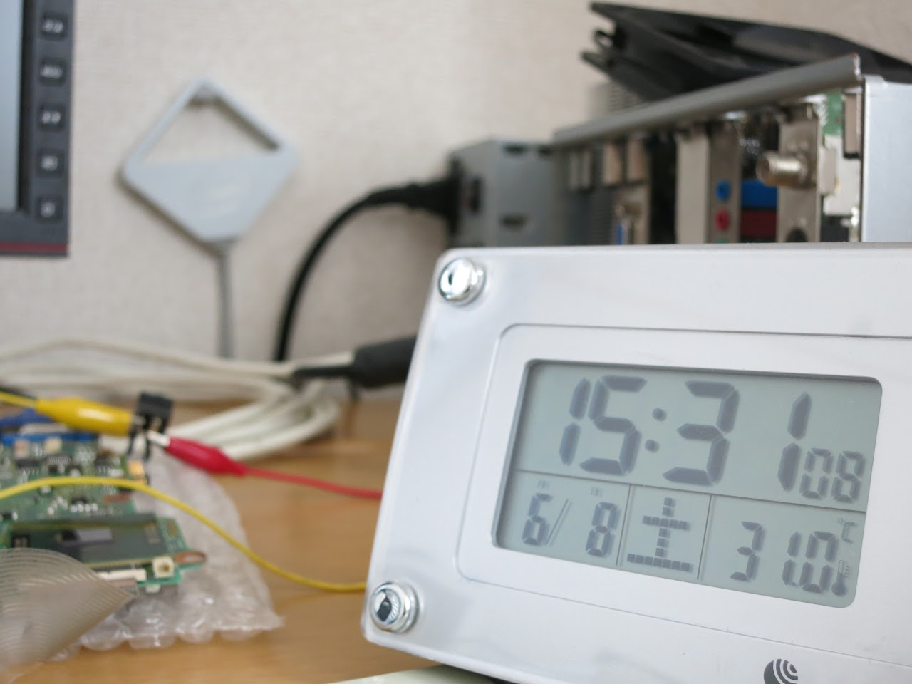
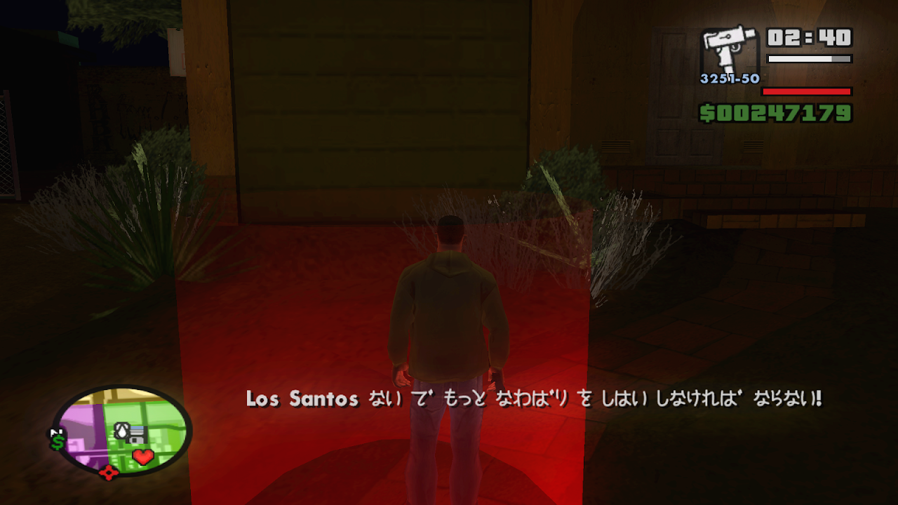

アツイー

暑いです。

&nbsp;

200w（3930k@4.6GHz）+150w（660ti）の熱源とガンガン当たる西日のおかげで、

僕の部屋は31度になってしまいました。

&nbsp;

まだ夏にはなっていないですよね・・・

&nbsp;

梅雨だからって毎日雨が降って欲しいわけではないですが、

いくらなんでも暑くなるの早すぎやしませんかね・・・

&nbsp;

これ8月になったらどーなっちゃうんでしょうか。

室温40度とか普通にありそうで怖い・・・

&nbsp;

&nbsp;

&nbsp;

&nbsp;

そーそー

以前からちまちま進めてきたGTASAですが、

とうとうラストミッション直前まで行きました！

&nbsp;

縄張が足りないとかでクリアはまだ先になりそうですが。

&nbsp;

抗争起こすのって大変なんですよね。

そこそこ強力な武器を用意しないといけないし、

なにより敵の数が多い！

&nbsp;

メインの武器をM4からAK47に替えたら幸せになれました。

敵ギャングが落としていってくれるので、武器不足はなんとか解消されそうです。

いや、別に武器が足りないなら買えばいいだけですが・・・

