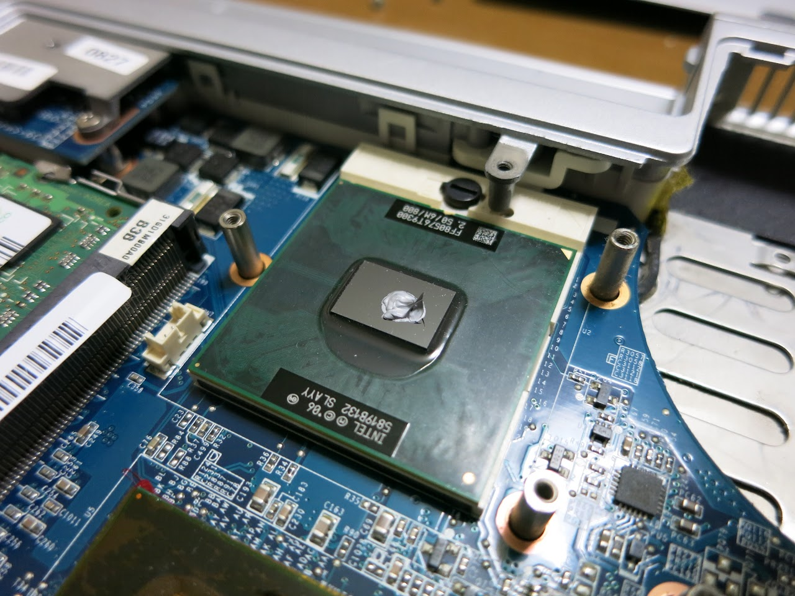

どーもです。

&nbsp;

ウチにはVAIO VGN-CR52Bというノーパソがあります。

父親が糞ーテックをから乗り換えたPCです。（今はまた別なのを使ってる）

&nbsp;

いまや週末のSkype専用マシンとなってしまいましたが、

今回、いろいろあって友人からCore2Duo T9300を貰うことができたので換装してみます。

&nbsp;

CPU換装はメーカーの(ry

&nbsp;

<h3>作業開始♪</h3>

まず裏蓋を開けます。本体をひっくり返して、EnterキーのようなL型の部分のネジ6箇所を外します。

&nbsp;

そしたら、クーラーを固定している5箇所のネジとファンのコネクタを外します。

ネジは1,2,3,4,6と番号が振ってあるのでわかりやすいです（5はどこだ？？？）

&nbsp;

CPUを載せ替えます。上の黒いネジを180度回すと外れるようになります。

グリスにはSilverArrow付属のCF3を使ってみました。

&nbsp;

逆の手順で戻して換装終了です。

&nbsp;

&nbsp;

<h3>結果</h3>

このノーパソにはMobile Intel GL960 Expressというチップセットが載っています。

これはFSB533MHｚのものなので動くか不安だったのですが、

なんか知らんがあっさり動いてしまいました

チップセットが勝手にFSBオーバークロックしてくれたんでしょうか？

おまけにメモリクロックも533MHz→667MHzになってました。ラッキー♪

&nbsp;

ではベンチを回して見ましょう。

換装前、換装後の順でスクショを貼っていきます。

<h4>SuperPi Mod</h4>

&nbsp;

32[sec]→23[sec]

クロック600MHzとキャッシュ6MB、そして45nmのリソグラフィーの違いはとても大きかった！！！

pi10秒短縮はOCの世界だと物凄いことです。これは驚いた！！！

&nbsp;

<h4>CrystalMark2004</h4>

&nbsp;

ALUスコア2.5倍、

FPU、MEMスコア2倍

とんでもねぇ、驚きのスペックアップwwwwwwww

特にメモリクロックが上がってくれたのも本当に効果デカイ！

&nbsp;

&nbsp;

いや、本当に驚いた！！！

これであと数年は戦えますね！

&nbsp;

CPUを安く譲っていただいた某Kさん、本当にありがとう！！！！

