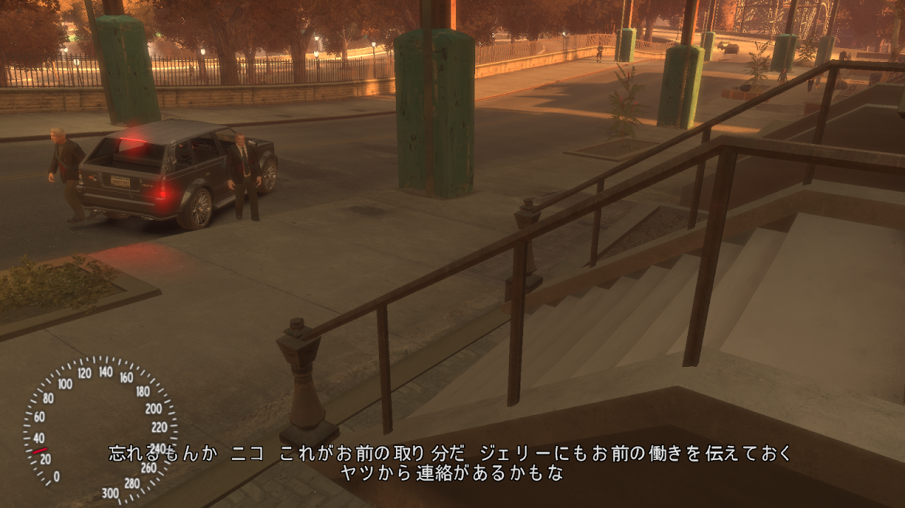
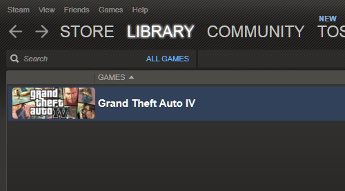
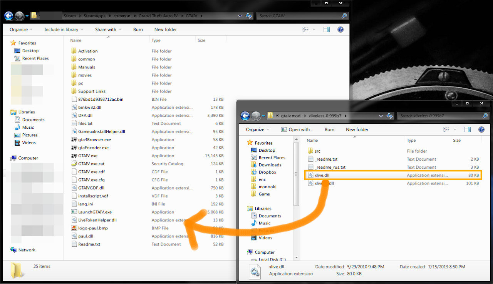
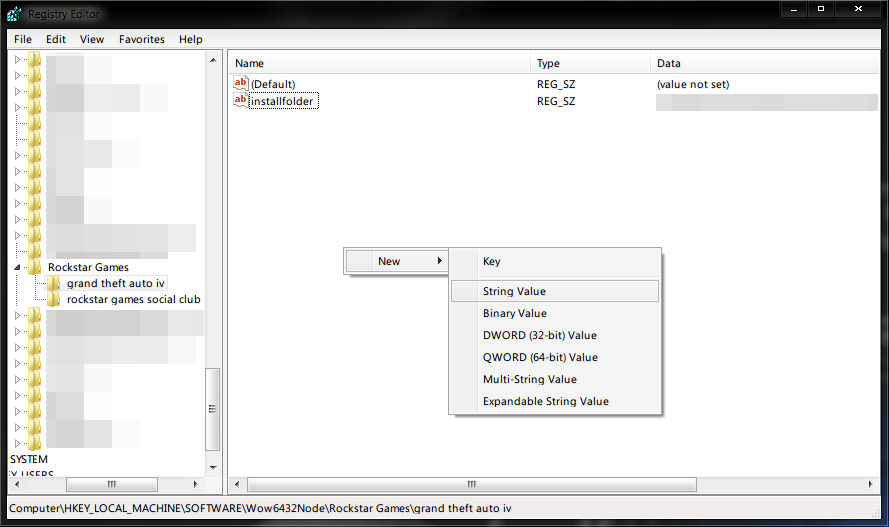
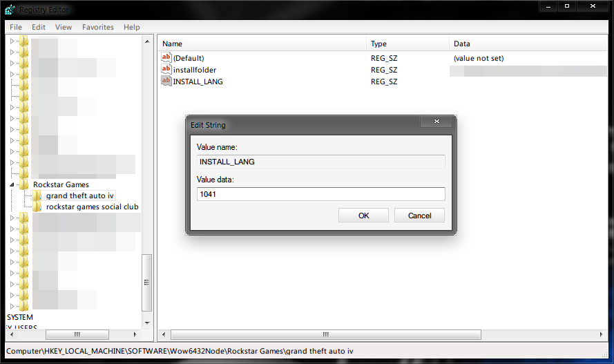
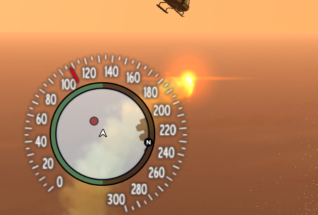
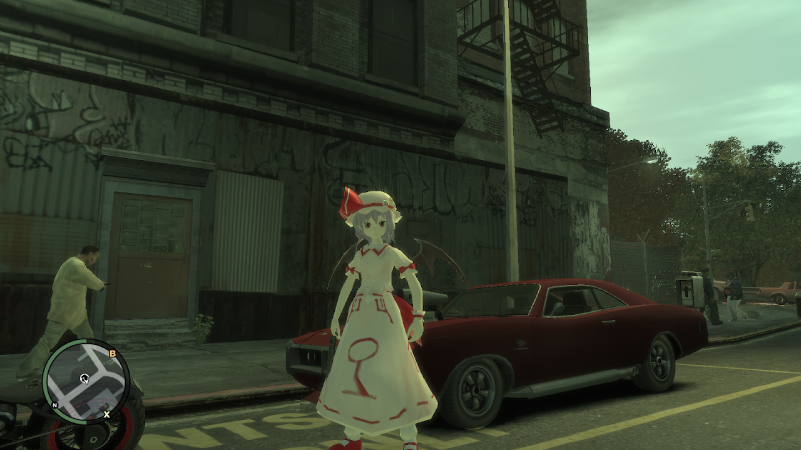

どーもです。

&nbsp;

GTASAに続き、GTAIVをちまちまプレイ中です。

さっき銀行強盗ミッションをやっとクリアしたところです。

いやぁ、大変だった。

&nbsp;

さて、僕は安さにつられてGTAIVをSteamで買いました。

ですが、Mod追加等でちょっと戸惑ったので、メモしておきます。

&nbsp;

<h3>まず・・・</h3>

SteamからGTAIVをインストールしたら、まず何もいじらずGTAIVを起動します。

初期設定とかでいろいろ起動に時間がかかります。

&nbsp;

タイトルが表示されたら「QUIT」を選んでゲームを終了します。

&nbsp;

<h3>xlivelessの導入</h3>

いずれMod入れて遊ぶ予定だし、マイ糞ソフトのアカなん使いたくない。さらに、プレイ中Liveがどーのこーの鬱陶しいし、セーブデータが面倒な場所に保存されてしまいますので、Liveを無効化するMod「xliveless」を導入します。

&nbsp;

まず、↓からxliveless-0.999b7.rarをダウンロード、解凍します。

<a href="http://www.gtaforums.com/?showtopic=388658">GTAForums.com -> [REL|GTAIV] XLiveLess</a>

<a href="https://dl.dropboxusercontent.com/u/55743933/xliveless-0.999b7.rar">勝手にミラー</a>

&nbsp;

解凍した中にあるxlive.dllをGTAIVのインストールフォルダに突っ込みます。

ほかのファイルは入れてはいけません。

GTAIVのインストール先ですが、Steamをインストールしたフォルダの中にあります。

インストール先を自分で変えていなければここ↓にあるはずです。

C:\Program Files (x86)\Steam\SteamApps\common\Grand Theft Auto IV\GTAIV

&nbsp;

これでLiveは無効化されました。

そして、セーブデータは

Documents\Rockstar Games\GTA IV\savegames

に保存されるようになります。

&nbsp;

<h3>日本語字幕化</h3>

最初はAll Englishでがんばろうとしましたが、

&nbsp;

無理

&nbsp;

ってことで日本語字幕化します。

&nbsp;

GTAIVインストールフォルダにあるcommon\textの中に、american.gxtというファイルがあります。

これを適当にリネーム（僕はbak_american.gxt）します。

そして、同じフォルダにあるjapanese.gxtをamerican.gxtにリネームします。

&nbsp;

これで一応日本語字幕化は成功なのですが、おそらく文字化けすると思います。

&nbsp;

対処法として、まずレジストリエディタを開きます。

キーボードのWindowsロゴ＋Rキーでファイル名を指定して実行を開き、regeditと入力してEnterです。

64bit：HKEY_LOCAL_MACHINE\SOFTWARE\Wow6432Node\Rockstar Games\Grand Theft Auto IV

32bit：HKEY_LOCAL_MACHINE\SOFTWARE\Rockstar Games\Grand Theft Auto IV

を開き、

右クリックで新規→文字列値

名前をINSTALL_LANG、値を1041にします。

&nbsp;

これで文字化けは解消されたはずです。

なお、英語字幕の時にプレイしたときのセーブデータは日本語化すると読み込めなくなるようなので注意してください。

僕も序盤でしたがやり直しました・・・

&nbsp;

参考：<a href="http://wikiwiki.jp/gta4pc/?%C6%FC%CB%DC%B8%EC%B2%BD">日本語化 - Grand Theft Auto 4 PC Wiki*</a>

&nbsp;

<h3>Speedometer IVの導入</h3>

スピードメーターです。なぜか入れたくなるんですよねぇ・・・

&nbsp;

これと

<a href="http://www.gtaforums.com/index.php?showtopic=420021">GTAForums.com -> [WIP|SCR|IV] Speedometer IV</a>

これ

<a href="http://www.gta-modding.com/area/index.php?act=view&id=598">GTA-Modding.com - Download Area » GTA IV » Mods » HUD Speedometer</a>

またはこれ

<a href="https://dl.dropboxusercontent.com/u/55743933/SpeedometerIVv03a_and_HUD_Speedometer.rar">勝手にまとめたー</a>

をダウンロード、解凍。

SpeedometerIVv03a.rarからScriptHook.dll、SpeedoIV.asiをインストールフォルダに突っ込み、

さらにSpeedoIVという名前でフォルダを作成し、その中に598_hud_speedometer.rarのDefaultフォルダとConfig.iniを突っ込みます。

これで画像のようなスピードメーターが乗り物に乗ると表示されるはずです。

&nbsp;

このスピードメーターModにはいろいろテーマがあるので、好みのものを探してみるといいかもしれません。

&nbsp;

&nbsp;

&nbsp;

&nbsp;

とりあえず僕がGTAIVをインストールしてからやったことはこんな感じです。

タイトル画面の表示がおかしいので、現在情報収集中です。プレイに支障はないですが。

&nbsp;

それにしてもMod入れにくくなりましたね。

一度試しにレミリアスキンModを入れてみましたが・・・面倒すぎです。

&nbsp;

ではでは～

