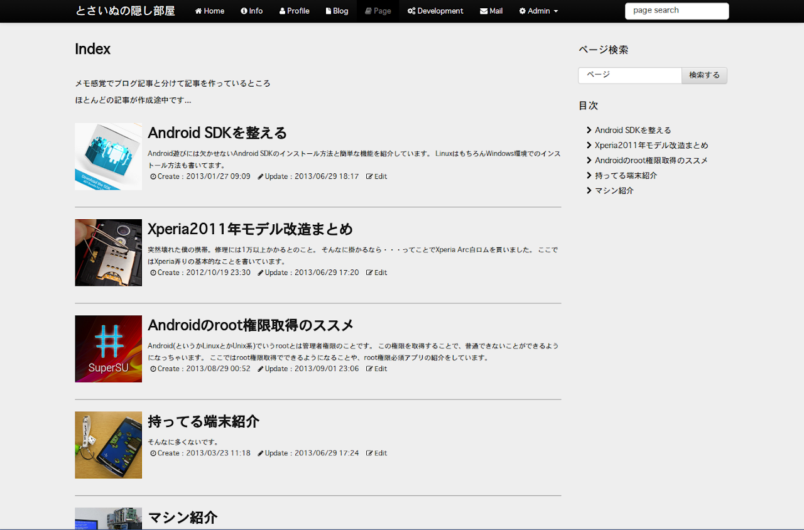

どーもです。

&nbsp;

本日、ブログテーマに<a href="http://getbootstrap.com/">TwitterBootstrap</a>を使ったものに変えてみました。

驚くほどかっこよくなり（自己満）、大満足です。

&nbsp;

<a href="http://metal-mad.com/">metal-mad.com</a>で公開中のg16をベースにさせていただきました。

管理人の<a href="https://twitter.com/metalmadcom">佐藤さん</a>、素晴らしいテーマの提供ありがとうございます。

