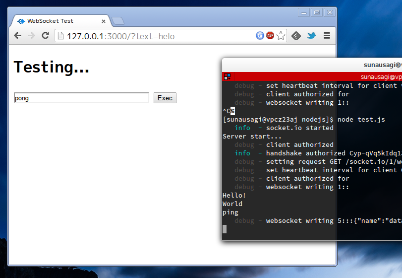

どもども〜

&nbsp;

昨日の記事にも書いたように、ブラウザから操縦するラジコン的なものの制作を計画しています。

今日はそれで使おうと思っている<a href="http://nodejs.org/">Node.js</a>と<a href="http://socket.io/">Socket.IO</a>を使ってプログラムを書いていました。

&nbsp;

興味ある方だけ続きからどうぞ。

<!--more-->

&nbsp;

<h2>Node.jsとは？</h2>

簡単に言えば、

「JavaScriptを使ったサーバーが構築できる言語」

のことらしいです。

「アクセスされるごとにどのような処理をさせるか」といったことがjsで書けるほか、

Socket.IOなどの組み合わせで、簡単にリアルタイムWeb（主にSNSなど）が構築できます。

※すいませんうまく説明できません・・・気になったらググってください

&nbsp;

<h2>Arch LinuxでNode.jsを動かす</h2>

pacman(yaourt)で簡単にインストール出来ました。

<pre class="prettyprint linenums">
<code>$ yaourt -Sys nodejs         
community/nodejs 0.10.19-1
    Evented I/O for V8 javascript
...

$ yaourt -S nodejs
...

$ node -v           
v0.10.19
</code></pre>

&nbsp;

<h2>htmlを表示するだけ</h2>

動作確認に、同じディレクトリにあるhtmlファイルを開くだけのコードを書いてみます。

<pre class="prettyprint linenums">
<code>/*
  test.js
*/

var app = require('http').createServer(handler)
  , fs = require('fs')

app.listen(3000);

function handler (req, res) {
  fs.readFile('index.html',
  function (err, data) {
    if(err) {
      res.writeHead(404);
      return res.end('index.html not found.');
    }
    res.writeHead(200);
    res.write(data);
    res.end();
  });
}

console.log('Server start...');
</code></pre>

また、このtest.jsと同じディレクトリにhtmlファイルをindex.htmlという名前で保存しておきます。

&nbsp;

<pre class="prettyprint linenums">
$ node test.js
</pre>

でサーバーを起動させます。

http://127.0.0.1:3000にアクセスすると、用意したhtmlファイルが表示されるはずです。

&nbsp;

<h2>Socket.IOでリアルタイムで通信を行う</h2>

まず、npmでSocket.IOをインストールします。jsを置くディレクトリでこのコマンドを打ちます。

root権限が必要でした。

<pre class="prettyprint linenums">
$ sudo npm install socket.io
</pre>

&nbsp;

さて、今日書いたプログラムです。

ブラウザのフォームにテキストを入れてボタンを押すと、サーバーのlogにそのテキストが表示されます。

また、フォームに「ping」と入力しボタンを押すと、サーバーが「pong」を返しフォームに表示させるようになってます。

※エラー処理等、細かいことはあまり気にしてませんw

<pre class="prettyprint linenums">
<code>/*
  main.js
*/

var app = require('http').createServer(handler)
  , io = require('socket.io').listen(app)
  , fs = require('fs')

app.listen(3000);

function handler (req, res) {
  fs.readFile('index.html',
  function (err, data) {
    if(err) {
      res.writeHead(404);
      return res.end('index.html not found.');
    }
    res.writeHead(200);
    res.write(data);
    res.end();
  });
}

console.log('Server start...');

io.sockets.on('connection', function (socket) {
  socket.on('data1', function (data) {
    console.log(data);
    if(data == 'ping') {
      socket.emit('data2', 'pong');
    }
  });
});
</code></pre>

&nbsp;

<pre class="prettyprint linenums">
<code>/*
  index.html
*/

&lt;!DOCTYPE html PUBLIC "-//W3C//DTD XHTML 1.0 Transitional//EN"
"http://www.w3.org/TR/xhtml1/DTD/xhtml1-transitional.dtd"&gt;
&lt;html xmlns="http://www.w3.org/1999/xhtml"&gt;
  &lt;head&gt;
    &lt;title&gt;WebSocket Test&lt;/title&gt;
    &lt;script src="/socket.io/socket.io.js"&gt;&lt;/script&gt;
    &lt;script&gt;
      var socket = io.connect('http://localhost');
      function OnButtonClick() {
        var data1 = document.send.text.value;
        socket.emit('data1', data1);
      }
      socket.on('data2', function (data2) {
        document.send.text.value = data2;
      });
    &lt;/script&gt;
  &lt;/head&gt;
  &lt;body&gt;
    &lt;h1&gt;Testing...&lt;/h1&gt;
    &lt;form name="send"&gt;
      &lt;input type="text" name="text" size="40"&gt;
      &lt;input type="button" value="Exec" onclick="OnButtonClick();"/&gt;
    &lt;/form&gt;
  &lt;/body&gt;
&lt;/html&gt;
</code></pre>

&nbsp;

いやぁ〜、これはおもしろいです。

jsなんてほとんど書いたことないですが、結構簡単に書くことができました。

これだけできれば、遠隔操作のシステムもほとんどできたといってもいいようなものですね。

&nbsp;

ではでは〜

<del>あれ、明日TOEICだった気が・・・</del>

&nbsp;

参考

<a href="http://nodejs.org/">node.js</a>

<a href="http://socket.io/">Socket.IO: the cross-browser WebSocket for realtime apps.</a>

<a href="http://mdlab.jp/project/node_js/01.html">第一回 Node.jsでどんなことができる？｜マルチデバイスLab. - Multi Device Lab.</a>

