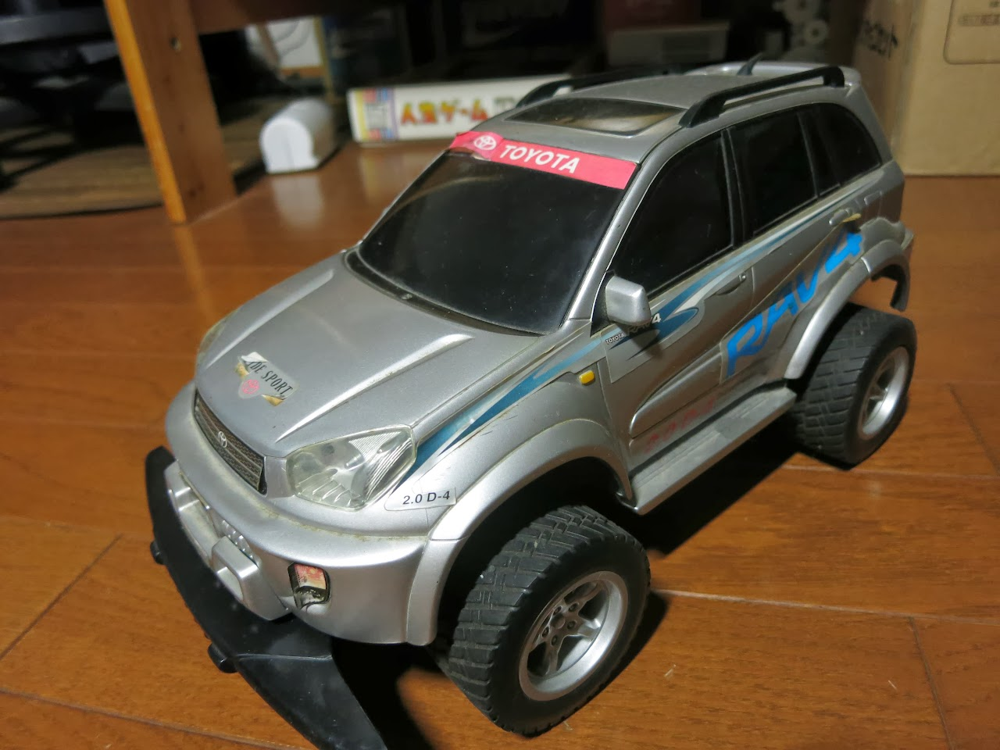
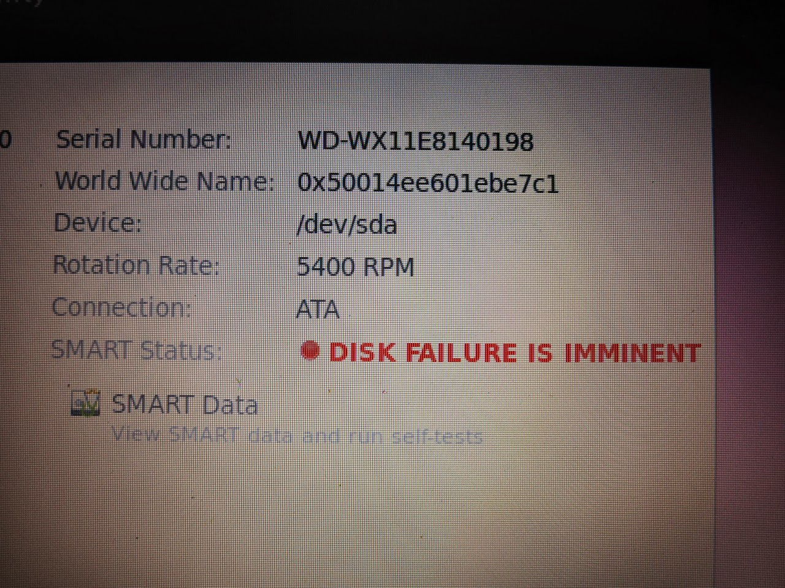
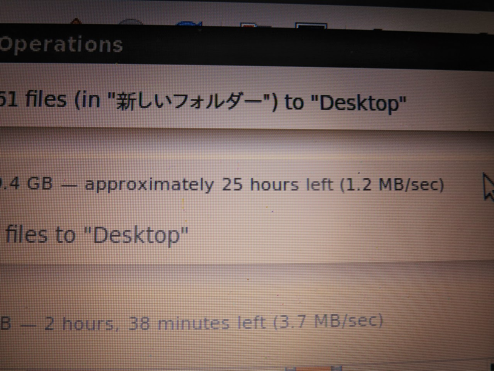
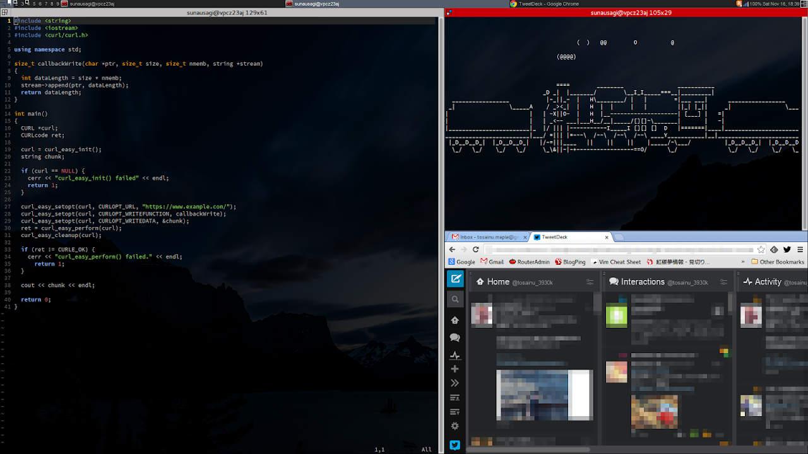
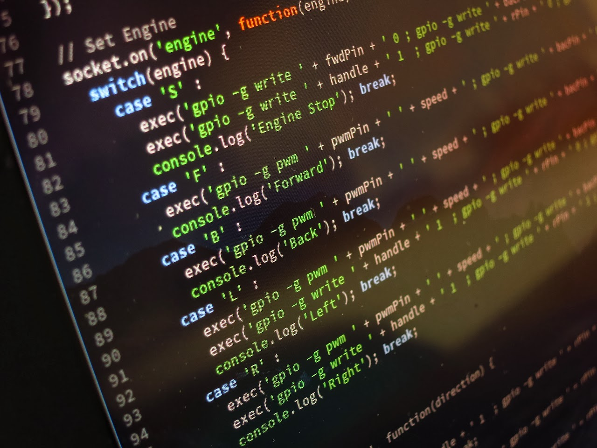
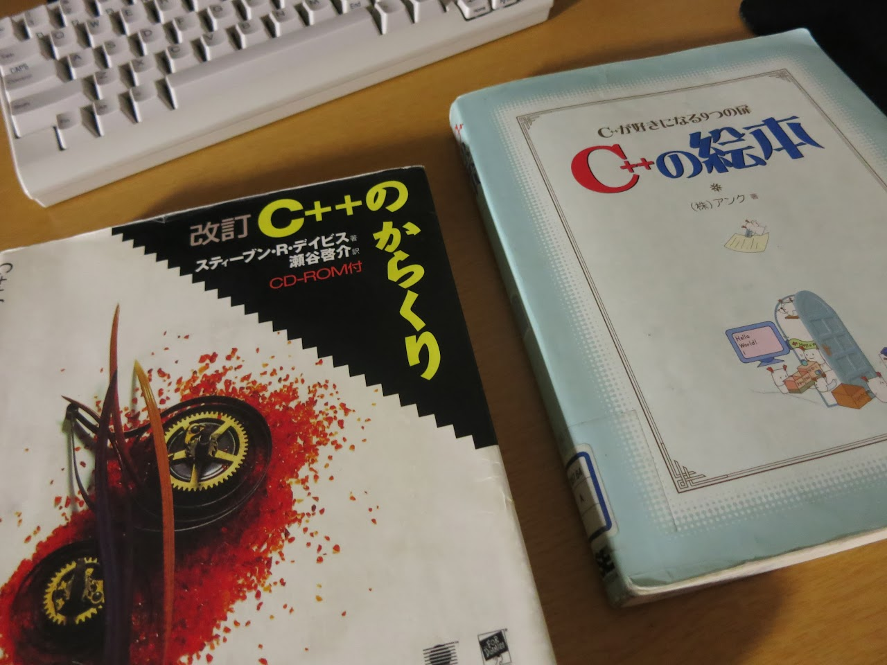
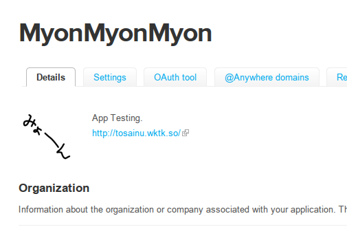

どーもです。

とある友人氏に「更新すくない」と言われたので更新しようと思いますw

&nbsp;

&nbsp;

Q. オマエ今何やってるん？

&nbsp;

A. いろいろやってます

&nbsp;

&nbsp;

文化祭がおわり、例のラジコンも一旦解体。

この活動が今後どうなるかはわかりませんが、評判は良かったようなので、来年もパワーアップできたらいいと思っています。

&nbsp;

今にも死にそうなHDDからのデータ救出を頼まれたので、2日掛けて作業したりもしてました。

皆さん、決してﾉｰﾖﾊﾟﾖｺﾝを自転車のかごに入れて走ってはいけません。

仮に死ななかったとしても、非常につらい目に遭います。

&nbsp;

最近はawesomeというWMを使っています。

「こんなの使えるかボゲイ」と言った数日後にCinnamonから完全移行。rc.lua弄ってキーボードショートカット追加したりもしました。

需要あったら解説記事書きます。（多分無い、きっと無い）

&nbsp;

文化祭は終わりましたが、引き続きプログラムを書いています。というか、もっと書かなければいけないと思っています。

周りでは「すげーすげー」と言われ、調子に乗っていた時期もありました。でも今は違います。危機感を感じています。

僕は全然すごくありません。人に見せられるような、何かマジメなものを全く生産できていません。

一番重要なのは学校の勉強ですが(ｳｯ)、他人に置いていかれないよう、日々技量を上げていきたいところです。

&nbsp;

今メインで書いているのがC++。といってもCっぽい文法のままですが・・・

いつかはCっぽくない言語にも手を出してみたいな・・・

ShellとかRubyとか。

&nbsp;

ちなみに、今何を書いているかというと・・・

<blockquote class="twitter-tweet tw-align-center">
ついったーに「ふぇぇ」とつぶやくfeeコマンドをつくろう
&mdash; とさいぬ〜 (@tosainu_3930k) <a href="https://twitter.com/tosainu_3930k/statuses/399835967399288832">November 11, 2013</a></blockquote>

<blockquote class="twitter-tweet tw-align-center">
mikutterに対抗したmikotterを作るプロジェクト
&mdash; とさいぬ〜 (@tosainu_3930k) <a href="https://twitter.com/tosainu_3930k/statuses/383968505415995393">September 28, 2013</a></blockquote>

まぁ

できるかわかりませんけどねwww

&nbsp;

mikotterとか冗談で言ったんだし・・・
