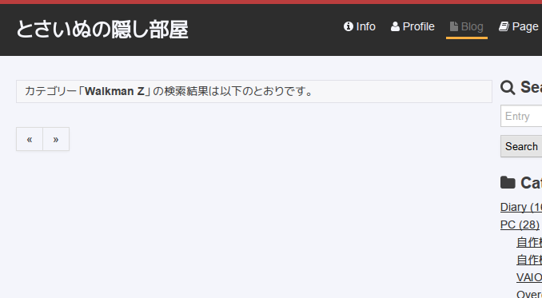
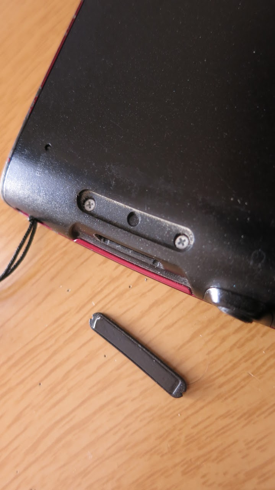
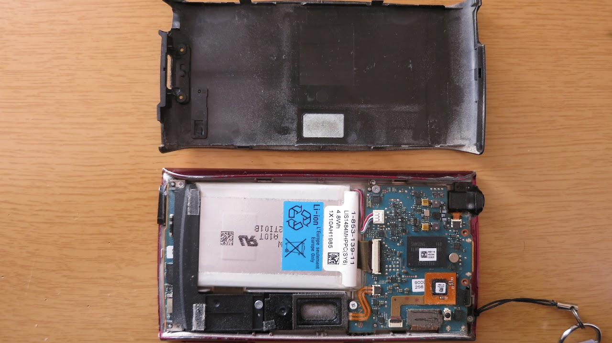
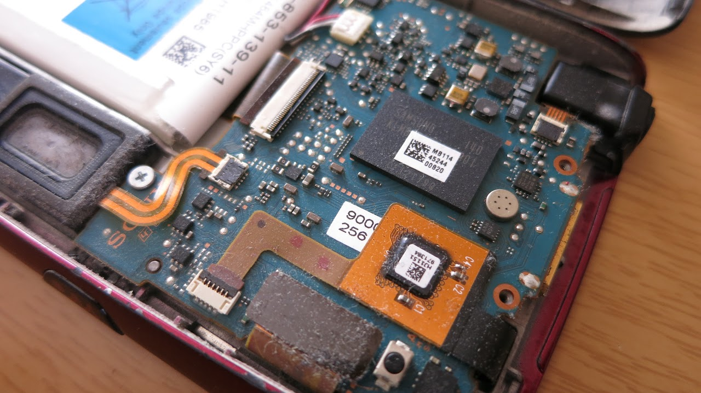
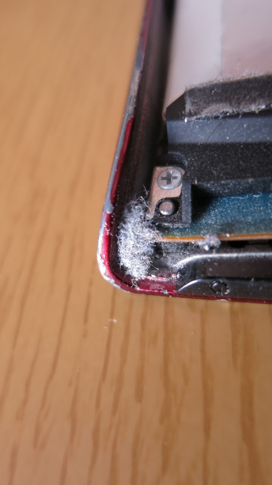
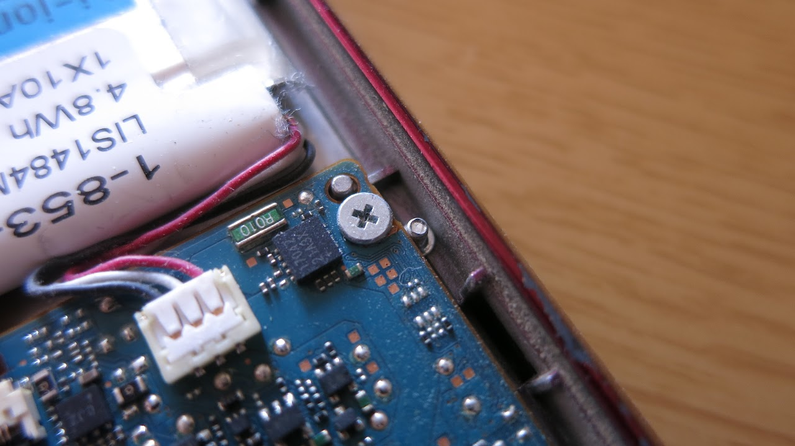
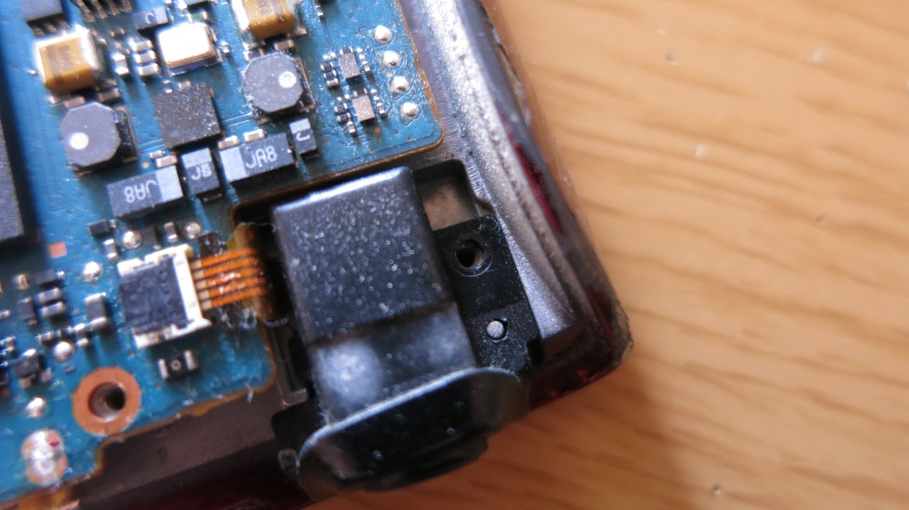
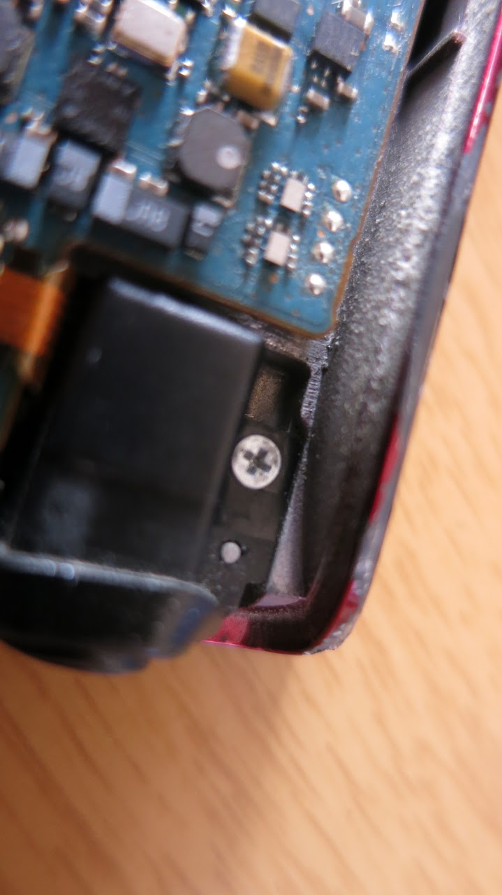
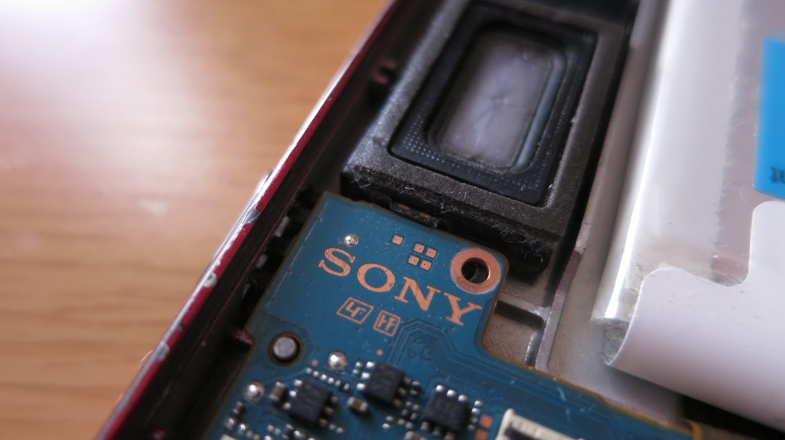
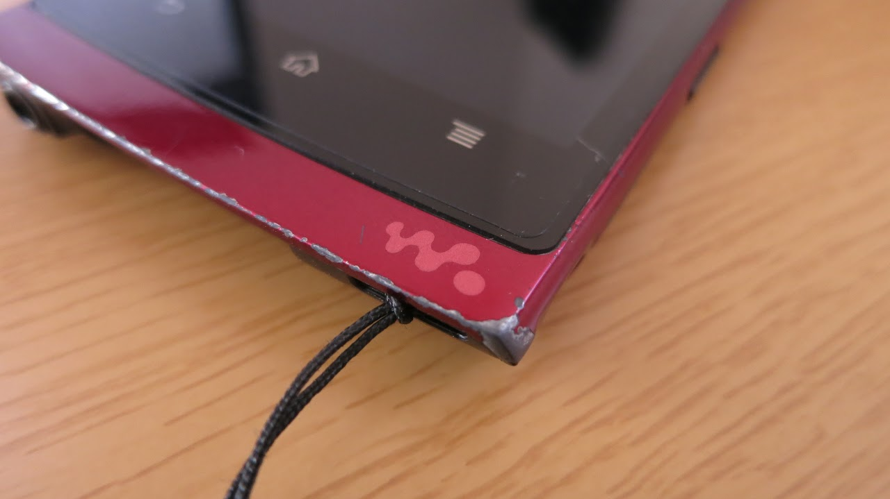

どーもですん

&nbsp;

WalkmanZのカテゴリ、初の記事になります。

カテゴリを作ったのはかなり前ですが・・・

&nbsp;

実は僕WalkmanZ持ってるんですよね。

2012年正月、クリスマスにもらった商品券やお年玉を持って名古屋に出かけたのはいい思い出です。

Tegra2ｱｧｯｯって人もいますが、当時DualCoreで3万円代で買え、かつ信頼できるメーカのAndroid端末はこれくらいだったものです。

当時のスマートフォンはシングルコア端末がまだたくさんありましたしね。

&nbsp;

さて本題。

これで数年目になるWalkmanZですが、いろいろ不調が出てきたのです。

* 電源ボタンの反応が異常に悪い
* イヤホンジャックの接触不良とガタつき

もう保証期間過ぎてますし、root権限取得なんかで保証もクソもないので、分解してみることにしました。

<!--more-->

## 分解する

WMポート上部の細長い蓋を開けるとネジが出てきます。

このネジを外し、裏蓋を持ち上げるようにすると外れます。

ただし、電源ボタン側の裏蓋は両面テープで固定されているようで、少し力を入れないと外れません。

ホコリがヤバイです。

電源ボタン付近、とても大きなホコリが出てきました。

反応の悪さの原因はこれでしょう。

## 本体内部でネジ発見！？

ホコリをエアダスターで吹いてると・・・

！！！？？？

ネジが出てきましたwww

よく見ると、どうやらこれはイヤホンジャックを固定していたネジのようです。

イヤホンジャックガタつき、どう考えてもこれですね・・・

ちゃんと元の場所に取り付けます。

そして、ジャック内の汚れも、ティッシュで作ったこよりに接点復活剤を吹いたもので掃除しておきます。

接点復活剤には賛否ありますが、気にしてしまうほどの耳は持ってませんのでまぁいいでしょう。

## 内部スピーカの無効化

イヤホンジャックの接触が悪いこともあり、こんなことが結構頻繁に起きてるんですよね。

<blockquote class="twitter-tweet tw-align-center" data-partner="tweetdeck">
アレな音楽聞いてるわけじゃないけど、時々電車の中でスピーカーから音楽流してしまい焦る
&mdash; とさいぬ (;ﾞ＞&#39;ω＜&#39;):  (@tosainu_3930k) <a href="https://twitter.com/tosainu_3930k/statuses/422554114862510080">January 13, 2014</a></blockquote>

いい機会だし、内部スピーカの配線を取り外てしまいます。

こんな感じにスピーカの線を下に折り込みました。

外さなかった理由は、スピーカを固定するネジ穴が基板上のSONYロゴ右上のネジ穴と共有しており、高さが合わなくなってしまうためです。

## 結果

大成功です、もう感動。

ガタつき、接触不良が改善したほか、明らかに音の迫力が増しました。(というよりは「新品の頃に戻った？」)

いやー本当にヤバイ、分解してよかった。

&nbsp;

分解した感想ですが、WalkmanZ内部のネジ、全体的にかなり緩めでした。

おそらく長年の使用によるものだとは思いますが・・・・

&nbsp;

&nbsp;

それにしても・・・

キズ増えたな・・・(´・ω・｀)
