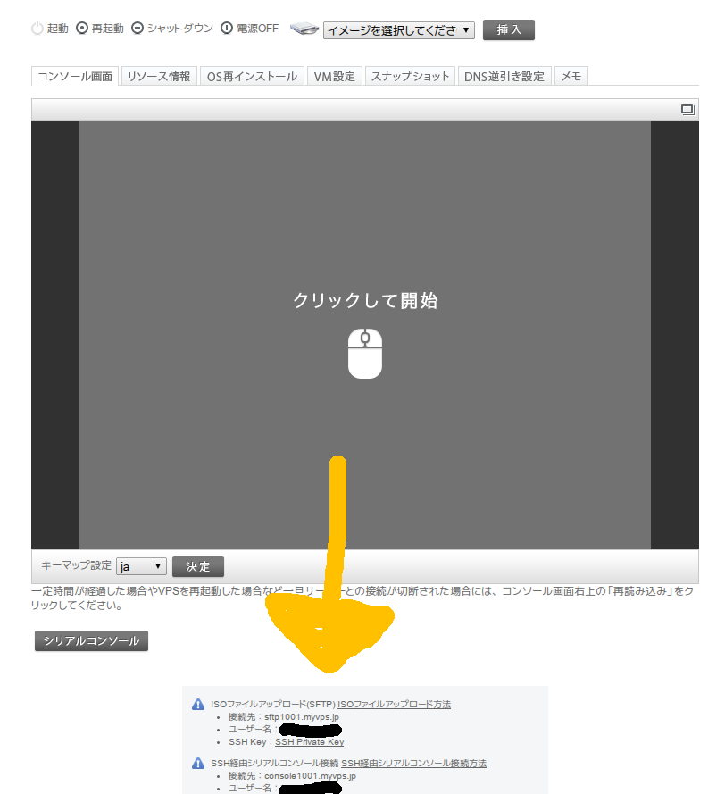
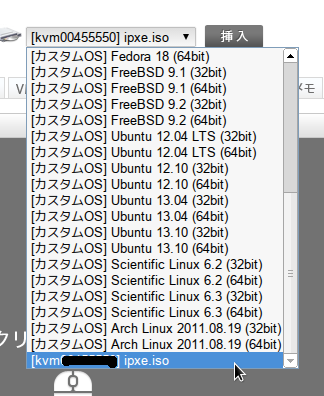
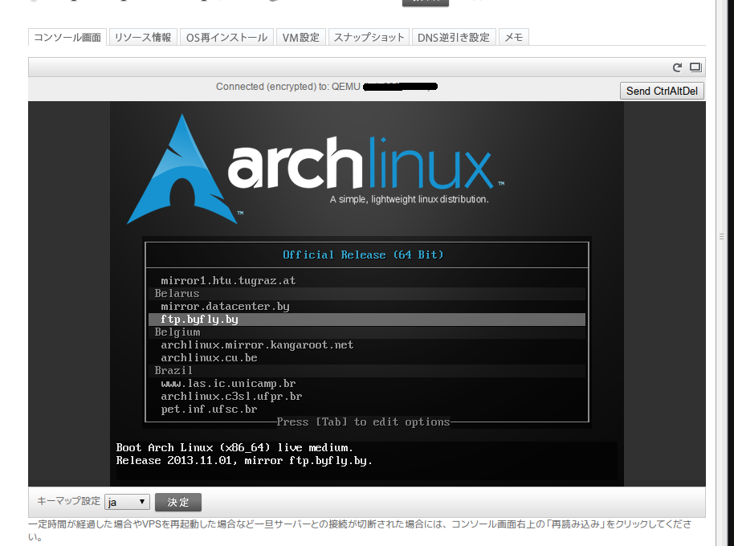

おはよーございます

&nbsp;

タイトル通りです。契約してしまいました。

スペックはこんなやつです。

| \ | 最下位 | 契約したの |
| --- | ------ | -------------- |
| CPU | 2コア | 10コア (Intel Core 2 Duo T7700相当？) |
| RAM | 1GB |16GB |
| HDD | 100GB |1TB |

つよい(つよい)

## Arch Linuxをインストールする

デフォルトのOSがセント君でつらぽよなのでArch Linuxを入れちゃいます。

しかし、公式が用意しているArchのインストーラが古過ぎる(/arch/setup実行する時代)ので、手動でisoファイルのアップロードをします。

Fullのインストーラのアップロードはクソ回線で時間がかかるのでNetboot Live Systemを利用しました。

&nbsp;

<a href="https://releng.archlinux.org/pxeboot/">Arch Linux - Netboot Live System</a>からipxe.isoをダウンロード、

コンソール画面下に接続方法が書いてあるのでFileZilla等で接続して、

imagesフォルダ内にアップロードしましょう。

こんな感じに選択できるようになるので選択して起動、

あとはミラーサーバにFTP.JAIST.AC.JPを選択すればいつものようなインストールができるようになります。

やったね！

## で、

とりあえずは引っ越し作業に向けていろいろパッケージの追加をしています。

せっかくの15日間なので、ベンチとかもガンガン回してみたいと思っています。

&nbsp;

## おまけ

/etc/motdを書き換えると、ログイン時のウェルカムメッセージを変えることができます。

<blockquote class="twitter-tweet tw-align-center" lang="en">
/etc/motd書き換え楽しい&#10;✌(&#39;ω&#39;✌ )三✌(&#39;ω&#39;)✌三( ✌&#39;ω&#39;)✌ <a href="http://t.co/SKFkmUDfF0">pic.twitter.com/SKFkmUDfF0</a>
&mdash; とさいぬ (;ﾞ＞&#39;ω＜&#39;): (@tosainu_3930k) <a href="https://twitter.com/tosainu_3930k/statuses/427230789697163264">January 26, 2014</a></blockquote>

