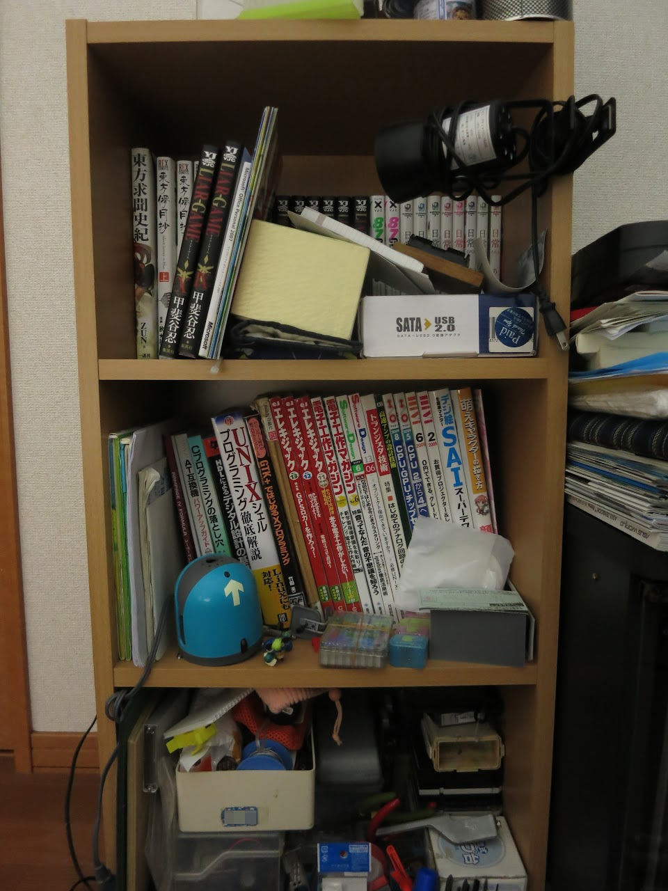
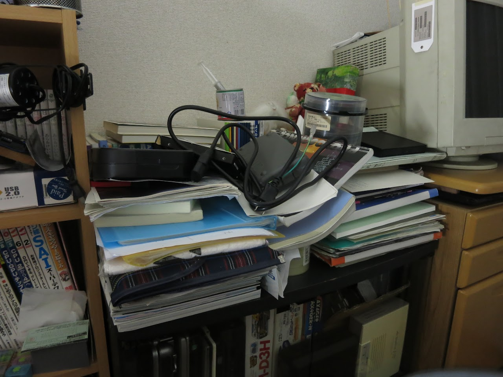
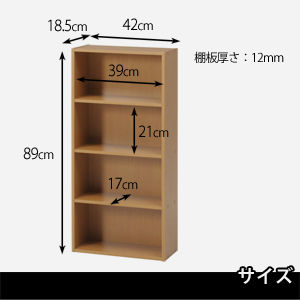
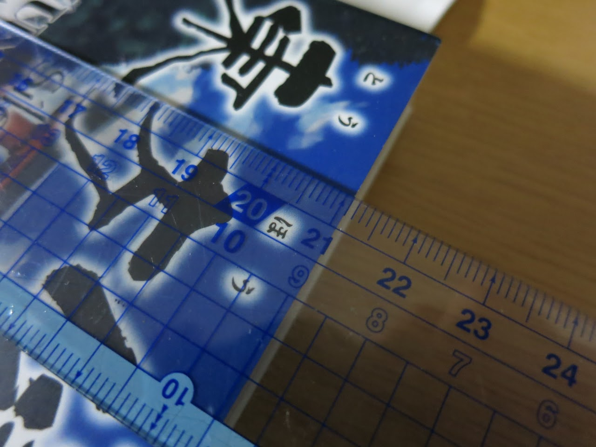

どーもども

&nbsp;

最近、とても本棚が欲しいと思っています。

というのも、ウチの本棚(と思われる)ものはこんな状態ですし

教科書にいたっては悲惨なことに・・・

&nbsp;

そしてさらに、最近本が増えていっているんですよね。

今日だって、学校の図書館さんが古い雑誌の無償配布していたので・・・

<blockquote class="twitter-tweet tw-align-center" lang="en">
とさいぬは SoftwareDesign(2010)1年分を 手に入れた！ <a href="http://t.co/yX0L8NkphI">pic.twitter.com/yX0L8NkphI</a>
&mdash; とさいぬ (;ﾞ＞&#39;ω＜&#39;): (@tosainu_3930k) <a href="https://twitter.com/tosainu_3930k/statuses/430150589335359488">February 3, 2014</a></blockquote>

SoftwareDesign(2010)1年分をもらってきましたw

総額15060+税ってとこでしょうか。

&nbsp;

ってことでいろいろ本棚を探していたのですが・・・

<a href="http://www.amazon.co.jp/dp/B0034G4HKQ/ref=cm_sw_r_tw_dp_Hw77sb13XCPXT">不二貿易 BD ラック (BOOK&DVD) HP9418/ 文庫本ラック (ホワイト) 81397 不二貿易(FUJI BOEKI)</a>

<a href="http://www.amazon.co.jp/dp/B002WJHLQS/ref=cm_sw_r_tw_dp_xv77sb002P54W">山善(YAMAZEN) 文庫本収納ラック 本棚カラーボックス CMCR-9060(DBR) ダークブラウン 山善</a>

どうも一般的な本棚の収納部の大きさは高さ210mm程度らしいです。

これの何がいけないかって、A5サイズの本がギリギリ入らない大きさでして・・・

僕の所持する教科書は勿論、一部のコミックなどもこのA5サイズ

うー、ナンテコッタイ

&nbsp;

高さ可変できるものは高くなるしなぁ・・・

何かオススメあれば情報ください。

ではでは〜
