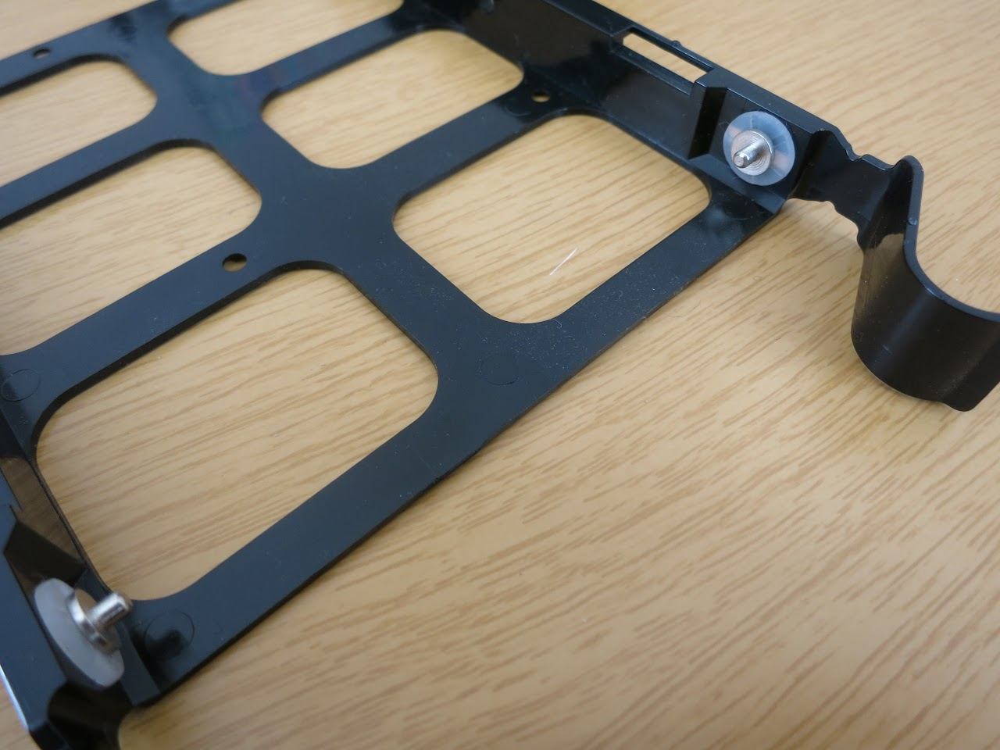
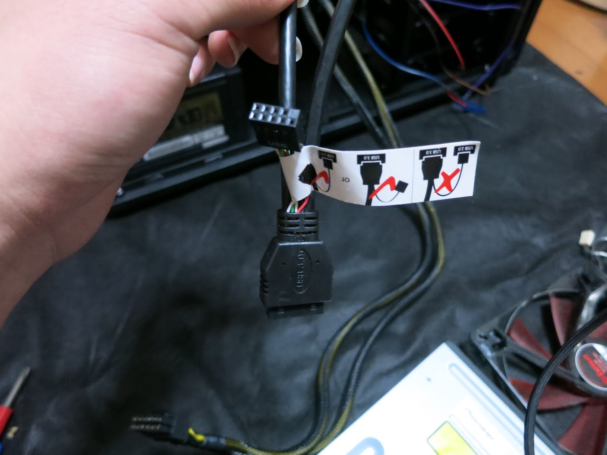

どーもです。

はい、買ってしまいました。

消費税増税とかあるからね。

&nbsp;

<!--more-->

## そもそもなんでケース交換したのさ？

> とさいぬは激怒した。必ず、かのCorsairのケースを除かなければならぬと決意した。
> とさいぬは、ただの学生である。PCを立ち上げ、コードだけ書いてきた。
> けれどもケースの工作精度に対しては、人一倍に敏感であった。

はい、くだらないネタすいませんw

でも何度でも言います、

「Corsairのケースはクソ、二度と使いたくない」

* 初期不良の多さ
* 各所に目立つ作りの悪さ
* HDDマウンタがゴミ
* 硬すぎる電源ボタン

もう我慢できませんでした。

* 丈夫なHDDマウンタ
* そこそこ作りがしっかりしている
* FrontI/Oはすべて正面に
* 比較的安価である

を満たすケースがないかと探していたところ、たまたまRSS購読中に見つけた"Antec P100"の文字。

レビューサイト等に目を通し、また以前からAntecケースを一度使いたいと思っていたこともあり一目惚れ。

今回購入を決意しました。

&nbsp;

## 大きさ
並べてみるとこんな感じです。

若干小さくなったかな〜って感じです。

&nbsp;

## 気に入ったところ

### HDDマウンタ
Corsairケースで失敗したせいもあって、僕がケースを選ぶときはまずHDDマウンタを見ます。

まずトレイ、上がCorsair、下がAntecです。

見てくださいこの厚さの違い！丈夫さが全然違います。

そして何よりベイ自体の丈夫さ。

Corsairのケースでは配置が変更できる分、マウンタは購入時から平行四辺形です。

あの5万もするぼったくりケース900D、アレでさえも歪んでいます、要注意。

それに対してAntec P100、見ての通り丈夫な作りをしています。

トレイが「カシャッ」としっかり固定されるのもびっくりしました。

&nbsp;

### 静音性
650Dはうるさいというか、HDDマウンタがカスいせいで共振がとても気になりました。

それに対してのP100、本当に驚きました。「これが本当に中身の同じPCなのか」と。

すごく静かです。

電源を設置する場所に張り付けられたゴムシート、HDDマウンタに付いた丈夫なゴム、そして丈夫な足、ケース側面に貼られたスポンジなど、防音のための機構がいくつもありいい感じです。

&nbsp;

### デザイン
正面から見えるのはフロントIOパネルのみと、とてもシンプルで良いです。

どうも最近良く見るケースは厨二臭かったり、無駄なギミックがついてたりと、ピンとくるものがなかったんですよね。

可動部分が多かったり凸凹が多いと、その部分にホコリ等が溜ってしまうじゃないですか。あれがどうしても許せなかったんです。

&nbsp;

### その他
650Dの内部のケーブル、全部黒で統一されていたんです。

もちろん、目立ちにくく見栄えも良くなってよかったのですが、HDD-LEDのコネクタ、なんと極性表示無し！！

P100の一目見て極性のわかるケーブルには涙が出そうになりました。

ほか、フロントIOのオーディオケーブルがHD AudioとAC'97の両対応だったり、USB3.0と2.0両対応だったりと、旧世代パーツにも何気に対応していて驚きました。

裏のスペースも結構広く、余裕を持った裏配線ができると思います。

&nbsp;

## 少し微妙だなと思ったところ

### ペラい
ペラいです。サイドパネルだとかがペラいのはまだしも、M/B置くところに力を加えるとたわんだり、上部ファン取付部分が凹んでいたりでちょっとなぁ〜って感じです。

&nbsp;

### ネジがわかりにくい
取説の記述もなく迷いました。忘備録も兼ねてメモしておきます。

左から、

* わからない(多分ファン)
* フロントファン
* HDD固定用
* 拡張スロット・電源
* M/B固定
* 5インチベイ固定
* SSD固定
* M/B固定(ケース側)

です。

&nbsp;

いやぁ、本当に良いケースです。買い替えてよかった！

&nbsp;

【ゆるぼ】一部改造跡あり650Dを流す先
