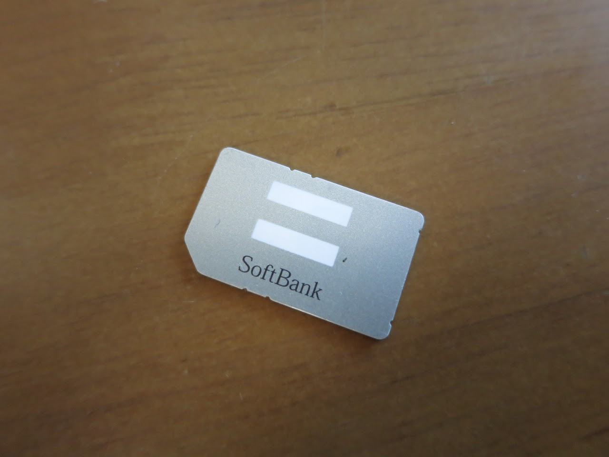

<iframe width="560" height="315" src="https://www.youtube.com/embed/GOzR_GXgjxA?rel=0" frameborder="0" allowfullscreen></iframe>

**▂▅▇█▓▒░(’ω’)░▒▓█▇▅▂うわああああああああああああああああああああああああ**

つらい、最高につらいです。  
確かに最近タッチパネルの誤作動が多いなぁと思っていましたが、まさか死んでしまうなんて！！！！

ふぇえ....  
デザインも使い勝手も拡張性も最高なXperia2011が............  
手放したくないです、本当に。

SIMがコレなので、おそらく新規契約になってしまうのかなぁ....  

このSIM使えば、Softbankの2つ折り携帯用プランが適用されて、ほとんど電話代だけの通信が可能になるのですが。

SoftbankでAndroid携帯はお高いですし、かといって店員が推しまくってくるiPhoneは諸々の理由で使いたくないですし。  
<blockquote class="twitter-tweet tw-align-center" data-partner="tweetdeck">
標準音楽PlayerがFlac未対応だったりiTunesが面倒そう等、僕がiOS端末使わないのに理由はいくつかありますが、一番の理由はApple社製品にありがちな「他のApple社製品が生えてきた 」というApple沼が怖いってことですかね
&mdash; (✿╹◡╹)ﾉ とさいぬ (@tosainu_3930k) <a href="https://twitter.com/tosainu_3930k/statuses/451975405960830976">April 4, 2014</a></blockquote>

うーーーーむ、もう一台Xperia2011を買ってしまおうかと思ってしまうくらいつらい。

そういえば、以前こんな記事を書きました。  
[Motorolaが好きになったかも](http://tosainu.wktk.so/view/269 "Motorolaが好きになったかも")

MotorolaのMoto XやMoto G、とても気になりますね。

Motorolaは友人の使うMOTOROLA PHOTON ISW11Mを触れたことがありますが、その当時はあまり良い印象はありませんでした。  
Walkman Zと同じTegra2を搭載しているのも関わらず、異様にアニメーションがカクつくように感じられたからです。

しかし今、各携帯メーカがふざけたデカさの携帯を発表したり、特許争いを頻繁に起こしていたりと良いニュースが少ない中、このMotorolaの提唱する

> Stock Android Phones, Sized 'Just Right'

最高じゃないですか。

是非とも、資金面に余裕が出来次第手に入れたいところですね。

欲を言えば、Motorolaさん、是非ともMotoシリーズを日本にもお願いします！

ではではー
