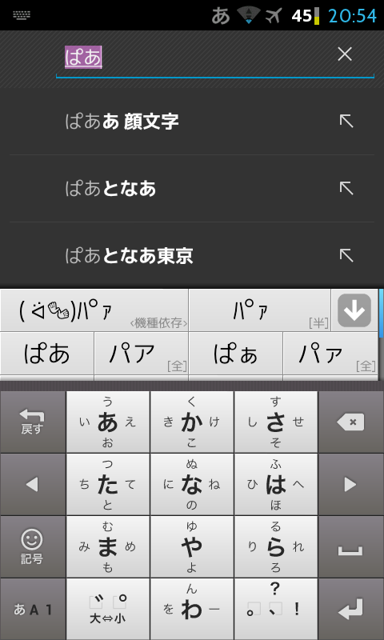
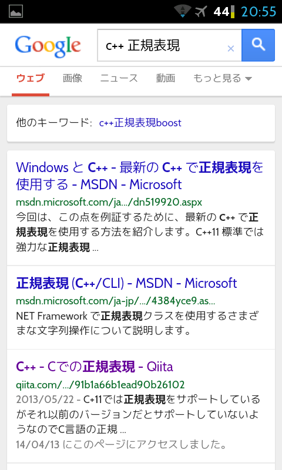

どーもです。

Walkman Zですが、root権限の取得ができてしまいます。ここでは方法を紹介したりはしませんが。  
今回はroot権限を取得してから僕がやったことを紹介します。

## 準備

* root権限の取得
* busyboxのインストール
* 作業PCはLinux(Unix系)で、AndroidSDK等が整っているとする

## フォント関連
Walkman Zの標準状態での日本語フォントであるモトヤLシーダ3等幅(MTLc3m.ttf)は、なんか微妙ですよね。見難い訳じゃないですが、なんとなく中華臭がします。  
以前はモトヤマルベリ(MTLmr3m.ttf)を追加して使っていたのですが、今回は[migu](http://mix-mplus-ipa.sourceforge.jp/migu/ "migu")を使うことにしました。

    // 編集するファイルを引っ張ってくる
    myon@pc:~$ adb pull /system/vendor/etc/fallback_fonts.xml .
    
    // 編集
    myon@pc:~$ vim fallback_fonts.xml

`/system/vendor/etc/fallback_fonts.xml`はこのように書き換えます

```xml
<familyset>
    <family order="0">
        <fileset>
            <file>migu-1p-regular.ttf</file>
            <file>migu-1p-bold.ttf</file>
        </fileset>
    </family>
</familyset>
```


    // ファイルの転送
    myon@pc:~$ adb push migu-1p-regular.ttf /sdcard/
    myon@pc:~$ adb push migu-1p-bold.ttf /sdcard/
    myon@pc:~$ adb push fallback_fonts.xml /sdcard/
    
    // 端末に接続
    myon@pc:~$ adb shell
    shell@android:/ $ su -
    
    // /systemを書き込み可の状態にリマウント
    root@android:/ # busybox mount -o remount,rw /system
    
    // font等のコピー・置換
    root@android:/ # cp /sdcard/migu-*.ttf /system/fonts/
    root@android:/ # chmod 644 /system/fonts/*
    root@android:/ # cp /sdcard/fallback_fonts.xml /system/vendor/etc/
    root@android:/ # chmod 644 /system/vendor/etc/fallback_fonts.xml

他、英字フォントとして[Cabin Font](http://www.impallari.com/cabin "Cabin")、[ツイッターするやつの特殊記号用フォント](https://play.google.com/store/apps/details?id=com.suruyatu.font "tsuiyatsu")も追加しました。  
ツイッターするやつ(fontデータ)のapkを抜き出して解凍、さらに中から出てくるoriginal.zip(だったと思う)を解凍してフォントファイルを抜き出します。

    // 編集するファイルを引っ張ってくる
    myon@pc:~$ adb pull /system/etc/system_fonts.xml .
    myon@pc:~$ adb pull /system/etc/fallback_fonts.xml .
    
    // 編集
    myon@pc:~$ vim system_fonts.xml
    myon@pc:~$ vim fallback_fonts.xml

`system_fonts.xml`は、DroidSans(|-Regular|-Bold|-Italic|-BoldItalic).ttfの項目をすべてCabin-\*に置換。  
`fallback_fonts.xml`は、最後の行あたりを以下のように追記しました。

```xml
    <family>
        <fileset>
            <file>original.ttf</file>
        </fileset>
    </family>
    <family>
        <fileset>
            <file>DroidSansFallback.ttf</file>
        </fileset>
    </family>
</familyset>
```

これらを同様に/system/fonts等に送って端末を再起動させれば反映されます。

  


## スクリーンショット撮影時のシャッター音の無効化
`/system/media/audio/ui/camera_click.ogg`を削除または無効な名前(\*.ogg.bak等)にリネームします。

## SystemUI.apkのdeodex化とバッテリ残量100段階表示
deodex作業は[こちらの記事](http://maruppa.blog.fc2.com/blog-entry-115.html "deodex")を参考にしました。

ちなみに、こんな感じのShellScriptを書いておくと捗ります。

```shell
#!/bin/sh

java -jar baksmali.jar $@
```

```shell
#!/bin/sh

java -jar smali.jar $@
```


    $ ./baksmali -d system/framework -x SystemUI.odex -o set
    $ ./smali set -o classes.dex
    $ 7z a -tzip SystemUI.apk classes.dex

こうして出来上がったSystemUI.apkを、framework-res.apkとともに[UOT Kitchen](http://uot.dakra.lt/kitchen/ "UOT Kitchen")のFile uploadタブからアップロードし、Batteryのタブを開いてUse this modにチェック、好みのアイコンにチェックを入れたり色を再設定してSummaryタブのSubmit work to kitchenボタンで送信。  
画面に従いしばらく待つと加工したapkの入ったzipがダウンロードできるようになります。

    $ unzip UOT-xx-xx-xx-xx-x.zip
    $ adb push app/SystemUI.apk /sdcard/
    $ adb push ramework/framework-res.apk /sdcard/
    $ adb shell
    shell@android:/ $ su -
    root@android:/ # busybox mount -o remount,rw /system
    root@android:/ # cp /sdcard/*.apk /system/
    root@android:/ # chmod 644 /system/*.apk
    root@android:/ # mv /system/SystemUI.apk /system/app/
    root@android:/ # mv /system/framework-res.apk /system/framework/
    root@android:/ # rm /system/app/SystemUI.odex

これで再起動を掛けると反映されます。SystemUI.apk等の書き換えは非常に危険なので、上コマンドのような置換を行いましょう。


ではではー
