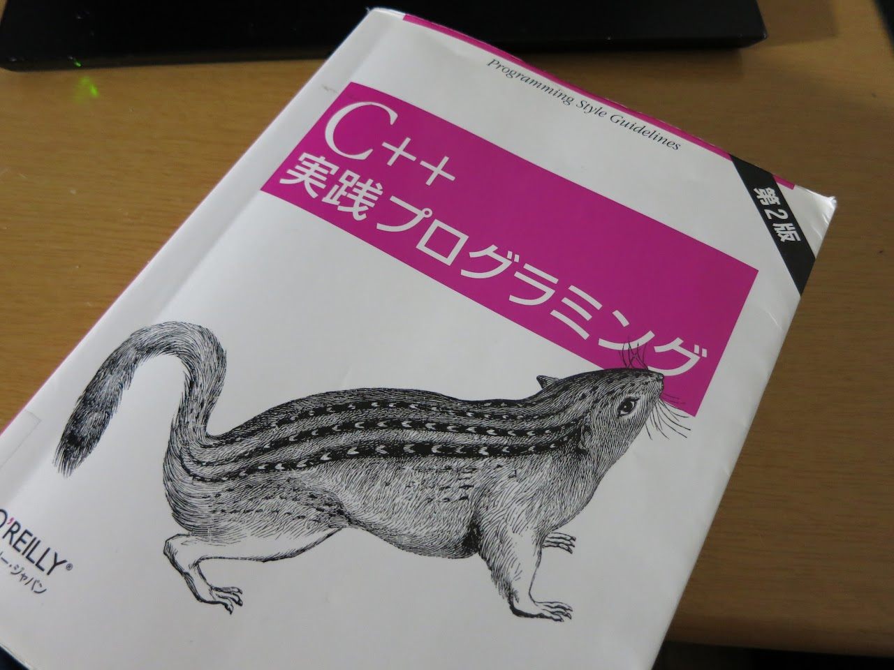

どーもです。

GWですね。  
まぁ、4日しかないんでWeekと呼んでいいのかは非常にアレなんですが。

やる事といえばもちろんコレでしょう。  

ウチの学校の図書館で見つけたので、早速借りてきました。  
ウチの学校の図書館は2000年以前のJavaの本ばっかりしかない印象だったのですが、よく探してみるとEffective C++やEffective STLも最新巻ではありませんでしたが置いてありましたし、C++以外の言語では意外とHaskell本があったのが驚きです。しかも英語版のOreilly本ww  
それにしてもJava本で本棚1つあるのが本当に謎ですが。

まぁ、せっかくの良い本なのでしっかり読んでみようと思います。

Twitterですが、僕の発言をあまり好んでいない方等いるようなので発言数減らしていこうと思います。僕自身少し調子乗ってたところもありますし。  
「授業でVisual C++ 2008使わされるんだけど、嫌だなぁ。慣れたエディタとコンパイラが使いたい」と発言したところ、某氏にリムブロ食らったのは本当にショックがデカいですしね.......
