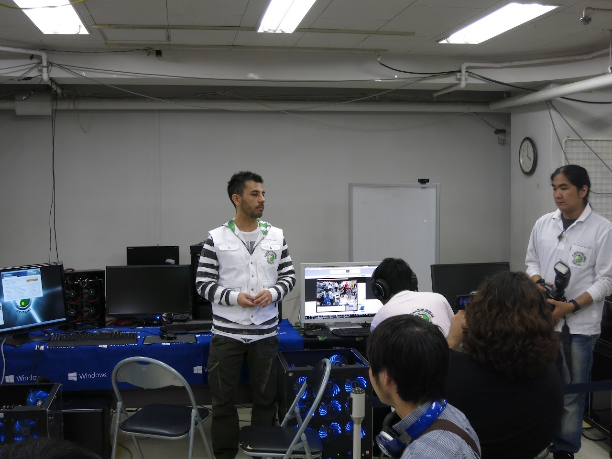

どーもですー

[昨年](http://tosainu.wktk.so/view/278 "Xtreme OverClock BreakThrough 4th Stage")に続き、今年も[Xtreme OverClock BreakThrough 5th Stage](https://sites.google.com/a/shachi-hoko.jp.net/team-shachi-hoko/project-updates/%E3%80%90puresuririsu%E3%80%91jinnianmoobakurokkuibento%E3%80%8C2014gwxtremeoverclockbreakthrough5thstage%E3%80%8Dwodaxuguddouiruedmbendiandekaicui "xob5")に行ってきました〜  

今年は海外の[Fusion-OC](http://www.fusion-oc.com/ "fusion-oc")の方々と協力してのイベントだったそうで、  
  
  
  
こんなマシンがゴロゴロ置いてある、トンデモナイイベントでした。

<!--more-->

## 超ハイエンドモンスターPCによるオーバークロックvsマルチコア比較デモ

  
Xeon E5 2687w Dualというモンスターマシンによる実演でした。

このマシン、なんとCPU・VGA合わせて5系統の水冷化をしているそうで......やばすぎます。

## 本格水冷PC現地組み立てデモ

  
画像の空冷マシンを、実際にこの場で水冷化しちゃおうって企画です。  
ただでさえ情報の少ない本格水冷という分野、本当に勉強になるコーナーでした。

WaterBlockを取り付けて・・・  

Reservoir&Pump  

でっかいRadiatorを・・・  

どーーーん  

Coolantを流しこんで  

エア抜き  

そして完成！  

このマシンではi7-4770k@4.2GHzで運用していたそうなのですが、空冷時では80度近かったところ、今回の水冷化で60度弱まで発熱を抑えることができたようです。

## 海外チーム Fusion-OC TeamによるOC

海外のOCチーム、"Fusion-OC"の方たちによる3DMARK 11の実演でした。

リーダーさんの挨拶  

  
  

今回記録されたスコアは32482。これは世界の水冷PCでのランキングでなんと10位以内に入るんだとか、すげぇ！

## メモリオーバークロックの紹介と実演

  
メモリのオーバークロックによる効果の紹介でした。

うん、メモリも深そうです。ちょーっと僕のマシンでは厳しそうだけど......

今年もとても勉強になるイベントでした！  
県内でこのようなイベントがもっと増えてもいいなぁと思ったり。

TEAM SHACHI-HOKOのメンバーさん、そしてFusion-OC Teamの方々、本当にありがとうございました！！

&nbsp;

&nbsp;

全く関係ないのですが、この会場に行く前にイヤホン屋に寄ってしまったのですが、そこに以前勧められたことのあるSHURE SE315があったんで聞いてしまったんですよね。  
ヤバイです。

よくマニアの方々が"解像度が・・・"とかよくわからないこと言ってますが、それがよくわかるイヤホンでした。  
なんせ本当にクリアではっきりとした音が出てきます。  
"ん！？ ヤバイヤバイ"となって数秒で試聴をやめましたが、その6時間後であってもATH-CKS50で音楽を聞いた瞬間、あまりの曇った感じに投げ捨てたくなる衝動に駆られてしまいました。

うー、頑張って避けてきたけど、イヤホンの沼は避けられないのかなぁ......(´・ω・｀)

ではではー
