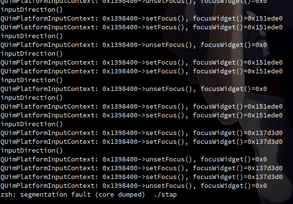
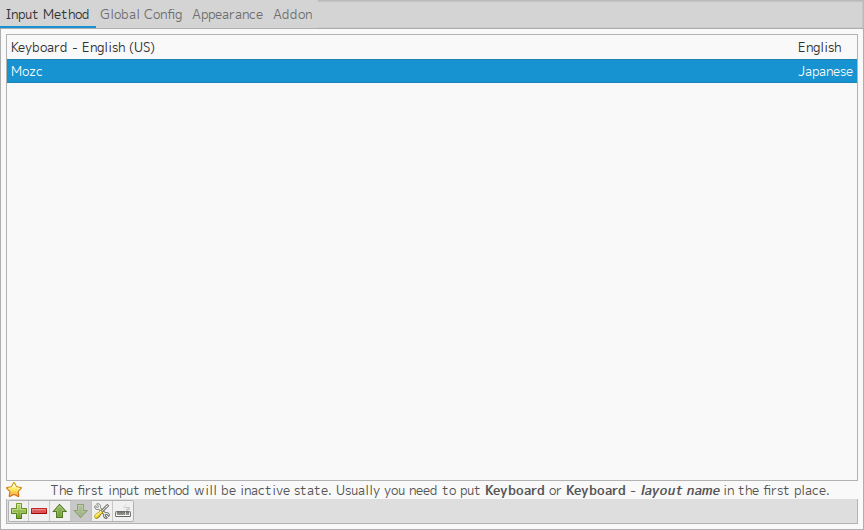
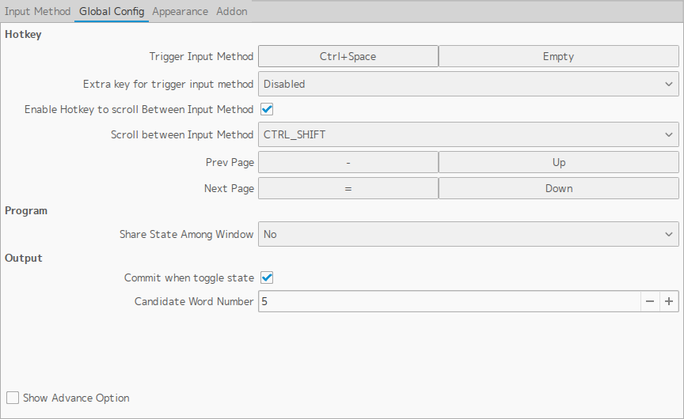

みょんみょん

[以前, uimの "vi-cooperative mode" を紹介しました.](http://tosainu.wktk.so/view/366 "uim")  
しかし最近, 諸事情でQt5を扱っているのですが, なんとuimがまともにQt5をサポートしていない！！

  
uimの安定板にはQt5のサポートコードがまだ取り込まれておらず, また最新ブランチからビルドしてもQt5アプリをSegmentation Faultさせてしまう始末...

ってことで, fcitx, そしてArch LinuxのCommunityレポジトリにも取り込まれたfcitx-mozcに移行することにしました.  
また, 当然fcitxにvi-cooperative modeは無いので, `.vimrc`に似たようなことができるように設定を書いてみました.

## インストール

    // いらない
    $ yaourt -Rcns uim-mozc mozc
    
    // こんにちわ
    $ yaoutr -Sy fcitx-im fcitx-qt5 fcitx-configtool fcitx-mozc

`.xprofile`を編集

```shell
# fcitx
export GTK_IM_MODULE=fcitx
export QT_IM_MODULE=fcitx
export XMODIFIERS="@im=fcitx"
export DefaultIMModule=fcitx
fcitx
```

ログオフなり再起動

## fcitxの設定

通知領域のfcitxアイコンの右クリックで設定を開く  


デフォルトの入力言語が日本語入力なのは鬱陶しいので, mozcよりも上に適当なキーボードの設定を追加(僕は英字配列のキーボードを使っているのでEnglishにしました)  


Trigger Input Methodに日本語入力のON/OFFキーを設定  


## Vimの設定(vi-cooperative modeもどき)

インサートモードから抜けるときに`fcitx-remote -c`(IMを無効にする)を実行するようにします.  
`augroup MyVimrc`の部分はautocmdが複数回呼ばれてしまうのを防ぐための工夫です.  
[Vimの極め方](http://whileimautomaton.net/2008/08/vimworkshop3-kana-presentation "Vimの極め方") の "リローダブルなvimrcを書く" とかが参考になると思います.

```vim
augroup MyVimrc
  autocmd!
augroup END

" fcitx
autocmd MyVimrc InsertLeave * call system('fcitx-remote -c')
"}}}
```

## ウェイ

日本語入力のままコマンドモードに移っても誤爆しなくなったヾ(❀╹◡╹)ﾉﾞ

とはいえ, fcitxさん. いろいろと細かい挙動に不満が.......

* 日本語入力中にChromiumの通知が出ると, そのまま確定され, さらに通知を出したChromium上に一旦かーそるを移動しないと再び日本語入力を有効にできない
* 通知が出なくてもなんか突然日本語入力できなくなる
* 通知領域のアイコン右クリックで出るメニューが若干ズレてる？

ちなみに, バージョンは4.2.8.4です.

ではでは〜
