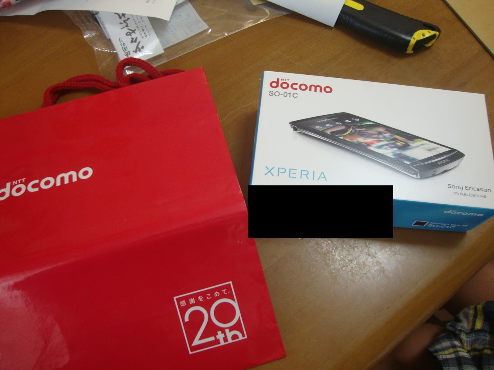

SoftBank銀SIMで使えるXperia Arcの入手から, その後遊んだことについてまとめてみた.

## まず
2012年から書いてきたXperia2011弄り方まとめを前ブログから持ってきました.  
今後も少しづつ記事を増やしていければなと思う.

## 注意！！！

ここに書かれていることは, 結構危険な内容も含まれています.  
場合によっては端末が起動しなくなったりすることがあるかもしれませんので注意してください.

尚, ここで紹介しているのはXperia2011年モデルでのやり方です.
最近の端末では, 特にブートローダーアンロック以降のやり方は結構変わっているようなので, 参考にする場合などは注意してください。

## 端末の入手

端末はAmazonで購入した.  
Xperiaと検索して絞ると, 白ロムのArcとAcroや, その海外モデルが12,000円程から販売されているのを発見.

やっぱり, 現時点で安全に楽しく遊べる携帯はXperiaの2011年モデルだと思うんですよ.  
今となっては性能はあまり高い機種ではなくなってしまいましたが...

SoftBankと帯域が同じなところや, 有名なカスタムROMである**CyanogenMod**の公式対応(注: 現在は公式サポートは切れています)などから購入機種はArcにした.

また, SIMフリー化が面倒くさそうだったのでSIMフリー加工済みの機種を購入(2012/7/15)した.

**注: これから思いっきり弄りたい方はSIMフリー加工されていないものの購入をおすすめします**  
(Bootloader Unlockが失敗して文鎮化する恐れがあるため)

## 届いた
端末は2012/7/16の午前中に届いた. 予定は19日だったのでびっくり.

docomoの袋付きで笑ったw

## もくじ

1. [root権限取得可能なファームウェアを書き込む](/blog/2013/01/08/xperia2011_flash_rootable_rom/)
2. [2011Xperia(Android2.3.4)のroot権限の取得](/blog/2013/01/08/xperia2011_rooting/)
3. [カスタムリカバリの導入](/blog/2013/01/08/xperia2011_flash_custom_recovery/)
4. [Omniusで国内ペリアをアンロック](/blog/2013/03/09/xperia2011_bootloader_unlock_with_omnius/)
5. [カスタムカーネルを書き込んでみる](/blog/2013/03/09/xperia2011_flash_custom_kernel/)
6. [カスタムROMを書き込んでみる](/blog/2013/06/29/xperia2011_flash_custom_rom/)
