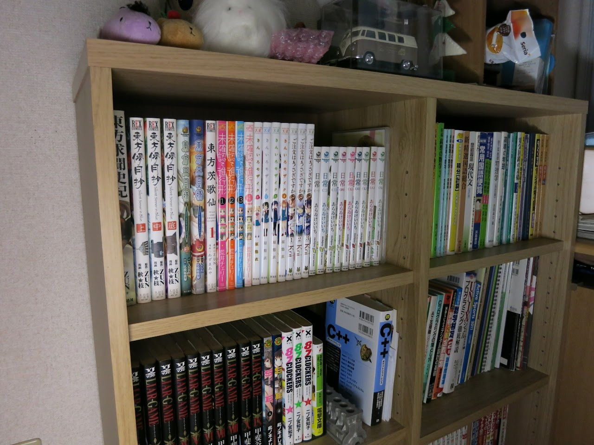
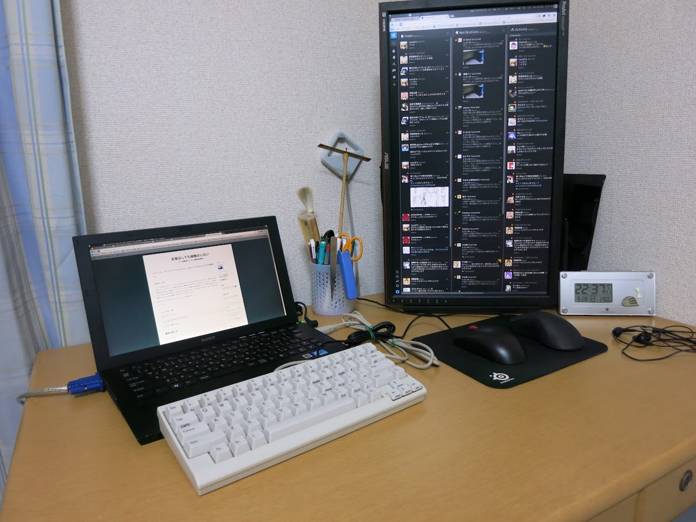
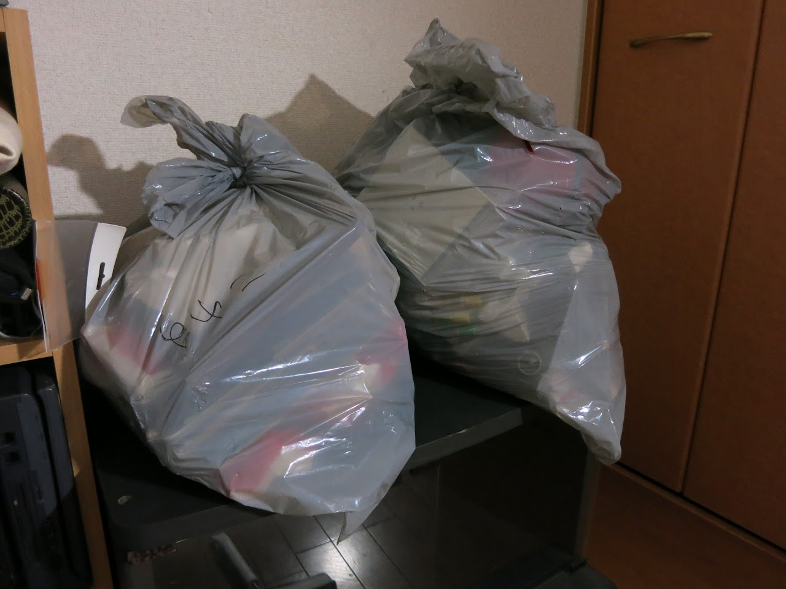

みょん.  
期末テストも終わり, 1週間ほどあった秋休みも終わろうとしてますね. はぁ.....

この秋休みは最初の3日をすべて自室の大掃除に当てました.  
たぶん年末の大掃除以上に激しくやったと思います.

まず, 新しい本棚を買ってもらいました.  
[以前](/blog/2014/02/04/entry/)からA5サイズのコミックが入る本棚を探していましたが, やっといい感じのを見つけることが出来ました.  
最近少しづつ増えているコミック類はもちろん, 雑に積まれていた教科書の類も綺麗に収納できて良いです.  

また, 本棚の収納力が上がったおかげで机の上の本を移動することができ, その結果机をより広く使えるようになりました.  
PCはVAIO Zたんをメインで使うことにしてディスプレイを縦に設置してみました.  

あとは大量に出たガラクタの類や幼稚園時代のスケッチブックなどのゴミの回収を待つだけですね.  
僕の地域では月に1回しか金属や小さな家電等のゴミを回収してくれる日がないので辛いです.  

やっぱり片付いた部屋は気持ちがいいですね. ∩(＞◡＜\*)∩

ほか, 訳あってポートフォリオページとこのブログをGithub Pagesに移行しました.  
何があったかはTwitterとか漁ればいいと思います. うぅ....

それにしても, 最近プログラム書いてない感しか無いし, 今日はTOEICだし, 再来週はFEだしでやばいなぁ....  
まぁがんばります.

ではではー
