この記事は先日の**[ご注文はBlu-rayですか?](/blog/2014/12/19/gochiusa_blu_ray_photo_review/)**の続きです.

## まず

ご存じの方も多いと思いますが, **ガバガバのDVD**の反省もこめてBlu-ray(以後BD)には結構強力な(利用者からすれば面倒な)コピープロテクトが採用されています.

僕自身のメモも兼ねて簡単にまとめると, 大半のBDは**A**dvanced **A**ccess **C**ontent **S**ystem (AACS)というコピープロテクト規格が採用されており, より複雑な暗号アルゴリズムを使っている上に, **定期的なキーの更新**が行われることで突破された場合も**再び阻止することが可能**となっています.

そのため専用のハードウェアやプレイヤーが必要になり, 特にPCで普通に再生する場合には対応ハードウェアの他に**有料の再生ソフトウェア**が必要になってきます.

## 何があったか

BDディスクを買っておいてアレなんですが, 僕はBDプレイヤーを持っていません.  
しかし, 昨年組んだPCにはBDドライブを載っけましたし, いろいろあってポータブルBDドライブも1台持っています.

先程PCでBDを再生するとき有料のソフトが要ると書きましたが, BDドライブ等に付属するソフトを使う方法もあります.  
しかし, あえて書かなかったのは**それができなかった**からです.

とりあえず確実に再生できる方法を試そうと, 仕方なくWin10TPを起動しBDドライブに付属していた**CyberLink PowerDVD10**を使い再生を試みました.

<!--more-->

## CyberLink PowerDVDとの格闘

出落ちw  
まぁ英語版Winだし仕方ないけど  
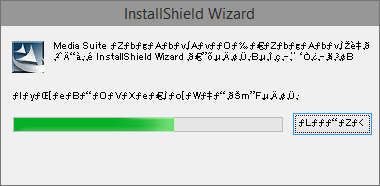  
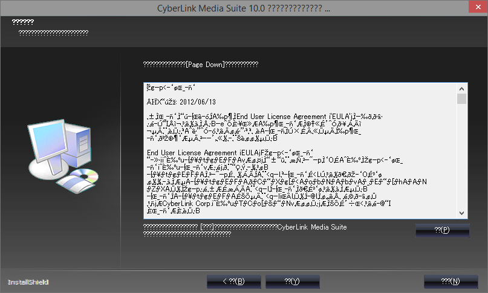

あのさぁ... 有名なソフトだろ???  
こんな広告貼っていいのかよおい.....  
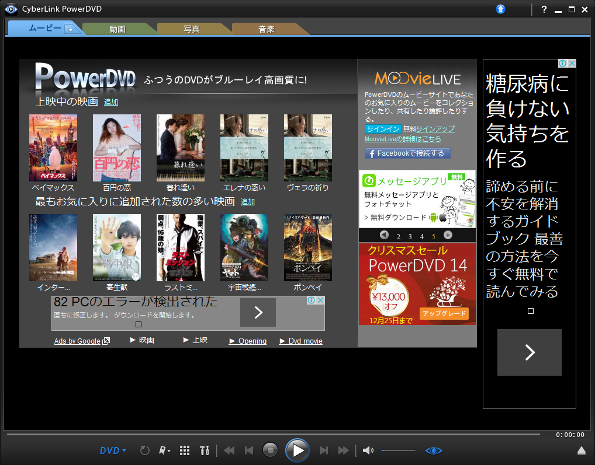

早速BDを入れて再生してみると, なんか出た  
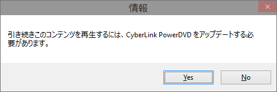

AACSキーの更新とかかなぁということで, 画面に従いYes  
すると**一瞬で完了した**とダイアログが出た  
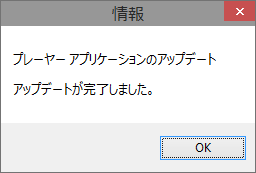

それじゃぁいってみよう, ポチ(再生ボタンをクリック)  
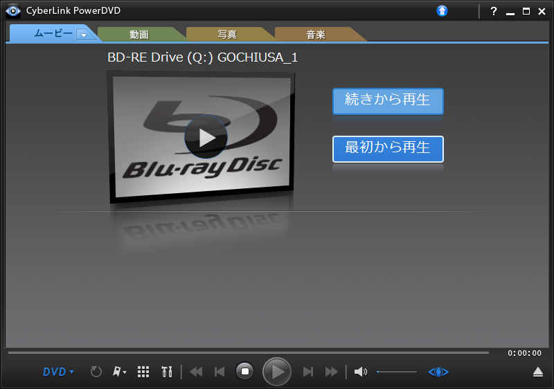  
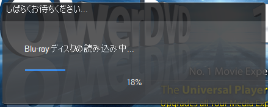  
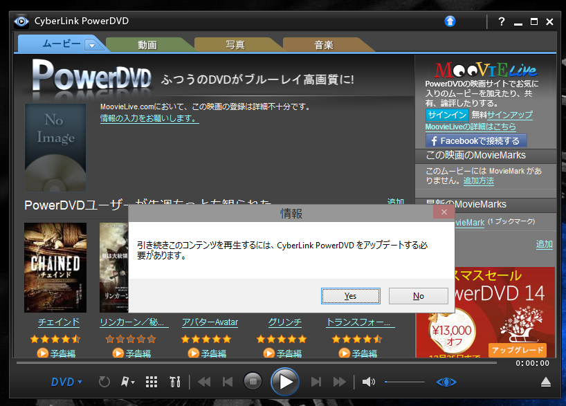  
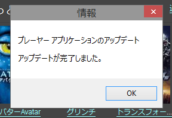  
**無限ループってこわくね?** (その後再起動等を繰り返すも延々にループ)

きっとソフトからのアップデートがうまくできていないんだろうということで, [ここ](http://www.cyberlink.com/support/powerdvd-ultra/patches_en_US.html)から手動でアップデータをDL/インストールした  
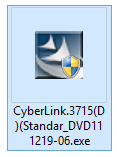

英語サイトから落としてきたのもあってか, 表示言語が英語になった  
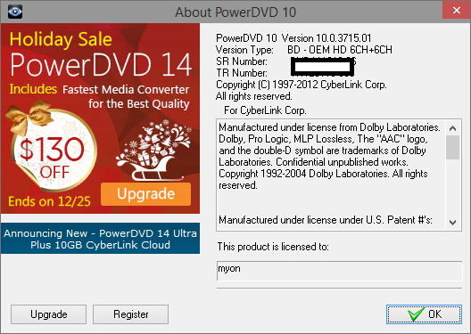

今度こそ逝ってみよう, ポチ  
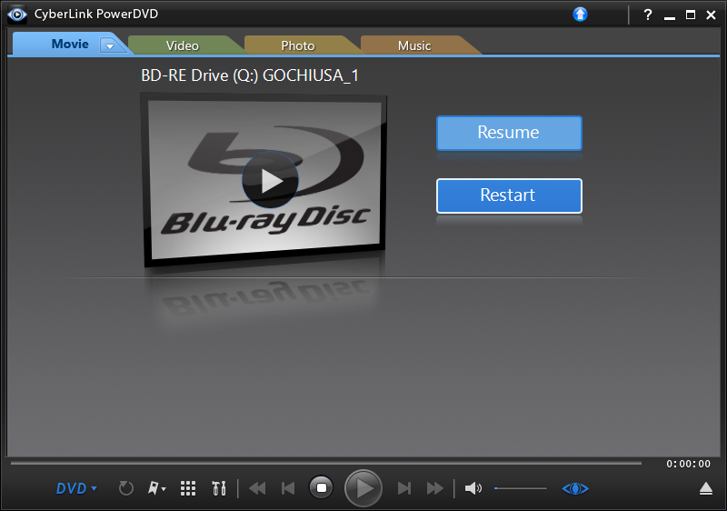
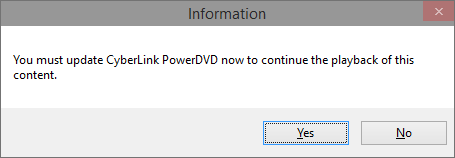

前バージョンと違ってYes押しても更新完了は出ず, そのままStoppedと表示されるようになってしまった  
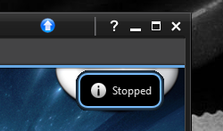

いろいろ調べていると, PowerDVD 10 **Ultra**の場合はPowerDVD 11 Ultraに無償で更新できるらしく, また更新することで見れるようになるという情報を見つけた

ってことでアップデータを落としてきてインストール.....  
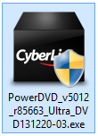  
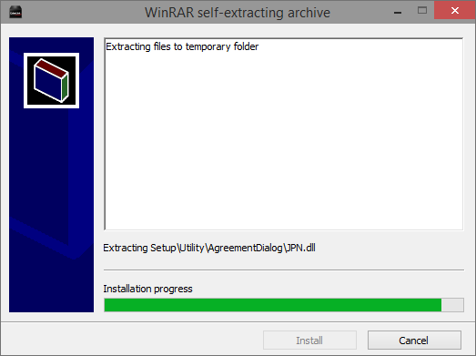  
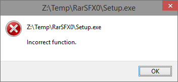

(･∀･；)  
適当に互換機能の設定したら動いたけど....  
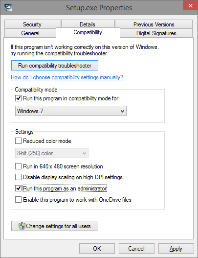  
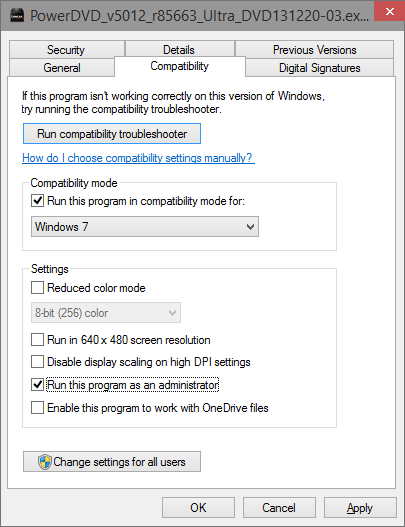  
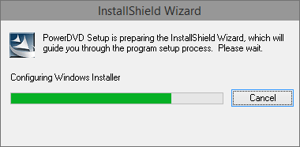

僕のはPowerDVD 10 **Ultra**じゃなかったらしい  
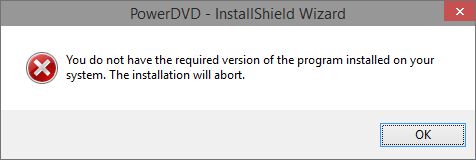

次記事に続きます. <del>(今日中に書きたい)</del>書けませんでした → [対Blu-ray用決戦部隊、通称MakeMKV](/blog/2014/12/21/play_blu_rau_in_archlinux/)

<blockquote class="twitter-tweet tw-align-center" lang="en">
PowerDVDもう許さなねぇからなぁ？
&mdash; とさいぬ (@myon\_\_\_) <a href="https://twitter.com/myon___/status/545908000934727681">December 19, 2014</a></blockquote>

