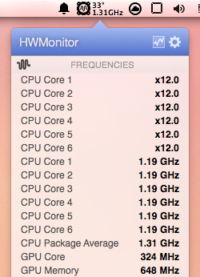
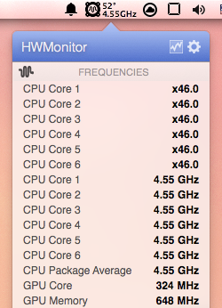

どもども, 進級確定のとさいぬです.  
長い春休みも残り半分となりましたが, ある晩見た**夢**がすごく鮮明に残っているので忘れないようにメモっておこうと思います.

<!--more-->

* 本記事はあくまで**夢のメモ**であり, 記事中の画像は**記憶を元に高画質でレンダリングしたもの**です
* Apple以外で製造されたハードウェアにOS Xをインストールすることは**Appleの規約違反**になります

## Introduction

昨年秋の記事, [Arch Linuxインストールめも (2014秋版)](/blog/2014/10/06/archlinux_installation_memo_2014/) にこんな記述がありました.

> ## Configure Partition

> こんな感じにした

> | Device | Capacity | Filesystem | Mountpoint | Memo |
> | ------ | -------: | ---------- | ---------- | ---- |
> | 略 |
> | /dev/sda3 | 64GB |  |  | **もう一つOS入れる予定** |

実はこの記事以前も何度か**夢**を見ていたのですが, 当時のPCのパーティション構成的な問題から別で接続したハードディスクをインストール先にしていました.  
OS X on HDDはWin on HDDほどの不満はなかったものの, やはりSSDに入れたいよねという希望からこのようなパーティションに組み直したわけです.

しかし, ここから**Arch Linux + Win + OS XのTriple Boot**が完成するまでの道が大変でした.  
というのも, 秋のOS再インストールではすべてのOSをUEFIからBootするようにしたわけですが, OSx86では欠かせない[Chameleon](http://chameleon.osx86.hu/)等の特殊なブートローダが**UEFIに対応していなかった**のです[^1].

[^1]: 当時もUEFIに対応したCloverはあったが, まだ不安定で僕の環境では使い物にならなかった

しかし最近**[Clover](http://sourceforge.net/projects/cloverefiboot/)**というUEFI対応のブートローダが話題で, 使えそうだったので再挑戦してみました.


### Components

* Intel Core i7-3930k (OC at 4.6GHz)
* Asus Rampage IV Formula (BIOS 4901)
* Nvidia Geforce GTX 660 Ti
* Corsair DDR3-1600 8GB x4
* Plextor M5S 256GB
* HDD 3TB
* Intel Centrino Advanced-N 6205 for Desktop [^2]
* PFU HHKB Lite 2 (US-Layout)
* Razer DeathAdder 3500 BE

[^2]: 残念ながらMacでは使うことができません. 誰かドライバ書いてくださいなんでもしますから!

パーティション構成は上記の秋の記事を参照

## Install OS X

大体は[Install Mac OS X | Rampage Dev](http://www.rampagedev.com/?page_id=144)を参考に, Mavericksをインストールをしました.

### Create Mavericks Install USB

知り合いのMacerに借りたり, NireshみたいなOS X環境を使うなどしてInstaller USB driveを作りました.  
手順は上記リンク先通りです.

### Configure BIOS

重要そうな部分の画像を貼っておきます.  
よくVT-xやVT-dは切ったほうがよい等の記述を見かけますが, 別に有効のままで問題無いと思います.  
  
  
  


### OS X Installation

作成したUSB driveから**UEFI**でBoot.  
Cloverのメニューが表示されたらキーボードの`o`でオプションを開き, boot flagsに

```
-v cpus=1 npci=0x2000 nv_disable=1
```

を設定してインストーラを起動します.  
`nv_disable=1` はGeforce GTX 6xx等が刺さっている場合で必須です. (ブラックアウトする)

インストーラが起動したら画面に従ってパーティションのフォーマット&&インストールをしました.  
途中で一度再起動がかかりますが, **この時点ではまだインストールが完了していない**のでもう一度USBからインストーラをBootする必要があります. (これに気づけずやり直しまくってた)

## Post Installation

ブートローダをインストールするまではインストールに使ったUSBから起動します. 先ほどのboot flagsを付けるのも忘れずに.  
もしも`VM Swap Subsystem is on`とかでBootが止まってしまう場合は, boot flagsに`-x`[^3]を追加すると起動できるかもしれません.

[^3]: Safe modeで起動させるオプション

### Prepare Tools

以下のツールをUSBメモリ等で突っ込みました.

* [MultiBeast](http://www.tonymacx86.com/downloads.php?do=file&id=255)
* [Kext Wizard](http://www.insanelymac.com/forum/topic/253395-kext-wizard-easy-to-use-kext-installer-and-more/)

### Install NIC Driver

いろいろと不便なので, とりあえず先にNICのドライバを突っ込みました.

インストール後の設定をいろいろやってくれるMultiBeastは定番ですが, そのまま起動して指示通りに操作するとChameleonをインストールしようとしてくるため, 今回のようにCloverを使う場合には少々不便です.  
そこで, MultiBeast.appの右クリックメニューからShow Package Contentsで中身を開き, `Contents/Resources/AppleIntelE1000e-v3.1.0.pkg`を抜き出してインストールすることにしました.  


NICドライバのインストール後はKext Wizardを開き, **Repair permissions/Rebuild cacheを行ってから**再起動します.  


### System Update

このあとデバイスドライバ等を組み込んでいくわけですが, ドライバを入れたあとのシステムアップデートは不都合を起こしやすい(経験上)ため, 先に済ませておくことにしました.  
システムアップデートをする分にはApple IDでのログインは必要なかった気がします.

### Install Device Driver

NICドライバのインストールを行った時と同様の方法でMultiBeastから以下のインストーラを抜き出し, 全部インストールしました.

* AHCI\_3rdParty\_SATA.pkg
* AHCI\_Intel\_Generic\_SATA.pkg
* AppleHDA-898.pkg[^4]
* FakeSMC-v6.9.1315-HWMonitor.pkg
* FakeSMC-v6.9.1315-Plugins.pkg
* FakeSMC-v6.9.1315.pkg
* GenericUSBXHCI-v1.2.7.pkg
* PS2-Keyboard-Mouse.pkg

[^4]: ここでオンボードオーディオのドライバを入れていますが, DSDT.amlを入れてやるまでは動作しません.

**Repair permissions/Rebuild cacheを忘れずに行ってから**再起動します.

## Enable SpeedStep

x79というのは(一般的には)特殊なプラットフォームであるためか, この時点ではCPUのSpeedStepが効かず, CPUのクロックは定格(3.2GHz)固定で動作してしまいます.  
別にこのままでも使い物にならないわけではありませんが, **Turbo Boostすら効かない**ため, CINEBENCH R11.5では2.5ほどのスコア低下が起きてしまったりといろいろ残念です.

ググったところ, [Guide: Asus X79 OS X Controlled SpeedStep](http://www.tonymacx86.com/general-help/127574-guide-asus-x79-os-x-controlled-speedstep.html) という素晴らしい記事がありましたので, これを参考にすることにしました.  
また, このようなACPI周りはブートローダの設定に依存してくるため, Cloverのインストールもここで行いました.

### Create DSDT.aml

上記記事中のリンクにもある [Asus Rampage IV Extreme Guide: Create your DSDT in 5 min using MacIASL.](http://www.tonymacx86.com/dsdt/114418-asus-rampage-iv-extreme-guide-create-your-dsdt-5-min-using-maciasl.html) を参考に作業しました.

[MaciASL](http://sourceforge.net/projects/maciasl/)を開き, File -> New from ACPI -> DSDT を選択.  


開いたウィンドウ上部のPatchをクリックし, 下部のOpenから[1スレッド目のAttached Filesにある R4E\_DSDT\_Patch\_10-2014.txt](http://www.tonymacx86.com/general-help/127574-guide-asus-x79-os-x-controlled-speedstep.html)を読み込ませApply.  
ファイル名がどう見てもR4E用ですが, R4Fでも(今のところ)問題はなかったです.  


ウィンドウ上部のCompileをクリックし問題がないことを確認した後, File -> Save As を選択.  
File Formatを`ACPI Machine Language Binary`, File Nameを`DSDT.aml`にして適当な場所に保存しておきます.  


### Create ssdt.aml

[ssdtPRgen.sh](https://github.com/Piker-Alpha/ssdtPRGen.sh)をダウンロードします.  
ターミナルを開き, こんな感じコマンドを叩いていくとデスクトップに`ssdt.aml`, `DSDT.dsl`が作成されます.

```
$ sudo ./ssdtPRGen.sh -c 1 -m MacPro6,1 -b Mac-F60DEB81FF30ACF6 -w 3 -turbo 4600
ssdtPRGen.sh v0.9 Copyright (c) 2011-2012 by † RevoGirl
             v6.6 Copyright (c) 2013 by † Jeroen
             v15.6 Copyright (c) 2013-2015 by Pike R. Alpha
-----------------------------------------------------------
Bugs > https://github.com/Piker-Alpha/ssdtPRGen.sh/issues <

Override value: (-c) CPU type, now using: Ivy Bridge!
Override value: (-m) model, now using: MacPro6,1!
Override value: (-b) board-id, now using: Mac-F60DEB81FF30ACF6!
Override value: (-w) Ivy Bridge workarounds, now set to: 3!
Override value: (-turbo) maximum (turbo) frequency, now using: 4600 MHz!

System information: Mac OS X 10.9.5 (13F1066)
Brandstring 'Intel(R) Core(TM) i7-3930K CPU @ 3.20GHz'

Scope (_SB_) {23608 bytes} with ACPI Processor declarations found in the DSDT (ACPI 1.0 compliant)
Generating ssdt.dsl for a 'MacPro6,1' with board-id [Mac-F60DEB81FF30ACF6]
Ivy Bridge Core i7-3930K processor [0x206D7] setup [0x0a01]
With a maximum TDP of 130 Watt, as specified by Intel
Number logical CPU's: 12 (Core Frequency: 3200 MHz)
Number of Turbo States: 14 (3300-4600 MHz)
Number of P-States: 35 (1200-4600 MHz)
Injected C-States for C000 (C1,C3,C6)
Injected C-States for C001 (C1,C3,C6)
Warning: 'system-type' may be set improperly (1 instead of 3)

Intel ACPI Component Architecture
ASL Optimizing Compiler version 20140926-64 [Nov  6 2014]
Copyright (c) 2000 - 2014 Intel Corporation

ASL Input:     /Volumes/MacHome/Users/cocoa/Desktop/ssdt.dsl - 373 lines, 11348 bytes, 96 keywords
AML Output:    /Volumes/MacHome/Users/cocoa/Desktop/ssdt.aml - 2735 bytes, 40 named objects, 56 executable opcodes

Compilation complete. 0 Errors, 0 Warnings, 0 Remarks, 0 Optimizations

Do you want to copy /Volumes/MacHome/Users/cocoa/Desktop/ssdt.aml to /Extra/ssdt.aml? (y/n)? n
Do you want to open ssdt.dsl (y/n)? n
```

`Ivy Bridge Core i7-3930K processor`に違和感がありますが, 気にしなくて大丈夫です.

### Install Clover

[Cloverのサイト](http://sourceforge.net/projects/cloverefiboot/)から最新のインストーラをダウンロードし(今回はv2.3-r3193), `Clover_v2.3k_r3193.pkg`を実行.  
Continue -> Continue -> Customize と進み, こんな感じにチェックを入れてInstallしました.  


Cloverの設定等が置かれるESPをマウントするために, Macのターミナルから

```
$ diskutil list
/dev/disk0
   #:                       TYPE NAME                    SIZE       IDENTIFIER
   0:      GUID_partition_scheme                        *256.1 GB   disk0
   1:                        EFI ESP                     536.9 MB   disk0s1 // <- これがESPっぽい

--- 略 ---

$ sudo diskutil mount disk0s1
Volume ESP on disk0s1 mounted
```

という感じにコマンドを叩きます.

`/Volumes/ESP/EFI/CLOVER/config.plist`を[こんな感じ](https://gist.github.com/Tosainu/9ed51dfde6fa9270a25b)に設定しました.  
また, `/Volumes/ESP/EFI/CLOVER/ACPI/patched/`の中に先ほど作成した`DSDT.aml`と`ssdt.aml`を突っ込みます.

### Install kexts

[1スレッド目のAttached Filesにある X79\_CPUPM\_kexts.zip](http://www.tonymacx86.com/general-help/127574-guide-asus-x79-os-x-controlled-speedstep.html)をダウンロード&&解凍し, 中の`AppleIntelCPUPowerManagementSandE.kext`, `X79X86PlatformPlugin.kext`をデスクトップに置きます.  
[KextBeast](http://www.tonymacx86.com/downloads.php?do=file&id=32)を実行して, デスクトップに置いたkextをインストールしました.

最後に**Repair permissions/Rebuild cacheを忘れずに行ってから**再起動します.

### Configure Bootloader

CloverのインストーラがUEFIのエントリへの登録もやってくれるはずなのですが, 何故かされていませんでした.  
そのためArch Linuxを起動して, ターミナルからこんな感じのコマンドを叩いて登録しました.

```
// /dev/sdXはESPがあるストレージのパス
$ sudo efibootmgr -c -d /dev/sdX -l /EFI/CLOVER/CLOVERX64.efi -L "Clover"
```

また, 個人的にCloverをメインのブートローダにするのはいろいろと不便なので, `/etc/grub.d/40_custom`にこんな感じの設定を追加し, GrubのメニューからCloverを起動できるようにしてみました.  
ポイントは`chainloader`に`/EFI/CLOVER/CLOVERX64.efi`ではなく`/EFI/Boot/BOOTX64.efi`を指定してやるところです.

```
menuentry "Clover" {
  insmod fat
  insmod search_fs_uuid
  insmod chain
  search --fs-uuid --set=root $hints_string $uuid
  chainloader /EFI/Boot/BOOTX64.efi
  boot
}
```

`$uuid`と`$hints_string`には以下のコマンドを実行した時の結果を設定します.

```
// $uuid
$ sudo grub-probe --target=fs_uuid /boot/efi/EFI/Boot/BOOTX64.efi

// $hints_string
$ sudo grub-probe --target=hints_string /boot/efi/EFI/Boot/BOOTX64.efi
```

最後にGrubの設定ファイルを再生成して完了です.

```
$ sudo grub-mkconfig -o /boot/grub/grub.cfg
```

### ∩(＞◡＜✘)∩

もうインストールに使ったUSBメモリなしで起動できるようになりました.  
また, こんな感じにSpeedStepが効いているのを確認できると思います.

 

## Install Softwares

システムの設定はこれで完了なので, 今度は使い物になるように(特に黒画面の)ツールを整えていきます.

### Device Utilities

* [Razer Synapse 2.0 (MAC)](http://drivers.razersupport.com/index.php?_m=downloads&_a=view&parentcategoryid=239&pcid=0&nav=0&_m=downloads&_a=view&parentcategoryid=239&pcid=0&nav=0)
* [HHKB Lite2 for Mac](http://www.pfu.fujitsu.com/hhkeyboard/macdownload_lite2.html)
* [Wacom Tablet for Mac OS X](http://tablet.wacom.co.jp/download/download_detail.html?drv_c=531)

### from App Store

* Blackmagic Disk Speed Test
* Twitter for Mac
* TweetDeck
* Xcode

### Command Line Tools

```
$ sudo xcodebuild -license
$ xcode-select --install
```

### Homebrew

```
$ ruby -e "$(curl -fsSL https://raw.githubusercontent.com/Homebrew/install/master/install)"
```

`.zshrc`等を編集してPATHに`/usr/local/bin/`, `/usr/local/sbin`を追加.

```zsh
path=(
  /usr/local/bin(N-/)
  /usr/local/sbin(N-/)
  $path
)
```

これらを突っ込んだ.

```
$ brew list
autoconf  brew-cask     gdbm  gmp           libksba   luajit    pcre        sl    zsh
automake  clang-format  ghc   go            libtool   mercurial pkg-config  vim
boost     cmake         git   libgpg-error  libyaml   openssl   readline    xz
```

#### Vim

Pythonを有効にするといろいろ入れられて気分が悪かったので`--without-python`した.

```
$ brew install vim \
  --override-system-vi \
  --with-lua \
  --with-luajit \
  --without-python \
  --HEAD
```

#### OpenSSL

MavericksデフォルトのOpenSSL 0.9.8zcは古すぎてTLS 1.1/1.2に対応しておらず, 例えばBoost.Asioを使ったこんなコードを書くとinvalid\_argument例外が投げられます.

```cpp
boost::asio::ssl::context context(boost::asio::ssl::context_base::tlsv12);
```

仕方ないので, Warningは出るけどこうしました.

```
$ brew link openssl --force
```

### node.js

```
$ git clone https://github.com/creationix/nvm.git ~/.nvm
$ source ~/.nvm/nvm.sh
$ nvm install 0.12
$ nvm use 0.12
$ nvm alias default 0.12
```

`.zshrc`に以下を記述.

```zsh
[ -s ~/.nvm/nvm.sh ] && . ~/.nvm/nvm.sh
```

### Ruby

```
$ curl -sSL https://get.rvm.io | bash -s -- --ignore-dotfiles
$ rvm install ruby-2.2
$ rvm use 2.2 --default
```

`.zshrc`に以下を記述.

```zsh
[ -s ~/.rvm/scripts/rvm ] && source ~/.rvm/scripts/rvm
```

### Homebrew Cask

```
$ brew install caskroom/cask/brew-cask
```

デフォルトではインストールしたアプリケーションのリンクが`~/Applications/`に張られるようなのですが, いろいろと都合が悪いので, `.zshrc`とかに

```shell
export HOMEBREW_CASK_OPTS="--appdir=/Applications"
```

を書いて, `/Applications/`に張られるようにしました.

Caskではこれらを突っ込んだ.

```
$ brew cask list
appcleaner  firefox  google-japanese-ime  karabiner  xtrafinder
chromium    gimp     iterm2               onyx
```

#### XtraFinder

デフォルトのFinderは**ファイル/ディレクトリのカットができなかったり**, **Icon Viewで項目が自動整列されなかったり**と不便なのですが, それを可能にしてくれます.  
設定はこんな感じにしてみました.  


#### Karabinder

Macを使ってみてからずっと気になっていたのですが, Key Repeatが**異様に遅い**のです.  
キーボードの設定に**Key Repeat**という項目がありますが, それをFastにしても全然遅いです.

もっと早くできないかと調べていて出会ったのがこれです.  
とりあえず`Delay Until Repeat`を`275ms`, `Key Repeat`を`27ms`に設定して様子を見ています.  


また, MacにはCommand key (`⌘`)がありますが, 僕にはこのキーの扱いにどうも馴染めませんでした.  
というのも, Macのキーボードショートカットは(非Macer的には)変わっていて, 例えばコピーやペーストなどの普段Ctrlキーを使うキーボードショートカットがCommandキーとの組み合わせになっていたりするのです.

そのため System Preferences -> keyboard -> Modifier Keys を開いてこんなかんじにCommandとCtrlを入れ替える設定をしてみました.  


しかし, この設定はターミナルで問題を起こします.  
僕はよく`^C`とか`^D`を使ったりするのですが, これらはMacでもCtrlキーを使うため, 上の設定ではキーボードのCommandキーに相当するキーを使わないといけなくなります.

これを解決するために, [Macでのキーバインド変更（CtrlとCommand入れ替え，ターミナル.appを使うときは入れ替えない） - 木綿豆腐。](http://d.hatena.ne.jp/yamamo_men/20120210/1328887773) を参考に設定をしました.  
上記記事中ではKeyRemap4MacBookという名前のソフトウェアが登場しますが, Karabinderの古い名前であるだけで, 記事中のxmlもそのまま使えます.

## Images

壁紙だけ流行に乗りました.  
画面が縦なのは, 接続しているディスプレイを普段ノートパソコンのサブディスプレイとして使っているからです.


Mac Proです. (大嘘)  


起動ドライブのSSD. 特に何かしたわけじゃないけどTRIM対応してた.  


まぁまぁな感じ.  


氏ねベンチ新旧. OpenGLが若干落ちるが, CPUはWin版と大して変わらない結果が出せた.
  


## Great Success!

ここまでしてMac環境が欲しかったのには理由があって, 以前も何度か紹介しているTwitterライブラリ[twitpp](https://github.com/Tosainu/twitpp)をMacに正式対応させたかったわけです.

僕が趣味で書くプログラムは, Windowsには対応させなくとも, 一応\*nix系であるMacくらいには対応させたいなと思っています.  
しかし, 先日の[CocoaTwitのネタ紹介記事](/blog/2015/02/28/cocoatwit/)でも書いたようにtwitppがMacで動かないことが判明しました.

この環境が整ったことにより, twitppはAppleClangでエラーが出るコードが修正され, また環境によって異なるBoost等のパスに対応させるためCMakeを導入し, ついに[Macでも動かせるようになりました](https://github.com/Tosainu/twitpp/commit/95e20d4d11e02bf3e32c35663bedc837b358066e).

気が向いたらYosemiteの夢も見てみようかなーなんて.  
ではではー.
