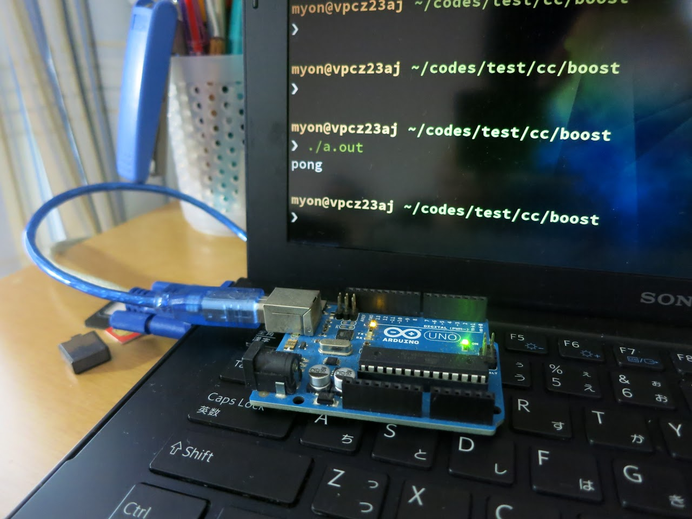

にゃんにゃん.

[自作の某ライブラリ](https://github.com/Tosainu/twitpp)でhttpクライアントとして使っている[Boost.Asio](http://www.boost.org/doc/libs/1_58_0/doc/html/boost_asio.html)ですが, シリアル通信もできるっぽいので, 雑にArduinoとPing-Pongしてみました.  


## 環境

* Arch Linux x86\_64
* Boost 1.57.0
* clang 3.6.0
* Arduino Uno
* avr-gcc 4.9.2
* avrdude 6.1

## PC側

簡単ですね. Boostのドキュメント見ながらでも数分で書けました.

```cpp
#include <chrono>
#include <thread>
#include <iostream>
#include <boost/asio.hpp>

auto main() -> int {
  boost::asio::io_service io;

  // ポートは /dev/ttyACM0
  boost::asio::serial_port serial(io, "/dev/ttyACM0");
  // 速度は 9600bps
  serial.set_option(boost::asio::serial_port_base::baud_rate(9600));

  // テキトウに5秒待つ
  std::this_thread::sleep_for(std::chrono::seconds(5));

  // "ping" を送信
  boost::asio::write(serial, boost::asio::buffer("ping\n"));

  // serial から response_buf に '\n' まで読み込む
  boost::asio::streambuf response_buf;
  boost::asio::read_until(serial, response_buf, '\n');

  // 表示して終わり
  std::cout << boost::asio::buffer_cast<const char*>(response_buf.data());
}
```

```
$ clang++ -std=c++1y -Wall -Wextra -lboost_system serial.cc
$ ./a.out
```

## Arduino側

正直こっちのほうが時間がかかりました. 5時間位でしょうか...  
まぁArduino(AVR)触ったのも2年ぶりくらいだし仕方ないね.

```cpp
#define F_CPU 16000000UL
#define BAUD 9600

#include <avr/io.h>
#include <util/setbaud.h>
#include <stdio.h>
#include <string.h>

static FILE uart_stdin;
static FILE uart_stdout;

static int uart_getchar(FILE*) {
  loop_until_bit_is_set(UCSR0A, RXC0);
  return UDR0;
}

static int uart_putchar(char c, FILE*) {
  loop_until_bit_is_set(UCSR0A, UDRE0);
  UDR0 = c;
  return 0;
}

static void uart_init() {
  // baud rate の設定
  UBRR0H = UBRRH_VALUE;
  UBRR0L = UBRRL_VALUE;

  // TX/RX を有効に
  UCSR0B = _BV(RXEN0) | _BV(TXEN0);
  // データは 8-bit
  UCSR0C = _BV(UCSZ01) | _BV(UCSZ00);

  // シリアル入出力を stdin/stdout に当てる
  fdev_setup_stream(&uart_stdin, nullptr, uart_getchar, _FDEV_SETUP_READ);
  fdev_setup_stream(&uart_stdout, uart_putchar, nullptr, _FDEV_SETUP_WRITE);
  stdin = &uart_stdin;
  stdout = &uart_stdout;
}

auto main() -> int {
  uart_init();

  // 読み込む
  char str[10];
  scanf("%s", str);

  // 読み込んだデータが "ping" だったら "pong" を返す
  if (!strcmp(str, "ping")) {
    printf("pong\n");
  }
}
```

```
$ avr-g++ -std=c++1y -mmcu=atmega328p -Wall -Wextra -Os pingpong.cc
$ avr-objcopy -O ihex -j .text -j .data a.out pingpong.hex
$ avrdude -c arduino -P /dev/ttyACM0 -p m328p -b 115200 -u -e -U flash:w:pingpong.hex:a
```

## see also

* [avr\_demo/hello\_uart at master · tuupola/avr\_demo](https://github.com/tuupola/avr_demo/tree/master/hello_uart)
