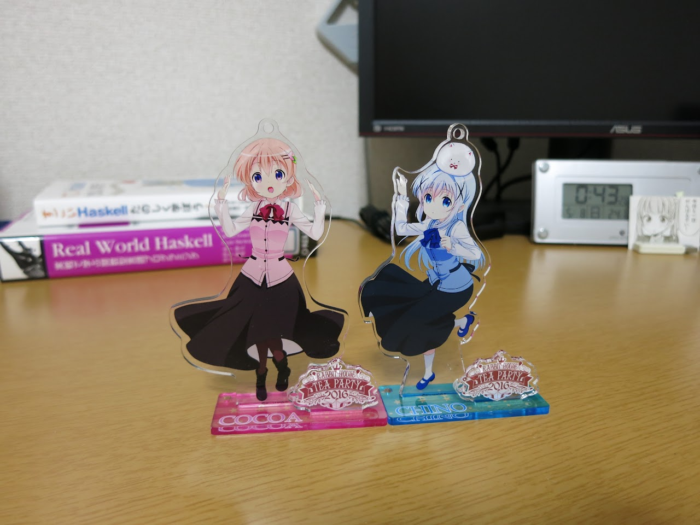

  
Rabbit House Tea Party 2016 お疲れ様でした!!!  
こういったアニメのイベントに参加するのは初めてなのですが, 本当に最高な1日でした!!!

<!--more-->

## 前日夜

当初の予定では電車で 11:00 過ぎくらいに行こうかと思っていたけれども, 当日の物販の待機列形成が 6:00 らしいということで急遽夜行バスを予約. 流石にパンフレットが品切れになることはないだろうけど, 初参加のイベントで失敗はしたくないなということで.

出発の1時間前にバス停に着いてしまったので, 持ってきた**ごちうさ3巻**を読んで待ってた. とにかく雨が止んでてよかった.

## 横浜上陸!

予定通り 5:30 過ぎに桜木町駅に到着.  
パシフィコ横浜までの道を調べていると, 同じバスに乗っていたとある人(T氏とする)から声を掛けられた.

**"もしかしてごちうさですか?"**

どうやらバス停でごちうさ読んでいるのを見て察したみたい. これも何かの縁ってことで, T氏と会場へ向かった.  
途中, ナビに使っていた僕の携帯のGPSが荒ぶってUターンすることになったりもしたけど, 5:50 過ぎにパシフィコ横浜前到着. 物販の列ができる場所を探す時間も含めれば丁度いいくらいだったと思う.

<blockquote class="twitter-tweet tw-align-center" data-lang="en">
c(＞◡＜と⌒c)つ彡 (@ パシフィコ横浜 (PACIFICO YOKOHAMA) in Yokohama, Kanagawa) <a href="https://t.co/SFtuIrKRYH">https://t.co/SFtuIrKRYH</a>
&mdash; とさいぬ (@myon\_\_\_) <a href="https://twitter.com/myon___/status/728688846523781121">May 6, 2016</a></blockquote>

## 物販

到着したときには既に列(というよりは群れ)ができててちょっと残念. ネットでは列整形のためのダッシュによるけが人の発生や販売開始時間の15分遅れで運営が叩かれてたけど, 元の原因はこの大人数の群れなわけで.

いろいろあって自分たちの前に並んでいた**イベントベテランのD氏**と仲良くなって, 以後T氏と合わせて3人で行動した. 偶然にも皆昼公演の座席の列がほとんど同じで, 特にD氏は僕のななめ後ろの席と近くて驚いた.  
前日の物販と同様, 販売開始後しばらくして千夜ちゃんキーホルダーの売り切れのアナウンスがあったりしたけど, 気になっていたもの(下の画像+イベントバッグ)はすべて入手できてよかった. とはいえ, 物販を脱出できたのは 10:30 過ぎ. 実に4時間半以上並んでいたようだ. イベント慣れしてるD氏やT氏は元気そうだったけど, 僕はこの時点で結構つらかった...  
  

## 昼公演

正面スクリーンで60秒のカウントが開始. だんだんと音も大きくなっていって, **5! 4! 3! 2! 1! ﾜｰｰｰｰｯ** でステージ上の大きなプレゼント箱からメンバー登場! この瞬間, なんというか感動で涙が出てきた. それが声優!のアニメを見た影響もあってか, 今まであまり意識することのなかった声優という職業の方々は本当にすごいんだなと思うようになっていたのがあったのだと思う. 目の前(50mくらい先だったけど)に好きなアニメの声優さんがいるってだけでなんか感動してしまった.  
そういうのもあって, 個人的に朗読が本当に良かった. もちろんストーリー自体もイベントに絡ませたネタが混ぜ込まれていたりでとても楽しめたのだけれど, 何より**生の声優さんたちが今目の前でストーリーを読み上げている**というものすごい状況にもう圧倒されてしまった. 汗拭きとして持ってきたタオルが完全に涙ふきになってた.

**ごちうさ??でメンバー10人が着た衣装の種類の合計は?** というクイズがあったのだけれど, **検証映像があります**で笑ってしまった. そしてその検証映像の作り込み, 予想されていた値を超える検証結果. こういう一昔前のニコニコ動画的なノリ好きだなぁ.  
その他のミニゲーム的コーナー, 特に後半はいつの間にかルールが変わっていたり, 得点がインフレ起こしてたりでカオスだったけど, これはこれで楽しかった. これ夜公演だとまた違った展開になったり, "昼はこんなエピソードがあってー" みたいなトークもあったりするんだろうなと思うと夜も見たかったなとちょっと後悔.

そしてライブパートに突入. 1曲目が **"ノーポイッ!"** なのは予想できたけど, その後チノ役**水瀬いのりさん<u>ソロ</u>**で **"出かけましょうと答えましょう"** がきてもうびっくり. 踊りながらにもかかわらず安定した歌声で歌っている姿は本当にすごいなぁと. とにかく最高だった.  
個人的に好きな楽曲でもあったココア役佐倉綾音さんとリゼ役種田梨沙さんによる **"Rabbit Hole"** が聴けたのも良かったし, 実は初めて聴くチマメ隊(水瀬いのりさん/徳井青空さん/村川梨衣さん)の **"ぴょん'sぷりんぷるん"** も結構盛り上がってて良かった.  
イベントソングの **"本日は誠にラリルレイン"** はごちうさ?? BD/DVD 6巻に付いてくるみたいですよ!
<blockquote class="twitter-tweet tw-align-center" data-lang="en">
6/3発売『ご注文はうさぎですか？？』BD&amp;DVD第6巻ジャケットを公開！初回限定特典として「Rabbit House Tea Party 2016」イベントソング『本日は誠にラリルレイン』も封入決定です！！<a href="https://twitter.com/hashtag/gochiusa?src=hash">#gochiusa</a> <a href="https://t.co/vrzw9nSbdo">pic.twitter.com/vrzw9nSbdo</a>
&mdash; TVアニメ「ご注文はうさぎですか？？」 (@usagi\_anime) <a href="https://twitter.com/usagi_anime/status/728938903411949570">May 7, 2016</a></blockquote>

## その他展示

とりあえず撮ったものはここに上げた.  

個人的には**ティッピータワー**が良かった. 会場のステンドグラス?とも合って綺麗だった.  

**"魔法少女チノ" 等身大フィギュア**  

**佐倉綾音さんのサイン**  

---

こんなに素晴らしいイベントを開催してくれたこと, そしてそれに参加できたことに本当に感謝です.  
ありがとうございました!!!!!!

<blockquote class="twitter-tweet tw-align-center" data-lang="en">
「Rabbit House Tea Party 2016」閉幕いたしました！お越しいただきました皆様、出演者の皆様、ありがとうございました！！ またラビットハウスに遊びに来てくださいね♪ <a href="https://twitter.com/hashtag/gochiusa?src=hash">#gochiusa</a> <a href="https://t.co/72GkYHjPpt">pic.twitter.com/72GkYHjPpt</a>
&mdash; TVアニメ「ご注文はうさぎですか？？」 (@usagi\_anime) <a href="https://twitter.com/usagi_anime/status/728911489772359680">May 7, 2016</a></blockquote>

以下, イベント参加に関する私的メモです.

- 筆箱とバインダを持って行ったのは大正解 (物販行列での注文用紙の記入, パンフレットやクリアファイル等の曲がり防止)
- 折りたたみじゃない傘はくっっっっそ邪魔. でも疲れたときの杖にはなる. 折りたたみ傘 + ビニール袋とかのほうがいいかも.
- リュックサックは楽だが, 人混みの中でものが出し入れしにくかったり, ホール座席の下に入りきらなかったりした. A4サイズのものが十分入るくらいの肩から提げるかばんのほうがよかったかも.
- ホール入場前に水分をとっておく (喉乾いて辛かった)
- ペンライトは買っとけ
