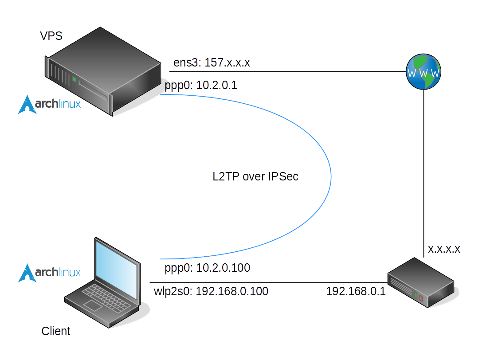

いろいろあってVPNを張りたくなったので, Arch LinuxでL2TP/IPsecなVPNサーバを構築したときのメモです.

## 環境

図にするとこんな感じ.  
記事中では, この図のIPアドレス及びネットワークインターフェース名を使っていきます.  


<!--more-->

ちなみに, サーバにはクーポンが残っていたConoHa(リニューアル前)のメモリ1GBプラン(2core-CPU, 1GB-RAM, 100GB-HDD)を使いました.

利用したソフトウェアとバージョンは以下のとおり.

| ソフトウェア | バージョン | メモ |
| :-: | :-: | --- |
| [Arch Linux](https://www.archlinux.org/) | - | 最高のLinuxディストリビューション |
| [Openswan](https://www.openswan.org/) | 2.6.47 | LinuxのためのIPsec(Internet Protocol Security)実装 |
| [xl2tpd](https://github.com/xelerance/xl2tpd) | 1.3.7 | LinuxのためのL2TP(Layer 2 Tunneling Protocol)実装 |
| [ppp](https://ppp.samba.org/) | 2.4.7 | LinuxやSolarisのためのPPP(Point-to-Point Protocol)実装 |
| iptables | 1.6.0 | ファイアウォール |

## 準備

必要なソフトウェアをインストール. Openswanは公式のリポジトリにないのでAURから入れました.

```
$ yaourt -S iptables xl2tpd openswan
```

また, いくつかのカーネルパラメータを変更するために, `/etc/sysctl.d/99-sysctl.conf`(名前は適当)を作成.

```
# /etc/sysctl.d/99-sysctl.conf

net.ipv4.ip_forward = 1
net.ipv4.conf.default.rp_filter = 0
net.ipv4.conf.default.accept_source_route = 0
net.ipv4.conf.all.send_redirects = 0
net.ipv4.conf.default.send_redirects = 0
net.ipv4.icmp_ignore_bogus_error_responses = 1
```

以下のコマンドを実行して反映させます.

```
$ sudo sysctl --system
```

## サーバ側の設定

### Openswan

`/etc/ipsec.conf`の41行目, `# Add connections here`の下に`include /etc/ipsec.d/*.conf`を追記.

```
# /etc/ipsec.conf - Openswan IPsec configuration file

# This file:  /usr/share/doc/openswan/ipsec.conf-sample
#
# Manual:     ipsec.conf.5


version	2.0	# conforms to second version of ipsec.conf specification

# basic configuration
config setup
	# Do not set debug options to debug configuration issues!
	# plutodebug / klipsdebug = "all", "none" or a combation from below:
	# "raw crypt parsing emitting control klips pfkey natt x509 dpd private"
	# eg:
	# plutodebug="control parsing"
	# Again: only enable plutodebug or klipsdebug when asked by a developer
	#
	# enable to get logs per-peer
	# plutoopts="--perpeerlog"
	#
	# Enable core dumps (might require system changes, like ulimit -C)
	# This is required for abrtd to work properly
	# Note: incorrect SElinux policies might prevent pluto writing the core
	dumpdir=/var/run/pluto/
	#
	# NAT-TRAVERSAL support, see README.NAT-Traversal
	nat_traversal=yes
	# exclude networks used on server side by adding %v4:!a.b.c.0/24
	# It seems that T-Mobile in the US and Rogers/Fido in Canada are
	# using 25/8 as "private" address space on their 3G network.
	# This range has not been announced via BGP (at least upto 2010-12-21)
	virtual_private=%v4:10.0.0.0/8,%v4:192.168.0.0/16,%v4:172.16.0.0/12,%v4:25.0.0.0/8,%v6:fd00::/8,%v6:fe80::/10
	# OE is now off by default. Uncomment and change to on, to enable.
	oe=off
	# which IPsec stack to use. auto will try netkey, then klips then mast
	protostack=auto
	# Use this to log to a file, or disable logging on embedded systems (like openwrt)
	#plutostderrlog=/dev/null

# Add connections here
include /etc/ipsec.d/*.conf
```

`/etc/ipsec.d/examples/l2tp-psk.conf`を`/etc/ipsec.d/`にコピー.  
33行目の`YourGatewayIP`の部分をサーバのIPアドレスに変更. また, 47行目以降の設定は今回必要ないので消しておきます.

```
$ sudo cp /etc/ipsec.d/examples/l2tp-psk.conf /etc/ipsec.d/
```

```
# /etc/ipsec.d/l2tp-psk.conf

conn L2TP-PSK-NAT
	rightsubnet=vhost:%priv
	also=L2TP-PSK-noNAT

conn L2TP-PSK-noNAT
	#
	# Configuration for one user with any type of IPsec/L2TP client
	# including the updated Windows 2000/XP (MS KB Q818043), but
	# excluding the non-updated Windows 2000/XP.
	#
	#
	# Use a Preshared Key. Disable Perfect Forward Secrecy.
	#
	# PreSharedSecret needs to be specified in /etc/ipsec.secrets as
	# YourIPAddress	 %any: "sharedsecret"
	authby=secret
	pfs=no
	auto=add
	keyingtries=3
	# we cannot rekey for %any, let client rekey
	rekey=no
	# Apple iOS doesn't send delete notify so we need dead peer detection
	# to detect vanishing clients
	dpddelay=10
	dpdtimeout=90
	dpdaction=clear
	# Set ikelifetime and keylife to same defaults windows has
	ikelifetime=8h
	keylife=1h
	# l2tp-over-ipsec is transport mode
	type=transport
	#
	left=157.x.x.x
	#
	# For updated Windows 2000/XP clients,
	# to support old clients as well, use leftprotoport=17/%any
	leftprotoport=17/1701
	#
	# The remote user.
	#
	right=%any
	# Using the magic port of "%any" means "any one single port". This is
	# a work around required for Apple OSX clients that use a randomly
	# high port.
	rightprotoport=17/%any
```

今回はサクッと立てたかったため, 認証方式にはPSK(Pre Shared Keys, 事前共有鍵)を選択.  
`/etc/ipsec.secrets`をこんな感じに記述しました.

```
: PSK "aaaaaaaaaaaaaaaaaaaaaaaaaaaaaaaaaaaaaaaaaaaaaaaaaa"
```

### xl2tpd

`/etc/xl2tpd/xl2tpd.conf`をこんな感じに記述.  
`listen-addr`にサーバのIPアドレス, `hostname`に適当な名前, `ip range`にクライアントに割り当てるIPアドレスの範囲, `local ip`にサーバのVPN側のIPアドレスを設定します.

```
[global]
listen-addr=157.x.x.x
auth file = /etc/ppp/chap-secrets
debug avp = no
debug network = no
debug packet = no
debug state = no
debug tunnel = no

[lns default]
hostname = hogefuga
ip range = 10.2.0.100-10.2.0.149
local ip = 10.2.0.1
assign ip = yes
length bit = yes
ppp debug = no
pppoptfile = /etc/ppp/options.l2tpd
require authentication = yes
require chap = yes
require pap = no
```

### ppp

`/etc/ppp/options.l2tpd`をこんな感じに記述.  
`ms-dns`や`mtu`, `mru`は環境に合わせて適宜変更します.

Openswanのドキュメント等では`crtscts`や`lock`も設定されていますが, これを入れるとエラーが出て起動しなかったため消してあります.

```
ipcp-accept-local
ipcp-accept-remote

ms-dns 8.8.8.8
ms-dns 8.8.4.4

auth
debug
idle 1800
mtu 1500
mru 1500
nodefaultroute
persist
proxyarp
name l2tpd

refuse-pap
refuse-chap
refuse-mschap
require-mschap-v2
```

接続するユーザとパスワードを`/etc/ppp/chap-secrets`に記述しておきます.

```
# Secrets for authentication using CHAP
# client	server	secret			IP addresses
nyan l2tpd bbbbbbbbbbbbbbbbbbbbbbbbbbbbbbbbbbbbbbbbbbbbbbbbbb *
```

### iptables

`500/UDP`, `1701/UDP`, `4500/UDP`を開放.  
また, NICとL2TP間をパケットが出入りできるように, いくつかのルールも設定します.

```
# iptables -A INPUT -i ens3 -p udp -m policy --dir in --pol ipsec -m udp --dport 1701 -j ACCEPT
# iptables -A INPUT -i ens3 -p udp --dport 4500 -j ACCEPT
# iptables -A INPUT -i ens3 -p udp --dport 500 -j ACCEPT

# iptables -A FORWARD -i ens3 -d 10.2.0.0/24 -j ACCEPT
# iptables -A FORWARD -s 10.2.0.0/24 -o ens3 -j ACCEPT
# iptables -t nat -A POSTROUTING -s 10.2.0.0/24 -o ens3 -j MASQUERADE
```

### サービスを有効にする

とりあえずスタートして, エラーが出なければ有効にしておきます.

```
$ sudo systemctl start openswan xl2tpd
$ sudo systemctl enable openswan xl2tpd
```

## クライアント側の設定

### Openswan

`/etc/ipsec.conf`の20行目を`plutoopts="--interface=wlp2s0"`のようにして通信を行うインターフェースを指定し, また41行目の`# Add connections here`以下に接続の設定を記述してしまいます.

```
# /etc/ipsec.conf - Openswan IPsec configuration file

# This file:  /usr/share/doc/openswan/ipsec.conf-sample
#
# Manual:     ipsec.conf.5


version	2.0	# conforms to second version of ipsec.conf specification

# basic configuration
config setup
	# Do not set debug options to debug configuration issues!
	# plutodebug / klipsdebug = "all", "none" or a combation from below:
	# "raw crypt parsing emitting control klips pfkey natt x509 dpd private"
	# eg:
	# plutodebug="control parsing"
	# Again: only enable plutodebug or klipsdebug when asked by a developer
	#
	# enable to get logs per-peer
	plutoopts="--interface=wlp2s0"
	#
	# Enable core dumps (might require system changes, like ulimit -C)
	# This is required for abrtd to work properly
	# Note: incorrect SElinux policies might prevent pluto writing the core
	dumpdir=/var/run/pluto/
	#
	# NAT-TRAVERSAL support, see README.NAT-Traversal
	nat_traversal=yes
	# exclude networks used on server side by adding %v4:!a.b.c.0/24
	# It seems that T-Mobile in the US and Rogers/Fido in Canada are
	# using 25/8 as "private" address space on their 3G network.
	# This range has not been announced via BGP (at least upto 2010-12-21)
	virtual_private=%v4:10.0.0.0/8,%v4:192.168.0.0/16,%v4:172.16.0.0/12,%v4:25.0.0.0/8,%v6:fd00::/8,%v6:fe80::/10
	# OE is now off by default. Uncomment and change to on, to enable.
	oe=off
	# which IPsec stack to use. auto will try netkey, then klips then mast
	protostack=netkey
	# Use this to log to a file, or disable logging on embedded systems (like openwrt)
	#plutostderrlog=/dev/null

# Add connections here
conn L2TP-PSK
	authby=secret
	pfs=no
	auto=add
	keyingtries=3
	dpddelay=30
	dpdtimeout=120
	dpdaction=clear
	rekey=yes
	ikelifetime=8h
	keylife=1h
	type=transport
	left=%defaultroute
	leftprotoport=17/1701
	right=157.x.x.x
	rightprotoport=17/1701
```

`/etc/ipsec.secrets`にサーバのIPアドレスとPSKを記述します.

```
%any 157.x.x.x : PSK "aaaaaaaaaaaaaaaaaaaaaaaaaaaaaaaaaaaaaaaaaaaaaaaaaa"
```

### xl2tpd

`/etc/xl2tpd/xl2tpd.conf`をこんな感じに記述.

```
[lac vpn-connection]
lns = 157.x.x.x
ppp debug = no
pppoptfile = /etc/ppp/options.l2tpd.client
length bit = yes
```

### ppp

`/etc/ppp/options.l2tpd.client`をこんな感じに記述.  
`mtu`や`mru`は環境に合わせて適宜変更します. また, `name`と`password`にはサーバの`/etc/ppp/chap-secrets`に設定したものを記述します.

```
ipcp-accept-local
ipcp-accept-remote

refuse-eap
require-mschap-v2
noauth
noccp
debug
idle 1800
mtu 1500
mru 1500
defaultroute
usepeerdns
noipdefault
connect-delay 5000

name nyan
password bbbbbbbbbbbbbbbbbbbbbbbbbbbbbbbbbbbbbbbbbbbbbbbbbb
```

### 接続する

予めxl2tpdコントロール用のファイルを作成しておきます.

```
$ sudo mkdir -p /var/run/xl2tpd
$ sudo touch /var/run/xl2tpd/l2tp-control
```

Openswan, xl2tpdを起動し, サーバに接続.

```
$ sudo systemctl start openswan xl2tpd
$ ipsec auto --up L2TP-PSK
$ sudo sh -c 'echo "c vpn-connection" > /var/run/xl2tpd/l2tp-control'
```

`ip a`等で`ppp0`のようなインターフェースが現れていればおそらく成功です.

```
$ ip a
1: lo: <LOOPBACK,UP,LOWER_UP> mtu 65536 qdisc noqueue state UNKNOWN group default qlen 1
    link/loopback 00:00:00:00:00:00 brd 00:00:00:00:00:00
    inet 127.0.0.1/8 scope host lo
       valid_lft forever preferred_lft forever
    inet6 ::1/128 scope host 
       valid_lft forever preferred_lft forever

---

18: ppp0: <POINTOPOINT,MULTICAST,NOARP,UP,LOWER_UP> mtu 1500 qdisc fq_codel state UNKNOWN group default qlen 3
    link/ppp 
    inet 10.2.0.100 peer 10.2.0.1/32 scope global ppp0
       valid_lft forever preferred_lft forever
```

全てのトラフィックをVPN経由にするために, ルーティングの設定をしてやります.

```
$ sudo ip route add 157.x.x.x via 192.168.0.1 dev wlp2s0
$ sudo ip route add default via 10.2.0.100
```

試しに`traceroute`してみると, 確かにVPSを経由しているっぽいことが確認できました.

```
$ traceroute google.com
traceroute to google.com (172.217.25.78), 30 hops max, 60 byte packets
 1  10.2.0.1 (10.2.0.1)  25.864 ms  25.858 ms  25.887 ms
 2  v157-x-x-x.xxx.static.cnode.jp (157.x.x.x)  26.937 ms  26.912 ms  26.727 ms
 3  157.7.42.33 (157.7.42.33)  31.746 ms  32.370 ms  31.793 ms
 4  unused-133-130-013-017.interq.or.jp (133.130.13.17)  31.812 ms  31.729 ms  31.742 ms
 5  unused-133-130-012-033.interq.or.jp (133.130.12.33)  31.415 ms  31.326 ms  30.830 ms
 6  as15169.ix.jpix.ad.jp (210.171.224.96)  32.713 ms  22.008 ms  24.173 ms
 7  216.239.54.5 (216.239.54.5)  31.506 ms  31.349 ms  31.465 ms
 8  108.170.233.77 (108.170.233.77)  30.116 ms 108.170.233.79 (108.170.233.79)  31.230 ms 108.170.233.77 (108.170.233.77)  30.432 ms
 9  nrt13s50-in-f14.1e100.net (172.217.25.78)  30.481 ms  30.522 ms  33.844 ms
```

### 切断する

こんな感じにするようです. 接続の逆をする感じですね.

```
$ ipsec auto --down L2TP-PSK
$ sudo sh -c 'echo "d vpn-connection" > /var/run/xl2tpd/l2tp-control'
$ sudo systemctl stop openswan xl2tpd

$ sudo ip route del 157.x.x.x via 192.168.0.1 dev wlp2s0
```

## その他

Openswanやxl2tpdが出力するログは, 以下のようなコマンドで確認できます.

```
$ journalctl -f -u openswan.service -u xl2tpd.service
```

また, 設定ファイルの`debug xxx`等の項目を`yes`にすると出力される情報が増えるので, 上手く接続できないときは試してみると良いかもしれません.

## 参考文献

- [L2tp ipsec configuration using openswan and xl2tpd · xelerance/Openswan Wiki](https://github.com/xelerance/Openswan/wiki/L2tp-ipsec-configuration-using-openswan-and-xl2tpd)
- [IPSEC L2TP VPN on Arch Linux on a Raspberry Pi with OpenSwan, xl2tpd and ppp - Raymii.org](https://raymii.org/s/tutorials/IPSEC_L2TP_vpn_on_a_Raspberry_Pi_with_Arch_Linux.html)
- [Openswan L2TP/IPsec VPN client setup - ArchWiki](https://wiki.archlinux.org/index.php/Openswan_L2TP/IPsec_VPN_client_setup)
- [sysctl - ArchWiki](https://wiki.archlinux.org/index.php/sysctl)
