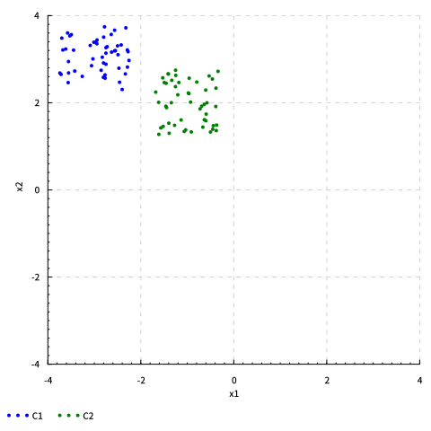
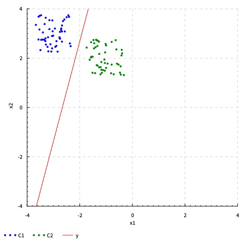
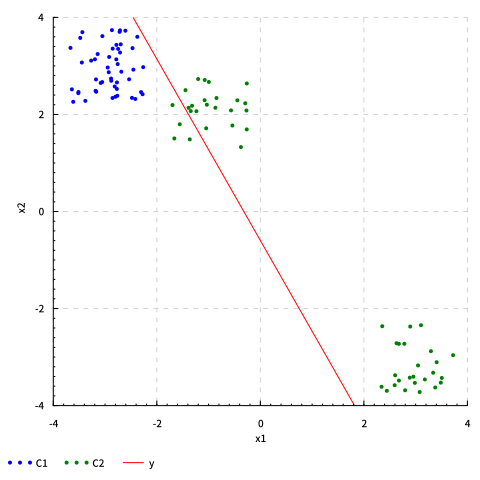
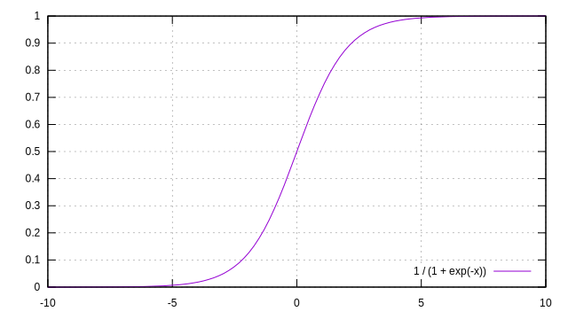
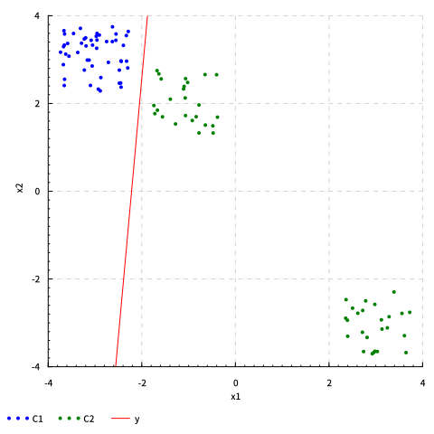

あけましたおめでとうございます (✿╹◡╹)ﾉ

2017年は、今まで通っていた `echo 6auY5bCCCg== | base64 -d` を卒業し、情報の大学に編入しました。編入1年目ということでなかなか他のことに手を出せないくらい忙しかったのは辛かったけれど、念願の CS 講義を受けられるようになりとても充実した1年だった気がします。

今学期履修している講義に「機械学習・パターン認識論」があります。先輩方からの評判も良く、自分自身興味があったこともあり、とても楽しいと感じている講義の1つです。とはいえ、やっぱり数式を眺めていても理解できる気がしないので、コードを書いてみることにしました。

<!--more-->

## 環境

流行りの言語やライブラリはいくつかありますが、どうもモチベが出ないので Haskell でやりました。ちょうどこの記事を書き始めてすぐに LTS Haskell 10.x (ghc-8.2.2) が出たみたいですが、今回はこれで。

- Arch Linux
- Stack (Version 1.6.1)
- LTS Haskell 9.18 (ghc-8.0.2)
    - Chart-1.8.2
    - hmatrix-0.18.0.0
    - hmatrix-gsl-0.18.0.1
    - random-1.1

## 雑なデータセットを作る

まずは乱数でデータセットを作り、それを Chart でプロットしてみます。

```haskell
import           Control.Monad                          (replicateM)
import           Graphics.Rendering.Chart.Backend.Cairo
import           Graphics.Rendering.Chart.Easy
import           System.Random

-- https://stackoverflow.com/a/13669958
instance (Random x, Random y) => Random (x, y) where
  randomR ((x1, y1), (x2, y2)) gen1 =
    let (x, gen2) = randomR (x1, x2) gen1
        (y, gen3) = randomR (y1, y2) gen2
    in  ((x, y), gen3)
  random = undefined

main :: IO ()
main = do
  c1 <- replicateM 50 $
    getStdRandom $ randomR ((-3.75, 2.25), (-2.25, 3.75)) :: IO [(Double, Double)]
  c2 <- replicateM 50 $
    getStdRandom $ randomR ((-1.75, 1.25), (-0.25, 2.75)) :: IO [(Double, Double)]

  let fo = def { _fo_size   = (480, 480)
               , _fo_format = SVG
               }

  toFile fo "dataset.svg" $ do
    layout_x_axis . laxis_generate .= scaledAxis def (-4, 4)
    layout_x_axis . laxis_title    .= "x1"
    layout_y_axis . laxis_generate .= scaledAxis def (-4, 4)
    layout_y_axis . laxis_title    .= "x2"

    setShapes [PointShapeCircle, PointShapeCircle]
    plot (points "C1" c1)
    plot (points "C2" c2)
```

出力された `dataset.svg` はこんな感じ。


この $C_1$ と $C_2$ を分類してみます。

## 最小二乗法でパラメータを求める

識別関数 $y(\boldsymbol{x})$ を次式で表すことにします。

$$
y(\boldsymbol{x}) = \boldsymbol{w}^\top \boldsymbol{x} + w_0
$$

ここで、$\boldsymbol{x}$ は入力ベクトル

$$
\boldsymbol{x} = (x_1, \dots, x_M)^\top
$$

$\boldsymbol{w}$ はパラメータベクトル

$$
\boldsymbol{w} = (w_1, \dots, w_M)^\top
$$

$w_0$ はバイアスパラメータです。

この識別関数が $y(\boldsymbol{x}) \ge 0$ となれば $C_1$ に、$y(\boldsymbol{x}) \lt 0$ となれば $C_2$ に属すとし、これを満たすような $\boldsymbol{w}$、$w_0$ を求めます。

まず、簡単化のため $y(\boldsymbol{x})$ を次のように変形。

$$
y(\boldsymbol{x}) = \tilde{\boldsymbol{w}}^\top \tilde{\boldsymbol{x}},\quad\tilde{\boldsymbol{w}} = (w_0, \boldsymbol{w}^\top)^\top,\quad\tilde{\boldsymbol{x}} = (1, \boldsymbol{x}^\top)^\top
$$

学習データ $\tilde{\boldsymbol{X}}$ と、それに対応する目的 (教師) ベクトル $\boldsymbol{t}$ を次のように定めると

$$
\begin{aligned}
  \tilde{\boldsymbol{X}} &= (\tilde{\boldsymbol{x}}_1, \dots, \tilde{\boldsymbol{x}}_N)^\top \\
         \boldsymbol{t}  &= (t_1, \dots, t_N)^\top \quad
             t_n =
               \begin{cases}
                  1,  & \tilde{\boldsymbol{x}}_n \in C_1 \\
                 -1,  & \tilde{\boldsymbol{x}}_n \in C_2
               \end{cases}
\end{aligned}
$$

パラメータベクトル $\tilde{\boldsymbol{w}}$ に関する2乗誤差関数 $E_D (\tilde{\boldsymbol{w}})$ は次のようになります。

$$
\begin{aligned}
  \boldsymbol{y}(\tilde{\boldsymbol{X}}) &=
    \begin{pmatrix}
      y(\tilde{\boldsymbol{x}}_1) \\
      \vdots              \\
      y(\tilde{\boldsymbol{x}}_N)
    \end{pmatrix}           \\
  E_D (\tilde{\boldsymbol{w}}) &= \frac{1}{2} (\boldsymbol{t} - \boldsymbol{y}(\tilde{\boldsymbol{X}}))^\top
                            (\boldsymbol{t} - \boldsymbol{y}(\tilde{\boldsymbol{X}}))                         \\
                       &= \frac{1}{2} (\boldsymbol{t} - \tilde{\boldsymbol{X}} \tilde{\boldsymbol{w}})^\top
                            (\boldsymbol{t} - \tilde{\boldsymbol{X}} \tilde{\boldsymbol{w}})                  \\
                       &= \frac{1}{2} (\boldsymbol{t}^\top \boldsymbol{t} - \boldsymbol{t}^\top \tilde{\boldsymbol{X}} \tilde{\boldsymbol{w}}
                            - \tilde{\boldsymbol{w}}^\top \tilde{\boldsymbol{X}}^\top \boldsymbol{t}
                            + \tilde{\boldsymbol{w}}^\top \tilde{\boldsymbol{X}}^\top \tilde{\boldsymbol{X}} \tilde{\boldsymbol{w}})
\end{aligned}
$$

この式が最小となる $\tilde{\boldsymbol{w}}$ を求めるため $\tilde{\boldsymbol{w}}$ で微分し

$$
\begin{aligned}
  \frac{\partial E_D(\tilde{\boldsymbol{w}})}{\partial \tilde{\boldsymbol{w}}} &=
    - \tilde{\boldsymbol{X}} ^ \top \boldsymbol{t} + \tilde{\boldsymbol{X}}^\top \tilde{\boldsymbol{X}} \tilde{\boldsymbol{w}}
\end{aligned}
$$

それを $0$ とおくとこうなります。

$$
\begin{aligned}
    \tilde{\boldsymbol{X}}^\top \tilde{\boldsymbol{X}} \tilde{\boldsymbol{w}} &= \tilde{\boldsymbol{X}} ^ \top \boldsymbol{t}     \\
    \tilde{\boldsymbol{w}} &= (\tilde{\boldsymbol{X}} ^ \top \tilde{\boldsymbol{X}}) ^ {-1} \tilde{\boldsymbol{X}} ^ \top \boldsymbol{t} \\
    \tilde{\boldsymbol{w}} &= \tilde{\boldsymbol{X}}^\dagger \boldsymbol{t}
\end{aligned}
$$

これを実装すればパラメータベクトルが求まりそうです。

ということで、まずは `c1` と `c2` から学習データ行列 `mx` と、それに対応する目的ベクトル `mt` をこんな感じで hmatrix のベクトル・行列にしてやります。

```haskell
let xs    = c1 ++ c2
    n     = length xs
    mx    = (n><3) $ concatMap (\(x1, x2) -> [1.0, x1, x2]) xs
    mt    = vector $ replicate (length c1)   1.0
                  ++ replicate (length c2) (-1.0)
```

パラメータベクトルは一般逆行列を求める hmatrix の関数 [`pinv`](https://hackage.haskell.org/package/hmatrix-0.18.1.0/docs/Numeric-LinearAlgebra.html#v:pinv) を使って次のようにも書けますが

```haskell
let mw    = pinv mx #> mt
```

最小二乗法を解く便利な [`(<\>)`](https://hackage.haskell.org/package/hmatrix-0.18.1.0/docs/Numeric-LinearAlgebra.html#v:-60--92--62-) 演算子があったのでこれを使いました。

```haskell
let mw    = mx <\> mt
```

パラメータベクトルが求まったので、今度は識別境界を引いてみます。識別関数を $y (\boldsymbol{x}) = 0$ として式を変形するとこんな感じになるので

$$
\begin{aligned}
  \tilde{\boldsymbol{w}}^\top \tilde{\boldsymbol{x}} &= 0 \\
  \tilde{w}_0 + \tilde{w}_1 \tilde{x}_1 + \tilde{w}_2 \tilde{x}_2 &= 0 \\
  \tilde{x}_2 &= \frac{- \tilde{w}_0 - \tilde{w}_1 \tilde{x}_1}{\tilde{w}_2}
\end{aligned}
$$

次のようなコードで $(-5, y(-5))$、$(5, y(5))$ となる2点を求め、それを結ぶ直線を描画しました。

```haskell
let x1hat = [-5.0, 5.0]
    x2hat = map (\xi -> (- (mw ! 0) - (mw ! 1) * xi) / (mw ! 2)) x1hat
    yhat  = zip x1hat x2hat

-- ...

toFile fo "ls1.svg" $ do
  layout_x_axis . laxis_generate .= scaledAxis def (-4, 4)
  layout_x_axis . laxis_title    .= "x1"
  layout_y_axis . laxis_generate .= scaledAxis def (-4, 4)
  layout_y_axis . laxis_title    .= "x2"

  setShapes [PointShapeCircle, PointShapeCircle]
  plot (points "C1" c1)
  plot (points "C2" c2)
  plot (line "y"  [yhat])
```

最終的なコードは[これ](https://gist.github.com/Tosainu/8df05092c75a53711efbda52ecec4c64)で、出力された `ls1.svg` はこんな感じになりました。$C_1$ と $C_2$ の間に、それっぽく境界線が引けました。



## ロジスティック回帰でパラメータを求める

データ点を生成している箇所をこんな感じに変更し、$C_2$ を $(-1, 2)$ 付近のほかに $(3, -3)$ 付近のデータを含むようにしてみます。

```haskell
-- ...
main :: IO ()
main = do
  c1 <- replicateM 50 $
    getStdRandom $ randomR ((-3.75, 2.25), (-2.25, 3.75)) :: IO [(Double, Double)]
  c21 <- replicateM 25 $
    getStdRandom $ randomR ((-1.75, 1.25), (-0.25, 2.75)) :: IO [(Double, Double)]
  c22 <- replicateM 25 $
    getStdRandom $ randomR ((2.25, -2.25), (3.75, -3.75)) :: IO [(Double, Double)]

  let c2    = c21 ++ c22
-- ...
 ```

すると、出力された画像はこんな感じになってしまいました。最小二乗法は与えた全てのデータに対しての誤差を最小にしようとするので、外れ値や他クラスのデータがあるとそれに影響されてしまうわけですね。



そこで、次に示すロジスティック関数 (シグモイド関数) $\sigma (a)$ を使って、識別境界からの距離を確率的な距離 $[0, 1]$ としてみます。

$$
\sigma (a) = \frac{1}{1 + \exp(- a)}
$$



ある入力データ $\tilde{\boldsymbol{x}}$ が与えられたとき、それが $C_1$ に属する確率を $p(1 | \tilde{\boldsymbol{x}})$、そうでない確率を $p(0 | \tilde{\boldsymbol{x}})$ とし、次のように定めます。このように、ある線形関数 $y$ をロジスティック関数で変形したモデルのことを一般化線形モデルと呼ぶらしいです。

$$
\begin{aligned}
  p(1 | \tilde{\boldsymbol{x}}) &= f (\tilde{\boldsymbol{x}}) = \sigma (y (\tilde{\boldsymbol{x}})) = \frac{1}{1 + \exp (- y (\tilde{\boldsymbol{x}}))} \\
  p(0 | \tilde{\boldsymbol{x}}) &= 1 - p(1 | \tilde{\boldsymbol{x}})
\end{aligned}
$$

では、学習データ $\tilde{\boldsymbol{X}}$、目的ベクトル $\boldsymbol{t}$、識別関数 $y (\tilde{\boldsymbol{x}})$ が次のように与えられたときのパラメータベクトル $\tilde{\boldsymbol{w}}$ を求めていきます。

$$
\begin{aligned}
  \tilde{\boldsymbol{X}} &= (\tilde{\boldsymbol{x}}_1, \dots, \tilde{\boldsymbol{x}}_N)^\top \\
         \boldsymbol{t}  &= (t_1, \dots, t_N)^\top \quad
             t_n =
               \begin{cases}
                 1,  & \tilde{\boldsymbol{x}}_n \in C_1 \\
                 0,  & \tilde{\boldsymbol{x}}_n \in C_2
               \end{cases} \\
  y (\tilde{\boldsymbol{x}}) &= \tilde{\boldsymbol{w}}^\top \tilde{\boldsymbol{x}}
\end{aligned}
$$

まず、先ほど示した確率の式は、次のようにも書けるので

$$
p(y | \tilde{\boldsymbol{x}}) = (f (\tilde{\boldsymbol{x}}))^y (1 - f(\tilde{\boldsymbol{x}}))^{1 - y}
$$

尤度関数 $L (\tilde{\boldsymbol{w}})$ と対数尤度 $\log L (\tilde{\boldsymbol{w}})$ を次のように表すことができます。

$$
\begin{aligned}
  L (\tilde{\boldsymbol{w}}) &= \prod_{i = 1}^{N} p (t_i | \tilde{\boldsymbol{x}}_i)  \\
                     &= \prod_{i = 1}^{N} (f (\tilde{\boldsymbol{x}}_i))^{t_i} (1 - f(\tilde{\boldsymbol{x}}_i))^{1 - t_i} \\
  \log L (\tilde{\boldsymbol{w}}) &= \sum_{i = 1}^{N} t_i \log f (\tilde{\boldsymbol{x}}_i)
                              + (1 - t_i) \log (1 - f(\tilde{\boldsymbol{x}}_i))
\end{aligned}
$$

この対数尤度が最大となるような $\tilde{\boldsymbol{w}}$ を求めることができれば良さそうです。

ということで、まずは $\sigma (x)$ を求める `sigmoid` と、それをベクトル・行列に適用する `sigmoid'` 関数をこんな感じに実装しました。[`cmap`](https://hackage.haskell.org/package/hmatrix-0.18.1.0/docs/Numeric-LinearAlgebra-Data.html#v:cmap) は、ベクトルや行列の全要素に任意の関数を適用できる関数です。

```haskell
sigmoid :: Floating a => a -> a
sigmoid x = 1.0 / (1.0 + exp (-x))

sigmoid' :: (Container c e, Floating e) => c e -> c e
sigmoid' = cmap sigmoid
```

パラメータベクトルは最小二乗法では求められない？ようなので、hmatrix-gsl パッケージの [`minimizeVD`](https://hackage.haskell.org/package/hmatrix-gsl-0.18.0.1/docs/Numeric-GSL-Minimization.html#v:minimizeVD) 関数を使って最急降下法で近似的に求めることにしました。

今回は最大化をしたいので、最小化したい関数には対数尤度に $- 1$ を掛けたものを

$$
\begin{aligned}
  ll (\tilde{\boldsymbol{w}}) &= - \log L (\tilde{\boldsymbol{w}}) \\
                      &= - \sum_{i = 1}^{N} t_i \log f (\tilde{\boldsymbol{x}}_i)
                         + (1 - t_i) \log (1 - f(\tilde{\boldsymbol{x}}_i))       \\
                      &= - \boldsymbol{t}^\top \log \boldsymbol{f} (\tilde{\boldsymbol{X}})
                         - (\boldsymbol{1} - \boldsymbol{t}) ^ \top \log (\boldsymbol{1} - \boldsymbol{f} (\tilde{\boldsymbol{X}}))
\end{aligned}
$$

勾配は、$\sigma' (a) = \sigma (a) (1 - \sigma (a))$ を用いて

$$
\begin{aligned}
  \frac{\partial ll (\tilde{\boldsymbol{w}})}{\partial \tilde{\boldsymbol{w}}} &=
       - \sum_{i = 1}^{N} \Big(\frac{t_i}{f (x_i)} - \frac{1 - t_i}{1 - f (x_i)} \Big)
           f (x_i) (1 - f (x_i)) \frac{\partial}{\partial \tilde{w}_i} \tilde{w}_i \tilde{x}_i  \\
    &= - \sum_{i = 1}^{N} (t_i (1 - f (x_i)) - (1 - t_i) f (x_i)) x_i \\
    &= - \sum_{i = 1}^{N} (t_i - f (x_i)) x_i \\
    &= \tilde{\boldsymbol{X}}^\top (\boldsymbol{f} (\tilde{\boldsymbol{X}}) - \boldsymbol{t})
\end{aligned}
$$

求めた2つの関数と適当なパラメータをこんな感じで渡してやります。

```haskell
let f   x   w = sigmoid' (x #> w)
    ll  x y w = -y <.> log (f x w) - (1 - y) <.> log (1 - f x w)
    dll x y w = tr x #> (f x w - y)

    (mw, p)  = minimizeVD SteepestDescent 10e-3 3000 10e-4 10e-4
                  (ll mx mt)
                  (dll mx mt)
                  (vector [1, 1, 1])
```

最終的なコードは[これ](https://gist.github.com/Tosainu/02784b8e1233158436e623633a2b50b5)で、出力された `logistic.svg` はこんな感じになりました。最小二乗法のときに発生した境界線の傾きはなく、いい感じに線が引けました。



## まとめ

Haskell で、2次元の線形分類器を最小二乗法、ロジスティック回帰の2手法で実装してみました。コードの実装とブログ記事にまとめる作業を通して、特にロジスティック回帰にあったモヤモヤを解決できたのは良かったなという感じです。

最終的には MNIST みたいな有名なデータセットを分類してみたりしたかったのですが、時間がなさそうなので断念。他クラス分類、パーセプトロン、SVM 等も一度実装してみたいけど...

## 参考文献

- 機械学習・パターン認識論 講義資料
- [Least squares in matrix form](http://global.oup.com/booksites/content/0199268010/samplesec3)
- [Generalized inverse - Wikipedia](https://en.wikipedia.org/wiki/Generalized_inverse)
- [Unsupervised Feature Learning and Deep Learning Tutorial](http://ufldl.stanford.edu/tutorial/supervised/LogisticRegression/)
