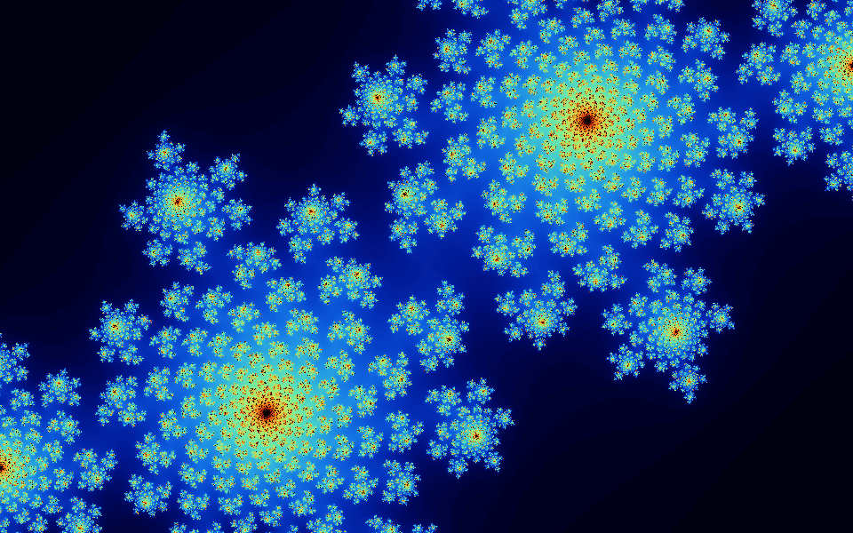
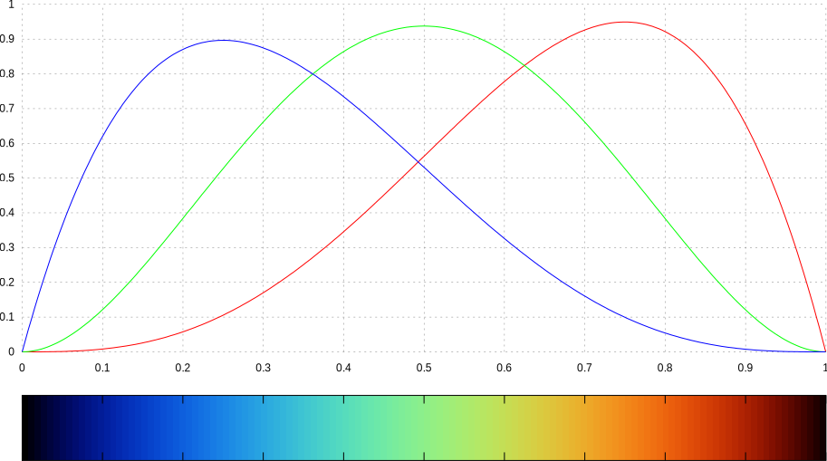
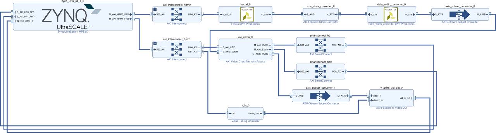
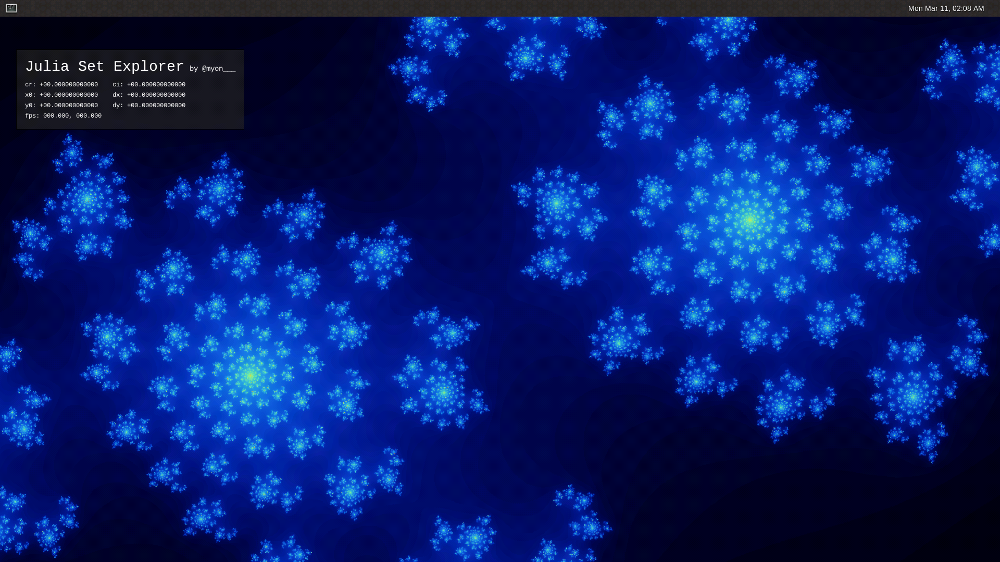

[Ultra96](https://www.96boards.org/product/ultra96/) というデバイスがあります。Ultra96 は Xilinx 社の [Zynq UltraScale+ MPSoC](https://www.xilinx.com/products/silicon-devices/soc/zynq-ultrascale-mpsoc.html) が載っている開発ボードで、[FPGA](https://en.wikipedia.org/wiki/Field-programmable_gate_array) 開発から最新の ARM 開発、Linux カーネルやそのデバイスドライバ開発なんかも学べて、しかも$249で入手できるというコスパの高い[^1]デバイスです。

[^1]: 学生が一度にポンと出すにはちょっと大変な価格かな... ラボのボスに頼んでみよう ヾ(๑╹◡╹)ﾉ"

今回いろいろあって Ultra96 で遊べる環境ができたので、Julia set を表示してぐりぐり動かせるやつを作ってみました。こんな感じです。

<blockquote class="twitter-tweet tw-align-center" data-lang="en"><p lang="ja" dir="ltr">当初の目標だった「Ultra96 に直接接続したゲームパッドでぐりぐり動かす」ができた ヾ(๑&gt;◡&lt;)ﾉ&quot; <a href="https://t.co/AMDp3hPPnz">pic.twitter.com/AMDp3hPPnz</a></p>&mdash; +。:.ﾟ٩(๑＞◡＜๑)۶:.｡+ﾟ (@myon___) <a href="https://twitter.com/myon___/status/1112762085799157763?ref_src=twsrc%5Etfw">April 1, 2019</a></blockquote>
<script async src="https://platform.twitter.com/widgets.js" charset="utf-8"></script>

関連するソースコードはほぼ全て [GitHub のリポジトリ](https://github.com/Tosainu/ultra96-fractal) に公開してあります。

まだ当初予定していた機能を実装しきれていなかったりしますが、とりあえずシステム全体とその開発方法などを紹介していきたいと思います。

<!--more-->

## Julia set

[Julia set](https://en.wikipedia.org/wiki/Julia_set) は[フラクタル](https://en.wikipedia.org/wiki/Fractal)として知られる図形の1つです。同様の図形だと [Mandelbrot set](https://en.wikipedia.org/wiki/Mandelbrot_set) のほうが有名かもしれませんが、個人的にはこっちのほうが好きです。

Julia set は、ある複素数の多項式関数 $f_c(z)$ に初期値 $z_0$ を与えて繰り返し適用したときに、収束する領域と発散する領域の境界になるような $z_0$ の集合のことらしいです。そして Julia set の描画は、画像の各ピクセルの座標値から $z_0$ を決めて、その値を $f_c(z)$ に与えて繰り返し適用したときの動きをもとに色を割り当てることで行います。

...といってもイメージしにくいので、有名な $f_c(z)$ である
$$
f_c(z) = z^2 + c
$$
を Rust で描いてみます。コードは [image crate の Example](https://github.com/image-rs/image#62-generating-fractals) で紹介されているものをベースにしました。

```rust
fn main() {
    // 画像のサイズ
    let (imgx, imgy) = (960, 600);
    // 最大反復回数
    let max_iter = 255;

    let x0 = 1.0;
    let y0 = imgy as f32 / imgx as f32;
    let dx = 2.0 * x0 / imgx as f32;
    let dy = 2.0 * y0 / imgy as f32;

    let mut imgbuf = image::ImageBuffer::new(imgx, imgy);

    for (x, y, pixel) in imgbuf.enumerate_pixels_mut() {
        // 定数 c
        let c = num_complex::Complex::new(-0.4, 0.6);

        // 初期値 z_0
        let cx = -x0 + dx * x as f32;
        let cy = -y0 + dy * y as f32;
        let z_0 = num_complex::Complex::new(cx, cy);

        // z_{i + 1} = z^2 + c を計算
        // |z| > 2.0 になったら "発散した" とする
        let mut z = z_0;
        let mut i = 0;
        while i < max_iter && z.norm() <= 2.0 {
            z = z * z + c;
            i += 1;
        }

        // 反復回数 i をベースに色つけ
        *pixel = colorize(i as f32 / max_iter as f32);
    }

    imgbuf.save("fractal.png").unwrap();
}

fn colorize(t: f32) -> image::Rgb<u8> {
    let m = std::u8::MAX as f32;
    let r = m * 9.0 * (1.0 - t) * t * t * t;
    let g = m * 15.0 * (1.0 - t) * (1.0 - t) * t * t;
    let b = m * 8.5 * (1.0 - t) * (1.0 - t) * (1.0 - t) * t;
    image::Rgb([r as u8, g as u8, b as u8])
}
```

これを実行するとこんな感じの画像が出力されます。



## FPGA で Julia set を描画する

前述したコードからもわかるように、Julia set の描画はそこそこの計算量があります。これをいかに速く計算するかは長く研究されているようで、いろいろなアプローチが見つかります。今回は Zynq UltraScale+ MPSoC のプログラマブルな回路側 (Programmable Logic, PL) に **Julia set の描画専用の回路を構築**することで高速に描画することを試みてみました。

### 高位合成 (High-level synthesis, HLS)

FPGA 開発というと、VHDL や Verilog HDL といった [Hardware description language (HDL)](https://en.wikipedia.org/wiki/Hardware_description_language) によって [Register-transfer level (RTL)](https://en.wikipedia.org/wiki/Register-transfer_level) の記述をするイメージが強いかもしれません。FPGA 開発全体でみればそのような言語を使った開発が一般的なのでしょうが、近年[高位合成 (High-level synthesis, HLS)](https://en.wikipedia.org/wiki/High-level_synthesis) と呼ばれる技術がある程度の実用レベルになりつつあり、これを利用した開発手法が話題になっています。

HLS は RTL より抽象度の高い言語によってハードウェアの設計を可能にする技術です。HLS にも様々な種類があるので一概にはいえませんが、この抽象度の高い言語とは C や Java のようなソフトウェア開発のためのプログラミング言語を指します。プログラミング言語で記述したアルゴリズムがどのようにハードウェア化されるかは[このへん](https://www.xilinx.com/support/documentation/sw_manuals/xilinx2018_3/ug902-vivado-high-level-synthesis.pdf#page=6)が参考になると思います。ソフトウェア向けのプログラミング言語を用いた記述を入力とする HLS はソフトウェアで実装されたアルゴリズムのハードウェア化をある程度容易にしたことから、特にハードウェアアクセラレータ実装をしている界隈などで注目されているなかなかホットな技術といってよいでしょう。

今回 Julia set を描画する回路を設計するにあたり、Xilinx 社が提供している HLS の開発環境である [Vivado HLS](https://www.xilinx.com/products/design-tools/vivado/integration/esl-design.html) を利用することにしました。理由としては、とりあえず動作するものを短期間で実装したかったのと、個人的に別の HLS 開発環境に触れていた経験があることから Xilinx の HLS についても調査したいという思いがあったためです。

### Vivado HLS で Julia set 描画回路を実装する

Vivado HLS は入力言語に C、C++、SystemC をサポートしています。今回は C++ で実装しました。最終的なソースコードは[これ](https://github.com/Tosainu/ultra96-fractal/tree/1ed4e5e409d6445a85741149c112322cc6fc251c/hls_ip/fractal)です。

Vivado HLS は思っていた以上に強かったようで、とりあえず適当に実装してみた Julia set のコードも普通に合成できてしまい驚きました。このため「アルゴリズムを FPGA に持っていく」点に関してはほとんど苦労することなく行うことができたと言って良いです。Vivado HLS すごい。ちなみにコミットログをたどったところ、開発初期のコードは[こんな感じ](https://github.com/Tosainu/ultra96-fractal/blob/9aeb006057254d9e9d859b307b64db8e86adc5ef/hls_ip/fractal/fractal.cc)だったようです。
```cpp
#include <cmath>
#include <complex>

#include "fractal.h"

uint24_type colorize(fix64_type t) {
  // https://solarianprogrammer.com/2013/02/28/mandelbrot-set-cpp-11/
  const fix64_type one{1.0};
  const fix64_type r = fix64_type{8.5} * (one - t) * (one - t) * (one - t) * t;
  const fix64_type g = fix64_type{15.0} * (one - t) * (one - t) * t * t;
  const fix64_type b = fix64_type{9.0} * (one - t) * t * t * t;

  uint24_type rgb = 0;
  rgb |= static_cast<uint24_type>(std::min(r, one) * fix64_type{255.0});
  rgb |= static_cast<uint24_type>(std::min(g, one) * fix64_type{255.0}) << 8;
  rgb |= static_cast<uint24_type>(std::min(b, one) * fix64_type{255.0}) << 16;
  return rgb;
}

void fractal(stream_type& m_axis) {
#pragma HLS INTERFACE axis register both port=m_axis
#pragma HLS INTERFACE s_axilite port=return

  const auto x1 = fix64_type{1.0};
  const auto y1 = fix64_type{MAX_HEIGHT} / fix64_type{MAX_WIDTH};
  const auto dx = fix64_type{2.0} * x1 / fix64_type{MAX_WIDTH};
  const auto dy = fix64_type{2.0} * y1 / fix64_type{MAX_HEIGHT};

  const auto offset_x = fix64_type{0};
  const auto offset_y = fix64_type{0};

  video_type video;

  for (std::uint32_t y = 0; y < MAX_HEIGHT; y++) {
    for (std::uint32_t x = 0; x < MAX_WIDTH; x++) {
      // Set Start-of-Frame (tuser) and End-of-Line (tlast) singale
      // https://forums.xilinx.com/t5/Video/Video-Beginner-Series-14-Creating-a-Pattern-Generator-using-HLS/m-p/895489/highlight/true#M21986
      if (x == 0 && y == 0) {
        video.user = 1;
      } else {
        video.user = 0;
      }
      if (x == MAX_WIDTH - 1) {
        video.last = 1;
      } else {
        video.last = 0;
      }

      const auto cx = -x1 + dx * x + offset_x;
      const auto cy = -y1 + dy * y + offset_y;

      auto z       = std::complex<fix64_type>{cx, cy};
      const auto c = std::complex<fix64_type>{-0.4, 0.6};

      std::uint32_t i = 0;
      while (i < MAX_ITERATIONS && z.real() * z.real() + z.imag() * z.imag() <= 4.0) {
        z = z * z + c;
        i++;
      }

      video.data = colorize(static_cast<fix64_type>(i) / fix64_type{255.0});

      m_axis << video;
    }
  }
}
```

もちろんこのままでは実用にならないほど性能が出ないためチューニングをする必要があります。今回はパイプライン化や並列化、固定小数点数の採用やループの反復回数の固定化など様々なチューニングを行いました。そのなかでも少し変わった例として、色つけ処理部分 (前述した Rust や C++ コード中の `colorize` 関数) に適用した手法を紹介しようと思います。

色つけ処理は反復回数 [0, 255] に RGB の色を割り当てるものです。RGB の各チャンネルの値は、反復回数 $i$ を最大反復回数 255 で割った [0, 1.0] の値 $t$ を次の3つの関数に渡すことで求めています。
$$
\begin{aligned}
    r(t) &= 9 (1 - t) t^3 \\
    g(t) &= 15 (1 - t)^2 t^2 \\
    b(t) &= 8.5 (1 - t)^3 t
\end{aligned}
$$


この関数は見ての通り乗算が多く、そのまま FPGA に落とせば計算に必要なクロックサイクル数は増えるし貴重な FPGA のリソースを大量に消費するしでなにもいいことがありません。今回これらの関数に与えられうる値は $\cfrac{0}{255}, \cfrac{1}{255}, \cfrac{2}{255}, \dots, \cfrac{255}{255}$ と決まっているので定数化が可能ですが、流石に手作業で 256 個の値を計算しハードコーディングするのは面倒だしメンテナンス性も下がって最悪です。

そこで、Vivado HLS で C++11 の機能がある程度利用可能[^3]なことを活用 (悪用？) し、**`constexpr` を使った色変換テーブルのコンパイル時計算**をやってみました。

[^3]: プロジェクト設定で `CFLAGS` に `-std=c++11` を設定する。ベースとなっているコンパイラもあまり新しいものではないようなので、`-std=c++17`、`-std=c++14`、`-std=c++1y` とかはもちろんダメだったし、C++11 の機能にも未対応なものがいくつかあったりする。C/RTL co-simulation が動作しなくなる副作用もある

まず `colorize` 関数を `constexpr` 化します。C++11 なので `constexpr` な関数の中身が `return` 文1つしか書けない点や `constexpr` な [`std::min`](https://en.cppreference.com/w/cpp/algorithm/min) などがないことに注意します。
```cpp
namespace detail {

template <class T>
constexpr T constexpr_min(T a, T b) {
  return a < b ? a : b;
}

constexpr std::uint32_t f2i(double d) {
  return static_cast<std::uint32_t>(constexpr_min(d, 1.0) * 255.0);
}

constexpr std::uint32_t colorize(double t) {
  return (f2i(9.0 * (1.0 - t) * t * t * t) << 16) |                // red
         (f2i(8.5 * (1.0 - t) * (1.0 - t) * (1.0 - t) * t) << 8) | // blue
         (f2i(15.0 * (1.0 - t) * (1.0 - t) * t * t));              // green
}

constexpr std::uint32_t index2color(std::size_t i) {
  return colorize(static_cast<double>(i) / 255.0);
}

} // namespace detail
```

続いて反復回数から RGB 値を求める色変換テーブルを構築する部分を書いていきます。こんな感じのコードで各要素が `index2color(index)` となる配列 `color_table` をコンパイル時に構築できるようにするのが目標です。
```cpp
constexpr std::array<std::uint32_t, 256> make_color_table() {
  return detail::make_array<256>(detail::index2color);
}

static constexpr auto color_table = make_color_table();
```

`detail::make_array<N>` を実装するのに [std::make_integer_sequence](https://en.cppreference.com/w/cpp/utility/integer_sequence) があると便利なのですが、C++11 の標準ライブラリには入っていないので、まずそれ相当のものを自分で実装します。
```cpp
namespace detail {

template <std::size_t... Values>
struct index_sequence {};

template <std::size_t N, std::size_t... Values>
struct index_sequence_impl : index_sequence_impl<N - 1, N - 1, Values...> {};

template <std::size_t... Values>
struct index_sequence_impl<0, Values...> {
  using type = index_sequence<Values...>;
};

template <std::size_t N>
using make_index_sequence = typename index_sequence_impl<N>::type;

} // namespace detail
```
この `make_index_sequence<N>` は `index_sequence<0, 1, 2, ..., N - 1>` を作るためのもので、コンパイル時に `0` ~ `N - 1` の数値が欲しいときに使います。
```cpp
template <std::size_t... Indeces>
constexpr auto foo_impl(index_sequence<Indeces...>) {
  // Indeces... が 0, 1, 2, ..., N - 1 になる
  return std::make_tuple(Indeces...);
}

template <std::size_t N>
constexpr auto foo() {
  return foo_impl(make_index_sequence<N>{});
}

foo<4>(); // => std::tuple<std::size_t>{0, 1, 2, 3};
```

これを使うと `detail::make_array` をこんな感じに実装できます。C++11 には[関数の返り値の型推論](https://en.cppreference.com/w/cpp/language/function#Return_type_deduction)もないのでそれっぽい返り値の型も書いてやる必要があります。
```cpp
namespace detail {

template <class Function, std::size_t... Indeces>
constexpr auto make_array_impl(Function f, index_sequence<Indeces...>)
    -> std::array<typename std::result_of<Function(std::size_t)>::type, sizeof...(Indeces)> {
  return {{f(Indeces)...}};
}

template <std::size_t N, class Function>
constexpr auto make_array(Function f)
    -> std::array<typename std::result_of<Function(std::size_t)>::type, N> {
  return make_array_impl(f, make_index_sequence<N>{});
}

} // namespace detail
```

これらをまとめたソースコードが[こちら](https://github.com/Tosainu/ultra96-fractal/blob/1ed4e5e409d6445a85741149c112322cc6fc251c/hls_ip/fractal/color_table.h)です。C++11 のためコードは長くなったものの、カラーパレットの変更は `constexpr` 化された `colorize` 関数を変更するだけでテーブル構築はコンパイラが勝手にやってくれるようになりましたし、構築された色変換テーブルはただの配列なので、その要素を参照する処理は FPGA デザイン上で ROM から値を1つ読むだけの軽い処理に展開されたりと、とても効果のあったチューニングでした。**C++ メタプロは FPGA 開発にも役立ちます！**[^4]

[^4]: ネタ性が高いだけで実際あんまり嬉しくない

チューニングの結果、実装した回路は 1920px x 1080px の Julia set を 約 6 fps で描画できるようになりました。ただ僕の Vivado HLS 力が足りず、当初計画していた「ぼくの考えたさいきょうの Julia set レンダリングパイプライン」になっていないので、また時間があればより高速な実装に挑戦してみたいと思っています。

### ブロックデザイン

ここまでで Julia set を描画するための回路の設計ができました。しかし、実際に動作させるためには様々な周辺回路が必要です。特に今回は Zynq UltraScale+ MPSoC のプロセッサ側 (Processing System, PS) も利用したいので、実装した Julia set 描画回路を PS から制御できるようにしたり、描画した Julia set の画像を PS から取得できるようにする必要があります。今回は Xilinx 社が提供する設計ツールである [Vivado](https://www.xilinx.com/products/design-tools/vivado.html) の IP Integrator を使ってシステム全体 (Julia set 描画回路とその周辺回路) の設計を行いました。

IP は Intellectual Property の略で、再利用可能な回路デザインのことを指します。ソフトウェア開発で例えるならライブラリのようなものでしょうか。そして最近の FPGA 開発ツールは様々な IP を GUI 上で配置・接続することで目的のシステムを開発する機能を搭載しているものがあり、Vivado では IP Integrator がそれに当たります。IP Integrator で作成したデザインはブロックデザインと呼ばれています。

今回作成した Julia set explorer のブロックデザインは次のようになっています。表示されているものは簡略化されたもので、クリックすると Vivado から直接出力した詳細なものが表示されます。
[](bd.pdf)

`fractal_0` が Vivado HLS で出力した Julia set 描画回路の IP で、`m_axis` がその出力ポートです。出力された画像の信号は、周波数の調整やデータの簡単な下処理を行うための IP を通したうえで、[AXI Video DMA (AXI VDMA)](https://www.xilinx.com/products/intellectual-property/axi_video_dma.html) という IP に接続されています。この IP は Vivado にバンドルされているもので、ストリーム形式の映像データをメモリへ転送したり、逆にメモリから映像を読み出してストリーム形式で出力するものです。今回は描画した Julia set の画像をメモリに書き込み、PS からその画像を読み出せるようにする役割があります。

上のデモでは使っていませんが、今回のブロックデザインには PL から直接 [Zynq UltraScale+ MPSoC の DisplayPort Controller](https://www.xilinx.com/support/documentation/user_guides/ug1085-zynq-ultrascale-trm.pdf#page=919) に映像を送り込むための回路も組み込まれています。ブロックデザインの右下あたりの IP がそれにあたります。下の tweet をしていた時期の実装では、この部分の回路を使った映像の出力をしていました。
<blockquote class="twitter-tweet tw-align-center" data-lang="en"><p lang="ja" dir="ltr">Ultra96 で Julia set 描くやつ、6fps くらい出るようになったり、いろんなの描けるようになった <a href="https://t.co/iTE2lkyyVs">pic.twitter.com/iTE2lkyyVs</a></p>&mdash; +。:.ﾟ٩(๑＞◡＜๑)۶:.｡+ﾟ (@myon___) <a href="https://twitter.com/myon___/status/1099649604088254464?ref_src=twsrc%5Etfw">February 24, 2019</a></blockquote>
<script async src="https://platform.twitter.com/widgets.js" charset="utf-8"></script>

## Ultra96 向け Linux のブートイメージを作る

PL の実装ができたので、今度は PS で動かすソフトウェアの実装をしていきます。

Xilinx の開発環境では、ベアメタル、FreeRTOS、Linux の開発を公式でサポートしているようです。当初はベアメタルでやっていこうと思っていたのですが、

- USB 接続のゲームパッドでぐりぐり動かしたい
- 現在の状況をカッコイイ感じでオーバーレイ表示したい
- ベアメタル開発時に提供されるライブラリが好きになれず規模の大きなコードを書く気になれなかった

という気持ちになってきたので Linux を利用することにしました。実装に必要な知識は多くなるけれども、ゲームパッドや GPU など各種デバイスドライバが提供されることや、普段から慣れた環境が利用できるメリットのほうが大きいと考えたためです。個人的に低レイヤ Linux に関する知識を付けていきたいなと思っていたのもあります。

### PetaLinux Tools で Ultra96 向けプロジェクトを作る

[PetaLinux Tools](https://www.xilinx.com/products/design-tools/embedded-software/petalinux-sdk.html) は Xilinx デバイスの PS 向け組み込み Linux 開発ツール群です。ブートローダ、カーネル、ライブラリ、アプリケーションの設定・ビルドおよびブートイメージの生成などを全てやってくれます。

Ultra96 向け PetaLinux プロジェクトの作成は、[ここ](http://zedboard.org/support/design/24166/156) で公開されている Board Support Packages (BSP) を利用するのが簡単そうです。しかし表示されているバージョンが v2018.2 と古かったりして心配だったので、展開した BSP の中身を参考にしながら自分で設定することにしました。

といっても必要な手順はそんなに多くありません。まず以下のコマンドでプロジェクトを作成します。

    $ petalinux-create --type project --template zynqMP --name <project-name>
    $ cd <project-name>
    $ petalinux-config --get-hw-description=<path-to-hdf-dir>

最後の `petalinux-config` を実行すると、Linux カーネルで `make menuconfig` したときのような画面が出てくるので以下の値を設定します。

    DTG Settings  --->
        (zcu100-revc) MACHINE_NAME
    u-boot Configuration  --->
        (xilinx_zynqmp_zcu100_revC_defconfig) u-boot config target

これらの値を設定することで、Ultra96 向けの Devicetree などが読み込まれるようになります。この変化のわかりやすい例としては、無線 LAN やオンボード LED がちゃんと認識されるなどがあります。

## Linux からいい感じに画像を取得できるようにする

Ultra96 の Linux 開発環境ができたので、次は Linux からいい感じに Julia set 描画回路を制御するためのデバイスドライバを実装していきます。方針としては Julia set 描画回路をカメラのような映像入力デバイスとして扱えるようにし、V4L2 の API でデバイスの制御と生成された画像の取得ができるようにする、という感じです。

### Xilinx Video IP driver

さてデバイスドライバを実装するといっても、僕はデバイスドライバどころか Linux のカーネルモジュールすらまともに書いたことがなく、何もわかりません。それなのに Xilinx 特有のたくさんの PDF なドキュメントの中に Linux のデバイスドライバ実装に関するものは全くと言っていいほどなく、とても困ってしまいました。

それからいろいろ調べていって参考になったのが Xilinx の Linux カーネルのリポジトリ [Xilinx/linux-xlnx](https://github.com/Xilinx/linux-xlnx) です。追加されている Xilinx プラットフォーム特有のデバイスドライバの実装やそれらについてのドキュメントがとても参考になりました。特に今回のデバイスドライバ実装には

- [drivers/media/platform/xilinx/xilinx-tpg.c](https://github.com/Xilinx/linux-xlnx/blob/xilinx-v2018.3/drivers/media/platform/xilinx/xilinx-tpg.c)
    - Test Pattern Generator (TPG) のデバイスドライバ
    - ほぼ同じ動作をするデバイスであったため
    - 実装したコードもだいたい同じ感じになっている
- [Documentation/devicetree/bindings/media/xilinx/](https://github.com/Xilinx/linux-xlnx/tree/xilinx-v2018.3/Documentation/devicetree/bindings/media/xilinx)
    - Xilinx Video IP 関連の Devicetree の記述に関するドキュメント

あたりをよく参照していた記憶があります。

### デバイスドライバを実装する

ということでデバイスドライバを実装しました。最終的なコードは[ここ](https://github.com/Tosainu/ultra96-fractal/blob/1ed4e5e409d6445a85741149c112322cc6fc251c/petalinux_project/project-spec/meta-user/recipes-modules/kernel-module-fractal/files/fractal.c)です。

今回は [Platform device API](https://lwn.net/Articles/448499/) と呼ばれるものを使って実装していきます。Platform device のドライバ実装でまず必要となるのがデバイスの初期化のための処理 (`probe`) と取り外された (？) ときの処理 (`remove`) です。これらの処理の登録は、必要な関数を実装し、その関数ポインタなどを対応するメンバに指定した [`struct platform_driver`](https://elixir.bootlin.com/linux/v4.14/source/include/linux/platform_device.h#L180) 型の変数を [`module_platform_driver()`](https://elixir.bootlin.com/linux/v4.14/source/include/linux/platform_device.h#L227) マクロに渡せばいいようです。

```c
static int fractal_probe(struct platform_device *dev)
{
	// なんか実装
}

static int fractal_remove(struct platform_device *dev)
{
	// なんか実装
}

static const struct of_device_id fractal_of_id_table[] = {
	{ .compatible = "xlnx,fractal-1.0" },
	{ }
};
MODULE_DEVICE_TABLE(of, fractal_of_id_table);

static struct platform_driver fractal_driver = {
	.driver = {
		.name = "fractal",
		.of_match_table = fractal_of_id_table,
	},
	.probe = fractal_probe,
	.remove = fractal_remove,
};

module_platform_driver(fractal_driver);
```

`probe` に登録した関数 `fractal_probe` では、大きく分けて3つの処理を行っています。

1. ドライバ内で利用するメモリ領域の確保
2. デバイスのレジスタにアクセスするための準備
3. V4L2 デバイスのための初期化

まずメモリ領域の確保です。今回実装したデバイスドライバ内で扱うデータとしてこんな感じの構造体を定義したので、
```c
struct fractal_device {
	struct device *dev;
	void __iomem *iomem;
	struct clk *clk;

	struct v4l2_subdev subdev;
	struct v4l2_mbus_framefmt format;
	struct media_pad pads[1];
};
```
こんな感じのコードでメモリ領域を確保することにしました。
```c
static int fractal_probe(struct platform_device *dev)
{
	struct fractal_device *fractal;

	fractal = devm_kzalloc(&dev->dev, sizeof *fractal, GFP_KERNEL);
	if (!fractal)
		return -ENOMEM;
```

続いて、`fractal->iomem` からデバイスのレジスタ ([MMIO](https://en.wikipedia.org/wiki/Memory-mapped_I/O) なデバイスになっている) にアクセスできるようにします。こんな感じにすればいいようです。
```c
	struct resource *res;
	int ret;

	res = platform_get_resource(dev, IORESOURCE_MEM, 0);
	fractal->iomem = devm_ioremap_resource(fractal->dev, res);
	if (IS_ERR(fractal->iomem))
		return PTR_ERR(fractal->iomem);
```
これで `fractal->iomem` 経由でデバイスのレジスタにアクセスできるようになったので、例えば `ctrl` レジスタの `START` ビットと `AUTO_RESTART` ビットをセットするならこんな感じでできるようになります。
```c
#define FRACTAL_REG_CTRL		0x0
#define FRACTAL_REG_CTRL_START		BIT(0)
#define FRACTAL_REG_CTRL_DONE		BIT(1)
#define FRACTAL_REG_CTRL_IDLE		BIT(2)
#define FRACTAL_REG_CTRL_READY		BIT(3)
#define FRACTAL_REG_CTRL_AUTO_RESTART	BIT(7)

static inline void fractal_write(struct fractal_device *dev, u32 addr, u32 value)
{
	iowrite32(value, dev->iomem + addr);
}

static inline void fractal_set(struct fractal_device *dev, u32 addr, u32 value)
{
	fractal_write(dev, addr, fractal_read(dev, addr) | value);
}

fractal_set(fractal, FRACTAL_REG_CTRL,
	    FRACTAL_REG_CTRL_AUTO_RESTART |
	    FRACTAL_REG_CTRL_START);
```

ちなみに、ここまでで登場した [`devm_kzalloc`](https://elixir.bootlin.com/linux/v4.14/source/include/linux/device.h#L660) や [`devm_ioremap_resource`](https://elixir.bootlin.com/linux/v4.4/source/lib/devres.c#L134) などの `devm_xxx` 系の関数は [Managed resource API](https://lwn.net/Articles/222860/) と呼ばれるもので、この関数を使って確保した各種リソースはデバイスドライバがアンロードされたときに自動で解放してくれるそうです。便利。

最後に V4L2 関連の初期化です。これも流れとしては必要な値を設定したり、各種必要な処理を実装してその関数ポインタを渡すというもので、だいたいこんな感じになりました。
```c
static int fractal_s_stream(struct v4l2_subdev *subdev, int enable)
{
	// なんか実装
}

static const struct v4l2_subdev_core_ops fractal_core_ops = {
	// ...
};

static const struct v4l2_subdev_video_ops fractal_video_ops = {
	.s_stream = fractal_s_stream,
};

static const struct v4l2_subdev_pad_ops fractal_pad_ops = {
	// ...
};

static const struct v4l2_subdev_ops fractal_ops = {
	.core   = &fractal_core_ops,
	.video  = &fractal_video_ops,
	.pad    = &fractal_pad_ops,
};

static int fractal_probe(struct platform_device *dev)
{
	struct v4l2_subdev *subdev;

	// その他の設定 ...

	subdev = &fractal->subdev;
	v4l2_subdev_init(subdev, &fractal_ops);

	// その他の設定 ...
}
```
`s_stream` はストリーミングの開始・終了時 ([`ioctl VIDIOC_STREAMON`, `ioctl VIDIOC_STREAMOFF`](https://www.kernel.org/doc/html/v4.14/media/uapi/v4l/vidioc-streamon.html)) に呼ばれる関数です。今回実装した Julia set 描画回路は描画の開始と終了を制御してやる必要があるので、このように実装しました。ストリーミングの開始時には、適用な初期値の設定も行っています。
```c
static inline struct fractal_device
*get_fractal_device(struct v4l2_subdev *subdev)
{
	return container_of(subdev, struct fractal_device, subdev);
}

static int fractal_s_stream(struct v4l2_subdev *subdev, int enable)
{
	struct fractal_device *fractal = get_fractal_device(subdev);

	if (enable) {
		fractal_write(fractal, FRACTAL_REG_X0, 0x10000000u);
		fractal_write(fractal, FRACTAL_REG_Y0, 0x09000000u);
		fractal_write(fractal, FRACTAL_REG_DX, 0x00044444u);
		fractal_write(fractal, FRACTAL_REG_DY, 0x00044444u);
		fractal_write(fractal, FRACTAL_REG_CR, 0xf9999999u);
		fractal_write(fractal, FRACTAL_REG_CI, 0x09999999u);

		fractal_set(fractal, FRACTAL_REG_CTRL,
			    FRACTAL_REG_CTRL_AUTO_RESTART |
			    FRACTAL_REG_CTRL_START);
	} else {
		fractal_clr(fractal, FRACTAL_REG_CTRL,
			    FRACTAL_REG_CTRL_AUTO_RESTART |
			    FRACTAL_REG_CTRL_START);
	}

	return 0;
}
```

このほか、`fractal_pad_ops` の `enum_mbus_code`、`enum_frame_size`、`get_fmt`、`set_fmt` が実装されています。実装といっても、今回は画像フォーマットは固定であるなどの理由からなにか特別な処理を実装したわけではないので、ここでは省略します。

### Devicetree の設定

[Devicetree](https://www.devicetree.org/) は、(ソフトウェアから直接探索できない) デバイスのプロパティや接続関係の詳細を記述するためのものだそうです。従来 OS の実装にハードコーディングしていたデバイス固有のパラメータを Devicetree に切り離すことで、OS をより汎用的なコードで実装できるようにするのが狙いだそうです。デバイスドライバの実装の際に MMIO なレジスタをマッピングするなどを行いましたが、ここで必要になる MMIO のアドレスなんかも Devicetree に記述される情報だったりします。ARM の Linux は Devicetree を活用しているものの1つで、今回 Linux に実装したデバイスを認識させるにあたって Devicetree の設定がいくつか必要になります。

PetaLinux Tools を使った開発では、Devicetree の設定を PetaLinux Tools が自動生成した Devicetree に必要に応じてノードの追加・上書きなどをすることによって行うようです。PetaLinux Tools が生成した Devicetree は `components/plnx_workspace/device-tree/device-tree/` にあります。例えば PL 上の回路に関連するものは `pl.dtsi` に記述されていて、今回実装した Julia set 描画回路に対応するものはこんな感じになっていました。
```dts
fractal_0: fractal@a0000000 {
	clock-names = "ap_clk";
	clocks = <&misc_clk_1>;
	compatible = "xlnx,fractal-1.0";
	interrupt-names = "interrupt";
	interrupt-parent = <&gic>;
	interrupts = <0 89 4>;
	reg = <0x0 0xa0000000 0x0 0x10000>;
	xlnx,s-axi-ctrl-addr-width = <0x6>;
	xlnx,s-axi-ctrl-data-width = <0x20>;
};
```
この生成された Devicetree へのノードの追加・上書きは `project-spec/meta-user/recipes-bsp/device-tree/files/system-user.dtsi` によって行います。例えば前述した `fractal_0` に `hello = "world";` というプロパティを追加したいときはこのような記述を追加します。
```dts
&fractal_0 {
	hello = "world";
}
```

さて、今回 Devicetree に追加しなければいけないのが

- [Xilinx Video IP Pipeline (VIPP)](https://github.com/Xilinx/linux-xlnx/blob/xilinx-v2018.3/Documentation/devicetree/bindings/media/xilinx/xlnx,video.txt) ノード
- 映像処理関連 IP が持つ入出力ポート
- 各種 IP と VIPP の入出力ポートの接続関係

です。とりあえず今回記述した `system-user.dtsi` が[こんな感じ](https://github.com/Tosainu/ultra96-fractal/blob/1ed4e5e409d6445a85741149c112322cc6fc251c/petalinux_project/project-spec/meta-user/recipes-bsp/device-tree/files/system-user.dtsi)になりました。
```dts
&fractal_0 {
	ports {
		#address-cells = <1>;
		#size-cells = <0>;

		port@0 {
			reg = <0>;
			fractal_0_out_0: endpoint {
				remote-endpoint = <&vcap_0_in_0>;
			};
		};
	};
};

&amba_pl {
	vcap_0: video_cap {
		compatible = "xlnx,video";
		dmas = <&axi_vdma_0 1>;
		dma-names = "port0";

		ports {
			#address-cells = <1>;
			#size-cells = <0>;

			port@0 {
				reg = <0>;
				direction = "input";
				vcap_0_in_0: endpoint {
					remote-endpoint = <&fractal_0_out_0>;
				};
			};
		};
	};
};
```
`vcap_0` が VIPP ノードです。このノードの `compatible` には `xlnx,video` を指定します。また `dmas` に利用する DMA とその Channel ID を指定します。Stream ID は、[AXI VDMA の場合](https://github.com/Xilinx/linux-xlnx/blob/xilinx-v2018.3/Documentation/devicetree/bindings/dma/xilinx/xilinx_dma.txt#L105-L112) 0 が Read channel、1 が Write channel に対応します[^dtvdma]。

[^dtvdma]: リンク先のドキュメントは微妙に違っていて、たぶん write/tx → read/tx、read/rx → write/rx が正しい。

デバイスの入出力ポートは `ports` ノード下に記述します。この辺の設定に関しては[ここ](https://github.com/Xilinx/linux-xlnx/blob/xilinx-v2018.3/Documentation/devicetree/bindings/media/video-interfaces.txt)を参考にすればよいでしょう。今回は `fractal_0`、`vcap_0` ともに入力または出力のポートの1つしかないなので `port@0` のみを記述し、それぞれ `remote-endpoint` にポートの接続先を指定してやりました。

### ブート時にドライバが読み込まれるようにする

デバイスドライバは PetaLinux プロジェクトのディレクトリで `petalinux-create --type modules` コマンドを実行することでプロジェクトに追加したカーネルモジュールとして実装しました。しかしこの追加したカーネルモジュールなのですが、`petalinux-config -c rootfs` で開いたメニューから有効にするだけでは、ビルドはされるもののブート時に自動で読み込まれるようになってくれませんでした。

追加したカーネルモジュールをブート時に自動的に読み込まれるようにするには、プロジェクトの `project-spec/meta-user/conf/petalinuxbsp.conf` に以下の行を追加する必要があるようです。

```conf
KERNEL_MODULE_AUTOLOAD_append = " <module-name>"
```

ちなみに、この `KERNEL_MODULE_AUTOLOAD` に関するドキュメントは[ここ](https://www.yoctoproject.org/docs/2.4/ref-manual/ref-manual.html#migration-1.7-kernel-module-autoloading)にあります。PetaLinux が Yocto Project をベースにしている (？) ためかこのあたりの設定項目のドキュメントは Yocto Project 側にあることも多く、調べるのが少し大変でした。

## 描画した Julia set をカッコよく表示できるようにする

最後に PL で描画した Julia set を表示したりゲームパッドで操作するためのアプリケーションを実装しました。実装したコードが[これ](https://github.com/Tosainu/ultra96-fractal/blob/1ed4e5e409d6445a85741149c112322cc6fc251c/petalinux_project/project-spec/meta-user/recipes-apps/fractal-explorer/files/main.cc)[^6]で、動作している様子がこんな感じです。ウィンドウ全体に描画した Julia set を表示しつつ、左上に Julia set のパラメータを表示しています[^7]。


[^6]: いきあたりばったりな実装をしていてアレなことになっているのでなんとかしたい...

[^7]: 現時点では未実装で、表示されているのは適当な値

### ディスプレイドライバと X11 の相性が悪い問題

上のスクリーンショットで気づいた方もいるかもしれませんが、今回 [Wayland](https://wayland.freedesktop.org/) な Window Manager (WM) である [Weston](https://gitlab.freedesktop.org/wayland/weston/) を使っています。Wayland な WM を利用しているのは、X11 な WM ではなぜか性能が全く出てくれなかったためです。画面のチラつき・カクつきといった現象がみられたり、OpenGL ES 2.0 版の glmark2 を試すと良くても十数 fps 程度しか出なかったりと、とても許容できるものではありませんでした。この問題に悩んでいるときたまたま [Zynq UltraScale+MPSoC で Wayland が利用できるという情報](https://xilinx-wiki.atlassian.net/wiki/spaces/A/pages/18841928/Xilinx+MALI+driver)[^xilwiki]を見つけ試してみたら X11 よりはかなりマシに動作してくれることがわかり、じゃあ Wayland にするかーとなった感じです。

[^xilwiki]: Xilinx Wiki ってしょっちゅう403になってこまる...

紹介したリンク先にあるように、PetaLinux で Weston を組み込んだイメージを作るには `project-spec/meta-user/conf/petalinuxbsp.conf` に次の行を追加すればいいようです。
```conf
DISTRO_FEATURES_append = " wayland"
IMAGE_INSTALL_append = " packagegroup-petalinux-weston"
```
さらに X11 関連のパッケージが完全に不要であれば、同ファイルに
```conf
DISTRO_FEATURES_remove = " x11"
```

も追加すると、作成されるイメージがより小さくなって良さそうです。

WM に Wayland なものを採用したため、実装するアプリケーションも Wayland に対応したものでなければいけません。今回は複雑な UI を持ったものを作る予定がなかったことや、起動イメージをできる限り小さくしたかったことから、`wayland-client.h` の関数を直接利用し Wayland client を実装しました。

### V4L2 でキャプチャした画像を低遅延で表示したい

単に PL で生成した画像を表示したいだけであれば、前述した Zynq UltraScale+ MPSoC の DisplayPort Controller に直接映像を流し込む方法などが良さそうです。しかし今回は描画した Juia set の上からステータス表示などを合成したかったため、OpenGL ES 2.0 を使った画像の表示とステータス表示の合成を行うことにしました[^9]。

[^9]: Zynq UltraScale+ MPSoC の DisplayPort Controller 自体に映像の合成機能があるのでこれが使えないかなーと思ったのですが、Linux からやろうとするとちょっと難しそうだったのと、ベアメタル実装でいろいろ検証していたときに[検討していたパターンで上手く行かなかったりした](https://twitter.com/myon___/status/1080115506093338627)のでやめました

この方針で実装するにあたり、特にソフトウェア側で発生する遅延を最小限にするためにいくつかの工夫が必要でした。

OpenGL を使って画像を表示したい場合、まず GPU 側に画像を転送する必要があります。例えば以下のような画像データ `image` がある場合、
```c
GLubyte image[width * height * 4];
```
これを GPU に転送するコードは [`glTexImage2D`](https://www.khronos.org/registry/OpenGL-Refpages/es2.0/xhtml/glTexImage2D.xml) や [`glTexSubImage2D`](https://www.khronos.org/registry/OpenGL-Refpages/es2.0/xhtml/glTexSubImage2D.xml) などを使えばよく、だいたいこんな感じになります[^10]。
```c
GLuint texture;
glGenTextures(num_buffers, &texture);

glBindTexture(GL_TEXTURE_2D, texture);
glTexImage2D(GL_TEXTURE_2D,
    0, GL_RGBA, width, height, 0, GL_RGBA, GL_UNSIGNED_BYTE, image);
glBindTexture(GL_TEXTURE_2D, 0);
```

[^10]: 細かな処理を省いているのでこのコードはコピペではたぶん動きません

「なら V4L2 でキャプチャした画像を表示するのも簡単じゃん！」とこんな感じの実装[^11]をすると...
```c
// テクスチャの初期化
GLuint texture;
glGenTextures(num_buffers, &texture);

int fd = open("/dev/video0", O_RDWR);

// キャプチャ用バッファの初期設定
struct v4l2_requestbuffers req;
req.count = MAX_BUFFERS;
req.type = V4L2_BUF_TYPE_VIDEO_CAPTURE;
req.memory = V4L2_MEMORY_MMAP;
ioctl(fd, VIDIOC_REQBUFS, &req);

unsigned int num_buffers = req.count;

// バッファの確保・ストリーミングキューへの追加
void* buffers[MAX_BUFFERS];
for (unsigned int i = 0; i < num_buffers; ++i) {
  struct v4l2_buffer buf;
  buf.index = i;
  buf.type = V4L2_BUF_TYPE_VIDEO_CAPTURE;
  buf.memory = V4L2_MEMORY_MMAP;
  ioctl(fd, VIDIOC_QUERYBUF, &buf);

  buffers[i] = mmap(NULL, buf.length, PROT_READ | PROT_WRITE, MAP_SHARED, fd, buf.m.offset);

  ioctl(fd, VIDIOC_QBUF, &buf);
}

// キャプチャの開始
enum v4l2_buf_type type = V4L2_BUF_TYPE_VIDEO_CAPTURE;
ioctl(fd, VIDIOC_STREAMON, &type);

while (1) {
  // ストリーミングキューからバッファを取り出す
  struct v4l2_buffer buf;
  buf.type = V4L2_BUF_TYPE_VIDEO_CAPTURE;
  buf.memory = V4L2_MEMORY_MMAP;
  ioctl(fd, VIDIOC_DQBUF, &buf);

  // 新しく取得した画像を GPU に転送
  glBindTexture(GL_TEXTURE_2D, texture);
  glTexSubImage2D(GL_TEXTURE_2D,
      0, GL_RGBA, width, height, 0, GL_RGBA, GL_UNSIGNED_BYTE, buffers[buf.index]);
  glBindTexture(GL_TEXTURE_2D, 0);

  // 表示
  // ...

  // バッファをストリーミングキューへのへ戻す
  ioctl(fd, VIDIOC_QBUF, &buf);
}
```
`glTexSubImage2D` の部分で**全然速度が出てくれません。** ちょっと時間計測をしたときの記憶があいまいなので正確な値は書けないのですが、今回の 1920px x 1080px の RGBA な画像 (約 7.9MB) を転送するケースで 50ms ~ 90ms 程度のオーダの時間が掛かっていました。この原因としては、単純に画像のコピーがあまり軽い処理でないということに加え、V4L2 のバッファとして割り当てられた領域のメモリキャッシュが (おそらく) 無効化されていることによるものだと推測しています。

{ width=70% }

[^11]: これも細かな処理を省いているのでこのコードはコピペではたぶん動きません

この問題は、[たまたま見つけたスライド](https://elinux.org/images/5/53/Zero-copy_video_streaming.pdf)を参考に、[**dma-buf**](https://www.kernel.org/doc/html/v4.14/driver-api/dma-buf.html) という Linux カーネルが持つの複数のデバイス間でバッファを共有する仕組みを利用することで解決しました。

dma-buf の動作を簡単な図にするとこんな感じです。まず、共有したいメモリ領域を持つデバイスからそのメモリ領域に関する情報へアクセスするためのファイルディスクリプタを export します。そのファイルディスクリプタを共有先のデバイスに import することで、共有先のデバイスから共有元のメモリ領域に直接アクセスすることが可能となる、というものだそうです。dma-buf 利用前と比較し、データのコピーは必要なくなり、またユーザ空間でやり取りするデータもファイルディスクリプタだけと非常に簡単なものになっています。

{ width=70% }

ということで、dma-buf を使った実装をしていきます。V4L2 のバッファを export するには [`ioctl VIDIOC_EXPBUF`](https://www.kernel.org/doc/html/v4.14/media/uapi/v4l/vidioc-expbuf.html) を使います。
```c
int fds[MAX_BUFFERS];
for (unsigned int i = 0; i < num_buffers; ++i) {
  struct v4l2_exportbuffer exbuf;
  exbuf.index = i;
  exbuf.type = V4L2_BUF_TYPE_VIDEO_CAPTURE;
  ioctl(fd, VIDIOC_EXPBUF, &exbuf);

  // exbuf.fd にファイルディスクリプタがセットされている
  fds[i] = exbuf.fd;
}
```

続いて OpenGL/EGL でこのファイルディスクリプタを import する部分です。まず必要となる関数を呼び出せるようにします。
```c
static PFNEGLCREATEIMAGEKHRPROC eglCreateImageKHR;
static PFNEGLDESTROYIMAGEKHRPROC eglDestroyImageKHR;
static PFNGLEGLIMAGETARGETTEXTURE2DOESPROC glEGLImageTargetTexture2DOES;

eglCreateImageKHR =
    (PFNEGLCREATEIMAGEKHRPROC)eglGetProcAddress("eglCreateImageKHR");
eglDestroyImageKHR =
    (PFNEGLDESTROYIMAGEKHRPROC)eglGetProcAddress("eglDestroyImageKHR");
glEGLImageTargetTexture2DOES =
    (PFNGLEGLIMAGETARGETTEXTURE2DOESPROC)eglGetProcAddress("glEGLImageTargetTexture2DOES");
```

これらの関数を使ってこんな実装をすれば準備は完了です。V4L2 の各バッファの画像が、対応する OpenGL のテクスチャに勝手に転送されるようになります。
```c
GLuint textures[MAX_BUFFERS];
::glGenTextures(num_buffers, textures);
for (auto i = 0u; i < num_buffers; ++i) {
  EGLint attrs[] = {
    EGL_IMAGE_PRESERVED_KHR,       EGL_TRUE,
    EGL_WIDTH,                     width,
    EGL_HEIGHT,                    height,
    EGL_LINUX_DRM_FOURCC_EXT,      DRM_FORMAT_ABGR8888,
    EGL_DMA_BUF_PLANE0_FD_EXT,     fds[i],
    EGL_DMA_BUF_PLANE0_OFFSET_EXT, 0,
    EGL_DMA_BUF_PLANE0_PITCH_EXT,  width * 4,
    EGL_NONE
  };

  EGLImageKHR image =
      eglCreateImageKHR(egl_dpy, EGL_NO_CONTEXT, EGL_LINUX_DMA_BUF_EXT, NULL, attrs);

  glBindTexture(GL_TEXTURE_EXTERNAL_OES, textures[i]);
  glEGLImageTargetTexture2DOES(GL_TEXTURE_EXTERNAL_OES, image);
  glBindTexture(GL_TEXTURE_EXTERNAL_OES, 0);
}
```

## まとめ

Zynq UltraScale+ MPSoC の開発ボードである Ultra96 を用いて、FPGA、デバイスドライバ、デスクトップアプリケーションと、ハードウェアからソフトウェアまでを一通り実装して何かを作ってみた事例を紹介しました。なんか面白そうなデバイスがあるなーとか、最近の FPGA ってこんな開発方法があるのかーというのが伝わればいいなと思っています。

最後に、今回実装した Julia set explorer の元ネタというか、とても影響を受けている作品を紹介しようと思います。Chiaki Nakajima さんの [Pyxis 2010](http://www.chiaki.cc/Pyxis2010/index.htm) です。記事を見つけた当時 (6 ~ 7年前くらい？)、なんか FPGA っていうすごい素子があるんだなーというのと、なによりゲーム機を改造した作品ということでとても興味をひかれたのを覚えています。

## 追記 (2019/08/30)

もう少し強くなりました: [Ultra96 で Julia set をぐりぐり動かせるやつをもう少し強くした](/entry/2019/08/29/ultra96-julia-set-explorer-2/)
